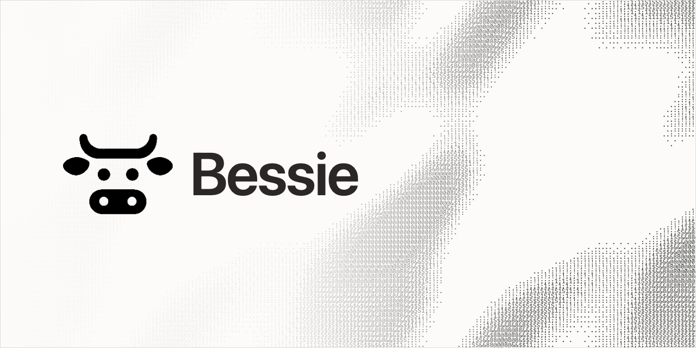

<picture>
  <source media="(prefers-color-scheme: dark)" srcset=".github/assets/bessie-social-preview-dark.png">
  <source media="(prefers-color-scheme: light)" srcset=".github/assets/bessie-social-preview-light.png">
  
</picture>

<p align="center">
  <strong>The native Mac layer for <a href="https://github.com/herdrdev/herdr">Herdr</a>.</strong><br>
  See every agent. Shape every workspace. Quit Bessie; the work keeps running.
</p>

<p align="center">
  
  
  
  <a href="https://github.com/herdrdev/herdr"></a>
  <a href="LICENSE"></a>
</p>

Herdr keeps coding agents, terminals, and workspaces alive. Bessie turns that durable foundation into one native Mac workspace for running a lot of agents without losing track of them.

## The big additions

**Projects remember the whole setup.** Save a reusable recipe with its Herd, folders, tabs, split layout, pane labels, and starting commands. Launch it again as ordinary Herdr work instead of rebuilding the same workspace by hand. Projects can target this Mac or a remote Herd over SSH.

**Local and remote sessions live in one sidebar.** Connect multiple Herds and see every workspace, tab, pane, and agent together. The redesigned agent sidebar tells you what **Needs you**, what is **Working**, and what is **Done**, **Idle**, or **Unknown**, then routes you to the exact pane.

**Pin what matters. Snooze what does not.** Keep important sessions at the top, quiet a pane for a bounded amount of time, wake it early, and separate pinned or snoozed work without changing the underlying Herdr session.

**Native notifications take you straight to the agent.** Choose whether Bessie notifies you when work needs an answer or settles. Notifications omit terminal contents, respect snoozing, and open the exact pane that triggered them.

**The menu bar keeps the Herd in reach.** See agents that need you, working agents, and status totals without opening the main window. Click a row to jump straight back into the work.

**Every pane is a real terminal.** Bessie uses [libghostty](https://github.com/Lakr233/libghostty-spm) for terminal rendering, with native tabs, splits, focus, keyboard handling, paste, scrolling, themes, and a focused Zen mode.

Herdr's plugin community has explored many of these jobs separately. Bessie brings them together as one coherent native client, while every live workspace and process remains ordinary Herdr-owned state. The [V1 feature contract](docs/v1/features.md) has the complete shipping scope and deliberate exclusions.

## Never heard of Herdr?

Running one coding agent in a terminal is easy. Running several at once is where things fall apart: tabs multiply, one agent stops for an answer, another finishes unnoticed, and closing the wrong window can take useful context with it.

[Herdr](https://github.com/herdrdev/herdr) solves the foundation of that problem. It is an open-source runtime for durable terminal workspaces and coding agents. Herdr owns the sessions, panes, processes, and state, so the work keeps running when a client disconnects and remains available through its CLI and public APIs.

Bessie makes that foundation easier to operate on a Mac. It includes the compatible Herdr runtime for local work, adds a visual layer for attention and navigation, and brings local and remote Herds into the same window. You get Herdr's durability without giving up direct CLI access or adopting a second session system.

Bessie is not a walled garden around Herdr. It is a native front door to it.

## Availability

Bessie is pre-release. There is no public binary yet, and a source checkout or locally packaged app is not a published release.

V1 targets **macOS 14 or newer on Apple silicon**. The app bundles the compatible Apple-silicon Herdr `0.8.0` runtime (protocol `19`, source `346411fa21afd297f5ed3b3fa56f9e3fbf7654b7`). Compatible system and custom runtimes remain explicit advanced options.

## Still Herdr underneath

Bessie is not a fork or a second runtime. Herdr remains the source of truth for every live workspace, tab, pane, terminal, process, agent, and durable session fact.

Bessie may keep presentation preferences, Project recipes, and last-opened Herdr identifiers. Those identifiers are only hints and are revalidated against a fresh Herdr snapshot.

Closing a Herdr workspace, tab, or pane is a real destructive action and can stop its processes. Closing Bessie's window or quitting the app does not.

Bessie uses Herdr's public JSON API, CLI surfaces, and terminal-session bridge. It does not copy Herdr's private protocol, maintain a shadow session database, or invent graphical approval actions that Herdr does not expose.

## Documentation

- [Documentation index](docs/README.md)
- [V1 features and non-goals](docs/v1/features.md)
- [Getting started](docs/v1/getting-started.md)
- [CLI, MCP, and intent-bus automation](docs/v1/automation.md)
- [Architecture](docs/v1/architecture.md)
- [Development and release operations](docs/v1/development.md)
- [Release engineering](docs/releases/README.md)

[Contributing](CONTRIBUTING.md) · [Security](SECURITY.md) · [License](LICENSE)

## Development quick start

Building Bessie requires an Apple-silicon Mac running macOS 14+, Swift 6, and the Xcode command-line tools.

```bash
swift package resolve
swift build
swift test
```

```bash
./scripts/check.sh
```

The package pins `libghostty-spm` `1.3.2` and Sparkle `2.9.5`. Development may use the repository-local runtime and configuration under `.local/`; it must not silently install or overwrite a system Herdr installation.

Read [the development guide](docs/v1/development.md) before changing implementation or packaging behavior.

## Built with love for Herdr

> I love Herdr as a platform. It reshaped how I work with coding agents: instead of treating every terminal as an isolated, fragile task, I can run a real fleet of durable work and move between agents without losing the thread. Bessie is my contribution back to the community that made that possible—a native Mac client built on Herdr's public foundation and informed by the ideas its plugin authors explored first.

Thank you to [Oğulcan Çelik](https://github.com/ogulcancelik), every Herdr contributor, and the community projects that shaped Bessie.

**[Read the full credits and acknowledgements →](CREDITS.md)**
