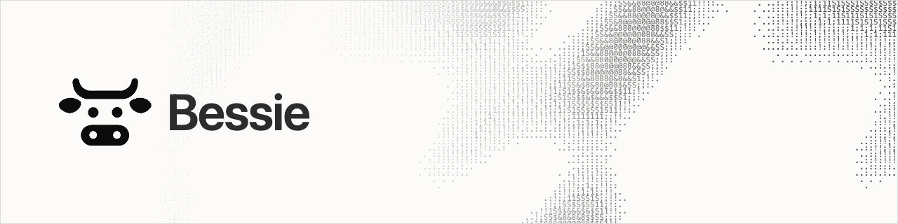
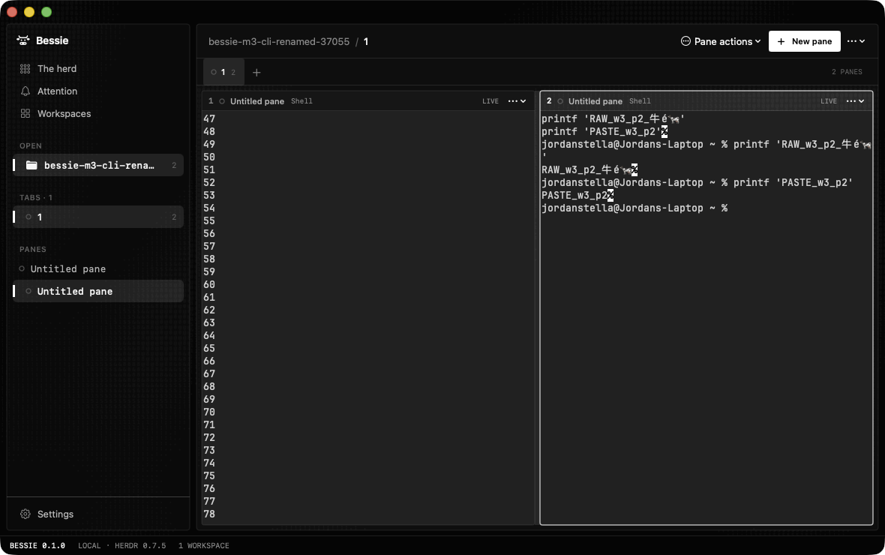
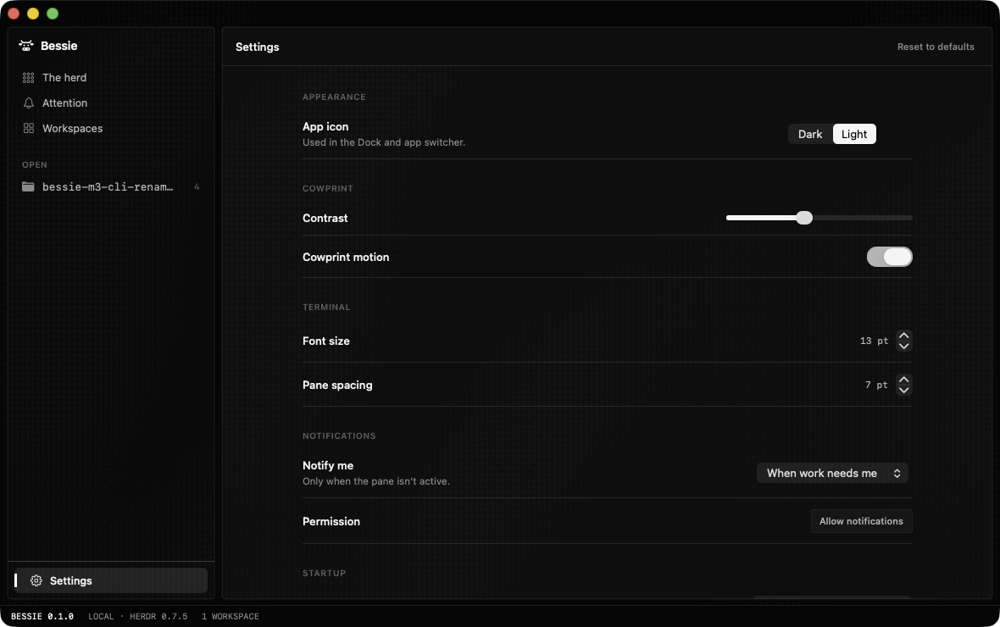

<picture>
  <source media="(prefers-color-scheme: dark)" srcset=".github/assets/bessie-banner-dark.gif">
  <source media="(prefers-color-scheme: light)" srcset=".github/assets/bessie-banner-light.gif">
  
</picture>

<p align="center">
  <strong>A native Mac client for <a href="https://github.com/herdrdev/herdr">Herdr</a>.</strong><br>
  Workspaces, terminals, and coding agents in one window. Quit Bessie and they keep running.
</p>

<p align="center">
  
  
  
  <a href="https://github.com/herdrdev/herdr"></a>
  <a href="https://github.com/Lakr233/libghostty-spm"></a>
</p>



Bessie is a graphical client, not a second session manager. [Herdr](https://github.com/herdrdev/herdr) remains the authority for workspaces, tabs, panes, terminal processes, and agent state. Bessie subscribes to that state and turns it into a native SwiftUI and AppKit interface backed by real [libghostty](https://github.com/Lakr233/libghostty-spm) terminals.

## What works

- **Live workspaces:** create, rename, reorder, open, and close Herdr workspaces.
- **Tabs and panes:** split, resize, zoom, focus, reorder, and move panes across tabs or workspaces.
- **Real terminals:** every visible pane is a Ghostty surface connected to a Herdr terminal controller.
- **Coding agents:** start supported agents from Herdr's manifest-backed catalog and follow their reported state.
- **Attention routing:** jump straight to panes that need you or have finished.
- **Safe ownership:** observe a terminal without taking control, then confirm before takeover.
- **Native notifications:** opt in from Settings; blocked and completed work routes back to the exact pane.
- **Process survival:** close and reopen Bessie without killing the shells and agents Herdr owns.
- **Two app icons:** choose the dark or light icon in Settings. Bessie reapplies it to the Dock and app switcher at launch.

## Requirements

- Apple silicon Mac running macOS 14 or newer
- Herdr 0.7.5
- An agent CLI on your login `PATH` if you want to start an agent
- Xcode command-line tools and Swift 6 only when building from source

Bessie checks `BESSIE_HERDR_PATH`, the current `PATH`, `~/.local/bin/herdr`, and the repository-local `.local/herdr/herdr`, in that order. Herdr must already be running before Bessie can connect.

## Install the release candidate

The current candidate is source-built and ad hoc signed. It is not notarized yet.

From a checkout on the Mac:

```bash
./scripts/package-app.sh
ditto dist/Bessie.app /Applications/Bessie.app
open /Applications/Bessie.app
```

Start Herdr first if it is not already running:

```bash
herdr server
```

The bundle reports version `0.1.0`. This branch is the `0.1.0-rc.1` acceptance candidate.

## Using Bessie

1. Start Herdr.
2. Open Bessie and choose a workspace from **Open** or **Workspaces**.
3. Use **New pane** to open a shell or start a supported agent.
4. Open **The herd** to see running agents and their state.
5. Open **Attention** when work needs you.

Bessie never silently steals a terminal controlled by another client. A conflicting pane opens read-only. Use **Take over terminal control** only when you mean it.

## Settings

Settings covers:

- dark or light Dock icon
- cowprint contrast and motion
- terminal font size
- pane spacing
- startup behavior
- notification policy and permission
- pinned Herdr and libghostty versions

Notification permission is requested only after you click **Allow notifications**.



## Test this candidate

The highest-value acceptance pass is short:

- drag workspaces and tabs in both directions
- resize a split using the divider
- move a pane to another tab and another workspace
- open a pane in observe mode, then confirm takeover
- allow notifications and follow one back to its pane
- start a shell and a Codex agent
- quit Bessie, reopen it, and confirm both are still there
- switch between the dark and light app icons

Record anything surprising, even if it is only a rough edge. The candidate is intentionally waiting on hands-on acceptance before it is called V1.

## How it is built

Bessie keeps only presentation preferences and a last-workspace hint. It does not persist a shadow copy of Herdr's session. Snapshot reconciliation is authoritative, and all mutations go through Herdr's public actions.

Terminal controllers use bounded reconnect delays of `0.25`, `0.5`, `1`, `2`, and `4` seconds. Input stays frozen until a matching full repaint makes the controller ready again. Observe mode is read-only; takeover is explicit.

See the [V1 plan](docs/plans/2026-07-31-bessie-v1.md) and [Mac verification report](docs/reports/mac-v1-alpha.md) for the full contract and evidence.

## Development

Run the static checks on any machine:

```bash
./scripts/check.sh
```

Run the native acceptance suite from the VPS repository with the configured Mac mirror:

```bash
BESSIE_AGENT_KIND=codex ./scripts/mac-verify.sh
```

The verifier:

- syncs to the Mac without destructive mirroring
- isolates Herdr config, state, and sockets under the repository
- runs the Swift test suite
- builds, packages, signs, and validates `dist/Bessie.app`
- exercises live Herdr, libghostty, shell, and agent flows
- tests reconnect and survival across app reopen
- captures and checks native Workspace and Settings screenshots
- removes only the processes and state it created

It refuses to reuse or stop an unrelated Herdr server.

## V1 boundaries

This candidate does not include remote sessions, worktrees, plugins, IDE surfaces, or generic activity feeds. Inner-terminal mouse and focus reporting and Kitty keyboard protocol handling remain outside the verified V1 baseline. Shift-drag still provides local terminal selection.

The app is ad hoc signed for local testing. Public distribution still needs release signing and notarization.
