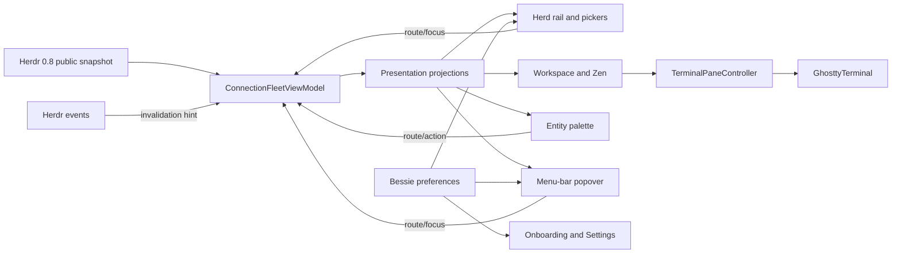
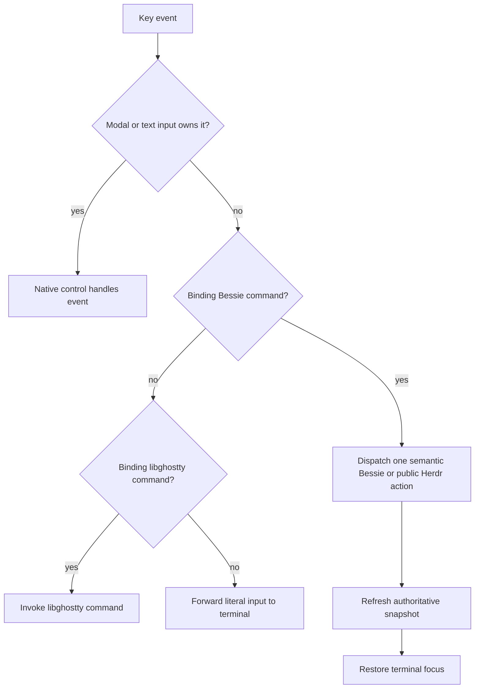
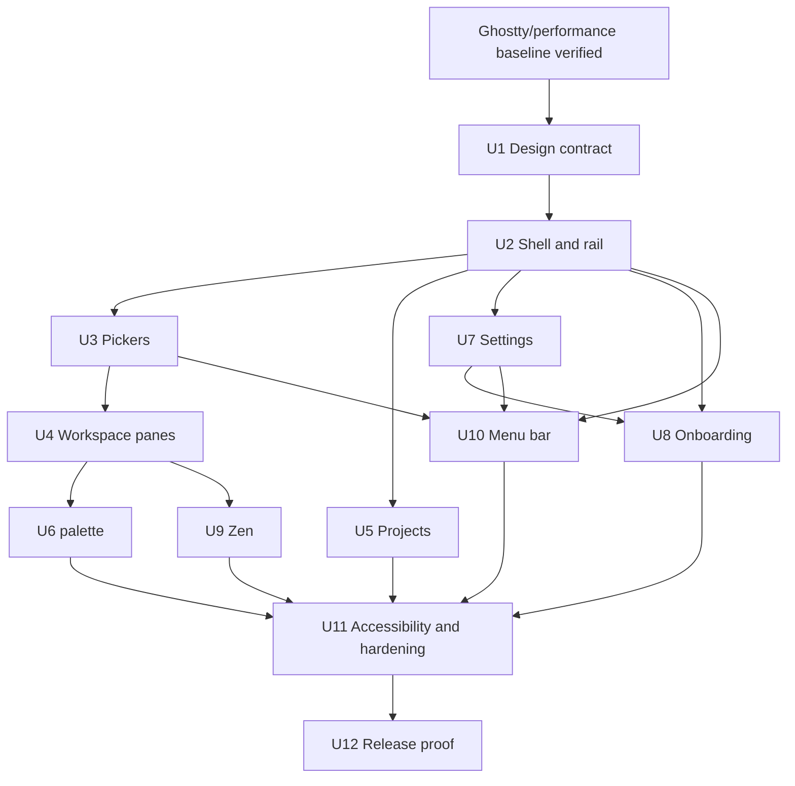

# Bessie Pre-v1 UI Redesign - Plan

## Goal Capsule

- **Objective:** Implement the retained 15-screen Pre-v1 design as Bessie's native macOS UI while preserving Herdr ownership and real libghostty terminals.
- **Target repo:** Bessie implementation repository, current `feat/v1-l-brand-chrome` branch.
- **Authority:** `AGENTS.md` and live public Herdr/libghostty behavior govern ownership and capability; the retained HTML governs visual hierarchy and product surfaces; the labeled KTDs below govern settled interaction choices.
- **Execution profile:** Deep, cross-cutting SwiftUI/AppKit work delivered in dependency order through U1-U12. Preserve the existing dirty branch and re-read every touched file before editing.
- **Stop conditions:** Stop and surface a blocker if a required behavior needs private Herdr/libghostty APIs, would create competing durable session state, would replace a real terminal with a fake surface, or cannot meet the binding terminal/performance gates.
- **Tail ownership:** The executor owns implementation, tests, packaged-app verification, visual evidence, simplification, and code review. Commit, push, PR, or publication still require Jordan's explicit instruction.

---

## Product Contract

### Summary

Implement the workstream artifact **`inbox/Bessie Pre-v1 UI Update.html`** as Bessie's native macOS product surface. The artifact is the visual and interaction contract: 15 unique screens, each rendered in Coals (dark) and Paper (light), for 30 reference artboards total.

This is not a loose restyling pass. It replaces the current information architecture with the redesigned floating-card shell and herd-centric rail; implements the redesigned workspace, pickers, Projects, entity palette, Settings, four-step onboarding, Zen, and menu-bar companion; and retains real data, real Herdr actions, and real libghostty terminals under the new presentation.

Implementation must be native SwiftUI/AppKit. Do not ship the HTML, JavaScript, canvas wrapper, or a web view. The redesign may supersede older Bessie UI plans, but it may not violate the ownership and terminal constraints in `AGENTS.md`.

This user-approved plan is the newer V1 release-boundary amendment: the entity palette and native menu-bar companion are unparked into Pre-v1, the visible herd model is Needs you/Working/Done/Idle with conditional Unknown rather than blocked-only, and any older PROJECT/V1 WebGL cowprint direction is superseded by an equivalent native SwiftUI/Core Graphics treatment. U1 updates the governing V1 documents before feature work; U12 verifies that reconciliation rather than deferring the authority decision until release.

Execution order is binding: first reproduce the Ghostty/performance baseline in U1, then implement U2–U11, then make U12's packaged-app, visual, accessibility, and performance proof a prerequisite for any V1 release candidate. Older V1 plan gates continue only after this plan's U12 passes.

### Problem Frame

Bessie's current native surfaces do not yet express the supplied herd-centric information architecture consistently across workspace, Projects, Settings, onboarding, Zen, and the menu bar. Implementing isolated artboards would leave routing, lifecycle, state vocabulary, terminal identity, and accessibility inconsistent. This plan treats the redesign as one product contract over shared authoritative Herdr state.

### Requirements

**Native visual system and surfaces**

- R1. Implement all 15 supplied screens in Coals and Paper for 30 native reference states, matching hierarchy, geometry, typography, iconography, copy, and state treatment except for the declared native-window-control exception and the authored dark cold-open video that supersedes the static splash in both appearance entry paths.
- R2. Use SwiftUI/AppKit and packaged assets only; do not ship the HTML, a web view, fake production state, or fake terminal panes.
- R3. Keep every visible terminal backed by libghostty and preserve terminal controller identity across cosmetic, routing, status, menu-bar, palette, and Zen updates.

**State, routing, and ownership**

- R4. Keep Herdr as the sole durable owner of connections, sessions, workspaces, tabs, panes, terminals, and processes; Bessie owns only presentation, recipes, routing, preferences, and transient projections.
- R5. Present Needs you, Working, Done, and Idle as distinct raw Herdr states while excluding stale/disconnected rows from authoritative live counts. Keep Unknown counted and reveal its controls, sections, menu totals, and accessibility summaries only while its scoped count is nonzero; normalize a disappearing selected Unknown filter to All.
- R6. Route Bessie-owned Mac shortcuts directly through semantic Bessie, Herdr, or libghostty actions with focus/modal guards; include wrapping `Cmd+Shift+J` and `Cmd+Shift+K` pane traversal.

**Product flows**

- R7. Preserve Projects as versioned launch recipes that materialize ordinary Herdr topology and never become a second live-session model.
- R8. Implement authoritative multi-herd and workspace pickers with honest connection health, retry, selection, and create-workspace behavior.
- R9. Provide one entity-aware command palette for panes, workspaces, Projects, herds, and commands using authoritative projections and honest stale-target recovery.
- R10. Implement the redesigned Settings, connection management, appearance, terminal, notification, menu-bar, diagnostics, reset, and Run Setup Again controls with versioned migration.
- R11. Play the supplied cold-open video only when onboarding begins on first run or explicit Run Setup Again, then create a fresh Herdr session/workspace from the user-selected local folder or validated remote path only after the final Notifications action; Finish and Skip notifications are both explicit completion actions.
- R12. Implement Zen as one minimal rail plus one existing real terminal, with deterministic entry/exit and no terminal-controller recreation.
- R13. Implement one native menu-bar companion and one idempotent main-window lifecycle over the shared fleet/routing substrate; explicit Quit is the only Bessie-owned process termination path.

**Quality and proof**

- R14. Support keyboard-only operation, VoiceOver, Reduce Motion, Reduce Transparency, increased contrast, dark/light changes, minimum-window behavior, and IME without breaking terminal focus.
- R15. Preserve the measured startup, terminal-input, frame-feed, resize, and sustained-output budgets and prove the packaged app on Jordan's Mac.
- R16. Produce native evidence for all 30 reference states and document any literal public-platform limitation instead of silently redesigning it; keep existing static runtime-lock, compatibility, packaging, intent-parity, and UI-copy gates green.

### Key Flows

- F1. **Completed-user launch:** Start Bessie without the onboarding video, attach or reconnect through the shared fleet, restore one main window, and focus the last valid terminal target.
- F2. **Onboarding:** Enter because completion is absent or Run Setup Again was explicit, play the cold-open once, collect connection and start location, explain the rail and notifications, then materialize one fresh ordinary Herdr session/workspace only after the user explicitly chooses Finish or Skip notifications.
- F3. **Cross-surface routing:** Resolve connection, workspace, tab, and pane from a rail, palette, notification, or menu-bar target; refresh stale projections before focus and return first responder to the terminal.
- F4. **Project launch:** Validate a saved recipe, materialize its workspace/tabs/panes through public Herdr actions, then reconcile from a fresh snapshot and route to the resulting terminal.
- F5. **Windowless companion:** Closing the main window leaves Bessie and Herdr running; the menu-bar companion continues one shared fleet loop without terminal controllers and reopens exactly one main window on request.

### Acceptance Examples

- AE1. Given a completed user launches Bessie normally, when the first window appears, then no cold-open frame is shown and the restored workspace is usable within the startup budget.
- AE2. Given first-run onboarding, when the 5.798-second clip ends before bootstrap, then the native Joining the herd loader continues without replaying the clip; playback failure or Reduce Motion starts at that native loader.
- AE3. Given multiple available pane rows, when `Cmd+Shift+J` is pressed on the last row or `Cmd+Shift+K` on the first, then focus wraps once to the opposite boundary and returns to the real terminal.
- AE4. Given a modal editor or text-entry control owns focus, when a topology shortcut is pressed, then no hidden workspace mutation occurs and normal text/modal behavior wins.
- AE5. Given a menu-bar or palette target became stale, when the user opens it, then Bessie refreshes authoritative state and reports or recovers from the stale target without opening a shadow pane.
- AE6. Given Run Setup Again is opened while Herdr sessions exist, when the user navigates or cancels before the final Notifications action, then no existing session is terminated or modified and no new session is created.
- AE7. Given the main window is closed while the menu-bar companion is enabled, when a pane row is selected, then Bessie recreates one main window, resolves the correct connection/pane, and creates no duplicate terminal controller.

### Source contract and interpretation order

1. **Primary visual/interaction contract:** Bessie workstream `inbox/Bessie Pre-v1 UI Update.html`.
2. **Extracted implementation inventory:** Bessie workstream `notes/BESSIE-PRE-V1-UI-INVENTORY.md`.
3. **Runtime and ownership contract:** `AGENTS.md`, then the workstream `ARCHITECTURE.md`, `HERDR-CAPABILITY-MAP.md`, `TERMINAL-BEHAVIOR.md`, and `WORKSPACE-INTERACTION-SPEC.md`.
4. **Shortcut/performance baseline:** `docs/plans/2026-08-03-ghostty-parity-and-perf.md` and `docs/plans/2026-08-03-v1-acceptance-remediation.md` §11 for terminal correctness, one-shot terminal bindings, mouse, and performance.
5. **Current dirty implementation branch.** A previous Amp worker's final completion and full Mac verification were not independently confirmed. The current VPS static gate passes, but U1 must re-read the actual files and establish the native Mac terminal/performance baseline before redesign edits.

When these sources conflict:

- The HTML wins for layout, hierarchy, visible copy, visual state, and which product surfaces exist.
- The runtime/ownership contract wins for data ownership and available actions.
- Direct Mac shortcuts invoke Bessie actions; Bessie calls public Herdr operations for topology and libghostty for terminal actions. There is no Bessie prefix mode. KTD6 rejects only interpreting older shortcut documents as a mandatory Bessie prefix protocol; their accepted one-shot terminal bindings and terminal/mouse/performance requirements remain binding. Illustrative shortcut text in the HTML does not define an action by itself.
- Live Herdr/libghostty behavior wins over fixture content in the artboards.

### Scope

#### In scope

- 244 pt expanded and 52 pt collapsed herd rail.
- Herd and workspace pickers.
- Workspace tab strip, 2×2 and arbitrary live pane topology, pane state chrome, focus, resizing, splitting, and real terminal hosting.
- Projects list and native Project recipe editor.
- Entity-aware command palette across panes, workspaces, Projects, connections/herds, and commands.
- Settings document and new menu-bar preferences.
- Splash plus four onboarding steps: Connect, How it works, Read the rail, Notifications.
- Zen mode with minimal herd awareness and one real terminal.
- `NSStatusItem` menu-bar companion and popover.
- Coals/Paper appearance, comfortable/compact density, cowprint, iconography, typography, state shapes, reduced motion, accessibility, and keyboard navigation.
- Dark/light screenshot evidence for all 15 unique screens.
- Documentation/roadmap reconciliation for UI plans this redesign supersedes.

#### Out of scope

- Files/editor, Follow, Shepherd, generic IDE, chat, or phone features.
- A second durable session or agent model in Bessie.
- A web-rendered production UI.
- Fake terminal panes or fake state.
- Private Herdr protocol use or a libghostty fork.
- Elapsed agent-age labels, “oldest” summaries, or any timer-derived status copy. The current fixture ages are removed from the product contract.
- Hearth CSS modes present in the source but absent from the 15 artboards (`companion`, `split`, `focus`).
- New user-configurable shape variants; the unused `data-state-shape` and `data-shape="soft"` hooks are not product settings.

### User-facing behavior contract

#### Status vocabulary

The Herd presents the raw Herdr states distinctly:

| Presentation state | Raw Herdr state | Meaning |
| --- | --- | --- |
| Needs you | `blocked` | Waiting for human action; the only interrupting state |
| Working | `working` | Thinking, tools, or active progress |
| Done | `done` | Herdr reports that the work finished |
| Idle | `idle` | Not currently working or asking for input |
| Unknown | `unknown` or unrecognized | Unclassified; never attention; hidden at scoped count zero |

Keep `done` and `idle` separate in labels, filters, groups, glyph geometry, command-palette search, menu totals, and accessibility speech.

#### Binding direct-shortcut contract

| Shortcut | Bessie behavior |
| --- | --- |
| `Option+P` | Open Bessie Projects |
| `Cmd+D` | Split the focused Herdr pane right |
| `Cmd+Shift+D` | Split the focused Herdr pane down |
| `Cmd+B` | Send exactly one byte `0x02` to the focused terminal; never arm a Bessie prefix state |
| `Cmd+C` | Copy an owned terminal selection; with no selection, send exactly one byte `0x03` |
| `Cmd+V` | Paste into the focused libghostty terminal |
| `Cmd+W` | Request Close Pane for the focused Herdr pane through the authoritative destructive-confirmation path |
| `Cmd+Shift+J` | Focus/open the next available pane row in rendered rail order; wrap last → first |
| `Cmd+Shift+K` | Focus/open the previous available pane row in rendered rail order; wrap first → last |

These commands operate directly—there is no Bessie `Cmd+B` prefix state. Preserve the accepted one-shot Ghostty-style terminal bindings: `Cmd+B` sends one byte `0x02`; `Cmd+C` copies an owned selection or sends one byte `0x03` when no selection exists. Neither arms a subsequent Bessie command. Actual `Ctrl+C`, `Ctrl+D`, `Ctrl+Z`, and `Ctrl+B` remain literal terminal input. Topology commands call Herdr's public actions instead of injecting Herdr keystrokes. `Cmd+[`/`Cmd+]` retain active-workspace pane traversal, while `Cmd+Shift+J/K` traverse all available pane rows in rendered rail order; they are intentionally different scopes. `Cmd+Shift+B` remains only the existing rail-collapse command—never an Open Bessie/prefix state machine. In a workspace terminal, `Cmd+W` intentionally replaces the old close-tab chord with Close Pane, but it must resolve `confirmationForClosingPane` and require confirmation before any destructive Herdr call; cancellation is a no-op with terminal focus restored. Close Tab remains available in the native menu and entity palette through its authoritative confirmation path. Non-workspace windows retain standard AppKit Close Window. Text-entry controls retain normal macOS editing and Option-character behavior; rail/pane navigation shortcuts must not mutate a workspace behind a modal editor. Every existing shortcut not explicitly changed here remains binding.

`Option+P` is an app command when Bessie's workspace terminal owns first responder and therefore opens Projects instead of sending terminal Meta-P. A native text field/editor or modal control keeps normal Option-character input and must not trigger Projects.

#### Screen matrix

| Ref | Screen | Required native behavior |
| --- | --- | --- |
| 01 / 01L | Workspace · panes | Expanded herd rail, workspace tab strip, live pane grid, real terminals, focused/blocked chrome |
| 02 / 02L | Sidebar collapsed | 52 pt icon/state rail with selected accent and identical workspace content |
| 03 / 03L | Herd picker | Select All/local/SSH connections, show health, retry/add herd routes |
| 04 / 04L | Workspace picker | Select/create workspace and preserve existing Herdr ownership |
| 05 / 05L | Projects | Recipe list, running-now projection, launch and overflow actions |
| 06 / 06L | Create project | Dedicated full-window editor, tabs/panes, split preview, exact command review, save/cancel |
| 07 / 07L | Command palette | Fuzzy mixed-entity search, keyboard selection, open/open-in-new-tab actions |
| 08 / 08L | Settings | Redesigned settings document and connection/menu-bar controls |
| 09 / 09L | Onboarding splash | Play the authored dark `bessie-cold-open.mp4` unrecolored once on first-run or explicit Run Setup Again in either appearance; when it ends, proceed directly to Connect if bootstrap is ready, otherwise hand off to the correctly themed native Joining the herd loader until bootstrap resolves |
| 10 / 10L | Onboarding · Connect | Select local or remote herd and the initial workspace folder/path; Continue requires both a live connection and valid start location |
| 11 / 11L | Onboarding · How it works | Herdr ownership and Herd/Workspace/Tab/Pane/Project concepts |
| 12 / 12L | Onboarding · Read the rail | Four-state explanation and click-to-open model |
| 13 / 13L | Onboarding · Notifications | Menu-bar/push choice, permission, Finish or Skip |
| 14 / 14L | Zen | Minimal 52 pt herd rail plus one real libghostty terminal and exit shortcut |
| 15 / 15L | Menu bar | Native status item, needs-you badge, state summary, pane routing, Open Bessie, Settings |

---

## Planning Contract

### Key Technical Decisions

- KTD1. **The HTML is a native contract, not an embedded runtime.** SwiftUI owns product surfaces; AppKit owns window, status-item, focus, and libghostty hosting seams. This keeps rendering native and terminal ownership explicit. The user-supplied cold-open is the newer contract for screen 09 and remains in its authored dark palette in both appearance entry paths.
- KTD2. **Implement the redesign as drawn unless a public capability is absent.** (session-settled: user-directed — chosen over reinterpretation or incremental visual adaptation: Jordan designated the supplied redesign as the intended UI/UX.)
- KTD3. **Remove elapsed-age labels.** Do not show fixture ages, “oldest” summaries, or synthesized timers. (session-settled: user-directed — chosen over local approximation or an upstream dependency: Jordan removed timestamps from the design.)
- KTD4. **Keep onboarding fully opaque.** Draw cowprint and layered content over an opaque base rather than transparent material. (session-settled: user-directed — chosen over translucent onboarding: Jordan requested removal of onboarding transparency without unrelated redesign.)
- KTD5. **Keep status presentation lossless.** Reuse the existing `HerdPresentationStatus`; map raw `done` and `idle` to distinct `.done` and `.idle` presentation cases so notification semantics and visible status remain exact. Do not introduce a parallel status enum.
- KTD6. **Use direct Mac shortcuts rather than a Bessie prefix.** Route Bessie commands semantically through public Herdr or libghostty actions, retain literal Control input, and guard text/modal focus. Preserve `Cmd+B → 0x02` and empty-selection `Cmd+C → 0x03` only as accepted one-shot terminal actions; neither arms a Bessie command state. (session-settled: user-directed — chosen over a mandatory Bessie prefix router: direct native actions are clearer and avoid fragile topology-prefix injection.)
- KTD7. **Treat Herdr events as invalidation hints.** New surfaces consume `ConnectionFleetViewModel` and authoritative resnapshots instead of inferring durable topology or agent truth from event order.
- KTD8. **Share one fleet and routing substrate with the menu bar.** The status item may keep Bessie alive without a main window, but it creates no shadow polling/session model and quitting Bessie never terminates Herdr.
- KTD9. **Implement Paper from the supplied artboards.** User-visible labels remain System, Dark, and Light; provisional HTML comments do not weaken the Paper reference states.
- KTD10. **Encode state without hue.** Geometry, fill, stroke, motion, labels, and accessibility descriptions carry status so the model works achromatically.
- KTD11. **Package and audit iconography.** Import only required vectors, preserve attribution, and add no icon font or runtime web dependency.
- KTD12. **Treat existing performance work as a binding baseline.** The redesign cannot regress startup, input, frame-feed, resize, or sustained-output budgets.
- KTD13. **Use public native window controls as the one visual exception.** Accept macOS traffic-light rendering and match surrounding geometry rather than replacing system behavior with private API.
- KTD14. **Complete onboarding by launching one fresh ordinary Herdr session and workspace.** Require the user-selected local folder or validated remote path and materialize only after the user explicitly chooses Finish or Skip notifications on the last screen. Skip means “skip notification setup,” not “skip workspace launch.” (session-settled: user-directed — chosen over a second workspace picker or silent home-directory default: onboarding should land directly in the workspace the user selected.)
- KTD15. **Play the supplied cold-open only during onboarding entry.** Play it once on first run or explicit Run Setup Again, never on ordinary launch/reopen/reconnect, and fall back to the native loader when necessary. (session-settled: user-directed — chosen over every cold process launch: the animation belongs to onboarding and must not slow returning users.)

### High-Level Technical Design

The sketches are directional contracts for ownership, lifecycle, and routing; they do not prescribe exact Swift types or method signatures.

### Presentation layers

- `BessieCore`: raw-to-presentation status mapping, rail projections, command-palette entities, settings schema, onboarding state, routing intents.
- `BessieApp`: shell, rail, popovers, pages, onboarding, Zen, Settings, AppKit status-item bridge.
- Existing `ConnectionFleetViewModel`: one fleet snapshot source for the main window and menu bar.
- Existing `TerminalPaneController` / `GhosttyTerminal`: one live terminal controller per visible pane; no terminal recreation during cosmetic shell updates.

### Proposed native component boundaries

- `BessieProductShell`: outer floating-card composition and destination routing.
- `HerdRail`: expanded/collapsed modes, sections, selection, resize/collapse.
- `HerdPicker` and `WorkspacePicker`: anchored native popovers.
- `WorkspaceSurface`: tab strip plus recursive Herdr layout rendered as pane cards.
- `BessieCommandPaletteModel` + `BessieCommandPalette`: typed cross-entity index and overlay.
- Existing `ProjectsSurface` and `ProjectEditorView`: restyled/recomposed without changing recipe ownership.
- Existing `BessieSettingsModel` and `BessieSettingsView`: schema migration plus redesigned sections.
- `BessieMenuBarController`: `NSStatusItem`, `NSPopover`, badge rendering, lifecycle and routing.
- Existing `OnboardingView`: replaced by splash/four-step composition over the same bootstrap capabilities.
- Existing Zen presentation state: retained; view recomposed around the redesigned strip and terminal.

### Data flow



### Shortcut ownership and focus gate



### Onboarding lifecycle

```mermaid
stateDiagram-v2
    [*] --> CompletedLaunch: completion persisted
    [*] --> ColdOpen: first run
    CompletedLaunch --> ColdOpen: Run Setup Again
    ColdOpen --> JoiningLoader: clip ends and bootstrap pending
    ColdOpen --> Connect: clip ends and bootstrap ready
    ColdOpen --> JoiningLoader: playback unavailable or Reduce Motion
    JoiningLoader --> Connect: bootstrap ready or failed with actionable error
    Connect --> Education: live connection and start location valid
    Education --> RailGuide
    RailGuide --> Notifications
    Notifications --> Materialize: explicit Finish or Skip notifications
    Materialize --> MainWorkspace: fresh session, workspace, and first frame succeed
    Materialize --> Notifications: materialization fails; preserve inputs for retry
```



### Window and companion lifecycle

```mermaid
stateDiagram-v2
    [*] --> MainWindow
    MainWindow --> WindowlessCompanion: close main window
    WindowlessCompanion --> MainWindow: Dock, menu-bar, notification, or Open Bessie
    MainWindow --> Exited: explicit Quit
    WindowlessCompanion --> Exited: explicit Quit
    Exited --> HerdrRunning: Bessie observers and tunnels stop; Herdr work remains
```



### State and persistence impact

Add versioned preferences for:

- menu-bar visibility;
- badge policy: Needs you / Needs you + Unknown / Nothing;
- row-click behavior: Focus pane / Open Bessie;
- four-step onboarding completion if the current persisted onboarding step format cannot migrate losslessly.

Migration rules:

- Existing users retain current settings where values map directly.
- Keep the persisted notification case named `blockedAndDone`. Its visible label is `Needs me, Done, and Idle`, and its existing trigger behavior remains blocked plus done/idle when leaving an active state.
- Existing onboarding-completed users stay completed. Every incomplete legacy step starts a new onboarding entry at the cold-open splash and then Connect; no legacy raw integer is reinterpreted and no incomplete user is auto-completed. Run Setup Again follows the same splash-to-Connect entry without mutating existing sessions.
- Unknown newer preference schemas fail honestly rather than being rewritten.

### Binding menu-bar lifecycle matrix

| Situation | Required behavior |
| --- | --- |
| First launch / migrated install | Menu-bar companion is enabled by default; application activation policy remains `.regular`, with a normal Dock presence |
| Main window closes | Close the window but keep Bessie and the status item running; do not stop Herdr or keep terminal controllers alive solely for the closed window |
| Menu-bar preference is off and last window closes | Keep the regular Dock application running with no status item; Dock reopen recreates the singleton main window |
| Dock reopen / app reopen / Open Bessie | Reuse or recreate exactly one main window, restore it if minimized/hidden, activate Bessie, and focus the last valid terminal target |
| Explicit Quit / `Cmd+Q` | Terminate Bessie and its SSH tunnels/observers only; leave local and remote Herdr sessions/processes alive |
| No main window but process remains | Continue one shared fleet refresh loop for all configured enabled connections so badge/counts remain authoritative; do not create terminal controllers |
| Multiple connections | Aggregate only fresh semantic state from all configured enabled connections; expose disconnected health separately and exclude stale cards from live counts |

### Binding notification trigger matrix

| Visible policy | Raw states that may notify |
| --- | --- |
| Off | none |
| When work needs me | `blocked` only |
| Needs me, Done, and Idle | `blocked`, plus `done` or `idle` when leaving an active state |

The persisted policy remains named `blockedAndDone`; changing status presentation does not rename or expand that stored contract.

### High-Level Technical Design Confidence Check

- **Path coverage — pass:** diagrams cover authoritative state flow, focus-aware shortcut dispatch, onboarding/video/bootstrap/materialization, and windowless menu-bar lifecycle. Project and palette routing reuse the same authoritative route path described in component boundaries.
- **Alternative selection — pass:** KTDs explicitly reject a web view, shadow Herdr state, synthesized prefix input, per-surface fleets, translucent onboarding, every-launch video playback, and private traffic-light imitation.
- **Diagram quality — pass:** three high-risk triggers have distinct sketches: cross-layer state flow, a decision branch with native/semantic/terminal ownership, and state lifecycles for onboarding and window/menu-bar behavior.
- **State integrity — pass:** every durable live mutation resolves through public Herdr operations and authoritative resnapshot; Bessie persistence is limited to recipes, settings, onboarding completion, and UI-only caches.
- **Testability — pass:** each implementation unit has executable normal, boundary, failure, lifecycle, and non-regression scenarios tied to named files and verification evidence.
- **Residual uncertainty — bounded:** public Herdr/libghostty behavior observed during implementation overrides retained assumptions. If an external capability is absent, the executor must record the limitation and preserve honest terminal behavior rather than add a private protocol hack.

### Deepening Outcomes

- Added a durable product contract with atomic R1-R16, F1-F5, AE1-AE7, authority order, stop conditions, and tail ownership.
- Converted decisions to stable KTD1-KTD15 and traced every unit to requirements and decisions.
- Added architecture sketches for state ownership, shortcut focus gates, onboarding, and window/menu-bar lifecycle.
- Defined onboarding-video packaging, gating, Reduce Motion/failure fallback, bootstrap handoff, and migration behavior from the inspected 5.798-second asset.
- Added stable U1-U12 units with Dependencies, Test Scenarios, and Verification fields.
- Replaced optimistic parallelism with dependency waves, disjoint file ownership, one integration owner, and serialized shared-file/build gates.
- Added an exact verification/evidence contract and corrected stale prefix, package-resource, onboarding-entry, and dirty-branch assumptions.

---

## Implementation Units

| U-ID | Title | Primary files | Depends on |
| --- | --- | --- | --- |
| U1 | Design contract and baseline | `BessieDesignSystem.swift`, visual tests, snapshot verifier | Current dirty branch and Mac verification access |
| U2 | Shell and herd rail | `ProductSurfaces.swift`, `HerdRail*.swift`, projections | U1 |
| U3 | Herd/workspace pickers | `HerdPicker.swift`, `WorkspacePicker.swift` | U2 |
| U4 | Workspace pane composition and shortcuts | `WorkspaceSurface.swift`, `TerminalPaneChrome.swift`, shortcut coordinator | U3 |
| U5 | Projects list/editor | Existing Project views/models | U2 |
| U6 | Entity-aware palette | `CommandPalette.swift`, `BessieCommandPalette.swift` | U4 |
| U7 | Settings and preference migration | Settings, persistence, notifications | U2 |
| U8 | Onboarding and cold-open | Onboarding, runtime setup, packaged video | U2, U7 |
| U9 | Zen | Zen surface and shortcut state | U4 |
| U10 | Menu-bar companion | App delegate, status controller/popover | U2, U3, U7 |
| U11 | Accessibility and hardening | All redesigned surfaces | U5-U10 |
| U12 | Release proof | Mac verifier, visual harness, docs | U11 |

### U1. Verify the current terminal baseline and encode the design contract

**Goal:** Verify the current terminal/shortcut/performance state first, then make the 30 artboards testable targets.

**Requirements:** R1-R3, R14-R16. **Decisions:** KTD1, KTD2, KTD4, KTD9-KTD13.

**Files:**

- `docs/plans/2026-08-03-ghostty-parity-and-perf.md` — consume its terminal, one-shot binding, mouse, and performance requirements; KTD6 forbids only a Bessie prefix state.
- `docs/plans/2026-08-02-v1-vision-occam-scope.md`, `docs/plans/2026-08-02-v1-shared-substrate.md`, `docs/roadmap/menu-bar-herd.md`, `docs/roadmap/entity-aware-command-palette.md`, `docs/roadmap/richer-herd-dashboard.md`, `docs/roadmap/README.md`, and `PROJECT.md` — amend release scope and superseded blocked-only/WebGL presentation language before feature work.
- `Sources/BessieApp/BessieDesignSystem.swift` — consolidate exact Coals/Paper tokens, dimensions, type roles, motion constants, state geometry.
- `Sources/BessieApp/Resources/` — add only required audited vector/icon assets and attribution.
- `Tests/BessieAppModelTests/BessieVisualFoundationTests.swift` — token, geometry, opacity, contrast, and reduced-motion assertions.
- `scripts/verify-design-snapshot.swift` — replace the rail-only proof with reusable region/geometry/color checks.

**Approach:**

1. Re-read the current branch and dirty diff; run `./scripts/check.sh` and `./scripts/mac-verify.sh` before redesign edits and retain baseline timings/screenshots. The native baseline must retain the harness's current minimum of five isolated cold-start samples (`mac-verify.sh` `for sample in {1..5}`), report sample counts for every percentile, and distinguish packaged live measurement from deterministic simulation. Any required metric reported `unavailable`, an incomplete five-run set, or inability to run the Mac lane blocks U1; do not infer native correctness from the VPS-only static pass.
2. Extract exact constants from the HTML: 244/52 rail widths, 9 card gap, 7 pane gap, 30/46 chrome heights, 4/3 radii, system/SF Mono type roles, achromatic palettes, hover/pop/panel timings.
   Preserve the existing comfortable/compact metric table for values the HTML does not define, but encode both variants explicitly in visual-foundation tests; only the binding 244/52 rail widths supersede the current density-specific 220/64 widths.
3. Package required cow, Phosphor, and agent-mark assets locally; document source/license.
   Include Claude, Codex, Grok, and Amp marks plus one audited generic-agent fallback. Unknown live agent IDs use the generic mark; non-agent shell/process panes remain terminal-marked under Shells.
4. Add an opaque onboarding-surface token separate from reusable material surfaces.
5. Add deterministic fixture hooks available only to tests/preview automation, never production fake state.

**Dependencies:** The terminal/shortcut/performance prerequisite work is present on the current dirty branch but is not trusted until U1 reproduces the Mac baseline. If that gate fails, stop UI work and repair only the prerequisite scope or report the blocker with evidence.

**Test Scenarios:** Missing or unlicensed assets fail the static package gate; Coals/Paper token fixtures resolve exact geometry and achromatic colors; the onboarding surface remains opaque with transparency reduction on and off; baseline sampling produces the required percentile fields before shell work begins.

**Verification:** Focused visual-foundation tests and asset-presence checks pass; dark/light token evidence exists; `./scripts/mac-verify.sh` completes at least five isolated packaged cold-start samples and records the sample count for each metric; the live-measurement report is complete and records first-window cold p95 ≤0.75 s, warm reattach p95 ≤1.5 s, and cold bundled-Herdr p95 ≤3.0 s. Simulation output does not satisfy this gate.

### U2. Replace the shell and implement the herd-centric rail

**Goal:** Implement screens 01/02 shell geometry and the exact expanded/collapsed information architecture.

**Requirements:** R1-R6, R14-R15. **Decisions:** KTD3, KTD5-KTD7, KTD10.

**Files:**

- `Sources/BessieApp/ProductSurfaces.swift` — split large shell sections into focused files if needed.
- New `Sources/BessieApp/HerdRail.swift` and `HerdRailComponents.swift`.
- `Sources/BessieCore/HerdList.swift`, `SurfaceProjection.swift`, `ConnectionDisplay.swift`.
- `Tests/BessieCoreTests/HerdListTests.swift`.
- `Tests/BessieAppModelTests/SurfaceProjectionTests.swift` and new `HerdRailPresentationTests.swift`.

**Approach:**

1. Render top trigger/search, Herd/Workspaces/Shells sections, Settings footer, theme control, selection bar, state and agent marks. The magnifier opens the entity palette. The theme control opens the existing System/Dark/Light appearance picker rather than silently cycling an undocumented state.
2. Map done and idle separately; order Needs you → Working → Done → Idle → Unknown.
3. Keep disconnected/freshness state separate from semantic state and exclude stale agent cards from authoritative live counts.
4. Implement 244→52 collapse with persisted presentation preference, keyboard action, drag/edge affordance, and stable terminal identity.
   Comfortable/Compact density may change row spacing and typography only; both use the binding 244 pt expanded and 52 pt collapsed rail widths. This explicitly replaces the current 220 pt compact and 64 pt collapsed geometry.
   The rail snaps between only 244 and 52 at a drag threshold; do not persist intermediate widths. Coalesce the resulting terminal resize.
5. Match the active rail to the HTML and remove obsolete duplicate rail entries. Keep existing feature-flagged Files/Follow substrate compiled and reachable through its existing non-rail route/menu when enabled; do not delete or expand those features in this plan.
6. Project every fresh live Herdr pane exactly once from authoritative snapshot topology, not from `fleet.agents` alone. Join recognized-agent metadata by pane ID; rows with a recognized agent render in their semantic group, and the remaining shell/process panes render under Shells. Keep Shells collapsed by default with a count; clicking a row focuses that real pane. Hide the group at zero and never synthesize fixture rows.
7. Build and unit-test one pure deterministic pane-navigation sequence from currently rendered rail pane rows. It returns the next/previous available pane ID with wrap semantics while skipping headers and disconnected/stale/unavailable targets; zero panes returns no target and one pane returns the current ID. U2 owns projection/order only. U4 owns keyboard registration, routing, menu/tooltips, and terminal-focus restoration.
8. Always render Needs you, Working, Done, and Idle headers in fixed order with honest zero counts. Render Unknown only while its scoped count is nonzero. Collapsed pane rows expose title and location in hover and keyboard-focus help plus matching accessibility labels, with no elapsed-age text.

**Dependencies:** U1.

**Test Scenarios:** Raw `done` and `idle` render as distinct Done and Idle states; Unknown hides at zero and a selected Unknown filter normalizes immediately to All; stale/disconnected rows are visible as health but excluded from live totals and pane traversal; zero/one/many-pane sequence calculation handles no target/current target/bidirectional wrap; every fresh pane appears exactly once as recognized-agent or Shells and disconnected panes appear in neither live set; all five raw-state groups remain in traversal; collapsing and theme changes preserve terminal-controller identity.

**Verification:** Projection and rail-presentation tests pass for every raw/status/freshness combination and pane classification; sequence-order and VoiceOver checks cover expanded/collapsed modes; screenshots 01/02 match in both appearances.

### U3. Implement herd and workspace pickers

**Goal:** Implement screens 03/04 as real anchored controls.

**Requirements:** R1, R4, R8, R14. **Decisions:** KTD7, KTD9, KTD10.

**Files:**

- New `Sources/BessieApp/HerdPicker.swift` and `WorkspacePicker.swift`.
- `Sources/BessieApp/BessieApp.swift` / `ProductSurfaces.swift` routing seams.
- `Sources/BessieApp/BessieSettings.swift` for add/retry/activate connection actions.
- `Tests/BessieAppModelTests/ConnectPresentationTests.swift` and new picker model tests.

**Approach:**

1. Herd picker lists All, local, and SSH connections with health, selected check, retry, and Add herd route.
2. Workspace picker lists authoritative workspaces for the selected scope, creates ordinary Herdr workspaces, and activates without persisting shadow topology.
3. Implement full keyboard traversal, Escape dismissal, outside-click dismissal, focus return, and anchored placement under narrow windows.
4. Match the popover shape, spacing, labels, and dividers from the source.

**Dependencies:** U2; finish this unit before U4 edits shared shell routing.

**Test Scenarios:** A healthy local or SSH herd switches using authoritative snapshots; a disconnected herd exposes Retry without presenting stale semantic state as live; workspace creation yields an ordinary Herdr workspace and no shadow record; Escape, outside click, and selection each dismiss once and return focus correctly; narrow windows keep the popover anchored and usable.

**Verification:** Picker model tests pass with warm, disconnected, and multi-connection inputs; isolated live local switch/create succeeds; screenshots 03/04 match in both appearances.

### U4. Recompose workspace pane chrome without touching terminal semantics

**Goal:** Implement screen 01's tabs/panes around real libghostty surfaces while preserving the U1-verified latency, shortcut, and mouse baseline.

**Requirements:** R1, R3, R4, R6, R15. **Decisions:** KTD3, KTD6, KTD7, KTD12.

**Files:**

- `Sources/BessieApp/ProductSurfaces.swift` / new `WorkspaceSurface.swift` and `TerminalPaneChrome.swift`.
- `Sources/BessieApp/TerminalPaneController.swift` only where hosting identity/focus requires it.
- `Sources/BessieCore/SessionProjection.swift`, `SurfaceProjection.swift`, and existing layout actions.
- `Sources/BessieCore/KeyboardShortcuts.swift`, `Sources/BessieApp/KeyboardShortcutCoordinator.swift`, and existing terminal, projection, shortcut, and live Herdr tests.

**Approach:**

1. Begin only after U3 is complete. Render authoritative recursive Herdr topology, not a hard-coded 2×2 fixture.
2. Match tab strip and pane-header hierarchy, state marks, agent/session labels, focused outline, blocked treatment, and expand action.
3. Ensure cosmetic status/frame updates do not reconstruct `GhosttyTerminal`, restart controllers, or invoke redundant fit/resize work.
4. Preserve raw terminal input, paste ordering, selection/mouse policy, and focus ownership from the verified baseline. Assert that no Bessie prefix state exists and do not add one. Preserve `Cmd+B → 0x02` and `BessieTerminalShortcutAction.copyOrSendInterrupt` as one-shot terminal actions. Actual Control chords continue through `TerminalInput` unchanged.
5. Remove elapsed-age text and its reserved spacing from pane chrome; no timestamp capability is a dependency.
6. Wire `Cmd+Shift+J/K` to U2's rendered-rail sequence and route once through public focus/open actions, then restore terminal first responder. Preserve `Cmd+[/]` as active-workspace traversal, `Cmd+Shift+B` as rail collapse only, and all other unchanged baseline shortcuts. Change workspace-terminal `Cmd+W` from Close Tab to Close Pane, but route it through `HerdrSessionProjection.confirmationForClosingPane` and perform no close unless the user confirms; expose Close Tab through the native menu/palette and preserve normal AppKit Close Window outside the workspace terminal.
7. Do not ship a dead top-bar overflow button. Render it only when the supplied inventory defines a menu that maps to existing workspace/tab actions; otherwise omit the control rather than inventing commands.
8. Bind the tab-strip Add control to one public Herdr create-tab action in the active workspace, reconcile from a fresh snapshot, and focus the new tab's first real pane. Disable it when no healthy active connection/workspace exists; create no Bessie-local tab record.
9. Define pane-header Expand as maximize/restore within the current workspace grid. It does not enter Zen, detach, or recreate `TerminalPaneController`; restore returns the authoritative prior layout projection.

**Dependencies:** U3 and the verified terminal/performance baseline.

**Test Scenarios:** Direct split/confirmed-close/Add Tab actions invoke one public Herdr operation and reconcile from a fresh snapshot; cancelling the `Cmd+W` pane-close confirmation invokes no Herdr mutation and restores terminal focus; Add Tab disables without a healthy active workspace; expand/restore preserves topology and the same terminal controller and never enters Zen; modal/text contexts cause no topology mutation; `Cmd+C` copies with a selection and sends exactly one `0x03` without one; `Cmd+B` sends exactly one `0x02`; neither action arms a prefix state; literal `Ctrl+C/B` reach the PTY unchanged; `Cmd+Shift+J/K` follow cross-rail order with wrap while `Cmd+[/]` remain active-workspace traversal; workspace `Cmd+W` closes one pane only after confirmation while menu/palette Close Tab and non-workspace Close Window remain available; status, appearance, and rail updates preserve controller identity; rapid resize converges without dropping/reordering bytes; shell, Vim, tmux, and Hermes mouse/input remain usable.

**Verification:** Existing 10,000-operation ordering, pane-focus, resize-storm, live terminal, shortcut, and mouse-TUI tests pass; screenshot 01 covers seeded semantic states; measured p50/p95 terminal budgets do not regress.

### U5. Restyle Projects and replace the editor composition

**Goal:** Implement screens 05/06 without changing Project recipe semantics.

**Requirements:** R1, R4, R7, R14. **Decisions:** KTD1, KTD7, KTD9-KTD11.

**Files:**

- `Sources/BessieApp/ProjectsSurface.swift`, `ProjectsViewModel.swift`, and `ProjectLaunchCoordinator.swift`; extend the existing launch path rather than create a second materializer.
- `Sources/BessieApp/ProjectEditorView.swift`, `ProjectLayoutPreview.swift`.
- `Sources/BessieCore/BessieProjects.swift`, `BessieProjectStore.swift`, `BessieProjectMaterialization.swift` only for behavior the design exposes and the current schema lacks.
- Existing Project model/materialization/view-model tests plus focused editor-presentation tests.

**Approach:**

1. Match the 820 pt list page, running-now chip, launch hierarchy, and overflow menu. Its exact actions are Open editor, Duplicate, and Delete; when a matching live workspace exists, prepend Open running workspace. Disable Launch while materialization is in flight rather than adding a second recipe instance accidentally.
2. Implement dedicated editor chrome, 286 pt form rail, tab list, split buttons, draggable split preview, Add pane, exact command review, and pane editor.
3. Keep exact launch commands visible and secrets unsupported; save only versioned recipes.
4. Launch materializes ordinary Herdr workspaces/tabs/panes and reconciles from a fresh snapshot.
5. With zero recipes, retain the Projects header and primary New project action, explain briefly that Projects are launch recipes rather than live places, omit running-now chrome, and open the normal editor from New project. A recipe-row click outside Launch/overflow opens the editor; launching is always explicit.

**Dependencies:** U2.

**Test Scenarios:** Valid recipes round-trip and preview deterministic split geometry; invalid commands/layouts remain editable and cannot launch; an in-flight launch disables duplicate materialization; successful launch creates ordinary Herdr topology and reconciles running state; a partial Herdr failure reports the exact operation and creates no shadow running record; duplicate and delete preserve existing confirmation/storage semantics.

**Verification:** Recipe migration, validation, preview-math, view-model, dry-run, and isolated live-materialization tests pass; screenshots 05/06 match in both appearances.

### U6. Build the entity-aware command palette

**Goal:** Implement screen 07 as functional navigation/action infrastructure, not a static command list.

**Requirements:** R1, R4, R6, R9, R14. **Decisions:** KTD6, KTD7, KTD10.

**Files:**

- New `Sources/BessieCore/CommandPalette.swift`.
- `Sources/BessieApp/KeyboardShortcutCoordinator.swift` — extend the existing `BessieCommandPalette`; extract it to a new `BessieCommandPalette.swift` only by moving the existing owner, never by defining a colliding second type.
- `Sources/BessieCore/KeyboardShortcuts.swift`.
- `Sources/BessieApp/ProductSurfaces.swift` routing.
- New Core/AppModel palette tests.

**Approach:**

1. Define typed entities for panes/agents, workspaces, Projects, connections/herds, and commands with stable IDs and route intents.
2. Build a deterministic fuzzy index with state/location metadata and no terminal-output indexing. The rail magnifier and `Cmd+Shift+P` open the same singleton overlay.
3. Implement arrow navigation, Escape, Return open, focus restoration, and empty/no-connection states. Enable and advertise Command-Return only for a result whose command definition exposes an explicit alternate route; pane/agent/workspace/Project/herd entities do not implicitly clone, move, multi-attach, or create topology. If the selected result has no alternate route, hide the footer hint and treat Command-Return as unavailable.
4. Show a key equivalent only when backed by verified behavior. Bessie-owned topology actions use the binding direct-chord table; do not hard-code the source's ambiguous `⌃S "` fixture or invent a Ghostty-derived map.
5. Ensure opening entities uses public Herdr/Bessie routing and exits Zen only when the route contract requires it.

**Dependencies:** U4.

**Test Scenarios:** Identical labels from different herds remain distinct by stable identity and location metadata; ranking and deduplication are deterministic; a stale result triggers refresh and honest recovery rather than a crash; Return dispatches once; Command-Return is advertised and dispatched only for an explicitly alternate-route-capable command and performs no implicit entity/topology mutation; Escape and completed routes restore terminal focus; modal/text contexts prevent hidden workspace mutation.

**Verification:** Ranking, deduplication, stale-target, route, keyboard, focus, and accessibility tests pass; screenshots 07/07L match.

### U7. Implement the redesigned Settings and migrate preferences

**Goal:** Implement screen 08 and its complete persisted behavior.

**Requirements:** R1, R5, R10, R13-R14. **Decisions:** KTD5, KTD8-KTD10.

**Files:**

- `Sources/BessieApp/BessieSettings.swift`, `RuntimeSettingsView.swift`.
- `Sources/BessieCore/PresentationPersistence.swift` and `Sources/BessieCore/BessieConnections.swift` for versioned presentation and connection persistence.
- `Sources/BessieApp/BessieNotifications.swift`, `Sources/BessieCore/NotificationPlanning.swift`.
- Existing Settings/notification tests plus persistence-migration and menu-bar preference tests.

**Approach:**

1. Match sections and controls exactly: General, Herds, Terminal, Notifications, Menu bar, Appearance, Advanced & diagnostics.
2. Preserve supported values: startup behavior; connection health/actions; font 10–24; pane spacing 0–16; notification policies; System/Dark/Light; Comfortable/Compact; Dark/Light icon; cowprint.
3. Add menu-bar visibility, badge policy, and row-click behavior.
4. Render the binding notification matrix above exactly: Off; When work needs me (`blocked`); Needs me, Done, and Idle (the existing `blockedAndDone` behavior).
5. Keep actual bundled/runtime versions dynamic—never ship fixture versions from the HTML.
6. Keep Reset to defaults, System Settings, test notification, Run setup again, and Copy diagnostics functional.
7. Package both exact Dark/Light app-icon assets. Persist the selection and apply it to the running app/Dock through public `NSApplication.applicationIconImage` at launch and change time; verify the built bundle contains both variants. The signed Finder bundle icon remains the package default—do not use private APIs or claim runtime Finder mutation.

**Dependencies:** U2.

**Test Scenarios:** Existing supported preferences migrate losslessly while an unknown newer schema fails honestly; Reset restores documented defaults without changing Herdr work; each visible notification policy resolves exactly to its raw trigger set and `idle` never emits; denied notification permission routes to System Settings; menu-bar visibility/badge/row-click settings update the shared companion without creating another fleet.

**Verification:** Persistence round-trip, migration, corruption, notification planning/permission, connection-management, menu-bar preference, and reset tests pass; screenshots 08/08L match.

### U8. Replace onboarding with the opaque four-step flow

**Goal:** Implement screens 09–13 and migrate existing completion state.

**Requirements:** R1-R4, R11, R14-R15. **Decisions:** KTD4, KTD7, KTD14, KTD15.

**Files:**

- `Sources/BessieApp/OnboardingView.swift`.
- New `Sources/BessieApp/ColdOpenSplashView.swift` for AVFoundation playback and native-loader fallback.
- New `Sources/BessieApp/OnboardingCompletionCoordinator.swift` for the asynchronous, idempotent completion state machine.
- `Sources/BessieApp/Resources/bessie-cold-open.mp4` copied from the retained workstream source during implementation.
- `Package.swift` — verify the existing `.process("Resources")` declaration packages the video; modify only if verification proves it insufficient.
- `Sources/BessieCore/RuntimeSetup.swift`, `ConnectionLifecycle.swift`, `RemoteHerdrBridge.swift`, and `BessieConnections.swift` for fresh named-session lifecycle and connection registration.
- `Sources/BessieApp/BessieApp.swift` bootstrap routing.
- `Tests/BessieCoreTests/RuntimeSetupTests.swift`.
- `Tests/BessieAppModelTests/SettingsAndNotificationsTests.swift` plus new onboarding-presentation tests.

**Approach:**

1. Bundle `bessie-cold-open.mp4` as a native application resource and present it with AVFoundation, without player controls or audio. Paint the opaque first frame synchronously, then prepare/start `AVPlayer` off the first-window critical path. Use an aspect-fill splash surface without stretching, play once, and never loop. Preserve its authored dark pixels in both System/Dark and Light onboarding entry paths; do not recolor it or synthesize a light variant. The native fallback and subsequent onboarding surfaces resume the selected appearance.
2. Gate playback by onboarding entry cause: first run and each explicit Run Setup Again entry only. A new process that relaunches while onboarding is still incomplete starts a new first-run onboarding entry and may play once again. Do not replay on Back/forward navigation within the same onboarding run, ordinary launch for completed users, Dock/menu-bar reopen, reconnect, or workspace restoration.
3. Start real bundled-runtime/connection bootstrap concurrently. When the clip ends, transition to the normal native opaque Joining the herd loader if bootstrap is still pending. If playback fails or Reduce Motion is enabled, show that native loader immediately. On bootstrap failure, proceed to Connect with an actionable error instead of spinning forever.
4. Keep both video and fallback fully opaque over a Coals/Paper base; Reduce Transparency must never expose content behind the onboarding window.
5. Replace five steps with Connect, How it works, Read the rail, Notifications.
6. Connect selects a local or remote herd and a required start location. For local Herdr, use a native folder picker and persist the standardized absolute folder. For SSH, select an existing configured `BessieConnectionDefinition` or invoke the same Add herd flow as Settings, whose persisted fields are display name, safe SSH config target/user@host, and optional safe session name; authentication remains owned by OpenSSH/Keychain and is never collected or stored by Bessie. Show validation/health/retry errors inline. Collect and validate an absolute remote path rather than pretending the native Mac picker can browse the remote filesystem. Continue stays disabled until the connection is live and the absolute start path validates.
7. Explain ownership and five states with exact source hierarchy/copy.
8. Notifications supports policy selection, permission request, Finish, and Skip. Finish applies the selected notification policy; Skip leaves notification setup unchanged. Both are explicit final completion actions and start the selected session/workspace launch exactly once.
9. Version the onboarding schema. Preserve only `completed == true`; start every incomplete legacy state and Run Setup Again as a fresh onboarding entry at the cold-open splash, never reinterpret a legacy raw integer, and proceed to Connect after the splash/bootstrap gate.
10. `OnboardingCompletionCoordinator` owns `idle → validating → startingSession → connecting → creatingWorkspace → waitingForFirstFrame → completed/failed`. It disables duplicate submission, carries one attempt ID, and serializes Finish/Skip into one completion operation.
11. Generate a unique safe Herdr session name for the attempt and register it as an ordinary Bessie connection recipe. For local setup, start that named session through `HerdrConnectionRunner`/`HerdrServerLauncher`. For SSH, first validate the selected absolute remote directory and strictly prove the uniquely named session does not already exist, then invoke public `herdr session attach <name>` over forced-PTY OpenSSH with that directory as the remote current directory. Adopt only the one ordinary initial workspace created by that fresh attach. Wait for authoritative status/snapshot and exact workspace/tab/pane IDs; refuse any collision, pre-existing session, extra topology, or ambiguity. Disconnect the bootstrap client only after `detached_server_daemon=true`, then prove status/snapshot and the existing Unix-socket tunnel remain usable. Use the existing SSH definition/OpenSSH only; never collect secrets, use nohup/a supervisor/private RPC, fake topology, or reuse. Do not stop the new Herdr session when Bessie exits.
12. After the new connection is authoritative, local setup calls public `workspace.create` with the validated local path. Remote setup adopts the exact attach-created workspace from step 11 and does not create a second workspace. In both paths, wait for the exact first shell pane and first live libghostty frame, then focus it. Do not silently reuse an unrelated session/workspace or default to the home directory.
13. Persist a non-secret pending onboarding-attempt record containing only attempt ID, generated connection/session ID, selected path, and completed stage. On retry or relaunch, reconcile that record against a fresh snapshot and resume the existing partial attempt instead of creating a duplicate session. Clear it only after successful completion or explicit pre-materialization cancellation; never treat it as durable topology authority.
14. Mark onboarding complete only after session start, connection bootstrap, workspace creation, and the first live terminal frame succeed. On failure, remain in onboarding with an actionable error and preserve the selected connection/path and pending attempt for idempotent retry.
15. Run Setup Again may edit the connection/path but creates nothing until a new explicit final Notifications action. It must not terminate or mutate existing Herdr sessions merely because onboarding was reopened.
16. A Run Setup Again entry snapshots the prior completed state and exposes Cancel Setup. Cancel, Escape, or closing the onboarding window before materialization restores `completed == true`, clears only a pre-materialization pending record, and performs zero Herdr operations. Once materialization starts, window close is not a cancellation signal: preserve the pending attempt and resume or show its actionable failure on reopen. The final action copy names the selected path and states that it opens a fresh workspace.

**Dependencies:** U2, U3, and U7; U1 provides opaque tokens and the asset/package gate.

**Test Scenarios:** First-run, incomplete-process relaunch, and explicit Run Setup Again each play the clip once per new onboarding entry, while completed-user launch, Dock/menu reopen, reconnect, restoration, and within-flow Back/forward do not; the opaque first frame appears within the first-window budget before asynchronous player preparation; Dark and Light entry paths preserve identical authored video pixels and then hand off to the selected native appearance; clip end while bootstrap is pending hands off to the native loader; missing/corrupt playback and Reduce Motion start at the native loader; bootstrap failure reaches Connect with an actionable error; Cancel/Escape/pre-materialization close during rerun restores prior completion with no Herdr side effect, while close after materialization begins preserves the pending attempt; Finish and Skip notifications each launch exactly once and identify the fresh workspace path; local and SSH finalization start a fresh named session, create the requested workspace, and persist completion only after the first live frame; failure/relaunch at every coordinator stage resumes the same pending attempt without duplicate sessions/workspaces.

**Verification:** Bundled-asset metadata check confirms silent H.264, 1920×1080, and 5.798 seconds; lifecycle, fallback, transition, validation, materialization, focus, notification, opacity, and failure tests pass; opening/final-frame evidence and screenshots 09–13 match in both appearances.

### U9. Recompose Zen around one real terminal

**Goal:** Implement screen 14 without creating alternate runtime state.

**Requirements:** R1, R3, R4, R6, R12, R14-R15. **Decisions:** KTD3, KTD6, KTD10, KTD12.

**Files:**

- `Sources/BessieApp/ProductSurfaces.swift` / new `BessieZenSurface.swift`.
- `Sources/BessieCore/KeyboardShortcuts.swift` existing Zen presentation state.
- Existing visual/shortcut/projection tests plus focused Zen tests.

**Approach:**

1. Render transparent/minimal 52 pt awareness strip only as specified inside the otherwise opaque app window.
2. Keep one existing terminal controller/surface, path label, semantic state, elsewhere count, and true shortcut label. “N elsewhere” counts Needs-you panes other than the focused Zen pane within the current herd scope; hide the chip at zero.
3. Navigate agent rows and exit without changing Herdr topology or recreating the terminal.
4. Render no elapsed-age element or reserved gap.

**Dependencies:** U4.

**Test Scenarios:** Enter/exit preserves the same terminal controller and Herdr topology; elsewhere count excludes the focused pane, ignores stale rows, and hides at zero; navigation resolves valid rows and handles disconnect during routing; Escape exits Zen and restores terminal focus; appearance/status updates do not regress terminal latency.

**Verification:** Zen entry/exit/focus/navigation/disconnect, elsewhere-count, and controller-identity tests pass; screenshots 14/14L match; terminal performance remains at workspace parity.

### U10. Add the native menu-bar companion

**Goal:** Implement screen 15 using native macOS status-item behavior.

**Requirements:** R1, R4-R5, R13-R14. **Decisions:** KTD3, KTD5, KTD7, KTD8, KTD10.

**Files:**

- New `Sources/BessieApp/BessieMenuBarController.swift`, `BessieMenuBarPopover.swift`, and `BessieWindowCoordinator.swift`.
- `Sources/BessieApp/BessieAppDelegate.swift`, `BessieApp.swift`.
- `Sources/BessieApp/BessieSettings.swift` for shared fleet/routing/preferences.
- Existing notification/routing models; new menu-bar presentation and lifecycle tests.

**Approach:**

1. Implement the binding menu-bar lifecycle matrix above using one strongly held `NSStatusItem`, one shared fleet, and a regular Dock application. `BessieAppDelegate.applicationShouldTerminateAfterLastWindowClosed` returns `false`; main-window close orders out/releases only that window and its terminal controllers; `applicationShouldHandleReopen` delegates to one idempotent `BessieWindowCoordinator.showOrCreateMainWindow()` and returns `true`.
2. Draw cow mark and optional badge from Needs-you or Needs-you+Unknown policy.
3. Popover shows Needs-you rows and separate Working/Done/Idle totals across fresh snapshots from all configured connections, plus an Unknown total only above zero, Open Bessie, and Settings using exact source hierarchy. Disconnected connections remain visible as health but contribute no semantic-state counts; do not invent an enable/disable field.
   With zero Needs-you rows, show an honest zero header, omit the row section, retain the other fresh totals and connection health, and keep Open Bessie and Settings. An all-zero fresh fleet remains a complete non-blank popover.
4. Render no “oldest” or per-row elapsed-age elements or reserved gaps.
5. Row click obeys the configured focus-pane/open-Bessie behavior, activates the correct connection, and resolves stale targets honestly.
6. Route Dock reopen, status-item Open Bessie, row click, notification click, and Settings through the same main-window coordinator so concurrent activations cannot create duplicate windows or terminal controllers. Disabling the status item removes only the companion item and never changes `applicationShouldTerminateAfterLastWindowClosed`; explicit Quit remains the only Bessie-owned process termination path.
7. Test every row of the binding lifecycle matrix, including disabled status item, minimized/hidden/windowless main window, Dock reopen, explicit Quit, and process-without-terminal-controller state.

**Dependencies:** U2, U3, and U7. Do not parallel-edit `BessieApp.swift`, `BessieAppDelegate.swift`, or shared settings/persistence with U8.

**Test Scenarios:** `applicationShouldTerminateAfterLastWindowClosed` remains false with the companion enabled or disabled; closing the main window leaves one companion and one shared refresh loop without terminal controllers; simultaneous Dock/menu-bar/notification/Open Bessie activations reuse/recreate exactly one main window and focus the last valid terminal; disabling the status item leaves normal Dock reopen behavior; badge policies count only fresh permitted raw states; a stale row recovers honestly; explicit Quit tears down Bessie observers/tunnels but leaves Herdr work alive.

**Verification:** Every lifecycle-matrix row, badge total, route, cold/warm activation, stale/disconnected, observer teardown, and no-duplicate-controller test passes; screenshots 15/15L are captured on a real macOS desktop.

### U11. Accessibility, keyboard, motion, and window-size hardening

**Goal:** Make every redesigned state operable beyond the static artboards.

**Requirements:** R1, R3, R6, R14. **Decisions:** KTD4, KTD6, KTD10, KTD12, KTD13.

**Files:** all new view files above; `KeyboardShortcutCoordinator.swift`; focused accessibility/presentation tests.

**Approach:**

1. Full keyboard order and focus return for rail, pickers, palette, settings, onboarding, Projects, Zen, and menu bar.
2. VoiceOver labels/values/actions for state shapes, agent marks, disclosure controls, tabs, pane focus, connection health, and badges.
3. Do not rely on hue; verify state geometry and spoken labels.
4. Respect Reduce Motion: stop working spinner/cow ambient animation and use non-motion state indicators; no bounce/parallax/large slide transitions.
5. Keep the existing binding minimum content size of 1080×680 pt. At that floor preserve the 52 pt rail, collapse optional labels, scroll Settings/Projects/editor documents, and give the terminal all remaining space without overlay or clipping. U1 records the resulting terminal grid at font sizes 10 and 24; U12 treats regression below that measured floor as a failure. There are no mobile breakpoints.
6. Verify increased contrast, reduce transparency, light/dark changes, keyboard repeat, and IME do not break terminal focus.

**Dependencies:** U5-U10 complete and integrated.

**Test Scenarios:** Keyboard-only traversal reaches and activates every interactive element with deterministic focus return; VoiceOver exposes state, location, health, and actions without relying on color; Reduce Motion removes ambient/spatial motion and invokes onboarding fallback; Reduce Transparency keeps onboarding opaque; increased contrast and light/dark switching preserve legibility; minimum-window/full-screen, key repeat, and IME input preserve a usable terminal grid and terminal focus.

**Verification:** Accessibility Inspector checklist, keyboard-only 15-screen walkthrough, reduced-motion/transparency evidence, minimum-window/full-screen checks, and focused accessibility/presentation tests pass.

### U12. Golden visual matrix, performance regression gate, docs, and packaged-app acceptance

**Goal:** Prove the native app matches the redesign and remains a fast real terminal client.

**Requirements:** R1-R16. **Decisions:** KTD1-KTD15.

**Files:**

- `scripts/mac-verify.sh`, `scripts/verify-design-snapshot.swift`, and new `scripts/capture-redesign-matrix.sh` deterministic screenshot harness.
- `Tests/BessieAppModelTests/` fixture/presentation coverage.
- `docs/reports/goal-progress.md` and affected `docs/roadmap/*.md` / older UI plans after implementation is complete.

**Approach:**

1. Capture native dark/light output for all 15 reference states at the inventory's binding frames and compare side-by-side with the HTML artboards:

   | Screens | Capture frame |
   | --- | --- |
   | 01–07, 10–13 | 1180×815 pt |
   | 08 Settings | 1180×1720 pt full-document evidence produced by deterministic segmented scrolling/stitching; the live 1080×680 window remains scrollable |
   | 09 Splash | 1180×560 pt |
   | 14 Zen | 1180×720 pt |
   | 15 Menu bar | 900×470 pt |

   Live windows may be larger, but U11's minimum/reflow rules remain binding. The manifest records screen ID, appearance, frame, scale, fixture seed, and artifact path.
2. Automate invariant checks for dimensions, region colors/chroma, state shapes, opacity, visible copy, and asset presence. Do not pretend brittle full-image pixel equality is semantic correctness.
3. Run the complete startup/terminal performance matrix on the same Mac/power state used for the U1 baseline.
4. Verify first-window cold p95 ≤0.75 s, warm reattach p95 ≤1.5 s, cold bundled-Herdr p95 ≤3.0 s, no main-thread stall >100 ms after first window, local printable echo p50 ≤25 ms/p95 ≤50 ms/p99 ≤100 ms, frame-feed p95 ≤8 ms, final resize convergence ≤250 ms, and no input freeze >100 ms.
5. Run static, Swift, isolated live Herdr, packaged-app, notification, menu-bar, terminal, mouse-TUI, and accessibility checks.
6. Reconcile roadmap and old plan statuses: explicitly mark menu bar and entity palette unparked and older shell/onboarding visual direction superseded. Clarify that the Ghostty plan's `Cmd+B`/empty-selection `Cmd+C` mappings remain one-shot terminal bindings while KTD6 forbids only a Bessie prefix state.
7. Install `dist/Bessie.app` as `Bessie.app` in the standard macOS Applications directory, relaunch it, verify executable identity, and inspect the installed app—not only a debug build.

**Dependencies:** U11; all feature units integrated on the preserved dirty branch without resetting unrelated work.

**Test Scenarios:** All 30 artboards produce deterministic native evidence at the binding frames above; static geometry/copy/asset checks fail on deliberate mismatch; performance sampling reports every binding percentile/threshold and blocks regressions; packaged-app launch exercises onboarding and completed-user paths, live local Herdr, notification, menu-bar, shortcut, mouse-TUI, accessibility, and reconnect behavior; final docs contain no stale claim that menu bar/palette are parked or that older shell/onboarding direction remains active.

**Verification:** Every command in the Verification Contract passes; the 30-state evidence manifest is complete; all numeric performance budgets pass; the installed packaged app passes the live Mac and accessibility checklist; final diff review finds no weakened checks, fake production state, shadow Herdr ownership, or unrelated reset.

**Verification commands:**

```bash
./scripts/check.sh
./scripts/mac-verify.sh
```

Plus the deterministic visual-matrix command introduced in this unit and live Mac checks documented by that script.

### Dependency graph



### Safe parallel execution schedule

One Amp pane owns integration and wave gates. Worker panes may edit concurrently only when the table assigns disjoint ownership. Before every wave, the integration owner records `git status --short`, assigns exact files, and stops on any unassigned diff. Workers do not reset, clean, commit, rebase, or modify files outside their assignment. Shared SwiftPM/Mac package verification runs once from the integration pane after each wave rather than concurrently against the same build directory.

| Wave | Parallel lanes | Required serialization / gate |
| --- | --- | --- |
| 0 | U1 baseline/design contract | Solo; capture a passing pre-change baseline before proceeding |
| 1 | U2 shell/rail | Solo; establishes shared shell and projection seams |
| 2 | U3 pickers ∥ U5 Projects | Disjoint view/model ownership; integration owner reconciles shell routes and runs focused tests |
| 3 | U4 terminal composition ∥ U7 Settings | Keep `KeyboardShortcutCoordinator.swift`/terminal files in U4 and settings/persistence files in U7; integration owner owns any `BessieApp.swift` bridge |
| 4 | U6 palette ∥ U8 onboarding | New feature files may proceed concurrently; integration owner serializes `BessieApp.swift` and root routing edits |
| 5 | U9 Zen ∥ U10 menu bar | U9 owns Zen/terminal presentation; U10 owns status-item/AppDelegate/settings integration; serialize any shared root-shell change |
| 6 | U11 accessibility/hardening | Solo cross-surface pass after all feature lanes merge cleanly |
| 7 | U12 release proof | Solo full build, visual matrix, performance, packaged-app, live Mac, and documentation gate |

`ProductSurfaces.swift`, `BessieApp.swift`, `BessieAppDelegate.swift`, `BessieSettings.swift`, `KeyboardShortcutCoordinator.swift`, `PresentationPersistence.swift`, and shared projection models always have a single writer. If a worker discovers it needs one, it stops and hands the change to the integration owner.

## System-wide impact

### Interaction graph

- A rail selection changes connection/workspace/pane focus through existing route intents and a fresh authoritative projection.
- A palette/menu-bar/notification target activates the connection first, then resolves workspace/tab/pane, then focuses the existing terminal surface.
- Theme/density/cowprint changes affect shell geometry and may trigger terminal resize; resize must coalesce and preserve byte ordering.
- Menu-bar lifecycle can outlive the main window but shares fleet state; it may not create a second per-pane controller.
- Onboarding completion changes root routing but does not own or stop Herdr.

### Error propagation

- Connection failure: rail/pickers/settings/menu bar show disconnected freshness and Retry; stale agent state is not promoted as live.
- Missing palette/menu target: show an honest stale-target recovery and open the relevant herd/workspace rather than crashing.
- Project validation/materialization failure: retain editable recipe and surface the exact failed operation; do not leave a shadow “running” state.
- Notification denial: Settings/onboarding show system status and route to System Settings.
- Missing icon/resource: fail static/package checks; do not silently substitute emoji.

### Lifecycle risks

- Reconstructing the shell must not reconstruct terminal controllers.
- Status-item observers/hotkeys must install once and tear down once.
- Popovers and command palette must return first responder to the terminal on dismissal.
- Closing the window, quitting Bessie, reconnecting, and switching appearance must leave ordinary Herdr processes usable.

### Observability

Retain the performance signposts present in the U1-verified baseline. Add debug-only signposts for shell first render, rail projection install, palette indexing/query, menu popover open, route-to-terminal focus, and appearance/density relayout. Never log terminal content, commands containing secrets, remote paths, or notification body source text.

---

## Verification Contract

### Test layers and commands

| Layer | Command / procedure | Gate |
| --- | --- | --- |
| Repo/static contract | `./scripts/check.sh` | Must pass after each integration wave; do not weaken existing assertions |
| Focused Swift tests | `swift test --filter BessieCoreTests` and `swift test --filter BessieAppModelTests` on macOS | Required before a unit may leave its wave; new scenarios above must execute, not merely compile |
| Isolated live Herdr | `./scripts/mac-verify.sh` using its isolated socket/runtime harness | Required after U4, U8, U10, and at U12; never point destructive tests at the user's durable session |
| Packaged application | `./scripts/mac-verify.sh` | Must package, install, relaunch, verify executable identity, and exercise the installed app |
| Visual matrix | New `./scripts/capture-redesign-matrix.sh` introduced by U12 | Must capture all 15 states in Dark and Light at U12's binding per-screen frames and emit a 30-state manifest |
| Performance | Existing hardening probes and signposts invoked by `./scripts/mac-verify.sh` | Every binding percentile/threshold in U12 must be reported and pass |
| Manual native behavior | Accessibility Inspector plus keyboard, mouse-TUI, notification, menu-bar, onboarding, and reconnect walkthrough | Evidence checklist must identify app build, OS, appearance, state, and result |

### Evidence policy

- Automated fixtures may seed presentation state only in test/preview automation; shipping builds use live Herdr state.
- Visual evidence pairs each reference artboard with native output and a short exception note only when a declared public-API limitation applies.
- U8 evidence includes opening and final video frames plus native fallback, first-run gating, Run Setup Again, and a normal completed-user launch with no video.
- U4 evidence includes stable terminal-controller identity and performance measurements, not screenshots alone.
- U10 evidence runs on a real macOS desktop because status-item/window activation behavior is not proved by headless snapshots.
- Any failed wave restores correctness by fixing the root cause; checks, thresholds, or assertions may not be deleted or relaxed to obtain green output.

---

## Definition of Done

A unit is complete only when its listed files/approach are implemented, its Test Scenarios are executable and passing, its Verification evidence exists, its assigned requirements/KTDs remain traceable, and integration-owner review finds no out-of-scope diff. The feature is complete only when all of the following hold:

1. All 15 unique screens exist as native interactive surfaces in both Dark and Light, with evidence for all 30 appearance paths; the screen-09 video remains the same authored dark asset in both paths and hands off to the selected native appearance.
2. The visual hierarchy, dimensions, density, copy, state geometry, iconography, and controls match the HTML after removing its superseded elapsed-age fixtures.
3. Needs you / Working / Done / Idle is the always-available user-facing state vocabulary in the redesigned surfaces; Unknown reappears live only above zero.
4. No elapsed-age, “oldest,” timer source, or timer-reserved gap exists in the redesigned UI.
5. Onboarding plays `bessie-cold-open.mp4` once only on first-run or explicit Run Setup Again, otherwise uses the normal native Joining the herd fallback, has four subsequent steps, requires an initial folder/path, remains fully opaque, and completes only after a fresh Herdr session/workspace opens its first live terminal. Completed users never see the video during ordinary launch/reopen/reconnect.
6. Every visible terminal is `GhosttyTerminal`; terminal identity survives rail/palette/popover/status updates.
7. The binding direct shortcut table routes exactly once from valid focus contexts; `Cmd+Shift+J` / `Cmd+Shift+K` navigate available pane rows in rail order, wrap last ↔ first, handle zero/one-pane boundaries without redundant routing, and preserve terminal focus; mouse behavior, ordinary input ordering, and terminal performance meet the completed prerequisite plan.
8. Projects remain recipes; all live topology remains ordinary Herdr state.
9. Menu-bar rows and palette results route to the correct connection/pane and handle stale/disconnected targets honestly; every row of the binding lifecycle matrix passes.
10. Keyboard-only and VoiceOver operation covers every interactive element; Reduce Motion and Reduce Transparency are respected.
11. `./scripts/check.sh` and `./scripts/mac-verify.sh` pass without weakened checks.
12. The packaged app is installed, relaunched, visually inspected, and live-tested on Jordan's Mac.
13. Notification policies match the binding raw-state matrix; `idle` never notifies.
14. Native traffic lights retain public macOS rendering; every other declared visual contract is matched or called out with evidence.

---

## Risks and Mitigations

| Risk | Mitigation |
| --- | --- |
| Large `ProductSurfaces.swift` turns redesign into a merge/conflict hotspot | Extract cohesive views at the assigned unit boundary and keep shared models narrow |
| SwiftUI shell updates recreate AppKit terminal views | Stable pane IDs/controller ownership tests and Instruments/signposts |
| Menu bar creates duplicate fleet/controllers | Inject one shared fleet/routing owner; lifecycle tests |
| HTML fixture shortcuts conflict with the binding direct-command contract | Render only verified shortcut descriptors; Bessie-owned commands follow the direct-chord table, terminal actions use libghostty, and literal Control input remains terminal-owned |
| Stale fixture ages leak into implementation | Treat all elapsed/oldest labels as removed from the product contract and assert their absence |
| Paper appearance drifts because source calls it provisional | Treat supplied Paper artboards as binding and capture golden evidence |
| Icon substitution changes the design | Package the exact required audited vectors; static asset checks |
| Static screenshots pass while behavior is dead | Pair each screen proof with live/model interaction acceptance |
| Redesign regresses latency | Capture baseline first and enforce the existing numeric budgets at U4/U12 |
| Bundled onboarding video delays ordinary launches or becomes an infinite loader | Gate it on onboarding entry cause only, never loop, fall back to the native loader, and test failure/Reduce-Motion/normal-launch paths |
| Existing dirty work is overwritten or parallel workers collide | Record the initial status/diff, use the binding wave/file-ownership schedule and one integration owner, stop on unassigned diffs, and never reset/clean/rebase unrelated work |

## Documentation follow-through

After implementation, update the affected roadmap and old plan documents so there is one current story:

- the menu-bar companion and entity-aware palette are explicitly unparked;
- old shell/onboarding visuals are superseded by this plan;
- Done and Idle are distinct visible states, and Unknown is conditional at zero;
- elapsed-age labels are intentionally absent and have no upstream dependency;
- the HTML remains retained source material in the workstream rather than copied into the shipping app.

## Research Sources

- Bessie workstream `inbox/Bessie Pre-v1 UI Update.html` — binding 15-screen, two-appearance design artifact.
- Bessie workstream `notes/BESSIE-PRE-V1-UI-INVENTORY.md` — extracted screen, interaction, token, and ambiguity inventory.
- `AGENTS.md` — repository and Herdr/libghostty ownership contract.
- `docs/plans/2026-08-03-ghostty-parity-and-perf.md` — completed shortcut, terminal-input, mouse, and performance work.
- `docs/plans/2026-08-03-v1-acceptance-remediation.md` §11 — numeric startup and terminal performance budgets.
- `docs/roadmap/menu-bar-herd.md` and `docs/plans/2026-08-02-menu-bar-herd.md` — prior menu-bar scope and lifecycle risks, superseded where this plan freezes behavior.
- `docs/plans/2026-08-02-entity-aware-command-palette.md` and `docs/research/2026-08-02-v1-feature-codebase-inventory.md` — palette entities, routing seams, and shortcut-conflict evidence.
- Current Bessie sources and tests named in each implementation unit — code-level feasibility and verification map.
