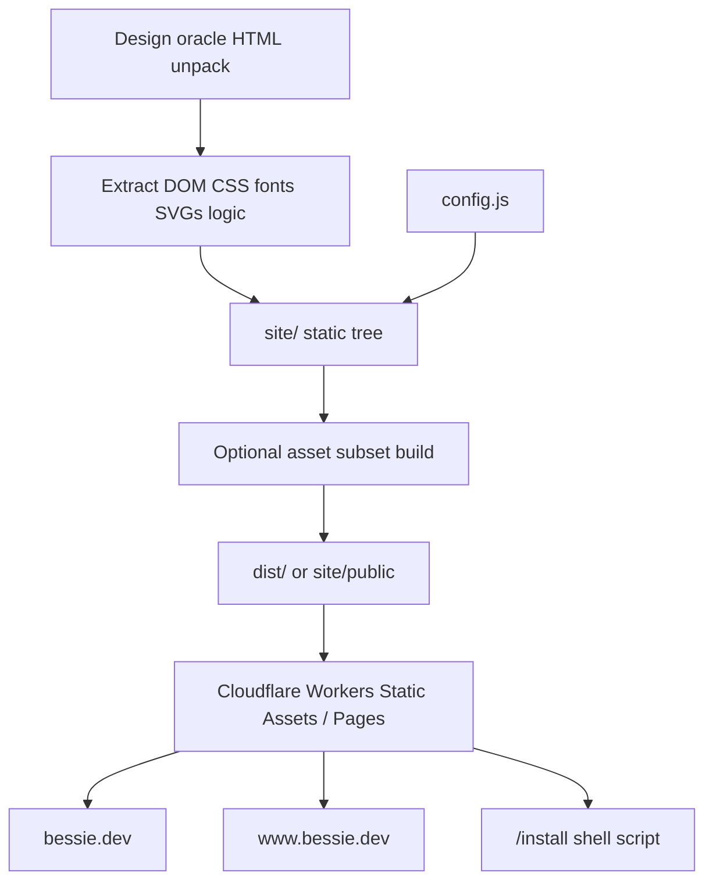

# bessie.dev Landing Page - Plan

## Goal Capsule

- **Objective:** Ship the retained design-canvas landing page pixel-for-pixel as the public site at `bessie.dev` (Cloudflare Pages or Workers Static Assets under the skeletor-js Cloudflare account).
- **Target repo:** Bessie implementation repository (`skeletor-js/bessie`), new `site/` tree; do not touch native Swift app behavior for this plan.
- **Authority:** The unpacked design source in `docs/research/bessie-landing-source/` (from workstream `inbox/Bessie Landing.html`) is the visual, copy, motion, and interaction contract. Product ownership rules in `AGENTS.md` still apply to any claims the page makes about Herdr/Bessie.
- **Execution profile:** Greenfield static site extraction + Cloudflare deploy. Prefer a pruned production site over shipping the 5MB design-canvas bundle.
- **Stop conditions:** Stop if Cloudflare credentials cannot target the account that owns the `bessie.dev` zone; if a required live download/install artifact is demanded but does not exist and Jordan has not approved a soft-CTA fallback; or if pixel parity cannot be reached without reintroducing the full canvas runtime and Jordan rejects that tradeoff.
- **Tail ownership:** The executor owns site code, local visual proof, deploy config, and live smoke checks. DNS mutations, custom-domain attach, commit/push/PR, and public release URL choices still require Jordan's explicit instruction when they are not already settled below.

---

## Product Contract

### Summary

Implement the marketing landing page designed in **`Bessie Landing.html`** as a production static site on **`bessie.dev`**.

The source is a design-canvas (dc-runtime) bundle: React + full Phosphor icon fonts + full Bessie design-system CSS + a `DCLogic` component that drives cold-open cowprint, scroll motion, copy-to-clipboard, and link wiring. Pixel-for-pixel means the **rendered page** matches that design at the contract viewports — not that the canvas toolchain ships to production.

Title and promise stay: **“Bessie — every agent, one window.”** The page is dark-only (Coals plate `#050505`), single scroll story, no secondary routes beyond optional `/install`.

### Problem Frame

Bessie has a finished landing design and a domain, but no production site. Shipping the raw canvas HTML would be heavy (~5MB unpack, full icon fonts, React, dc-runtime) and brittle. Shipping a loose rewrite would drift from the design. This plan extracts the design into a lean production site while preserving motion, hierarchy, copy, and chrome mocks exactly.

### Requirements

**Fidelity**

- R1. Reproduce every section of the design source in order, with the same copy, hierarchy, spacing, type sizes, and mock UI chrome: Hero, The problem, One surface / The herd, State is luminance, Command palette, Zen and menu bar, What it will not do, Download.
- R2. Preserve the canvas cold-open cowprint field (same twelve sine terms, period, glyph carve from Phosphor cow, letter/tag/CTA stagger, ambient ink after land) and scroll behaviors (`data-rise`, `data-par`, `data-float`, `data-ladder`, `data-reveal`, `data-term`, `data-stagger`, `data-typed`, `data-arrive`, live `.rr-age` ticks, section `data-ink` bidding).
- R3. Honor reduced motion: `prefers-reduced-motion: reduce` and optional `data-reduce-motion="1"` skip cold-open and land content immediately; motion watchdog still fail-opens content if the paint loop stalls.
- R4. Match design tokens for Coals: achromatic ladder, sharp radii, system UI + mono stacks, button/rail/pane/cmdk/card classes used by the landing DOM.

**Production shape**

- R5. Do not ship dc-runtime, React, Babel, or the full Phosphor catalog. Ship a production page whose visual result matches the design.
- R6. Keep the site static-first under `site/` with a tiny config surface for `repoUrl`, `installCmd`, `downloadUrl`, `coldOpen`, `parallax`, `heroInk`, `cowPx`.
- R7. Host on Cloudflare under the zone that already uses Cloudflare nameservers for `bessie.dev`. Prefer Workers Static Assets or Pages with custom domains for apex + `www`.
- R8. Serve an install script at `/install` on the same origin so the copy command can be `curl -fsSL https://bessie.dev/install | sh` without depending on a second domain for v1. The on-page install string must match that origin unless config overrides it.
- R9. Wire CTAs honestly: GitHub links use configured `repoUrl` (default `https://github.com/skeletor-js/bessie`); Download uses configured `downloadUrl` when set, otherwise scrolls to `#get` and does not fake a file; copy control uses the real clipboard fallback path from the design component.
- R10. Include correct document head: title, description, canonical `https://bessie.dev/`, Open Graph/Twitter basics, favicon from the cow mark, theme-color `#050505`, and `viewport`.
- R11. Prune assets aggressively: only the Phosphor glyphs the page uses (including cow for the field glyph raster, plus check/keyboard used by copy feedback), only CSS selectors the landing needs, and small agent-mark SVGs already present in the source unpack.
- R12. Provide local preview and automated visual proof against the design source at contract viewports before deploy.

**Claims and product truth**

- R13. Page copy may describe the product as designed; it must not invent live downloadable binaries or public installers that do not exist. Soft-CTA mode (scroll-to-install / repo only) is valid until a real macOS artifact URL is configured.
- R14. Do not expand this work into a blog, docs site, auth, analytics SDK, CMS, or multi-page marketing system.

### Key Flows

- F1. **Cold open:** Load `bessie.dev` → cowprint field plays once over the hero → mark, wordmark letters, tagline, CTAs, install row, and scroll cue land → field settles to ambient ink.
- F2. **Scroll story:** User scrolls; nav gains plate; sections rise; problem panes float; herd mock fits width; state ladder brightens; palette types `sch`; ages tick; ink density tracks nearest `data-ink` section.
- F3. **Get Bessie:** User hits Download / nav Download → reaches `#get`; copies install command; optional GitHub open in new tab; optional direct macOS download when `downloadUrl` is set.
- F4. **Reduced motion / failure:** Reduced motion or paint watchdog → content fully visible, no stuck `opacity:0` regions.

### Acceptance Examples

- AE1. **Covers R1, R2.** Given a 1440×900 viewport with motion enabled, when the page loads without scrolling for 5s, then the cold-open completes and the hero matches the design source hero (mark, wordmark, tagline, dual CTAs, install row, scroll cue) within the visual tolerance in Verification.
- AE2. **Covers R3.** Given `prefers-reduced-motion: reduce`, when the page loads, then hero content is visible immediately and no section below the fold remains at opacity 0 after one scroll pass.
- AE3. **Covers R8, R9.** Given default config, when the user clicks Copy on the install row, then the clipboard (or documented fallback) receives `curl -fsSL https://bessie.dev/install | sh`, and `GET /install` returns a shell script with `Content-Type` suitable for curl piping.
- AE4. **Covers R7.** Given deploy + domain attach complete, when fetching `https://bessie.dev/` and `https://www.bessie.dev/`, then both serve the landing HTML (www may redirect to apex) with cache-busted static assets.

### Scope Boundaries

**In scope**

- Extracted production landing at `site/`
- Asset prune, motion port, config, `/install` script stub or real installer when available
- Cloudflare project config and deploy runbook
- Visual regression evidence vs design source
- Retain/route the design source under repo research (already started at `docs/research/bessie-landing-source/`)

**Deferred**

- Real notarized `.dmg` / Sparkle feed wiring beyond a config URL
- `bessie.sh` domain alias (optional later CNAME/redirect to `bessie.dev`)
- Light/Paper marketing theme (design is dark-only)
- Docs, changelog, blog, status page
- Analytics, cookie banners, newsletter
- Localization

**Outside identity**

- Changing native Bessie app UI
- Public-open of the private GitHub repo (link may 404 for anonymous users until the repo is public; that is an org decision, not a site blocker)

### Outstanding Questions

- Q1. **Deferred:** Exact public macOS download URL / GitHub Release asset when v1 ships. Until set, Download is soft-CTA to `#get`.
- Q2. **Deferred:** Whether `bessie.sh` should exist as a short install host later. v1 uses `bessie.dev/install`.
- Q3. **Deferred non-blocking:** Whether anonymous GitHub visitors should hit a public mirror instead of private `skeletor-js/bessie`. Default keeps the private repo URL.

---

## Planning Contract

### Key Technical Decisions

- KTD1. **Production extraction, not canvas shipping** *(session-settled: user-directed — pixel-for-pixel implementation of the design; chosen over hosting the raw 5MB dc bundle: production must be lean and durable while matching pixels).* Build a real `site/` from the unpacked DOM, CSS subset, fonts subset, SVGs, and component logic. Keep the original HTML and unpack under `docs/research/bessie-landing-source/` as the oracle.
- KTD2. **Vanilla JS port of the landing `Component`** *(session-settled: user-approved — agent proposal: the design component only uses `React.createRef` and imperative DOM; chosen over shipping React+dc-runtime: zero framework tax, same behavior).* Replace refs with plain `{ current }`; mount on `DOMContentLoaded`; preserve algorithms from `landing-component.js` line-for-line where possible.
- KTD3. **Monorepo `site/` directory in `skeletor-js/bessie`** *(session-settled: user-approved — agent proposal over a separate marketing repo: one private remote already exists; CE plans and deploys stay with product; native Swift tree remains untouched).*
- KTD4. **Cloudflare Workers Static Assets (or Pages) on `bessie.dev`** *(session-settled: user-directed — Pages or Worker both acceptable; chosen Workers Static Assets with `wrangler.toml` routes `custom_domain` when possible because it matches other skeletor-js sites and keeps `/install` as a tiny Worker handler beside static files).* If only Pages is available with the active credentials, Pages + Pages Function for `/install` is an equal implementation of this KTD.
- KTD5. **Install command origin = `bessie.dev`** *(session-settled: user-approved — agent proposal overriding the design default `bessie.sh`: single domain Jordan confirmed owning; avoid a second zone for v1).* On-page copy and `/install` stay in lockstep via config default.
- KTD6. **CSS strategy = design tokens + used component rules only.** Start from unpacked CSS; drop unused Phosphor selector blocks and app screens not referenced by `landing-dom.html`. Prefer one `site/styles.css` (or built bundle) under ~100KB gzipped target, not a hard gate if glyph subsetting needs temporary full woff2.
- KTD7. **Icon strategy = subset Phosphor Thin + Fill.** Required Thin: arrow-down, caret-down, caret-right, copy, check, keyboard, corners-out, dots-three, download-simple, gear, github-logo, hard-drives, magnifying-glass, plus, seal-question, square-split-horizontal, squares-four, stack, sun, terminal-window. Required Fill: cow (cold-open glyph source). Agent marks stay as the small SVGs already unpacked (`claude`/`codex`/`amp` masks).
- KTD8. **Honest CTAs via `site/public/config.js` (or build-time injected config).** Defaults: `repoUrl=https://github.com/skeletor-js/bessie`, `installCmd=curl -fsSL https://bessie.dev/install | sh`, `downloadUrl=""`, `coldOpen=true`, `parallax=true`, `heroInk=0.13`, `cowPx=320`.
- KTD9. **Visual parity gate uses Playwright screenshots**, not human vibes alone. Compare production build vs design-canvas oracle at 1280 and 1440 width after cold-open completion (`coldOpen:false` mode also checked for reduced-motion path).

### High-Level Technical Design

**Runtime structure**

| Piece | Role |
|---|---|
| `index.html` | Exact landing DOM from `landing-dom.html`, productionized head, asset URLs |
| `styles.css` | Tokens + landing-needed component CSS + icon font-face |
| `cowprint.js` / `main.js` | Port of design `Component` motion + copy + links |
| `assets/icons/*` | Subset fonts + agent mark SVGs + favicon |
| `install` or Worker route | Shell installer script body |
| `wrangler.toml` | Project name, assets dir, custom domains |

**Section map (implementation checklist)**

1. Fixed nav — Bessie mark, The herd, At a glance, What it won't do, GitHub, Download
2. `#top` Hero — cold-open targets `data-o` / `data-l`
3. The problem — 2×2 panes with float lift/sink
4. `#surface` One surface — fitted full app chrome mock + three pillars
5. `#state` State ladder + Needs you card
6. Command palette mock with typed `sch`
7. Zen mock + menu bar companion mock
8. `#client` What it will not do — four cards
9. `#get` Download / install

### Assumptions

- A1. `bessie.dev` is already on Cloudflare nameservers (`nero`/`bella`); apex address records are not required before custom-domain attach, but conflicting website A/CNAME records must be handled per Cloudflare launch notes.
- A2. Jordan can supply or unlock Cloudflare credentials that can deploy to the account owning that zone (current agent env token did not authenticate during planning).
- A3. A perfect installer binary is not required for page launch; `/install` may print a clear “not published yet” message or fetch the latest Release asset when one exists.
- A4. Private GitHub repo link is acceptable for v1.

### Sequencing

1. Freeze oracle + extraction scaffolding
2. Production HTML/CSS/assets
3. Motion/logic port
4. Install route + config
5. Visual parity loop
6. Cloudflare project + domain smoke
7. Workstream routing note for the inbox source

---

## Implementation Units

### U1. Freeze design oracle and site scaffold

- **Goal:** Make the design source durable in-repo and create an empty production `site/` that can be previewed.
- **Requirements:** R5, R6, R11
- **Files:** `docs/research/bessie-landing-source/**` (already populated), `site/package.json`, `site/README.md`, `site/wrangler.toml`, `site/public/` or `site/src/` skeleton, root `.gitignore` only if site build outputs need ignoring
- **Approach:**
  - Keep the full original `Bessie Landing.html` plus unpacked `landing-dom.html`, `landing-component.js`, `all.css`, fonts, and SVGs as the oracle.
  - Add a short `docs/research/bessie-landing-source/README.md` describing unpack provenance and that production code lives in `site/`.
  - Scaffold `site/` with no native Swift coupling.
  - Prefer zero or minimal bundler: plain static files are enough; add a tiny Node script only for CSS/font subset builds if needed.
- **Test scenarios:**
  - **Happy path:** `site/` listed in repo; oracle files present and non-empty.
  - **Edge:** Large oracle HTML is not duplicated into Syncthing workstream inbox; research copy is the durable path.
- **Verification:** `test -f docs/research/bessie-landing-source/landing-dom.html && test -d site`

### U2. Production HTML shell and section DOM

- **Goal:** Port `landing-dom.html` into production `index.html` with real head tags and stable asset paths.
- **Requirements:** R1, R10, R13
- **Files:** `site/index.html`, `site/public/config.js`
- **Approach:**
  - Copy the DOM tree under the root `theme-dark` wrapper verbatim, including inline styles and `data-*` hooks the motion code depends on.
  - Replace design-canvas `ref="{{ ... }}"` / `sc-camel-on-click="{{ onCopy }}"` with plain ids/classes/data attributes the vanilla port will query.
  - Replace uuid asset URLs in mask/font references with `/assets/...` paths.
  - Add meta description from the hero tagline; OG title/description/image (static cow or later screenshot); favicon.
  - Load `config.js` then `main.js` as `type="module"` or defer scripts.
- **Test scenarios:**
  - **Happy path:** Opening `index.html` via local static server shows all section anchors `#top #surface #state #client #get`.
  - **Edge:** With JS disabled, noscript message or still-legible static content (at least hero copy visible without relying on opacity animation defaults — set initial visible styles for no-JS or document intentional JS requirement matching the design).
- **Verification:** Local static server; manual section checklist against oracle DOM text dump.

### U3. CSS extraction and token parity

- **Goal:** Ship only the CSS required for landing chrome and tokens so mocks match the app design system.
- **Requirements:** R1, R4, R11
- **Files:** `site/styles.css` (and optional `site/scripts/extract-css.mjs`)
- **Approach:**
  - From oracle CSS, keep `:root` type/color/layout/motion tokens for Coals, shared `@keyframes` (blink/spin/pulse), and rules for classes used in the landing DOM (`btn*`, `rail*`, `pane*`, `term`, `state*`, `cmdk*`, `card`, `win*`, `topbar`, `wb-tab`, `cursor`, `tspin`, `flame`, etc.).
  - Drop unused Phosphor utility selectors after icon subset is known.
  - Ensure body/page background `#050505` and fixed canvas layering match the design root wrapper.
- **Test scenarios:**
  - **Happy path:** Button, rail-row blocked/selected, pane heads, cmdk, and state dots match oracle screenshots at equal viewport.
  - **Edge:** No horizontal overflow at 1280 width on the fitted herd mock.
- **Verification:** Side-by-side screenshots for nav/hero/problem grid/herd mock/cmdk.

### U4. Icon font subset and static assets

- **Goal:** Provide cow + UI icons without multi-megabyte full Phosphor SVG/font packages.
- **Requirements:** R2, R11
- **Files:** `site/assets/fonts/*`, `site/assets/marks/*`, `site/assets/favicon.*`, optional subset script
- **Approach:**
  - Subset Phosphor Thin/Fill woff2 to required codepoints (include cow fill for `loadGlyph`).
  - Keep agent mark SVGs used as CSS masks; name them `claude.svg`, `codex.svg`, `amp.svg`.
  - Favicon from cow mark (PNG already in oracle `695ddea6-...png` or generated SVG).
  - If subset tooling is painful, temporarily ship the two woff2 files only (not the 3MB SVG fonts) and track a follow-up to subset — still delete ttf/woff duplicates and SVG font mammoths from the production tree.
- **Test scenarios:**
  - **Happy path:** Cow glyph paints; GitHub/download/copy icons render; agent marks visible on rows.
  - **Edge:** `document.fonts.load` failure still leaves page readable (watchdog/openAll path).
- **Verification:** Computed `::before` content on probe cow non-empty after fonts load; network panel shows no multi-MB SVG fonts.

### U5. Vanilla motion and interaction port

- **Goal:** Pixel-timed behavior parity with `landing-component.js`.
- **Requirements:** R2, R3, R9
- **Files:** `site/main.js` (split modules ok: `cowprint.js`, `scroll.js`, `clipboard.js`)
- **Approach:**
  - Port the class body from the oracle component with minimal renames.
  - Preserve: `T` sine terms, `PER/CYC/DUR`, Bayer dither, cold-open `env`, `paint`, `ambientEnv`, `grab` timelines, `scrollInner`, nav plate, `fit` for `data-fit`, age ticking, copy fallbacks, `applyLinks`.
  - Read config from `window.__BESSIE_SITE__` or imported constants.
  - Bind copy on install rows; bind repo links; Download buttons use `downloadUrl` or `#get`.
  - Mirror reduce-motion + scroll-skip-cold-open + paint watchdog fail-open.
- **Test scenarios:**
  - **Happy path:** Cold-open duration ~4.7s then ambient field; scroll cue fades; ages increment each second.
  - **Edge:** Force `loopDead` / throw in scroll → content forced visible.
  - **Edge:** Clipboard denied → “Press ⌘C” / selection fallback.
- **Verification:** Playwright script waits for hero land; asserts key nodes `opacity` ~1; reduced-motion project test.

### U6. Install route and CTA honesty

- **Goal:** Same-origin install endpoint and non-lying buttons.
- **Requirements:** R8, R9, R13
- **Files:** `site/worker.js` or `site/functions/install.ts` / static `install` with correct headers via `_headers`/`_routes`, `site/public/config.js`, optional `site/install.sh`
- **Approach:**
  - Default install script: detect macOS, print clear status, and either download the configured release asset or explain that binaries are not published yet with a link to the repo/releases.
  - Headers: `Content-Type: text/plain; charset=utf-8`, `Cache-Control: no-store` for `/install`.
  - On-page `data-copy` default matches `https://bessie.dev/install`.
  - Document how to set `downloadUrl` when a DMG exists.
- **Test scenarios:**
  - **Happy path:** `curl -fsSL http://localhost:8787/install` returns script starting with `#!/` or clear shell.
  - **Edge:** Empty `downloadUrl` → script exits non-zero with human message, does not pipe garbage into shell silently.
- **Verification:** curl local + production after deploy; copy button integration check.

### U7. Visual parity harness

- **Goal:** Prove pixel-for-pixel against the oracle, not just “looks close.”
- **Requirements:** R1, R2, R12
- **Files:** `site/scripts/visual-proof.mjs` (Playwright), `site/proof/` output gitignored or small diffs committed as evidence under `docs/research/bessie-landing-source/proof/`
- **Approach:**
  - Serve oracle template path (dc bundle or a frozen built oracle page) and production `site` on two ports.
  - Prefer production vs **production with oracle DOM/CSS frozen** if full dc-runtime harness is too heavy: alternatively screenshot the design file via headless Chrome after unpack bootstrap, or use pre-captured reference frames from a one-time oracle render checked into proof/.
  - Capture at widths 1280 and 1440, full-page after cold-open (`coldOpen:false` for stable section shots; separate motion smoke for cold-open).
  - Diff with a small threshold (suggest ≤0.3% pixel mismatch on section crops; full-page antialiasing may need slightly higher). Fail CI script locally when over threshold.
  - Contract viewports and section crops: hero, problem grid, herd window, state card, cmdk, zen, menu bar, client cards, download.
- **Test scenarios:**
  - **Happy path:** All section crops under threshold vs oracle references.
  - **Edge:** Font metric differences on Linux CI — run proof on Mac when available; document Linux as approximate if SF Pro metrics differ. Primary acceptance remains Jordan's Mac or Macbook screenshot pass.
- **Verification:** Script exit 0; proof images written; note environment in proof README.

### U8. Cloudflare project, domain, and smoke

- **Goal:** Put the site on `bessie.dev` / `www.bessie.dev`.
- **Requirements:** R7, R8, R10
- **Files:** `site/wrangler.toml`, `site/README.md` deploy section
- **Approach:**
  - Create project name `bessie-dev` (or `bessie-site`) in the Cloudflare account that owns the zone.
  - Configure assets directory + `/install` handler.
  - Attach custom domains for apex and www; resolve DNS conflicts per cloudflare custom-domain launch notes; do not delete MX/TXT.
  - Deploy only with credentials that target that account (`env -u` wrong tokens if needed; OAuth login runbook).
  - Smoke: HTML title, asset 200s, `/install` content-type, www behavior, cache headers sanity.
- **Test scenarios:**
  - **Happy path:** `curl -sI https://bessie.dev/` → 200; body contains “every agent, one window”.
  - **Edge:** Auth/account mismatch → stop and report; do not deploy to the wrong account's workers.dev and call it done.
- **Verification:** Live curl + browser open; record headers (`cf-ray`, cache) in the session note, not in the plan.

### U9. Workstream routing and operator docs

- **Goal:** Leave the workspace honest about where the design source and plan live.
- **Requirements:** R6
- **Files:** workstream `inbox/_index.md` (route history), optional `projects/` note only if a bounded marketing project already exists; `site/README.md`
- **Approach:**
  - Note that the landing HTML was ingested into repo `docs/research/bessie-landing-source/` and planned as `docs/plans/2026-08-04-002-feat-bessie-dev-landing-page-plan.md`.
  - Do not keep a 5MB duplicate in Syncthing inbox once routed.
  - README covers: local serve, config knobs, deploy, proof, how to update copy from a new canvas export.
- **Test scenarios:**
  - **Happy path:** A future agent can find oracle + plan + site from README links alone.
- **Verification:** Links resolve; inbox index updated.

---

## Verification Contract

| Gate | Command / action | Applies to |
|---|---|---|
| Oracle present | `test -f docs/research/bessie-landing-source/landing-component.js` | U1 |
| Local static smoke | `cd site && npx --yes serve public -p 4173` (or `wrangler dev`) and open `/` | U2–U6 |
| Install route | `curl -fsS http://127.0.0.1:8787/install \| head` | U6 |
| Visual proof | `node site/scripts/visual-proof.mjs` | U7 |
| Reduced motion | Playwright project with `reducedMotion: 'reduce'` | U5, U7 |
| Production smoke | `curl -fsS https://bessie.dev/ \| rg "every agent, one window"`; `curl -fsSI https://bessie.dev/install` | U8 |
| Asset budget check | Network log: no dc-runtime, no React, no multi-MB SVG fonts | U4, U8 |
| Native app untouched | `git diff --stat -- Sources Tests Package.swift` empty for this work | all |

No Swift test target is required. Do not run `release:validate` for the native app as part of this plan.

---

## Definition of Done

**Global**

- [ ] `site/` serves the landing page locally with all sections and motion.
- [ ] Visual proof against the design oracle passes at contract crops/viewports (Mac-preferred).
- [ ] `/install` exists on the same origin and matches the on-page copy command.
- [ ] CTAs do not claim a downloadable macOS build unless `downloadUrl` is configured.
- [ ] `bessie.dev` (and www policy) serves the site after deploy, or a credential/DNS blocker is explicitly reported with exact next human action.
- [ ] Design oracle retained under `docs/research/bessie-landing-source/`; inbox not left holding the only copy.
- [ ] Abandoned extraction experiments removed from `site/`.
- [ ] No unrelated native app changes.

**Per unit**

- U1: scaffold + oracle README
- U2: complete DOM + head
- U3: CSS parity for mocks
- U4: icons/fonts/favicon without canvas bloat
- U5: motion/clipboard/links parity + fail-open
- U6: install + config honesty
- U7: proof harness green
- U8: live domain smoke or explicit blocker
- U9: routing/docs done

---

## Appendix

### Design source inventory (unpacked)

| Artifact | Role |
|---|---|
| `Bessie Landing.html` | Original ~5MB canvas bundle |
| `landing-dom.html` | Section DOM (~40KB) — primary structure source |
| `landing-component.js` | Motion/clipboard/link logic (~25KB) — primary behavior source |
| `all.css` | Full design-system + Phosphor CSS (~268KB) — prune for production |
| Phosphor woff2/woff/ttf + SVG fonts | Icon sources — ship subset woff2 only |
| Small SVGs `171b5008`, `186c902e`, `1ce97004`, … | Agent marks / UI masks |
| PNG `695ddea6…` | Likely app icon / OG candidate |
| `dc-props.json` | Editable defaults: repoUrl, installCmd, coldOpen, parallax, heroInk, cowPx |

### Section labels in source

Hero · The problem · One surface · State is luminance · Command palette · Zen and menu bar · The one rule · Download

### Known design defaults that production overrides

| Knob | Design default | Production default |
|---|---|---|
| `installCmd` | `curl -fsSL https://bessie.sh/install \| sh` | `curl -fsSL https://bessie.dev/install \| sh` |
| `repoUrl` | empty (links fall back to `#get`) | `https://github.com/skeletor-js/bessie` |
| Download href | `#get` | `downloadUrl` or `#get` |

### Cloudflare note from planning session

- Public DNS: `bessie.dev` NS = Cloudflare (`nero`/`bella`); no apex A observed yet.
- Agent env `CLOUDFLARE_API_TOKEN` did not authenticate to the API during planning. U8 must establish the correct account/token or OAuth before deploy and must not declare victory from a wrong-account `workers.dev` URL.

### Out-of-scope reminder

This plan does not implement native menu bar, Zen, or herd product features — it only markets them with static mocks matching the design.
