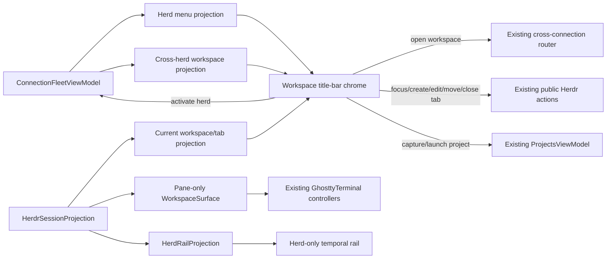

# Bessie tab refresh redesign

## Goal Capsule

Replace Bessie's duplicated workspace path bar and tab strip with one native trailing title-bar control group for herd, workspace, and tab; leave the main workspace card as real Herdr panes only; and remove duplicate navigation from the herd rail.

The source of truth for visual intent and product rationale is the external Bessie workstream artifact `inbox/Bessie Tab Refresh.html`. The workstream root is mapped for each environment in `AGENTS.md`.

This plan is a delta over `docs/plans/2026-08-04-001-feat-pre-v1-ui-redesign-plan.md`. Where they conflict, this plan supersedes that plan's workspace tab-strip, title/path chrome, rail navigation, workspace/project picker composition, and pane-header visual direction. It does not reopen the broader 15-screen redesign.

**Authority order:**

1. This plan's explicit requirements and decisions.
2. The Tab Refresh workstream artifact for visual hierarchy, spacing intent, labels, and rationale.
3. `docs/plans/2026-08-04-001-feat-pre-v1-ui-redesign-plan.md` for unchanged pre-V1 shell behavior.
4. `docs/plans/2026-08-01-bessie-v1.md`, `AGENTS.md`, and the retained workstream architecture/specification files for Herdr ownership and release constraints.
5. Existing tested behavior where the sources above are silent.

**Execution profile:** one implementation agent working in small tested checkpoints on the existing branch. Do not delegate a broad shell rewrite, replace libghostty, or create new Bessie-owned live topology state.

**Stop conditions:** stop and report rather than improvising if the native title-bar host cannot preserve the full-width drag region and standard traffic lights, if a menu action would require a non-public Herdr surface, or if implementation would recreate `GhosttyTerminal` / `PaneTerminalController` during cosmetic selection changes.

**Tail ownership:** the executor owns implementation, focused tests, design captures, `./scripts/check.sh`, full `./scripts/mac-verify.sh`, installation of the packaged app at `/Applications/Bessie.app`, installed-versus-packaged executable verification, a launched-app screenshot inspection, live terminal input/output verification, and an update to `docs/reports/goal-progress.md`. Do not commit, push, publish, or open a PR.

## Product Contract

### Summary

A Bessie window shows one concrete live workspace. The title bar expresses that location as three selectors—herd, workspace, and tab—on its trailing edge. Herd and workspace are quiet path text; tab is the only filled chip and shows pane count, never rolled-up status. The workspace card below contains panes, not a second path bar or tab strip.

The rail stops duplicating herd/workspace/project navigation. It becomes the aggregate herd in time order: Needs you, Working, Settled, and folded Shells, with Settings retained in the footer. Existing product destinations remain routable from the title-bar menus, command palette, keyboard shortcuts, notifications, and other established entry points.

### Problem Frame

The current `WorkspaceSurface` renders a 46 pt path bar and a 34 pt tab strip before the pane grid, repeats the tab name, gives a topology arrangement a misleading semantic-status dot, and makes horizontal width depend on open-tab count. `HerdRail` separately renders Herd, Projects, and Workspace navigation above the same live pane list. This costs vertical space, duplicates hierarchy, and mixes navigation places with recipes and runtime work.

### Requirements

- R1. In workspace context, render a single native title-bar control group on the trailing edge in this order: current herd, `/`, current workspace, `/`, current tab chip, then the sidebar toggle. Preserve a broad draggable title-bar region between the traffic lights and this trailing group.
- R2. Render herd and workspace triggers as quiet, unfilled path text with caret affordances. Render only the current tab as a filled chip. Weighted hierarchy is intentional; do not turn all three into equal chips.
- R3. The tab chip shows the authoritative current tab label and pane count. It has no status dot, rolled-up agent state, age, model, or second line.
- R4. Remove the 46 pt workspace path bar and 34 pt tab strip from `WorkspaceSurface`. With a valid tab/layout, the main card begins at the recursive pane grid, apart from an existing factual warning such as the remote-files banner.
- R5. The herd menu lists concrete reachable connection definitions and marks the active one. It does not offer “All herds” as a workspace location. Selecting a herd activates that connection through the existing fleet, revalidates the remembered/focused/first available workspace from a fresh authoritative projection, and keeps or returns the window to workspace context. A disconnected herd remains selectable only through the existing honest retry/settings path; it must not display stale topology as live.
- R6. The workspace menu lists authoritative fresh workspaces across reachable herds in one text column, marks the selected workspace, and switches both active connection and workspace when needed through the existing `openWorkspace` routing. Do not show per-row subtitle/detail text. Keep connection detail in accessibility descriptions. The deferred large-list fix is quiet herd section headings, not a subtitle on every row.
- R7. The workspace menu contains a `Workspaces` section with a trailing `+`, then a `Projects` section with a trailing `+`, followed by a quiet `Manage projects…` row. The Workspaces `+` creates one ordinary Herdr workspace using the existing public action. The Projects `+` invokes the existing capture-current-workspace flow and opens the existing project editor prefilled from the selected herd/workspace/tabs/pane splits. `Manage projects…` routes to the existing Projects surface.
- R8. Project recipe rows in the workspace menu launch through the existing `ProjectsViewModel` / `ProjectLaunchCoordinator`; they do not become live navigation objects or shadow Herdr state. Preserve in-flight launch protection and fresh-snapshot reconciliation.
- R9. The tab menu lists tabs only for the current authoritative workspace in one text column, marks the current tab, and has a `Tabs in <workspace>` section label with a trailing `+`. The `+` performs exactly one public `tab.create` in the active workspace, reconciles from a fresh snapshot, and focuses the first real pane.
- R10. Preserve tab focus, rename, reorder, and confirmed close behavior. Selection is the primary row action; rename/move/close remain reachable from each tab row's context menu and established native menu/command-palette routes. The redesign may remove drag reordering from the vanished strip, but it must not remove reorder capability.
- R11. Only one hierarchy menu may be open at a time. Each menu is 270 pt wide, anchored below its title-bar trigger, keyboard traversable, dismissible by Escape/outside click/selection, and returns focus correctly. Labels and rows are one line; current selection is indicated by a check.
- R12. Put `+` in the same trailing position on every creatable section label: Herds, Workspaces, Projects, and Tabs. Herds `+` opens the existing add-connection settings path. Footer management rows remain separate from creation.
- R13. Remove Herd, Projects, and Workspace navigation controls from the expanded and collapsed rail. The rail body contains only live pane groups in time order plus the folded Shells group and honest health messaging. Retain cow/brand, search, collapse/expand, appearance, and Settings controls where the current shell contract requires them.
- R14. Preserve rail-row pane actions, semantic grouping, ages, location metadata, provider marks, selection, keyboard traversal, and Shells behavior. The refresh moves hierarchy navigation out; it does not reduce the rail's live-work utility.
- R15. Simplify each pane header to agent/provider mark—or terminal glyph for an ordinary shell—then pane presentation name, spacer, and Zen control. Remove pane index, duplicate status dot, model/agent subtitle, `needs you` label, controller status label, and connecting copy from the header.
- R16. Preserve pane semantic state through existing border/background/mark treatments and accessibility text; blocked/focus state must remain perceivable without hue. Preserve all pane actions in the existing context menu. Do not add a visible three-dot control.
- R17. Cosmetic title-bar, menu, rail, and pane-header updates must preserve each visible pane's `PaneTerminalController`, `GhosttyTerminal`, frame sequencing, input ordering, mouse policy, focus restoration, resize behavior, and live Herdr ownership.
- R18. Non-workspace destinations keep their existing page title bars and remain reachable. This delta does not redesign Herd, Projects, Files, Agent Detail, Settings, onboarding, Trouble, Zen, or the menu-bar companion beyond shared chrome required to avoid regressions.
- R19. Light/dark appearances, compact/comfortable density, Reduce Motion, narrow-window behavior, VoiceOver labels, keyboard focus, and native title-bar fullscreen/zoom behavior remain supported.
- R20. The installed application must visually match the Tab Refresh artifact's hierarchy in a real live workspace and pass the repository's ordinary VPS and Mac verification paths.

### Actors and Key Flows

- F1. Switch hierarchy from the title bar
  - **Trigger:** The user opens herd, workspace, or tab.
  - **Steps:** Exactly one 270 pt menu opens; a one-line row is chosen; Bessie uses the existing fleet/navigation action; the authoritative snapshot reconciles selection; the terminal for the resulting pane regains first responder.
  - **Outcome:** The window displays one real workspace/tab without creating Bessie-owned live topology.
  - **Covered by:** R1-R6, R9-R11, R17.

- F2. Create from a section label
  - **Trigger:** The user presses the trailing `+` beside Herds, Workspaces, Projects, or Tabs.
  - **Steps:** Bessie dismisses the menu once and invokes the existing add-host, workspace-create, workspace-capture, or tab-create path.
  - **Outcome:** The gesture is consistent while ownership stays correct for each entity type.
  - **Covered by:** R7-R9, R12.

- F3. Work from the herd rail
  - **Trigger:** A pane changes state or the user chooses a rail row.
  - **Steps:** The rail groups/ranks authoritative pane projections; row selection routes to the pane; context actions remain available.
  - **Outcome:** The rail is an aggregate temporal work queue, not duplicate topology navigation.
  - **Covered by:** R13-R14.

- F4. Operate a pane
  - **Trigger:** The user focuses a pane, enters Zen, opens its context menu, types, pastes, resizes, or uses a mouse-aware TUI.
  - **Steps:** Simplified chrome changes presentation only; existing terminal controller and action routes remain intact.
  - **Outcome:** More pane area with no terminal semantic or performance regression.
  - **Covered by:** R15-R17.

### Acceptance Examples

- AE1. Given a live local workspace with three tabs, when the workspace opens, then the title bar reads `local / <workspace> / <tab chip>` with the tab's pane count, the old 80 pt of path/tab chrome is absent, and the pane grid starts at the top of the main card.
- AE2. Given tabs with blocked and working panes, when the tab menu and current chip render, then neither displays a rolled-up status dot; each pane and rail row still communicates its own state.
- AE3. Given multiple local/SSH connections, when a workspace on another herd is selected from the workspace menu, then Bessie activates that connection, focuses the real workspace/tab/pane through public actions, and restores the terminal first responder.
- AE4. Given a current workspace that can be captured, when Projects `+` is pressed, then the existing Create project editor opens prefilled from that workspace's tabs and split topology; no project is saved until the user saves it.
- AE5. Given an invalid/incomplete current projection, when Projects `+` is pressed, then the existing factual capture-unavailable reason appears and no partial recipe is created.
- AE6. Given a selected tab, when its context menu is opened, then Rename, Move left/right, and confirmed Close remain available even though the horizontal strip and drag reordering are gone.
- AE7. Given a shell and an agent pane, when pane headers render, then the shell uses a terminal glyph, the agent uses its provider mark, both show only name and Zen visibly, and existing context actions remain available.
- AE8. Given compact/light, comfortable/dark, and a narrow supported window, when menus open, then each stays anchored and usable at 270 pt, only one is open, and the title-bar drag region and native traffic lights remain functional.
- AE9. Given a live mouse-aware terminal and sustained output, when hierarchy/menu state changes, then the same controller remains attached, input/output ordering is preserved, and performance gates do not regress.

### Success Criteria

- The main workspace card recovers 80 pt of vertical chrome in both density modes unless a truthful warning banner is present.
- Title-bar hierarchy, menu structure, rail contents, and pane headers match the supplied artifact under screenshot inspection.
- No live Herdr object gains a Bessie-owned shadow record.
- Existing topology actions remain reachable and tested.
- Full Mac packaging, isolated live Herdr checks, installed-app executable verification, screenshot review, and terminal I/O checks pass.

### Scope Boundaries

**In scope:** title-bar workspace hierarchy controls; menu presentation models; workspace main-card chrome removal; rail navigation removal; project placement in the workspace menu; project capture entry point; tab action preservation; pane-header simplification; focused tests and visual/live verification.

**Out of scope:** the remainder of the pre-V1 15-screen redesign; onboarding, Settings, Trouble, Zen, Agent Detail, Files, and menu-bar redesign; graphical approvals; new Herdr protocol work; workspace-list herd headings before scale requires them; alternate terminal emulators; custom/private traffic lights; a new project schema/materializer; removal of existing destinations or command-palette routes.

### Dependencies and Sources

- `AGENTS.md` and retained workstream architecture/spec files.
- `docs/plans/2026-08-04-001-feat-pre-v1-ui-redesign-plan.md`, especially prior U2-U5 behavior that this plan visually revises but does not semantically discard.
- `docs/plans/2026-08-03-brand-shell-and-chrome-hygiene.md` for achromatic hierarchy and quiet chrome where not superseded.
- `Sources/BessieApp/ProductSurfaces.swift` for shell routing, current workspace chrome, tab actions, pane layout, and terminal focus.
- `Sources/BessieApp/HerdRail.swift`, `HerdPicker.swift`, and `WorkspacePicker.swift` for existing projection/action/accessibility behavior.
- `Sources/BessieApp/BessieApp.swift`, `BessieAppDelegate.swift`, `BessieWindowCoordinator.swift`, and `BessieDesignSystem.swift` for native window/title-bar contracts.
- `Sources/BessieApp/ProjectsViewModel.swift` and `Sources/BessieCore/BessieProjectCapture.swift` for save-as-project behavior.

### Outstanding Questions

- Q1. **Deferred, non-blocking:** when workspace counts make the one-column list ambiguous, add quiet herd headings inside the workspace menu. Do not add per-row subtitles now.

## Planning Contract

### Key Technical Decisions

- KTD1. Use the real SwiftUI/AppKit window toolbar/title bar, not a third in-content bar. Attach the workspace controls through a trailing toolbar placement in workspace context, with custom anchored popovers for the 270 pt menu bodies. If SwiftUI's toolbar placement cannot meet the tested drag/anchor contract, use one idempotently managed `NSTitlebarAccessoryViewController` owned by `BessieWindowCoordinator`; do not fall back to recreating the old in-content path bar. The fallback is an implementation mechanism, not a product question.
- KTD2. Model menu exclusivity with one enum (`herd`, `workspace`, `tab`, or `nil`) owned by the workspace chrome. Do not maintain three independent booleans that permit overlap.
- KTD3. Keep authoritative selection in existing fleet/session state. Presentation rows may be pure value projections, but no title-bar component persists herd/workspace/tab identity beyond the existing last-workspace hint and current SwiftUI selection bindings.
- KTD4. A workspace context is tied to one concrete connection. “All herds” remains the aggregate rail scope and is not rendered as the current herd crumb. Workspace rows may span fresh connections; selecting one uses the existing cross-connection `openWorkspace` route.
- KTD5. Extract workspace/tab selection derivation and actions enough to share them between `BessieProductShell`, title-bar chrome, and `WorkspaceSurface`; do not duplicate the current `requestTabFocus` navigation/focus algorithm. One semantic action must record switch timing, call public navigation, reconcile snapshot state, and restore the terminal.
- KTD6. Reuse and adapt `HerdPickerPresentation` / `WorkspacePickerPresentation` row builders where their authoritative health and topology filtering remains correct. Add a testable tab-menu projection. Detail fields remain available for accessibility but are not visibly rendered.
- KTD7. Keep tab rename/move/close in row context menus and existing command surfaces. Do not preserve vanished-strip drag-and-drop solely for parity; reorder semantics, not drag affordance, are the contract.
- KTD8. Invoke `ProjectsViewModel.beginCaptureCurrentWorkspace()` for Projects `+` and the existing project launch/presentation path for recipe rows. Do not create a second capture editor, store, or materialization coordinator.
- KTD9. Remove hierarchy rows from `HerdRail` inputs and body, but retain the existing `HerdRailProjection` state grouping/ranking and row actions. Simplify the view API after callers and tests migrate; do not leave dead picker closures or labels.
- KTD10. Build pane-header identity from existing pane/provider data: `BessieProviderMark` for agents and the terminal-window icon for shells. Keep semantic state in mark/container styling and accessibility. Header simplification must not touch terminal body/controller identity.
- KTD11. Keep the existing real title bar, native traffic lights, full-size content view, fullscreen policy, and double-click behavior. Interactive title-bar controls must not be swallowed by the current local event monitor or window-drag hit regions.
- KTD12. Treat the workstream HTML as a design reference only. Do not ship React, bundled fonts, web assets, an HTML parser, or a web view. Adapt it natively with existing Bessie tokens and Phosphor assets.
- KTD13. Split `ProductSurfaces.swift` only where it produces honest component boundaries—recommended `WorkspaceTitlebarChrome.swift` and optionally `WorkspaceSurface.swift` / `TerminalPaneChrome.swift`. Avoid a broad unrelated refactor of the 4,000+ line file during this visual delta.
- KTD14. Update capture artboards/scripts only to make the new title-bar menus and live workspace deterministic. Do not weaken, relabel, or remove existing acceptance/performance checks to manufacture a pass.

### High-Level Technical Design



### State and Action Flow

1. Parent shell computes current concrete connection, workspace, tab, pane count, herd rows, cross-herd workspace rows, project rows, and current health.
2. Workspace title-bar chrome renders trigger values and owns only transient open-menu/focus state.
3. A selection dismisses the menu once, invokes the existing semantic route, and waits for fresh projection reconciliation.
4. `WorkspaceSurface` consumes the same selected IDs but renders no hierarchy chrome; it begins with warning or pane layout.
5. Pane layout keys/controller registry inputs remain based on pane IDs, not title-bar/menu state, preventing cosmetic reconstruction.

### Implementation Constraints

- Use Swift 6 and existing SwiftUI/AppKit patterns; add no dependency.
- Keep public Herdr JSON/CLI/terminal bridge boundaries intact.
- Never mutate `.local/` system-equivalent runtime state outside isolated verification.
- Preserve current minimum window size and density metrics unless screenshot evidence requires a token adjustment.
- Keep menu buttons at least the project's accessibility hit target even when their visible text is quiet.
- Preserve focus return for terminal, title-bar trigger, modal, and context-menu cases.
- Do not read or modify credentials or system Herdr configuration.

### Sequencing

Implement U1 through U5 in order because the title-bar component depends on shared projections/actions, and the rail/pane cleanup should land only after the hierarchy controls are functional. U6 verifies the integrated result and owns documentation/install tail work.

## Implementation Units

### U1. Add testable hierarchy menu projections and shared routes

**Goal:** establish one authoritative presentation/action substrate before moving chrome.

**Requirements:** R3, R5-R10, R17. **Decisions:** KTD3-KTD8.

**Files:**

- `Sources/BessieApp/HerdPicker.swift`
- `Sources/BessieApp/WorkspacePicker.swift`
- `Sources/BessieApp/ProductSurfaces.swift`
- New `Sources/BessieApp/WorkspaceTitlebarChrome.swift` or a focused presentation-model file
- `Tests/BessieAppModelTests/PickerPresentationTests.swift`
- Focused new workspace-chrome presentation tests if clearer than extending the picker suite

**Approach:**

1. Define pure row/section models for concrete herds, cross-herd workspaces, projects, and current-workspace tabs. Include stable IDs, visible one-line names, selected/enabled state, and accessibility detail.
2. Exclude “All herds” from the title-bar herd model without changing aggregate rail scope semantics.
3. Derive the current tab and pane count from the same selected-pane/focused-tab fallback used by `WorkspaceSurface`; remove rolled-up `agentStatus` from title-bar presentation.
4. Extract/reuse one tab-focus path so title-bar selection preserves current switch metrics, public `tab.focus`, fresh-snapshot reconciliation, and terminal first-responder restoration.
5. Expose closures for workspace create/open, project capture/launch/manage, tab create/focus/edit/move/close, herd activate/retry/add. Reuse current models and confirmation flows.

**Test Scenarios:** concrete herd rows exclude aggregate scope; workspace rows include only fresh authoritative topology while preserving connection detail for accessibility; tab rows preserve projection order and selected fallback; pane count is authoritative; no tab status field is present; selecting a cross-herd workspace invokes one route; tab focus restores the intended pane; unavailable project capture returns the current factual reason.

**Verification:** run the focused picker/chrome tests with `swift test --filter PickerPresentationTests` and any new test class filter; confirm no terminal-controller creation occurs in projection code.

### U2. Install the trailing native title-bar chrome and menus

**Goal:** make the title bar the sole workspace hierarchy control.

**Requirements:** R1-R3, R5-R12, R19. **Decisions:** KTD1-KTD8, KTD11-KTD12.

**Files:**

- New `Sources/BessieApp/WorkspaceTitlebarChrome.swift`
- `Sources/BessieApp/ProductSurfaces.swift`
- `Sources/BessieApp/BessieApp.swift`
- `Sources/BessieApp/BessieAppDelegate.swift` and/or `BessieWindowCoordinator.swift` only if native hosting/drag policy requires it
- `Sources/BessieApp/BessieDesignSystem.swift`
- `Tests/BessieAppModelTests/BessieVisualFoundationTests.swift`
- Focused title-bar/menu behavior tests

**Approach:**

1. Attach a workspace-only trailing toolbar/title-bar group with quiet herd and workspace triggers, separators, a filled tab chip with pane count, and sidebar toggle.
2. Implement one exclusive open-menu enum and reusable 270 pt anchored panel. Preserve keyboard traversal, Escape, outside-click dismissal, selection dismissal, and focus return.
3. Render section headings and trailing `+` controls consistently. Keep one visible text column and selected checks; put management in footer rows.
4. Connect all actions from U1. Disable mutations honestly during disconnected/action-in-flight states without making stale rows appear live.
5. Verify title-bar controls coexist with native traffic lights, full-width drag region, double-click fullscreen behavior, and narrow-window layout. Compact values by truncating names before collapsing hierarchy or moving the group near traffic lights.
6. Add deterministic design-preview hooks for closed/rest and each menu-open state without shipping preview-only state into production behavior.

**Test Scenarios:** only one menu opens; each trigger has correct accessibility label/value; each section `+` dispatches exactly one existing action; outside click and Escape dismiss; tab chip has count but no status; sidebar toggle remains usable; double-clicking empty title-bar space still performs the established window action; interactive controls do not trigger window drag/fullscreen.

**Verification:** focused Swift tests pass; Mac captures cover rest plus all three menus in light/dark and one narrow-window case; inspect captures against the source artifact.

### U3. Make the workspace card panes-only and simplify pane headers

**Goal:** recover the duplicate 80 pt of chrome while preserving terminal semantics.

**Requirements:** R4, R15-R17, R19. **Decisions:** KTD5, KTD10, KTD13.

**Files:**

- `Sources/BessieApp/ProductSurfaces.swift`
- Optional new `Sources/BessieApp/WorkspaceSurface.swift`
- Optional new `Sources/BessieApp/TerminalPaneChrome.swift`
- `Tests/BessieAppModelTests/BessieVisualFoundationTests.swift`
- Existing terminal/focus/performance tests named by `scripts/check.sh`

**Approach:**

1. Delete the in-card path bar and horizontal tab strip only after U2 provides every hierarchy action.
2. Preserve the remote-files warning because it is factual workspace state, not navigation chrome.
3. Render pane header identity as provider mark or shell terminal glyph, pane name, and Zen. Remove index/status dot/subtitle/needs-you/controller-status text and any reserved spacing.
4. Preserve selected/blocked visual container treatment, semantic accessibility value, entire pane context menu, and controller fallback behavior in the terminal body.
5. Ensure view identity remains pane-ID based and menu/title changes do not change `terminalRegistrySignature` or reconstruct controllers.
6. Update empty-state copy that references creating/splitting “from the sidebar”; direct it to the title-bar tab `+` or pane context actions.

**Test Scenarios:** valid workspace starts at pane grid; warning banner remains only when true; agent/shell marks differ; header visible fields are exactly mark/name/Zen; blocked and selected state remain perceivable/accessibly named; context actions remain complete; controller identity survives tab menu opening, theme change, status update, and pane focus.

**Verification:** visual foundation tests reflect zero in-card workspace chrome; existing terminal frame sequencing, focus, resize, shortcut, mouse-TUI, and performance checks pass; live pane accepts input and produces observable output after repeated tab switching.

### U4. Turn the rail into the herd in time order

**Goal:** remove duplicate hierarchy navigation while retaining the rail's work queue.

**Requirements:** R13-R14, R18. **Decisions:** KTD4, KTD9.

**Files:**

- `Sources/BessieApp/HerdRail.swift`
- `Sources/BessieApp/ProductSurfaces.swift`
- `Tests/BessieAppModelTests/HerdRailPresentationTests.swift`
- `Tests/BessieCoreTests/HerdListTests.swift` only if projection behavior needs a focused correction

**Approach:**

1. Remove HerdPicker, Projects, and WorkspacePicker rows from expanded/collapsed rail body and remove now-dead API parameters/closures from `HerdRail` and its caller.
2. Keep state sections in existing rank/time order, folded Shells behavior, pane metadata/actions, health messaging, search, collapse, appearance, and Settings footer.
3. Keep destination routes available elsewhere; do not delete `ProductDestination`, Projects surface, Herd surface, Files, Agent, or Settings as part of this unit.
4. Rebalance rail padding only as required by the source artifact; do not change projection truth or invent new timestamps.

**Test Scenarios:** rail contains no hierarchy/project navigation rows in expanded or collapsed states; pane groups retain order/count and cross-herd location; shells fold/unfold; pane row opens/Zen/context actions still work; Settings/search/collapse/appearance remain accessible.

**Verification:** `HerdRailPresentationTests` and `HerdListTests` pass; screenshot rail matches the artifact at rest and in collapsed mode; command palette and direct routes still open removed destinations.

### U5. Integrate project recipes into the workspace menu

**Goal:** make Projects a workspace recipe section without changing storage/materialization ownership.

**Requirements:** R7-R8, R12, R18. **Decisions:** KTD8.

**Files:**

- `Sources/BessieApp/WorkspaceTitlebarChrome.swift`
- `Sources/BessieApp/ProductSurfaces.swift`
- `Sources/BessieApp/ProjectsViewModel.swift` only if a small reusable presentation/action seam is needed
- `Tests/BessieAppModelTests/ProjectsViewModelTests.swift`
- Focused workspace-menu tests

**Approach:**

1. Present stored recipe names under Workspaces in the same one-column menu; selection launches through the existing coordinator and current in-flight protections.
2. Wire Projects `+` directly to current workspace capture and existing editor presentation, retaining validation/error messages and no-save-until-confirmed semantics.
3. Route `Manage projects…` to the existing Projects surface.
4. Ensure changing herd/workspace updates the capture snapshot before enabling the `+`; never capture stale topology from the previously active connection.

**Test Scenarios:** capture from current workspace prefills name/CWD/tabs/splits; incomplete projection disables or fails factually; launch creates ordinary Herdr topology once; in-flight launch prevents duplicates; management row opens Projects; canceling editor leaves store unchanged.

**Verification:** `ProjectsViewModelTests` and `BessieProjectCaptureTests` pass; one isolated live capture/launch round-trip is exercised non-destructively under repository-local Herdr configuration; inspect editor prefill.

### U6. Run integrated visual, live, package, and install verification

**Goal:** prove the redesign as an installed native Mac app, not just compiled views.

**Requirements:** R17, R19-R20. **Decisions:** KTD11-KTD14.

**Files:**

- `scripts/capture-redesign-matrix.sh` and `scripts/verify-design-snapshot.swift` only as needed for deterministic new captures
- `scripts/check.sh` / `scripts/mac-verify.sh` only for honest coverage additions, never weakening
- `docs/reports/goal-progress.md`

**Approach:**

1. Run focused tests after each unit and `./scripts/check.sh` on the VPS.
2. Run `./scripts/mac-verify.sh` to sync intentionally to the verified Mac mirror, run Swift tests, package `dist/Bessie.app`, and exercise isolated live Herdr checks.
3. Capture and inspect the installed live workspace at rest, each of the three menus, compact/light, comfortable/dark, narrow width, and collapsed rail.
4. Assert real terminal output/input through live Herdr pane reads or the existing observable live check; switch tabs repeatedly and confirm controller/focus behavior.
5. Install the newly packaged app at `/Applications/Bessie.app`, relaunch it, compare installed and packaged executable hashes, and inspect a fresh screenshot from the installed binary.
6. Update `docs/reports/goal-progress.md` with changed files and actual command outputs. Remove abandoned experiments, preview artifacts outside expected capture locations, and dead code.

**Test Scenarios:** all source/artifact hierarchy states are inspectable; menus stay anchored; drag/fullscreen/traffic lights work; tab/workspace/herd routing survives fresh snapshots; live terminal input/output survives switching; app relaunch does not terminate Herdr; installed executable matches package.

**Verification:** all commands in the Verification Contract pass with recorded real output; failures are fixed at root cause or reported honestly without narrowing checks.

## Verification Contract

### Focused checks

Run filters as units land, including:

```bash
swift test --filter PickerPresentationTests
swift test --filter HerdRailPresentationTests
swift test --filter HerdListTests
swift test --filter ProjectsViewModelTests
swift test --filter BessieProjectCaptureTests
swift test --filter BessieVisualFoundationTests
```

Add focused title-bar/menu tests and run their class filter explicitly. Run any existing terminal controller, shortcut, projection, live Herdr, frame sequencing, resize, and performance filters touched by U3; use the test names discovered in the current repository rather than inventing commands in execution.

### Required repository gates

```bash
./scripts/check.sh
./scripts/mac-verify.sh
```

`mac-verify.sh` must perform its documented source sync, Mac Swift tests, packaging to `dist/Bessie.app`, and non-destructive live checks against isolated repository-local Herdr configuration. Compilation alone is not acceptance.

### Visual matrix

Capture and inspect on the Mac:

1. Workspace rest state, comfortable dark.
2. Workspace rest state, compact light.
3. Herd menu open.
4. Workspace + Projects menu open.
5. Tab menu open.
6. Narrow supported window with title-bar controls usable and drag region present.
7. Expanded herd-only rail and collapsed rail.
8. Agent pane and shell pane headers, selected and blocked states.

Compare hierarchy, labels, one-column rows, checks, `+` positions, 270 pt menu width, title-bar placement, pane-only main area, and rail contents to the workstream artifact. Record observed differences and fix material ones; do not claim match from code inspection.

### Live behavior gates

- Select a herd, a cross-herd workspace, and several tabs; observe fresh authoritative IDs and terminal focus after each route.
- Create a tab once and confirm one ordinary Herdr tab appears.
- Exercise rename, move, and cancel/confirm close from the tab row context menu.
- Open Projects `+`, inspect prefill, cancel without persistence; run one isolated recipe launch if the existing live verifier supports cleanup.
- Send terminal input and assert output through pane reads or equivalent; exercise paste, mouse-aware terminal behavior, pane resize, and rapid tab switching.
- Close/reopen Bessie's window and confirm Herdr/pane processes continue.
- Double-click empty title-bar space and verify established fullscreen behavior; click controls and verify they do not drag/fullscreen the window.

### Package and install gate

After `mac-verify.sh` succeeds:

1. Install `dist/Bessie.app` to `/Applications/Bessie.app` on `jordan-macbook`.
2. Relaunch the installed application.
3. Compare the packaged and installed executable with a cryptographic hash.
4. Capture and inspect the installed application, not only the build product.
5. Record the exact commands/results in `docs/reports/goal-progress.md`.

## Definition of Done

- D1. R1-R20 are implemented and traced to passing tests or explicit live/visual evidence.
- D2. The title bar is the sole workspace hierarchy control and preserves native traffic lights, drag, fullscreen, and narrow-window usability.
- D3. The workspace main card contains no duplicate path bar or horizontal tab strip and displays real libghostty panes without controller reconstruction.
- D4. Herd/workspace/tab menus are exclusive, 270 pt, one-column, keyboard accessible, and preserve every required creation/management/action route.
- D5. The rail contains the live herd in temporal groups plus folded Shells and footer controls, with no duplicate Herd/Workspace/Projects navigation rows.
- D6. Pane headers visibly contain only identity mark, pane name, and Zen; semantic state/accessibility and context actions remain intact.
- D7. Project capture and launch reuse existing recipe ownership, validation, storage, and materialization paths.
- D8. Focused tests, `./scripts/check.sh`, and `./scripts/mac-verify.sh` pass without weakened checks.
- D9. The packaged app is installed and relaunched at `/Applications/Bessie.app`; installed and packaged executables match; screenshots and live terminal I/O are inspected and recorded.
- D10. `docs/reports/goal-progress.md` contains changed files and actual verification results.
- D11. No commits, pushes, PRs, publications, private Herdr dependencies, alternate terminals, shipped HTML/web assets, dead APIs, abandoned experiments, or unrelated refactors remain in the diff.
