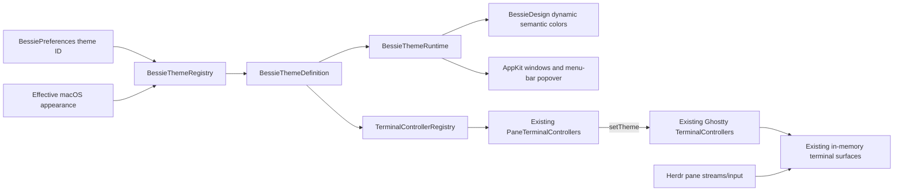

# Curated Bessie application and terminal themes

## Goal Capsule

Add a small, intentional catalog of coordinated Bessie themes that color both native app chrome and every real libghostty terminal surface: Bessie Dark, Bessie Light, and all four Catppuccin flavors—Latte, Frappé, Macchiato, and Mocha. Preserve System as an adaptive selection that resolves to Bessie Dark or Bessie Light. Bessie owns the theme selection and authored app mappings; Herdr continues to own all live terminal and session state.

This plan supersedes the narrow named-theme and independently-dark-terminal exclusions in `docs/plans/2026-08-02-design-system-customization.md`. It does not reopen that plan's decision to defer a token playground, arbitrary theme files, imports, or a marketplace.

**Authority order:**

1. This plan's explicit requirements and decisions.
2. The existing Bessie semantic hierarchy in `Sources/BessieApp/BessieDesignSystem.swift` and the exact Bessie Dark/Light values protected by visual tests.
3. `docs/plans/2026-08-03-brand-shell-and-chrome-hygiene.md` for brand hierarchy, native window behavior, and cowprint treatment where this plan is silent.
4. `docs/plans/2026-08-01-bessie-v1.md`, `AGENTS.md`, and the retained workstream specifications for Herdr ownership and release validation.
5. Existing tested behavior where the sources above are silent.

**Execution profile:** one implementation agent working in small, tested checkpoints on the existing branch. Do not introduce a theme marketplace, parser, editor, runtime dependency beyond the already pinned `libghostty-spm` package, or Bessie-owned terminal/session state.

**Stop conditions:** stop and report rather than improvising if exact `libghostty-spm` `1.3.2` cannot apply a `TerminalTheme` to an existing `TerminalController` without replacing the controller, if a selected palette cannot meet the primary text/code contrast gates without ceasing to resemble its named source, or if source/license provenance for a named palette cannot be preserved in the shipped app.

**Tail ownership:** the executor owns implementation, focused tests, provenance notices, theme captures, `./scripts/check.sh`, full `./scripts/mac-verify.sh`, installation of the packaged app at `/Applications/Bessie.app`, packaged-versus-installed executable verification, launched-app screenshot inspection for all six concrete themes, live terminal ANSI/input/output verification, and an update to `docs/reports/goal-progress.md`. Do not commit, push, publish, or open a PR.

## Product Contract

### Summary

Appearance Settings offers one adaptive System choice and six concrete coordinated themes:

- System — follows macOS and resolves to Bessie Dark/Bessie Light.
- Bessie Dark.
- Bessie Light.
- Catppuccin Latte.
- Catppuccin Frappé.
- Catppuccin Macchiato.
- Catppuccin Mocha.

Choosing a concrete theme updates the full Bessie window, menu-bar popover, authored code/diff surfaces, cowprint treatment, and every existing or subsequently created Ghostty terminal. The app and terminal use one selected theme, not independent selectors. Advanced custom theming is a later roadmap item.

### Problem Frame

Bessie already centralizes most native chrome behind a 25-color semantic palette and persists System/Dark/Light appearance, but its palette resolver is fixed to achromatic dark/light values. More importantly, each `BessieTerminalView` is explicitly forced to `darkAqua` and receives no Bessie-authored terminal colors. Users therefore cannot make the terminal and surrounding workspace feel like one environment, even though exact `libghostty-spm` `1.3.2` exposes runtime `TerminalController.setTheme(_:)`, separate light/dark terminal configurations, foreground/background/cursor/selection controls, and ANSI palette slots 0–15.

The first useful theming slice is a small curated catalog with deliberate semantic mappings. It is not an algorithm that guesses Bessie chrome from arbitrary files and not a VS Code theme importer.

### Requirements

- R1. Preserve the exact current Bessie Dark and Bessie Light semantic palettes as named concrete themes. Preserve System as an adaptive choice that follows macOS and resolves only to those two Bessie themes.
- R2. Add Catppuccin Latte, Frappé, Macchiato, and Mocha as fixed built-in themes. Latte is light; Frappé, Macchiato, and Mocha are dark. Do not silently switch a fixed named theme when macOS appearance changes.
- R3. Each concrete theme has one authored definition containing stable identity/display metadata, intrinsic light/dark appearance, the complete Bessie semantic app palette, and terminal foreground, background, cursor, cursor text, selection foreground/background, and ANSI slots 0–15.
- R4. A selected theme colors both native Bessie surfaces and all `GhosttyTerminal` surfaces. Do not retain the current independent forced-dark terminal behavior in Bessie Light, Catppuccin Latte, or System-light mode.
- R5. Theme selection applies live without restarting Bessie, reconnecting Herdr, recreating `PaneTerminalController`, replacing `TerminalController`, restarting a terminal bridge process, losing scrollback, changing pane ownership, or stealing terminal focus.
- R6. Theme updates reach visible, hidden warm, and future terminal controllers. A controller created after selection must start with the current theme before its surface is shown; a prewarmed controller must not flash the previous palette when attached.
- R7. Font-size changes, mouse configuration, option-as-alt, and mouse-hide-while-typing remain independent terminal overrides and must not erase or duplicate the selected terminal theme.
- R8. Theme selection persists through the existing presentation store and decodes existing `system`, `dark`, and `light` values losslessly. An unknown or unavailable future theme ID falls back safely to Bessie Dark while preserving the store's existing newer-schema protection; it must not crash startup or rewrite an unsupported settings envelope.
- R9. Replace the three-option mini-segment Theme control with a native compact theme picker suitable for seven choices. Each row shows a readable name, selected state, light/dark indication, and a small non-essential color preview; names and selection remain fully usable without color.
- R10. Preserve the existing rail quick appearance action as a deliberate Bessie mode toggle: any currently dark-resolving theme targets Bessie Light, any light-resolving theme targets Bessie Dark, and System uses the effective macOS appearance to choose the opposite. The label must state the concrete destination rather than imply it preserves the named theme.
- R11. Preserve Comfortable/Compact density, app icon, cowprint on/off, Reduce Motion, terminal font size, pane gap, menu-bar behavior, and all non-theme settings. Cowprint remains optional and uses the selected theme's authored foreground/accent treatment at the established subtle opacity rather than reverting to achromatic ink.
- R12. Add semantic theme tokens for the currently hard-coded diff added/removed/hunk foreground and plate colors. Keep `clear`, masks, diagnostic red glyphs, and the fixed cold-open brand splash outside the theme catalog only where they are intentionally invariant and documented.
- R13. Primary text against window/panel/background and terminal foreground against terminal background must meet WCAG AA normal-text contrast (4.5:1). Large/icon/accent foreground pairs must meet 3:1 where they convey information. Faint/disabled decoration may be lower, but state remains perceivable without hue through existing shape/text contracts.
- R14. Bessie Dark/Light retain the exact achromatic surface tests and existing snapshot verifier behavior. Named-theme verification is additive; do not weaken, relabel, skip, or broaden the achromatic baseline checks to make chromatic themes pass.
- R15. Theme palette values and names have auditable provenance. Add the applicable MIT notices and source links to packaged attribution. Do not ingest or ship VS Code extension JSON, extension code, fonts, icons, or upstream marketplace assets.
- R16. Update the customization roadmap to defer advanced custom Bessie themes: user-authored semantic and terminal token values, validation, live preview, reset, and import/export. Do not define a public custom-theme file format in this slice.
- R17. The installed app must demonstrate each concrete theme in a real live workspace with a real Ghostty terminal. Terminal output must visibly exercise normal text, cursor/selection where practical, and ANSI slots 0–15; live input/output and Herdr pane reads must still prove the terminal is not decorative.

### Actors and Key Flows

- F1. Select a concrete theme
  - **Trigger:** The user opens Appearance Settings and chooses a named theme.
  - **Steps:** Bessie persists the theme ID, resolves the authored app/terminal definition, applies native AppKit/SwiftUI appearance, pushes `TerminalTheme` into every controller, and redraws without topology mutation.
  - **Outcome:** Existing app chrome and terminals change together while sessions, input, focus, and scrollback survive.
  - **Covered by:** R2-R9, R11-R15.

- F2. Follow macOS appearance
  - **Trigger:** System is selected and macOS switches between light and dark.
  - **Steps:** Bessie resolves Bessie Light/Dark, updates windows/menu-bar surfaces, adopts the corresponding Ghostty color scheme/theme variant, and leaves fixed named themes untouched.
  - **Outcome:** App and terminal follow the OS as one coordinated pair.
  - **Covered by:** R1-R8.

- F3. Use the rail appearance shortcut
  - **Trigger:** The user presses the rail sun/moon action.
  - **Steps:** Bessie resolves whether the current theme is light or dark and selects the opposite concrete Bessie theme.
  - **Outcome:** The shortcut stays simple and predictable without inventing paired-mode behavior between fixed Catppuccin flavors.
  - **Covered by:** R10.

- F4. Continue terminal work across a theme change
  - **Trigger:** A live shell or agent TUI is producing output while the user changes themes or font size.
  - **Steps:** The same controller receives a configuration/theme update; the Herdr stream, in-memory session, focus, mouse route, and input queue continue.
  - **Outcome:** Only rendering changes.
  - **Covered by:** R5-R7, R17.

### Acceptance Examples

- AE1. Given Bessie Light, when a live terminal is shown, then the terminal uses the authored light foreground/background/ANSI palette and the `BessieTerminalView` is not forced to `darkAqua`.
- AE2. Given Catppuccin Mocha and two visible panes plus one warm pane, when Catppuccin Latte is chosen, then all three existing controllers keep identity and adopt Latte before any warm surface is attached.
- AE3. Given an existing schema-1 settings envelope containing `appearance: "dark"`, when this build launches, then Bessie selects Bessie Dark and saves/loads without dropping unrelated preferences.
- AE4. Given System and macOS dark mode, when macOS changes to light, then native chrome and the terminal both resolve to Bessie Light without a restart. Given Catppuccin Macchiato, the same OS change does not replace Macchiato.
- AE5. Given Catppuccin Frappé, when terminal font size changes, then rendered Ghostty configuration still contains Frappé foreground/background and all 16 ANSI palette entries plus the new font size.
- AE6. Given any named theme, when the rail shortcut is pressed, then its accessibility label says `Switch to Bessie Light` or `Switch to Bessie Dark` and the resulting selection is that concrete theme.
- AE7. Given cowprint disabled, when any theme is selected, then the texture remains absent; enabling it restores a subtle theme-authored treatment without reducing primary text contrast.
- AE8. Given the deterministic ANSI verification command in each theme, when screenshots and Herdr pane reads are captured, then all 16 colors are visibly distinguishable enough for terminal use, typed markers round-trip, and the same pane/controller remains live.

### Success Criteria

- All seven selections persist and apply live; six concrete theme definitions are complete and deterministic.
- App chrome and terminal palettes remain coordinated in every theme, including light terminal surfaces.
- No theme change recreates or reconnects live terminal/session objects.
- Existing Dark/Light achromatic tests and visual gates remain exact.
- Focused theme/persistence/controller tests, full VPS/Mac verification, packaging, installation, executable identity, live terminal checks, and screenshot inspection pass.
- Advanced custom theming is explicit in the roadmap and absent from production UI/API/schema.

### Scope Boundaries

**In scope:** six curated themes; System adaptive selection; authored semantic app mappings; authored terminal palette mappings; runtime app/terminal updates; persistence compatibility; theme picker; rail toggle semantics; diff-token cleanup; attribution; tests; captures; installed-app verification; custom-theme roadmap entry.

**Deferred for later:** user-authored tokens; a token editor; theme duplication; import/export; custom files; live file watching; sharing; marketplace/catalog downloads; automatic app-color derivation; per-workspace/per-pane themes; user-selected independent terminal/app themes.

**Outside this product's identity:** parsing VS Code extension packages; claiming full VS Code workbench/token compatibility; bundling upstream editor code/assets; replacing Ghostty; storing theme selection in Herdr; theming agent output by rewriting ANSI escape sequences.

### Dependencies and Sources

- `Sources/BessieApp/BessieDesignSystem.swift` — current 25-token app palette, adaptive AppKit color provider, cowprint, density, and exact baseline colors.
- `Sources/BessieCore/PresentationPersistence.swift` — appearance preference and schema-1 compatibility.
- `Sources/BessieApp/BessieSettings.swift`, `BessieApp.swift`, `BessieMenuBarPopover.swift`, `HerdRail.swift`, and `ProductSurfaces.swift` — selection UI, AppKit appearance application, preferred color scheme, and quick toggles.
- `Sources/BessieApp/TerminalPaneController.swift` — controller registry/prewarming and current forced `darkAqua` terminal surface.
- Exact dependency source `libghostty-spm` `1.3.2`, especially `TerminalController.setTheme(_:)`, `TerminalTheme`, `TerminalConfiguration`, and its public foreground/background/cursor/selection/palette builders. The pinned source shows theme and per-session terminal configuration are separately composed, so font-size updates need not erase themes.
- Official Catppuccin Ghostty port pinned at `5a58926563ddacbde4a12b4a347464c2c6945393`: `https://github.com/catppuccin/ghostty/tree/5a58926563ddacbde4a12b4a347464c2c6945393/themes`. Use its exact Latte, Frappé, Macchiato, and Mocha terminal values rather than the older iTerm2-derived catalog values bundled in `GhosttyTheme`.
- Catppuccin palette and license: `https://github.com/catppuccin/palette` and `https://github.com/catppuccin/ghostty/blob/5a58926563ddacbde4a12b4a347464c2c6945393/LICENSE` (MIT).
- `Sources/BessieApp/Resources/ATTRIBUTION.md` — packaged provenance surface.

### Outstanding Questions

None blocking. Theme token tuning is implementation-time visual work bounded by the named palettes, contrast gates, and screenshot review; it is not a license to add themes or custom controls.

## Planning Contract

### Key Technical Decisions

- KTD1. Introduce a stable `BessieThemeID` for `system`, `dark`, `light`, `catppuccinLatte`, `catppuccinFrappe`, `catppuccinMacchiato`, and `catppuccinMocha`. Keep persisted raw values for existing System/Dark/Light compatible. Store only the ID; built-in definitions remain code-owned and non-Codable. Use ASCII `frappe` in identifiers and the correct display label `Catppuccin Frappé`.
- KTD2. Treat System as selection behavior, not a seventh authored palette. It resolves to the existing Bessie Dark/Light definitions using effective macOS appearance. Every other ID resolves to one fixed definition and intrinsic color scheme.
- KTD3. Define one immutable `BessieThemeDefinition` registry in the app target. Each definition owns a full `BessiePalette` plus terminal theme/configuration and metadata. Do not generate semantic app colors from a few seeds in this slice.
- KTD4. Preserve the existing `BessieDesign` call-site facade so the roughly 500 semantic references do not require a broad view rewrite. Extend its dynamic `NSColor` providers to consult one app-global resolved-palette snapshot plus effective appearance. Publish snapshot replacements from the main actor; make provider reads Swift-6-safe either with a tiny lock-backed immutable snapshot box or an equivalent proven synchronization mechanism rather than unsafe mutable global state. Selection changes already publish through `BessieSettingsModel`; explicitly invalidate/update windows so static adaptive `Color` values redraw immediately. Keep theme runtime state presentation-only and independent of Herdr.
- KTD5. Keep `palette(for: ColorScheme)` as an exact Bessie Dark/Light baseline helper for current tests. Add explicit registry/resolution APIs for selected themes instead of changing baseline test meaning.
- KTD6. Use `TerminalController.setTheme(_:)` for palette changes and `setTerminalConfiguration(_:)` for font/mouse/option overrides. Pinned `1.3.2` composes these layers and applies them to the existing controller. Do not rebuild one monolithic string or recreate a controller.
- KTD7. `PaneTerminalController` tracks the effective concrete terminal-theme fingerprint, not only the persisted selection ID, applies the current theme at initialization, and exposes an idempotent update. `TerminalControllerRegistry` stores that effective value, fans changes to all live/warm controllers, and injects it into future controllers. This ensures System light ↔ dark changes apply even though the persisted ID remains `system`. `setTheme(_:) == false` is not automatically an error: compare the requested theme and inspect `lastConfigurationIssue` to distinguish a valid no-op from validation/application failure.
- KTD8. Remove the unconditional `terminalView.appearance = .darkAqua`. Fixed light/dark themes adopt a matching AppKit/Ghostty color scheme; System follows the view/window appearance. The terminal color values themselves come from `TerminalTheme`, not incidental AppKit defaults.
- KTD9. Author Bessie Dark/Light terminal values in Bessie. For all four Catppuccin terminal palettes, copy the exact values from the official `catppuccin/ghostty` port pinned at commit `5a58926563ddacbde4a12b4a347464c2c6945393`; do not silently substitute the older `GhosttyTheme`/iTerm2 catalog values because selection and bright ANSI values differ. Build public `TerminalConfiguration`/`TerminalTheme` values directly and include the Catppuccin MIT notice in the packaged attribution resource. Do not expose any upstream catalog.
- KTD10. Use a native menu-style picker rather than seven cramped segments. Keep preview swatches decorative and accessible names/checkmarks authoritative. Do not build a gallery, search, favorite system, or token editor.
- KTD11. Extract light/dark resolution into one testable function used by preferred color scheme, AppKit window appearance, terminal scheme, and rail quick-toggle labels/targets. Do not duplicate switch statements across surfaces.
- KTD12. Expand semantic palettes only for genuine app concepts currently hard-coded, beginning with diff add/remove/hunk colors. Brand splash colors, masks, and `Color.clear` remain explicit invariants rather than fake theme tokens.
- KTD13. Theme source colors may be adapted into Bessie's semantic hierarchy, but their primary backgrounds, foregrounds, accents, and terminal ANSI identities must remain recognizable. Status meaning remains carried by text/geometry and should not be reassigned to arbitrary theme hues.
- KTD14. Put third-party source/license details in packaged `Resources/ATTRIBUTION.md` and ensure packaging retains it. If exact license text is required by the source license, include it as a packaged resource rather than only linking to it.
- KTD15. Preserve the existing Dark/Light screenshot verifier unchanged for baseline captures. Add deterministic theme capture selection and theme-specific assertions separately; do not relax the chroma budget or luminance gates on baseline artboards.
- KTD16. Do not bump the presentation schema solely for an additive compatible theme ID. Preserve unknown-newer-envelope behavior and add explicit legacy/raw-value tests. If the existing decoder cannot safely represent an unknown current-schema ID, add a bounded fallback at the theme-field decoder rather than swallowing errors for unrelated fields.
- KTD17. Route interactive selection through one main-actor theme coordinator instead of mutating/persisting the preference first. The coordinator asks `TerminalControllerRegistry` to apply the candidate effective terminal theme transactionally: snapshot the previous effective theme, update all current controllers, roll back controllers already updated if any real failure occurs, and only after success commit the app runtime/AppKit chrome and persisted selection. Zero-controller selection may commit immediately. A future controller that cannot apply the already-validated built-in theme must remain in an explicit recoverable terminal-theme error state rather than displaying a mismatched palette.
- KTD18. The scene root owns the one effective-appearance ingress. On initial appearance and every `ColorScheme`/effective AppKit appearance change, it sends the effective scheme to the theme coordinator. The coordinator re-resolves and fans out only when System is selected and the effective concrete theme fingerprint changed; fixed themes ignore OS changes.

### High-Level Technical Design

Theme state flows only through presentation. Herdr terminal streams and ownership remain untouched.

### State and Action Flow

1. A Settings or rail action requests a candidate `BessieThemeID` from the app-global theme coordinator; it does not persist directly.
2. The coordinator resolves the effective concrete definition using the current macOS appearance and asks `TerminalControllerRegistry` to apply its terminal theme transactionally.
3. The registry updates every existing/warm Ghostty controller while retaining the previous effective theme. On any real failure it rolls already-updated controllers back and rejects the candidate.
4. After terminal success, the coordinator commits the selected ID to preferences, updates the app theme runtime before window colors, applies native light/dark appearance, and explicitly invalidates SwiftUI/AppKit surfaces.
5. The registry remembers the successful effective concrete terminal theme for future controller creation. Font/mouse overrides continue to compose separately.
6. The scene root reports initial and changed effective appearance to the coordinator. While System is selected, a changed effective concrete fingerprint runs the same terminal-first transition without rewriting the persisted `system` selection; fixed themes ignore the event.

### Implementation Constraints

- Swift 6, macOS 14+, exact `libghostty-spm` `1.3.2`; no new package dependency.
- All terminal surfaces remain `GhosttyTerminal`; no imitation, ANSI rewriting, or Herdr change.
- Theme definitions are app-global presentation data. Do not persist them in Herdr, project recipes, workspaces, tabs, or panes.
- Never log terminal contents or user colors from future custom themes; this slice has only non-secret built-ins.
- Preserve terminal controller identity, prewarming, focus, mouse behavior, input ordering, resize sequencing, and performance instrumentation.
- Preserve the current fixed cold-open splash unless a separate approved brand change says otherwise.

### Sequencing

Implement U1 through U5 in order. U1 establishes typed definitions and compatibility; U2 makes native chrome dynamic; U3 applies the same selection to existing terminal controllers; U4 exposes and hardens the product interaction; U5 owns complete verification, provenance, roadmap, packaging, installation, and evidence.

## Implementation Units

### U1. Add stable theme IDs, complete definitions, and persistence compatibility

**Goal:** create one testable source of truth before touching rendering.

**Requirements:** R1-R3, R8, R13, R15. **Decisions:** KTD1-KTD3, KTD5, KTD9, KTD13-KTD16.

**Files:**

- `Sources/BessieCore/PresentationPersistence.swift`
- New `Sources/BessieApp/BessieThemes.swift`
- `Sources/BessieApp/BessieDesignSystem.swift`
- `Tests/BessieCoreTests/PersistenceReconnectTests.swift` or a focused presentation-persistence suite
- `Tests/BessieAppModelTests/BessieVisualFoundationTests.swift`
- New focused theme registry tests if clearer

**Approach:**

1. Replace/extend the current three-case appearance identity with stable theme IDs while preserving stored raw `system`, `dark`, and `light` compatibility and all unrelated preference defaults.
2. Author six complete app definitions. Preserve exact Bessie Dark/Light `BessiePalette` values. Add complete semantic diff colors and all terminal roles.
3. Build Bessie Dark/Light terminal palettes from Bessie-authored values and the four Catppuccin terminal palettes from the pinned official `catppuccin/ghostty` values. Keep the values in Bessie's finite registry and build `TerminalConfiguration` directly; do not add the `GhosttyTheme` product or look up themes by runtime name.
4. Add pure sRGB/hex conversion and relative-luminance helpers sufficient for deterministic tests; do not create a public custom-theme schema.
5. Test unique/stable IDs, complete ANSI keys 0–15, valid color syntax, intrinsic scheme, catalog ordering, exact baseline tokens, contrast gates, legacy decode, round trip, sparse/default decode, and safe unknown theme fallback.

**Verification:** run focused core persistence and app theme tests on the Mac. A failing contrast or missing palette slot blocks the unit; do not paper over it with a verifier exception.

### U2. Make Bessie native chrome resolve the selected theme live

**Goal:** apply the selected definition across SwiftUI/AppKit surfaces without rewriting every semantic color call site.

**Requirements:** R1-R3, R5, R9-R14. **Decisions:** KTD2-KTD5, KTD10-KTD13.

**Files:**

- `Sources/BessieApp/BessieDesignSystem.swift`
- New `Sources/BessieApp/BessieThemeCoordinator.swift` or an equivalently focused app-global coordinator file
- `Sources/BessieApp/BessieSettings.swift`
- `Sources/BessieApp/BessieApp.swift`
- `Sources/BessieApp/BessieAppDelegate.swift` and/or `BessieWindowCoordinator.swift` only where window invalidation requires it
- `Sources/BessieApp/BessieMenuBarPopover.swift`
- `Sources/BessieApp/FollowFilesSurface.swift`
- Any additional file found by the direct-color audit only when the color is semantically theme-owned
- `Tests/BessieAppModelTests/BessieVisualFoundationTests.swift`
- `Tests/BessieAppModelTests/SettingsAndNotificationsTests.swift`

**Approach:**

1. Add a main-actor theme runtime/resolver behind `BessieDesign`'s dynamic colors. Ensure it is initialized from loaded preferences before first substantive window content and updated before window background colors.
2. Generalize `preferredColorScheme` and `applyAppAppearance` to use the resolved theme scheme. System remains nil/following; fixed themes set matching Aqua/Dark Aqua behavior. Add the scene-root initial/on-change effective-appearance ingress specified by KTD18; do not rely on preference `didSet` or a one-time startup call.
3. Update all scenes and menu-bar surfaces currently bound directly to `preferences.appearance` to consume one resolved theme selection.
4. Replace diff hard-coded RGB values with authored semantic colors. Audit remaining direct colors and document intentional invariant exceptions rather than blindly tokenizing masks/clear/splash.
5. Preserve cowprint toggle semantics and tune authored theme ink/opacities. Verify theme switching triggers immediate redraw in every open window and popover.

**Test Scenarios:** each ID resolves correct scheme/palette; scene-root effective-appearance ingress drives System from Bessie Dark to Bessie Light without changing the persisted `system` ID; fixed themes ignore system changes; rejected selection leaves preference/app palette unchanged; menu bar and settings use the selected palette; direct diff colors resolve through theme tokens; cowprint off stays off; app window backgrounds update immediately, including dark-to-dark Catppuccin switches.

**Verification:** focused App-model tests plus deterministic Settings and representative shell captures for all six concrete themes. Re-run the unmodified Dark/Light achromatic verifier.

### U3. Apply themes to every real Ghostty controller without lifecycle changes

**Goal:** make terminal surfaces coordinate with app chrome while preserving live work.

**Requirements:** R4-R8, R17. **Decisions:** KTD6-KTD9, KTD11.

**Files:**

- `Sources/BessieApp/TerminalPaneController.swift`
- `Sources/BessieApp/ProductSurfaces.swift`
- `Tests/BessieAppModelTests/SurfaceProjectionTests.swift` or new focused terminal-theme registry tests
- `Tests/BessieCoreTests/LiveHerdrTests.swift` only for bounded integration coverage if appropriate
- Mac verification fixtures/scripts for live ANSI output

**Approach:**

1. Construct each `TerminalController` with the current `TerminalTheme` and remove unconditional terminal `darkAqua` forcing.
2. Add idempotent `PaneTerminalController.updateTheme` using `ghosttyController.setTheme`. Keep font/mouse/option settings in `setTerminalConfiguration`; verify rendered config contains both layers after either update order.
3. Store the effective concrete terminal-theme fingerprint in `TerminalControllerRegistry`; fan changes to every controller in `store.controllers`, including warm controllers, and apply it in the create closure before prewarming/attachment.
4. Implement the transactional registry operation from KTD17, including rollback of already-updated controllers and no mutation of the registry's remembered effective theme until all controllers accept the candidate.
5. Route selection and System appearance changes through the app-global coordinator. Do not thread theme through every terminal view or use pane identity as a reconstruction key.
6. Surface a rejected Ghostty theme update in sanitized diagnostics. Reject interactive selection without persisting or recoloring app chrome; keep a future controller with an unexpected theme failure offscreen/in a recoverable error state rather than showing split app/terminal themes.

**Test Scenarios:** all terminal roles and ANSI slots render into config; controller identity survives theme changes; font-size update preserves theme; theme update preserves font/mouse overrides; warm/future controllers get current theme; System scheme change selects the new effective fingerprint despite a stable persisted ID; selection does not release/reconnect controller or alter session mode; a synthetic mid-fan-out rejection rolls already-updated controllers back and leaves registry/app/persistence on the prior theme; a future-controller rejection exposes the recoverable error instead of presenting mismatched colors.

**Verification:** focused Mac tests inspect `TerminalController.renderedConfig`; a live isolated Herdr pane changes through light and dark themes while a stable typed marker and ANSI sample remain observable. Record controller identity before/after.

### U4. Ship the finite theme picker and predictable quick toggle

**Goal:** expose the catalog without creating a customization product prematurely.

**Requirements:** R8-R11, R16. **Decisions:** KTD1-KTD3, KTD10-KTD11.

**Files:**

- `Sources/BessieApp/BessieSettings.swift`
- `Sources/BessieApp/HerdRail.swift`
- `Sources/BessieApp/ProductSurfaces.swift`
- `Tests/BessieAppModelTests/SettingsAndNotificationsTests.swift`
- `Tests/BessieAppModelTests/HerdRailPresentationTests.swift`
- `Tests/BessieAppModelTests/BessieVisualFoundationTests.swift`

**Approach:**

1. Replace mini segments with a compact native picker/menu ordered System, Bessie Dark, Bessie Light, Catppuccin Latte, Catppuccin Frappé, Catppuccin Macchiato, Catppuccin Mocha. Keep the upstream light-to-dark flavor ordering.
2. Show decorative palette swatches without making hue the only selection indicator. Preserve full keyboard and VoiceOver behavior and fit the current Settings width/density modes.
3. Generalize both rail appearance implementations to use one resolver and target Bessie Dark/Light explicitly. Remove duplicate light/dark logic from `HerdRail.swift` and `ProductSurfaces.swift`.
4. Keep app icon independent. Do not silently swap Dock icon, density, or cowprint preference with a theme.
5. Add UI/presentation tests for order, labels, selected state, intrinsic scheme text, quick-toggle target, and persisted selection.

**Verification:** Settings and expanded/collapsed rail captures in at least one light and one dark named theme; keyboard-select every choice; VoiceOver/accessibility inspection confirms names, checks, and concrete toggle destinations.

### U5. Provenance, roadmap, complete verification, packaging, and installed-app proof

**Goal:** prove the feature is legal, repeatable, live, and complete outside unit tests.

**Requirements:** R13-R17. **Decisions:** KTD13-KTD16.

**Files:**

- `Sources/BessieApp/Resources/ATTRIBUTION.md`
- Additional packaged license text resources only where required
- `docs/roadmap/design-system-and-customization.md`
- `scripts/check.sh`
- `scripts/mac-verify.sh`
- `scripts/verify-design-snapshot.swift` only for additive invocation/support; preserve baseline semantics
- Optional new focused theme snapshot verifier/script
- `docs/reports/goal-progress.md`

**Approach:**

1. Record the Catppuccin source, exact URL/revision where practical, MIT license, adaptation notes, and no-endorsement language. Ensure notices are in packaged resources, not repository-only docs.
2. Add the deferred custom-theme roadmap item without defining a format: semantic + terminal token editing, validation, preview, reset, import/export, and accessibility guardrails.
3. Keep ordinary Dark/Light design captures and verifier behavior intact. Add a deterministic way to launch/capture each named theme and a representative Settings view plus live workspace terminal.
4. Emit a deterministic terminal sample containing ANSI slots 0–15 and stable Unicode/input markers through an isolated repository-local Herdr configuration. Verify via public pane reads or equivalent observable path.
5. Run all focused tests, `./scripts/check.sh`, and full `./scripts/mac-verify.sh`. Inspect every theme screenshot for legibility, hierarchy, cowprint, selection/cursor, terminal chrome seams, and accidental stale-theme flashes.
6. Install newly packaged `dist/Bessie.app` at `/Applications/Bessie.app`, relaunch, verify packaged and installed executable hashes match, repeat a live terminal input/output check, and inspect a screenshot from the installed app.
7. Update `docs/reports/goal-progress.md` with changed files and exact command/test/capture/install results. Do not claim success from compilation alone.

**Verification:** all required scripts exit zero; packaged resources contain attribution; six concrete theme captures exist and are inspected; baseline achromatic captures still pass; installed executable is byte-identical to packaged executable; live terminal markers and ANSI output are observable after theme changes.

## Validation Matrix

| Area | Required proof |
| --- | --- |
| Theme registry | Seven selectable IDs, six complete definitions, unique IDs, exact ordering, valid colors, 16 ANSI slots |
| Persistence | Legacy System/Dark/Light decode, named round trip, sparse defaults, unknown theme fallback, newer-schema no-rewrite |
| Native app | Immediate chrome/window/menu-bar update, fixed-theme scheme, System response, cowprint on/off, density unchanged |
| Terminal | Light terminal works, runtime `setTheme`, stable controller identity, warm/future propagation, font/mouse override preservation |
| Accessibility | Primary contrast gates, non-color selected/state signals, keyboard and VoiceOver picker/toggle labels |
| Baseline | Existing exact Bessie Dark/Light achromatic token and snapshot checks unchanged and passing |
| Named visuals | Settings + real workspace/Ghostty capture for Catppuccin Latte, Frappé, Macchiato, and Mocha |
| Live behavior | ANSI 0–15 output plus typed/pasted marker observable through Herdr before/after theme change |
| Distribution | Attribution packaged; `check.sh`; full `mac-verify.sh`; app installed/relaunched; executable identity verified |

## Rollback and Failure Behavior

- If a persisted theme ID is not available in this build, resolve Bessie Dark and expose only a sanitized diagnostic; do not crash or discard unrelated preferences.
- If Ghostty rejects an interactive candidate, roll back any controllers already updated, retain the prior registry/app/persisted theme, log a sanitized configuration error, and fail verification. Do not recreate a controller as a recovery shortcut. If an already-validated built-in unexpectedly fails only for a newly created controller, keep that terminal surface in a recoverable error state until retry succeeds rather than showing a mismatched palette.
- If a named palette cannot satisfy required contrast while remaining recognizable, stop that theme from shipping and report the conflict rather than weakening global accessibility checks.
- If a third-party source lacks a redistribution license, use a verified permissive source for the palette or omit the theme pending approval; do not copy unlicensed VS Code extension material.

## Executor Handoff

Read `AGENTS.md` and this entire plan before editing. Re-check `git status`; preserve all unrelated work. Work U1-U5 in order, keeping `docs/reports/goal-progress.md` current at honest checkpoints. Use the exact public `libghostty-spm` `1.3.2` theme APIs, and verify controller identity rather than merely seeing changed pixels. Do not commit, push, publish, or open a PR.
