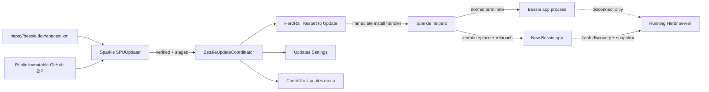

# Bessie secure self-updating releases - Plan

## Goal Capsule

Ship a secure direct-distribution update path for Bessie. A packaged Bessie app checks `https://bessie.dev/appcast.xml` on Sparkle's normal cadence, downloads and verifies a newer full release in the background, and shows **Restart to Update** immediately above Settings only when Sparkle has staged the update for installation. Clicking the action installs and relaunches Bessie; ignoring it lets Sparkle install on an ordinary app quit. Herdr and every Herdr-owned shell, agent, pane, and durable session survive the Bessie restart, and the relaunched app reattaches.

The same work must make releases reproducible and safe: monotonic app/build versions, exact Sparkle pinning, nested signing, Developer ID hardened-runtime signing, notarization and stapling, Ed25519 update signatures, a signed appcast, immutable public GitHub Release assets, Cloudflare publication, bootstrap instructions, rollback controls, and an actual old-build-to-new-build proof. Compilation or a manually copied app is not release evidence.

**Authority order:**

1. This plan's explicit requirements and decisions.
2. Sparkle `2.9.5` official setup, publishing, security, API, and sandboxing documentation.
3. Apple's current Developer ID and `notarytool` notarization requirements.
4. `docs/plans/2026-08-02-v1-hardening-gate.md` for Bessie's public-release gate.
5. `docs/plans/2026-08-04-002-feat-bessie-dev-landing-page-plan.md` for the `bessie.dev` Worker and launch boundary.
6. `docs/plans/2026-08-01-bessie-v1.md`, `AGENTS.md`, and the retained workstream specifications for Herdr ownership and required verification.
7. Existing tested behavior where the sources above are silent.

**Execution profile:** one implementation agent working in ordered checkpoints. The app/update integration and packaging work may be developed before public launch, but live GitHub publication, repository visibility changes, Cloudflare custom-domain attachment, Developer ID/notary credential use, and production appcast deployment are explicit Jordan-operated release gates.

**Stop conditions:** stop rather than improvising if the exact Sparkle framework cannot be embedded and signed by the repository's custom SwiftPM packaging path; if a candidate cannot update from an older signed build while preserving the running Herdr process; if the candidate drops compatibility with the Herdr version/protocol that the previous public build may still have running; if signing/notarization credentials or the Sparkle private key are unavailable; if Herdr redistribution rights are unresolved; if repository-history review finds a credential or other material that makes public visibility unsafe; or if `bessie.dev` cannot be attached without affecting unrelated DNS, MX, or TXT records.

**Tail ownership:** the executor owns code, focused tests, packaging checks, local/staging update proof, `./scripts/check.sh`, full `./scripts/mac-verify.sh`, installed-app verification, screenshot inspection, release documentation, and `docs/reports/goal-progress.md`. The executor must not make the repository public, mutate DNS, attach the production domain, publish a GitHub release, deploy the production appcast, notarize with Jordan's account, commit, push, or open a PR without explicit approval at that point.

## Product Contract

### Summary

Bessie uses Sparkle 2 rather than a Bessie-authored downloader or installer. Automatic checking and automatic background download are enabled by default without sending Sparkle system-profile telemetry. The standard Sparkle user driver remains available for manual **Check for Updates…**, progress, no-update, authorization, and actionable error UI. Bessie's custom UI is intentionally narrow: the app-level coordinator captures Sparkle's ready-to-install-on-quit callback and publishes a presentation state consumed by the rail and Settings.

The production feed is `https://bessie.dev/appcast.xml`. Full notarized ZIP archives and release notes are public GitHub Release assets in `skeletor-js/bessie` after Jordan makes that repository public. The appcast is deployed after the immutable release and its assets are externally reachable. The first Sparkle-enabled build still requires one manual installation; subsequent compatible builds update themselves.

### Problem Frame

Bessie's current package is manually assembled by `scripts/package-app.sh`. `scripts/Info.plist.in` hardcodes `CFBundleShortVersionString` `0.1.0` and `CFBundleVersion` `3`; the package has no updater dependency, feed key, signed archive, notarization workflow, release workflow, or appcast. The current script copies only the Bessie executable, resources, and pinned Herdr runtime before signing the nested runtime and outer bundle. That path must deliberately embed Sparkle's binary framework and helpers, preserve its symlinks, sign nested code in the supported order, and verify runtime linkage.

The product already has the right lifecycle contract. `BessieAppDelegate.applicationShouldTerminate` stops Bessie-owned clients and the intent server, while `scripts/mac-verify.sh` proves Herdr panes and agents survive app exit and reconnect. The updater must reuse that normal termination path rather than invent a process-management path. A Bessie update may replace the bundled Herdr executable on disk, but it must not stop the already-running Herdr daemon; therefore every auto-update candidate must remain compatible with the previous public build's potentially still-running Herdr runtime.

The `bessie.dev` landing Worker exists on `feat/bessie-dev-landing` and is currently available only at its `*.workers.dev` preview. As of 2026-08-05, `bessie.dev` and `www.bessie.dev` do not resolve publicly. The Worker uses Static Assets with SPA fallback, so the updater feed also needs an exact route/content check that never returns landing-page HTML as a successful appcast.

### Requirements

#### App behavior and user experience

- R1. A packaged production Bessie starts exactly one app-lifetime Sparkle updater after launch. Swift tests, command-line products, previews, and unpackaged development executables must not schedule production network checks.
- R2. Automatic checks and automatic background downloads are enabled by default. Use Sparkle's normal scheduled cadence; do not add a Bessie timer, GitHub API poller, or duplicate update state machine.
- R3. Do not send Sparkle system-profile information or Bessie/Herdr/session telemetry with appcast requests. The feed request contains no workspace, pane, process, agent, path, host, or user identifiers.
- R4. Once Sparkle has downloaded, verified, extracted, and scheduled an update for installation on quit, the expanded rail shows **Restart to Update** with the target display version immediately above Settings. Before that callback, no ready action is shown.
- R5. The collapsed rail shows a keyboard- and VoiceOver-accessible update/restart icon in the equivalent footer position. Update readiness must not be communicated only through color, animation, or an unlabeled symbol.
- R6. Activating **Restart to Update** invokes Sparkle's immediate-install handler. Bessie follows its ordinary termination path, Sparkle atomically replaces the app and relaunches it, and the coordinator tolerates authorization cancellation or a retried handler without corrupting UI state.
- R7. If the user ignores the action, Sparkle retains the staged update and attempts installation when Bessie next terminates normally. Closing the last window alone does not install because Bessie remains running.
- R8. Add native **Check for Updates…** app-menu access. Manual checks use Sparkle's standard user driver so checking, current-version, progress, authorization, and user-initiated errors are visible and actionable.
- R9. Add an Updates block to General Settings containing automatic-check and automatic-download controls plus current updater status and a manual-check action. Persist updater preferences through Sparkle's supported preferences, not Bessie's presentation envelope or Herdr.
- R10. Background no-update and transient network failures remain quiet and retry on Sparkle's future cadence. Settings may expose a sanitized last failure; the rail must not become a persistent error banner. Manual-check failures use standard Sparkle UI.
- R11. Restarting for an update never terminates Herdr or any Herdr-owned pane process. After relaunch, Bessie revalidates its last identifiers against a fresh snapshot and reattaches through existing connection and terminal-controller paths.

#### Update trust and compatibility

- R12. Pin the exact current production Sparkle release `2.9.5` through SwiftPM and use the `Sparkle` product. Do not use deprecated `SUUpdater`, deprecated `setFeedURL`, removed binary-distribution `sparkle-cli`, DSA signatures, interactive package updates, or custom version comparators.
- R13. Production Info.plist contains only HTTPS `SUFeedURL=https://bessie.dev/appcast.xml`, the public Ed25519 key, automatic-check/download eligibility and defaults, `SUVerifyUpdateBeforeExtraction=true`, `SURequireSignedFeed=true`, and no insecure-update exception. Signed-feed enforcement must never be enabled without pre-extraction verification. The private Ed25519 key never enters the repository, app bundle, appcast, logs, command arguments, or release artifacts.
- R14. Every update archive is accepted only when its Sparkle Ed25519 enclosure signature and Apple code-signing identity validate. Feed-signature validation is required as defense in depth. Invalid, truncated, tampered, unsigned, wrong-team, downgraded, or incompatible updates must leave the installed app intact.
- R15. `CFBundleVersion` is a strictly increasing numeric or dotted-numeric build version used as `sparkle:version`. `CFBundleShortVersionString` is the human release version used as `sparkle:shortVersionString`. Release tooling rejects missing, malformed, non-increasing, tag-mismatched, or feed-mismatched versions.
- R16. Every appcast item states the minimum supported macOS version `14.0`, archive length, full archive URL, display/build versions, release notes, publication date, and Ed25519 signature. Initial scope has one stable channel and full ZIP archives only—no beta channel, delta, package, paid/major-upgrade, informational-only, phased-rollout, or critical-update behavior.
- R17. An update may replace Bessie's bundled Herdr executable on disk but cannot restart a live Herdr server. A candidate must connect to the previous public release's Herdr version/protocol and to its own bundled version. An incompatible Herdr protocol/runtime bump is outside this updater path and blocks publication pending a separate explicit migration plan.
- R18. Keep the prior public archive available. Sparkle never performs a downgrade; recovery from a bad published build is to remove/roll back the feed item for users who have not installed it and publish a corrected higher build for those who have. Do not mutate or replace a published archive.

#### Packaging, notarization, and release publication

- R19. Extend custom packaging to embed the complete Sparkle framework in `Bessie.app/Contents/Frameworks`, preserve framework symlinks and helper layout, make the executable resolve the embedded framework at runtime, and sign all nested code inside-out with one Developer ID Application team before signing the outer app. Do not use `codesign --deep` as a signing shortcut.
- R20. Public archives are produced only from a release build with hardened runtime and timestamped Developer ID signatures, accepted by `notarytool`, stapled and validated, Gatekeeper-assessed, then archived from the final stapled app with metadata-preserving tooling. The archive is signed for Sparkle only after its bytes are final.
- R21. Release preparation runs on Jordan's trusted Mac using the Developer ID identity, a named `notarytool` Keychain profile, and Sparkle's Keychain-backed Ed25519 private key. Do not put the signing certificate, notary credentials, or Ed25519 private key into GitHub Actions for this slice.
- R22. Release tooling uses a draft GitHub Release: validate tag/versions, upload the final archive and checksums, and re-download/verify the draft assets with authenticated access. With immutable releases enabled for the repository, publish the complete release, confirm it is immutable, then verify anonymous download. The appcast is published last and may never reference a draft, private, missing, mutable, or partially uploaded asset.
- R23. Before first public release, Jordan makes `skeletor-js/bessie` public. The visibility step requires a repository and full-history credential/privacy audit, dependency/license and bundled-runtime redistribution review, and explicit approval. The current absence of a root software license is not silently changed; public visibility does not by itself grant an open-source license.
- R24. The first Sparkle-enabled release documents that existing builds require one manual install. The live feed may then advertise only equal/newer compatible releases. A staged old-to-new proof must pass before the first production appcast goes live.
- R25. Release tooling is fail-closed and resumable. Preparation may be rerun before publication; once a release is immutable, corrections require a new higher build. Production publication, repository visibility, Cloudflare domain attachment, and GitHub release publication remain explicit operator actions rather than side effects of ordinary `package-app.sh` or `mac-verify.sh`.

#### Feed hosting, verification, and operations

- R26. Serve the production feed at exactly `https://bessie.dev/appcast.xml` from the existing Cloudflare Worker/Static Assets site. It returns XML with an explicit XML content type, `nosniff`, bounded revalidation caching, and no redirect to HTTP or unrelated host.
- R27. The Worker treats `/appcast.xml` as an exact machine endpoint. If the asset is absent or invalid, it returns a non-2xx response rather than SPA `index.html`. Existing landing and `/install` behavior remain intact.
- R28. Keep the Worker preview, GitHub draft release, and production custom domain as distinct states. A successful `wrangler deploy` to `*.workers.dev` is not production evidence. Production launch verifies DNS, TLS, exact response body/headers, anonymous archive download, and Sparkle parsing from an installed old build.
- R29. Cloudflare custom-domain attachment preserves unrelated DNS, MX, and TXT records and requires explicit approval. If account, zone, DNS-edit, or Workers-route permissions do not match the intended `bessie.dev` zone, stop instead of deploying under a different account or editing unrelated records.
- R30. Add deterministic feed checks to the site smoke suite and release verifier: signed XML, expected latest version, public HTTPS enclosure, exact length, matching release checksum, minimum OS, no private URL, no prerelease channel, no leaked private key, and no HTML fallback.
- R31. Release evidence records source commit, tag, app/build versions, Sparkle version, bundled Herdr lock/version/protocol, archive and executable SHA-256, Developer ID/team, notarization submission ID/status, appcast URL/signature, GitHub release URL, Cloudflare deployment/version, old-to-new result, installed executable identity, and Herdr-survival result.

### Actors and Key Flows

- A1. Bessie user — receives, stages, and activates a trusted update without losing Herdr-owned work.
- A2. Release operator — prepares, verifies, signs, notarizes, publishes, pauses, or supersedes a release from the trusted Mac.
- A3. Sparkle updater/helper processes — check, verify, stage, install, and relaunch the app without owning Bessie's product/session state.
- A4. GitHub Releases — exposes immutable public archives and release notes after repository launch.
- A5. `bessie.dev` Cloudflare Worker — exposes the stable signed appcast separately from binary storage.

- F1. Background update and immediate restart
  - **Trigger:** automatic checks are enabled and the feed contains a higher compatible build.
  - **Steps:** Sparkle fetches and validates the signed feed, downloads the public archive, validates its signature/code identity, extracts it, and calls the install-on-quit delegate. The coordinator captures the target version and handler; the rail shows **Restart to Update**; the user activates it; normal Bessie termination runs; Sparkle installs and relaunches.
  - **Outcome:** the new Bessie version is running and attached to the same live Herdr process and panes.
  - **Covered by:** R1-R7, R11-R18.

- F2. Staged update installed on ordinary quit
  - **Trigger:** an update is ready but the user does not press the rail action.
  - **Steps:** the user continues working, then quits Bessie normally. Sparkle installs the staged update as the app terminates. A later launch starts the new version.
  - **Outcome:** no repeated download and no Herdr termination.
  - **Covered by:** R6-R7, R11, R17.

- F3. Manual check and preference control
  - **Trigger:** the user selects **Check for Updates…** or changes an Updates setting.
  - **Steps:** Bessie delegates to the same updater; Sparkle's standard UI reports checking/current/update/error states. Automatic settings update Sparkle preferences and scheduled behavior without disabling manual checks.
  - **Outcome:** users can inspect or control the automatic path without a second updater implementation.
  - **Covered by:** R8-R10.

- F4. Prepare and publish a release
  - **Trigger:** Jordan explicitly authorizes a release with a version, increasing build, and target tag.
  - **Steps:** the trusted Mac runs tests; packages/signs/notarizes/staples; creates and Ed25519-signs the final ZIP; verifies an old-to-new update against staging; creates a draft GitHub Release; uploads and re-downloads/verifies assets with authenticated access; publishes the release under the repository's immutable-release policy; verifies the published assets anonymously; generates the signed appcast; deploys the Worker preview; then deploys and verifies the production appcast.
  - **Outcome:** installed apps discover only a complete, public, immutable, verified release.
  - **Covered by:** R12-R16, R19-R31.

- F5. Bootstrap the updater
  - **Trigger:** a user has a pre-Sparkle Bessie build.
  - **Steps:** the user downloads and manually installs the first signed/notarized updater-enabled build. That build checks the same-version feed and remains current. The next higher verified build exercises the automatic path.
  - **Outcome:** every later compatible release can self-update; no false claim is made that old builds can bootstrap themselves.
  - **Covered by:** R23-R24.

- F6. Halt or recover a bad release
  - **Trigger:** pre-publication verification fails, or a published candidate is found defective.
  - **Steps:** before appcast publication, stop with no client exposure. After publication, roll back/remove the feed item to halt additional uptake while retaining immutable assets, then publish a corrected higher build. Users whose app no longer launches follow the manual-download recovery path.
  - **Outcome:** no archive is silently replaced and no downgrade is attempted.
  - **Covered by:** R14, R18, R22, R25, R31.

### Acceptance Examples

- AE1. Given packaged build `100` and a valid signed feed item for build `101`, when Sparkle finishes staging it, then the expanded rail shows **Restart to Update** and `101`'s display version above Settings; no ready action appears at discovery or partial-download time.
- AE2. Given the same staged update and a live Herdr pane containing a stable Unicode marker, when the user presses **Restart to Update**, then Bessie's ordinary termination hooks run, build `101` relaunches, the Herdr PID and pane ID remain unchanged, a fresh snapshot succeeds, and the prior marker plus new input/output are observable.
- AE3. Given a staged update the user ignores, when Bessie quits normally, then Sparkle installs it; the Herdr PID remains alive and the next Bessie launch reports the higher build.
- AE4. Given automatic checks disabled, when Bessie remains open past the scheduled interval, then no background check occurs; selecting **Check for Updates…** still performs a visible manual check.
- AE5. Given a same-version, lower-version, wrong-platform, or macOS-incompatible item, then no restart row appears and Sparkle does not install or downgrade.
- AE6. Given a corrupt archive, bad Ed25519 signature, bad signed-feed signature, mismatched Apple team, truncated response, HTML SPA fallback, or HTTP enclosure, then the installed app remains byte-valid and runnable; a manual check presents an actionable error while background behavior stays non-nagging.
- AE7. Given an installation authorization cancellation, then Bessie remains on the current build, the staged update remains recoverable/retryable, and the row does not claim installation succeeded.
- AE8. Given `swift test` or an unpackaged `.build/.../BessieApp`, then no production scheduled check is started and tests make no network request.
- AE9. Given a candidate whose Bessie client cannot connect to the previous public release's still-running Herdr protocol/version, release verification fails before GitHub/appcast publication; the release process never stops that Herdr server to manufacture a pass.
- AE10. Given a private GitHub repository or a published release asset that is not anonymously downloadable, appcast-publication preflight fails. Draft assets are verified with authenticated access and are never placed in the production feed.
- AE11. Given the release archive has been uploaded but the appcast has not been deployed, installed clients continue seeing the prior feed. Given the appcast is deployed, every enclosure it references already returns the expected public bytes and length.
- AE12. Given the first updater-enabled public build, pre-Sparkle users see manual-install instructions. The first automatic-update acceptance uses a deliberately lower signed test build or the prior public build rather than claiming same-build package verification proves updating.

### Success Criteria

- Exact Sparkle `2.9.5` is embedded, linked, signed, and runnable in the packaged/installed app.
- Automatic check/download defaults, manual check UI, Settings controls, and expanded/collapsed **Restart to Update** behavior pass focused tests and installed-app inspection.
- A real signed old build updates to a signed higher build through a signed staging appcast, installs/relaunches, and proves Herdr process/pane survival plus post-relaunch terminal I/O.
- Release tooling produces a Developer ID signed, notarized, stapled, Gatekeeper-accepted full ZIP with matching Info.plist, appcast, tag, signatures, lengths, and checksums.
- `https://bessie.dev/appcast.xml` is an exact, signed, HTTPS machine endpoint and never resolves to SPA HTML; all referenced release assets are anonymously downloadable and immutable.
- Static/focused tests, `./scripts/check.sh`, full `./scripts/mac-verify.sh`, release verification, installed-app executable identity, and screenshot inspection pass without weakening existing gates.
- The bootstrap limitation, release operation, pause/rollback behavior, key custody, repository-publication gate, and incompatible-Herdr gate are documented and evidenced.

### Scope Boundaries

**In scope:** Sparkle `2.9.5`; one stable appcast; automatic check/download/stage; install on quit; sidebar restart action; manual check menu; updater Settings; exact packaging/linkage/signing; version injection; Developer ID/notarization/stapling; Ed25519 archive and feed signing; GitHub public immutable release assets; `bessie.dev` appcast; staging/local update proof; bootstrap, release, and rollback runbooks; previous-Herdr compatibility gate.

**Deferred:** beta/nightly channels; staged/phased rollout; delta updates; `.pkg` updates; paid/major upgrades; critical update enforcement; Sparkle system-profile analytics; in-app release-note redesign; CI-held signing/notary/update keys; automatic repository visibility or DNS mutation; incompatible Herdr migrations; updater support for the CLI/MCP executables as standalone bundles.

**Outside this product's identity:** a Bessie-authored downloader, installer, patcher, daemon, update server, GitHub API poller, or runtime supervisor; terminating Herdr to finish an ordinary Bessie update; copying Sparkle source into Bessie; using Herdr as Bessie's update source of truth.

### Dependencies and Sources

- `Package.swift` — current Swift 6/macOS 14 package and exact dependency style.
- `scripts/Info.plist.in` — hardcoded app/build versions and future Sparkle keys.
- `scripts/package-app.sh` — manual app assembly, bundled Herdr integrity checks, and current nested/outer signing.
- `scripts/check.sh` — ordinary static/source validation.
- `scripts/mac-verify.sh` — Mac sync, tests, package/install identity, isolated live Herdr, quit survival, and relaunch proof.
- `scripts/dogfood-install-signed.sh` — current trusted-Mac signing identity/keychain preflight and GUI-session caveat.
- `Sources/BessieApp/BessieApp.swift` — app-global state, scenes, Settings scene, and Commands wiring.
- `Sources/BessieApp/BessieAppDelegate.swift` — normal termination path and Bessie-owned teardown.
- `Sources/BessieApp/ProductSurfaces.swift` — product shell and `HerdRail` construction.
- `Sources/BessieApp/HerdRail.swift` — expanded/collapsed footer immediately containing Settings.
- `Sources/BessieApp/BessieSettings.swift` — General Settings and diagnostic version surface.
- `Tests/BessieAppModelTests/HerdRailPresentationTests.swift` and `SettingsAndNotificationsTests.swift` — existing presentation/settings coverage.
- `docs/plans/2026-08-02-v1-hardening-gate.md` — signing/notarization/clean-machine release gate.
- `docs/plans/2026-08-04-002-feat-bessie-dev-landing-page-plan.md` — existing Worker/Static Assets branch, custom-domain pause, smoke proof, and rollback boundary.
- Landing implementation on `feat/bessie-dev-landing`: `site/worker.js`, `site/wrangler.toml`, `site/public/`, `site/scripts/smoke.mjs`, `site/README.md`. Integrate that branch before U6; do not recreate a second site.
- Sparkle setup and programmatic integration: <https://sparkle-project.org/documentation/> and <https://sparkle-project.org/documentation/programmatic-setup/>.
- Sparkle publishing and customization: <https://sparkle-project.org/documentation/publishing/> and <https://sparkle-project.org/documentation/customization/>.
- Sparkle updater delegate, including `willInstallUpdateOnQuit`: <https://sparkle-project.org/documentation/api-reference/Protocols/SPUUpdaterDelegate.html>.
- Sparkle security/reliability and `2.9.5` release: <https://sparkle-project.org/documentation/security-and-reliability/> and <https://github.com/sparkle-project/Sparkle/releases/tag/2.9.5>.
- Sparkle signing/sandboxing: <https://sparkle-project.org/documentation/sandboxing/>.
- Apple notarization workflow: <https://developer.apple.com/documentation/security/customizing-the-notarization-workflow>.
- GitHub immutable releases: <https://docs.github.com/en/code-security/concepts/supply-chain-security/immutable-releases>.
- Cloudflare Workers Static Assets and headers: <https://developers.cloudflare.com/workers/static-assets/> and <https://developers.cloudflare.com/workers/static-assets/headers/>.

### Outstanding Questions

None blocking. The Developer ID identity, Apple team, `notarytool` Keychain profile, Sparkle public key, and final Cloudflare deployment ID are execution-time release inputs and evidence, not values to invent in this plan. Jordan must separately approve the actual repository-visibility, domain, signing, notarization, and publication actions.

## Planning Contract

### Key Technical Decisions

- KTD1. Use exact Sparkle `2.9.5` through its SwiftPM `Sparkle` binary product; do not build an updater or consume GitHub's releases API in the app. (session-settled: user-approved — chosen over a homegrown GitHub downloader/installer: Sparkle owns secure macOS replacement, authorization, recovery, and relaunch.)
- KTD2. Own one `@MainActor` `BessieUpdateCoordinator` in `BessieApp`. It creates `SPUStandardUpdaterController(startingUpdater: false, updaterDelegate: ..., userDriverDelegate: nil)`, retains it, starts it once after initialization, exposes a narrow observable presentation state, and keeps Sparkle out of `BessieCore`, CLI, MCP, Herdr models, and presentation persistence.
- KTD3. Retain Sparkle's standard user driver. Use `SPUUpdaterDelegate.updater(_:willInstallUpdateOnQuit:immediateInstallationBlock:)` as the sole custom ready signal, return `true`, retain the item/version and retry-capable handler, and invoke that handler from **Restart to Update**. Do not implement the full `SPUUserDriver` protocol or treat `didDownloadUpdate` as ready.
- KTD4. Enable automatic checks/downloads by default and show custom UI only when the update is fully staged. (session-settled: user-approved — chosen over prompting before download: the user sees an action only when restart can complete the update.)
- KTD5. Store automatic-check/download choices in Sparkle's supported updater defaults and reflect them through the coordinator. Do not bump `BessiePresentationState`, duplicate `SU*` defaults, or make update settings part of a Herdr snapshot or Project recipe.
- KTD6. Use `SUFeedURL` in production Info.plist and the updater delegate's `feedURLString(for:)` only for an explicit update-test override. Never call deprecated `setFeedURL`. A test-only insecure-local-feed entitlement/key may be rendered into isolated test bundles, but production packaging must prove `SUAllowsInsecureUpdates` is absent.
- KTD7. Require both Ed25519 enclosure signatures and signed-feed validation over HTTPS. Generate/store the Sparkle private key in Jordan's login Keychain with an encrypted offline backup; package only the public key. (session-settled: user-approved — chosen over CI-managed or repository-held update keys: release signing stays on the trusted Mac and private key material does not enter the build service.)
- KTD8. Keep Developer ID/notarization and Sparkle signatures as separate trust layers. Package and code-sign inside-out, preserve the supplied Downloader XPC entitlements when that service is retained, submit via `xcrun notarytool`, staple/validate the app, recreate the ZIP from the final stapled app, then run Sparkle signing/appcast generation. Never sign pre-staple bytes or use deprecated `altool`/DSA/command-line private-key flags.
- KTD9. Accept release version and monotonically increasing build number as explicit release inputs; render them into a temporary/final Info.plist during packaging and assert equality across app, archive, tag, release title, appcast, and release report. Ordinary development packaging may retain safe defaults, but release mode fails without explicit inputs.
- KTD10. Serve a signed appcast from `bessie.dev` and public immutable archives from GitHub Releases. (session-settled: user-approved — chosen over binding installed clients to a GitHub-hosted feed: the stable domain preserves control of feed routing while GitHub stores immutable binaries.)
- KTD11. Make `skeletor-js/bessie` public before launch. (session-settled: user-directed — chosen over a binaries-only public repository or Cloudflare R2: anonymous clients can use release assets while source, tags, notes, and binaries remain on one release surface.) Public visibility is a separate approved operation after full-history security/privacy and redistribution review; it does not silently choose a source license.
- KTD12. Treat appcast publication as the client-exposure commit point. Build and verify locally, create/upload a draft, re-download and verify draft bytes with authenticated access, publish under the enabled immutable-release policy, confirm immutability and anonymous asset access, preview the appcast on the Worker hostname, and only then deploy the production feed. Do not make `package-app.sh` or ordinary verification publish anything.
- KTD13. Use one stable channel and full ZIP archives in the first updater release. (session-settled: user-approved — chosen over beta channels and delta updates: establish the complete signed/notarized replacement path before adding rollout complexity.)
- KTD14. Preserve Herdr across update restart and gate every candidate against the previous public runtime. (session-settled: user-approved — chosen over treating app restart as ownership of live terminal state: Herdr remains authoritative and Bessie reattaches.) An incompatible Herdr bump cannot ride the ordinary updater merely because the new bundle contains a new executable.
- KTD15. Keep silent background failures out of the rail. The standard user driver owns user-initiated errors; the coordinator may retain a sanitized Settings diagnostic and resets readiness only on a definitive cycle outcome. Never expose raw paths, URLs containing credentials, process output, or feed payloads.
- KTD16. Do not add updater actions to Bessie's CLI, MCP, intent bus, or command palette in this slice. Release publication is an operator workflow and update activation is an app-lifecycle action, not a Herdr topology/domain action; native app menu, Settings, and rail surfaces provide parity for the supported user workflows.

### High-Level Technical Design

Release flow:

```mermaid
flowchart LR
    SRC[Approved source + version/build] --> V[check.sh + mac-verify.sh]
    V --> P[Package + nested Developer ID sign]
    P --> N[notarytool + staple + Gatekeeper]
    N --> Z[Final metadata-preserving ZIP]
    Z --> E[Ed25519 sign + staged appcast]
    E --> T[Old-to-new isolated update proof]
    T --> D[Draft GitHub Release]
    D --> A[Anonymous asset verification]
    A --> I[Publish + immutable lock]
    I --> W[Workers preview appcast]
    W --> C[Production appcast deploy last]
```

### State and Action Flow

1. `BessieUpdateCoordinator` starts only for an eligible packaged app and asks Sparkle to schedule checks from the production Info.plist defaults.
2. Sparkle owns appcast fetching, version selection, archive download, signature/code-identity validation, extraction, and update persistence. Delegate callbacks update only coarse Bessie presentation state.
3. On `willInstallUpdateOnQuit`, the coordinator captures the target short/build versions and immediate-install block, returns `true`, and publishes `readyToRestart`. Future automatic cycles are intentionally stalled while this install opportunity is retained.
4. `HerdRail` renders the update row above its existing Settings footer. The product shell passes only an immutable update presentation plus `restartToUpdate`; no Sparkle type enters view code.
5. Activating the row marks an installing attempt and calls the retained handler on the main actor. `ConnectView` receives `NSApplication.willTerminateNotification` and runs `shutdownForAppExit()`; `BessieAppDelegate.applicationShouldTerminate` performs its existing Bessie-owned intent/fleet shutdown and returns `.terminateNow`. Neither path stops Herdr.
6. Sparkle installs the new bundle and relaunches. Existing Bessie startup runs runtime discovery, compatibility checks, snapshots, and terminal reattachment. Update code does not special-case Herdr ownership.
7. If the handler is canceled or installation aborts, the coordinator retains or reconstitutes a retryable state according to Sparkle's cycle callback and exposes a sanitized diagnostic. It never declares the higher version installed until a relaunched process reads that version from its own bundle.
8. If the user quits without pressing the row, Sparkle's scheduled install-on-quit path runs during the same ordinary termination contract.

### Security and Privacy Contract

- Update trust anchors are the packaged `SUPublicEDKey`, signed-feed requirement, HTTPS transport, and matching Apple Developer ID identity. No remote flag can disable them.
- Private signing/notary material is Keychain-backed and never passed in shell arguments or committed. Release scripts print identities, submission IDs, public keys, and hashes only—not secret material.
- Public-repository conversion is preceded by full-history secrets/privacy review. A finding blocks conversion; history rewriting, credential rotation, or data removal requires separate explicit approval and verification.
- Feed requests contain no system profile or Bessie/Herdr identifiers. Cloudflare access logs remain ordinary origin logs; Bessie adds no identifying query parameters.
- Release URLs are public HTTPS URLs. No GitHub token, signed temporary URL, Cloudflare token, or credential-bearing query string appears in an appcast.
- Nested code is signed explicitly and verified after all mutations. No bundle bytes change after final signing/stapling except wrapping the app in the final ZIP.
- Release artifacts are immutable. A compromised or defective release is superseded, not silently replaced.

### Sequencing

Implement U1-U8 in order. U1 proves dependency embedding and signing before product code depends on Sparkle. U2 establishes the testable coordinator. U3 wires app/menu/settings lifecycle; U4 adds the rail interaction. U5 builds release/notarization/appcast tooling without publishing. U6 integrates the existing site and feed endpoint. U7 proves an actual update and Herdr survival. U8 closes the public-launch, documentation, audit, and evidence gates. U6 depends on the landing-site branch being integrated; U8 requires Jordan's explicit approvals and credentials.

## Implementation Units

### U1. Pin, embed, link, and sign Sparkle in the custom app package

**Goal:** make the repository's real packaged app contain a valid, runnable Sparkle `2.9.5` framework before adding updater behavior.

**Requirements:** R12-R15, R19-R20. **Decisions:** KTD1, KTD7-KTD9.

**Files:**

- `Package.swift`
- `scripts/Info.plist.in`
- `scripts/package-app.sh`
- `scripts/check.sh`
- New focused packaging helper only if it removes duplicated inside-out signing logic

**Approach:**

1. Add `https://github.com/sparkle-project/Sparkle` exact `2.9.5` and the `Sparkle` product to `BessieApp`; do not add it to `BessieCore`, CLI, or MCP targets.
2. Update the custom package script to locate the resolved binary framework from SwiftPM output, copy it with symlink-preserving tooling into `Contents/Frameworks`, and fail if the expected framework, `Versions/B`, `Updater.app`, or `Autoupdate` layout is missing. Do not hardcode an obsolete `Versions/A` path.
3. Verify the Bessie executable's load command resolves `@rpath/Sparkle.framework/...` from the packaged app. Add only the minimal linker/rpath setting if SwiftPM does not already emit `@executable_path/../Frameworks`; prove with `otool`, not assumption.
4. Render marketing/build versions and Sparkle production keys into the packaged Info.plist. Add deterministic static checks for required production keys and absence of insecure update keys/private material.
5. Implement explicit inside-out Developer ID signing for the bundled Herdr binary, Sparkle nested helpers/services/framework as required by the exact distribution, then the outer app. Preserve Sparkle's supplied Downloader XPC entitlements if `Downloader.xpc` is retained. Keep ad hoc packaging for ordinary development without enabling distribution Library Validation, but run the same structural/linkage checks.
6. Verify `codesign --verify --deep --strict`, nested authorities/team identifiers and entitlements in Developer ID mode, framework symlinks, `otool` linkage/rpath, `plutil`, executable architectures, bundled Herdr lock/version/notices, and a packaged app launch. Retain Sparkle dSYMs with release evidence/symbols but never embed them in `Bessie.app`.

**Test Scenarios:** exact dependency resolution; framework copy preserves links; missing/moved helper fails; app linked to bundle framework rather than `.build`; production keys present only in package; insecure key absent; nested signature mismatch fails; bundled Herdr checks remain intact.

**Verification:** focused static package checks and a Mac release build launch. U1 does not pass from `swift build` alone.

### U2. Add the app-lifetime updater coordinator and deterministic state tests

**Goal:** adapt Sparkle's updater lifecycle into a small testable Bessie presentation contract.

**Requirements:** R1-R3, R6-R10, R12-R14. **Decisions:** KTD2-KTD7, KTD15-KTD16.

**Files:**

- New `Sources/BessieApp/BessieUpdateCoordinator.swift`
- New `Tests/BessieAppModelTests/BessieUpdateCoordinatorTests.swift`
- `Package.swift` test-target dependencies only as required

**Approach:**

1. Define Bessie-owned value state independent of SwiftUI and Sparkle view types: ineligible, idle, checking/manual state as needed, ready-to-restart with short/build versions, installing attempt, and sanitized failure/status. Keep the visible rail predicate strictly tied to a retained install handler.
2. Define a narrow updater adapter/protocol for coordinator tests. The production adapter owns `SPUStandardUpdaterController` and its `SPUUpdater`; tests inject a fake and never contact the network.
3. Start once with `startingUpdater: false`, retain delegates strongly, call Sparkle's start API, capture startup failure, and gate production scheduling on packaged-app eligibility plus explicit test hooks.
4. Implement `willInstallUpdateOnQuit`, item/version capture, immediate handler retry semantics, cycle completion/abort handling, manual check, automatic preference getters/setters, and sanitized last status. Return `true` only when the coordinator safely retains the handler.
5. Use delegate feed override only under an explicit update-test environment contract. Production reads the immutable Info.plist URL and signed-feed settings.
6. Unit-test transition ordering, duplicate callbacks, cancellation/retry, background versus manual errors, no-update behavior, toggles, one updater instance, ineligible development/test binaries, and absence of raw sensitive error content.

**Verification:** focused coordinator tests pass without network or application termination; Swift concurrency warnings remain zero under Swift 6.

### U3. Wire updater lifecycle, native menu, and General Settings

**Goal:** expose supported updater controls through existing app-global surfaces without duplicating persisted state.

**Requirements:** R1-R3, R8-R10. **Decisions:** KTD2, KTD4-KTD6, KTD15-KTD16.

**Files:**

- `Sources/BessieApp/BessieApp.swift`
- `Sources/BessieApp/BessieSettings.swift`
- `Sources/BessieApp/BessieAppDelegate.swift` only for injection/termination assertions if needed
- `Tests/BessieAppModelTests/SettingsAndNotificationsTests.swift`
- New focused command tests if existing command coverage is not suitable

**Approach:**

1. Construct one `@StateObject` coordinator in `BessieApp` and inject it into every scene that can show Settings or the product shell. Do not recreate it per window.
2. Add a `Commands` implementation for **Check for Updates…** backed by `canCheckForUpdates` and the same coordinator. Preserve existing command/menu and single-window behavior.
3. Add an Updates block under General Settings with automatic checks, automatic downloads, current version/build, target/status when present, and manual check. Ensure `SUAllowsAutomaticUpdates` permits the user-facing download control. Controls call coordinator methods; they do not edit `BessieSettingsModel.preferences`.
4. Keep background failure text sanitized and subordinate. Manual checks rely on Sparkle standard windows/alerts rather than Bessie-authored duplicate dialogs.
5. Assert both ordinary termination hooks remain Bessie-client cleanup only: `ConnectView.shutdownForAppExit()` runs from `NSApplication.willTerminateNotification`, and `BessieAppDelegate.applicationShouldTerminate` stops only Bessie-owned intent/fleet state. Do not add `herdr stop`, pane close, workspace close, or process kill behavior.

**Test Scenarios:** one coordinator across scenes; menu enabled/disabled correctly; toggles round-trip through fake updater; Settings does not rewrite presentation schema; background failure presentation is bounded; app termination invokes only existing fleet/client stop contracts.

**Verification:** focused Settings/command/lifecycle tests and native Settings screenshot in dark/light modes.

### U4. Add the expanded and collapsed Restart to Update rail action

**Goal:** show one clear action only when a verified update can immediately install.

**Requirements:** R4-R7, R10-R11. **Decisions:** KTD3-KTD5, KTD14-KTD15.

**Files:**

- `Sources/BessieApp/ProductSurfaces.swift`
- `Sources/BessieApp/HerdRail.swift`
- `Tests/BessieAppModelTests/HerdRailPresentationTests.swift`
- `Tests/BessieAppModelTests/BessieVisualFoundationTests.swift` only for stable geometry/accessibility invariants
- Deterministic design/capture fixtures used by `scripts/mac-verify.sh`

**Approach:**

1. Pass an updater presentation value and restart closure from the product shell into `HerdRail`; do not pass `SPUUpdater` or a handler block directly to view code.
2. Insert a distinct update row above the current Settings footer divider. Expanded copy is exactly **Restart to Update** with the target display version as secondary text/help. Keep the visual hierarchy urgent enough to notice but below Needs You work and without pretending it is an error.
3. Add the equivalent collapsed icon action with **Restart to Update Bessie <version>** accessibility/help text. Preserve the 244/52 rail geometry, keyboard navigation, density, hover, theme, Increase Contrast, and Reduce Motion behavior.
4. Disable repeated activation while an install attempt is in flight. If authorization is canceled and the retained handler remains valid, return to a retryable ready state; never show success before relaunch.
5. Add deterministic ready/not-ready/installing rail fixtures and tests for position, exact label, target version, expanded/collapsed accessibility, non-color state, and one invocation per activation.

**Verification:** focused rail tests plus launched-app screenshots of ready state in expanded/collapsed and light/dark presentations; inspect rather than trusting snapshot generation alone.

### U5. Build fail-closed version, notarization, archive, and appcast tooling

**Goal:** turn an approved source revision into final release bytes and a staged signed feed without publishing them.

**Requirements:** R13-R25, R30-R31. **Decisions:** KTD7-KTD9, KTD12-KTD13.

**Files:**

- New `scripts/release-app.sh`
- New focused release metadata/check helper(s) under `scripts/`
- `scripts/package-app.sh`
- `scripts/Info.plist.in`
- `scripts/check.sh`
- `scripts/mac-verify.sh`
- `.gitignore` for secret-free generated scratch/output only
- New `docs/releases/README.md` or a focused release runbook

**Approach:**

1. Define explicit prepare/verify/publish boundaries. `release-app.sh prepare` requires clean approved source, tag-compatible marketing version, increasing build number, real Developer ID identity, notary Keychain profile, and Keychain-backed Sparkle key. It never publishes.
2. Package and verify nested code, submit the archive with `xcrun notarytool --wait`, retain submission/log evidence, staple/validate the app, run `spctl`, and recreate the ZIP from final stapled bytes using `ditto` metadata-preserving flags.
3. Produce SHA-256 files and use Sparkle `2.9.5` supported `generate_keys`/`generate_appcast` or `sign_update` tooling without deprecated `-s` secret arguments or removed `sparkle-cli`. Generate the signed feed from final archives with `generate_appcast`'s maximum-deltas option set to `0`; verify that no delta files or delta enclosures were emitted, and validate all required fields.
4. Compare release inputs against the currently deployed/staged appcast and reject non-increasing builds, reused tags, version mismatches, private/non-HTTPS URLs, missing previous archive, unsupported minimum OS, and any post-signing bundle mutation.
5. Add a dry-run/offline verifier that needs no secret and validates an existing prepared release directory. Separate secret-bearing Keychain preflight from ordinary repository checks.
6. Write a release evidence template with the fields in R31. Ensure logs redact environment values and never serialize Keychain material.

**Test Scenarios:** missing/locked identity; unusable notary profile; missing Sparkle key; non-increasing build; tag mismatch; notarization rejection; post-staple mutation; incorrect archive length; bad public URL; deprecated/insecure plist key; appcast generation after immutable-byte finalization.

**Verification:** run prepare against a non-published test version on Jordan's Mac, inspect notary/signature outputs, and run the secret-free verifier from a second clean directory.

### U6. Integrate the exact `bessie.dev` appcast endpoint without weakening the site

**Goal:** add a stable machine feed to the existing Worker/Static Assets deployment and preserve the landing site.

**Requirements:** R22, R26-R30. **Decisions:** KTD10-KTD12.

**Dependencies:** integrate `feat/bessie-dev-landing` and its `site/` implementation first. Do not create a parallel Worker or silently attach the production domain.

**Files:**

- `site/worker.js`
- `site/wrangler.toml`
- `site/public/appcast.xml` when a signed staged/live feed exists
- `site/public/_headers` or equivalent explicit response-header configuration
- `site/scripts/smoke.mjs`
- `site/README.md`
- `site/package.json` only if a focused verification command is needed

**Approach:**

1. Reserve `/appcast.xml` as an exact machine route before SPA fallback. Missing/invalid feed returns non-2xx; valid feed returns XML, `X-Content-Type-Options: nosniff`, and a bounded revalidation policy. Do not proxy GitHub's API.
2. Extend smoke checks to reject HTML fallback, wrong content type, HTTP/credential-bearing enclosure URLs, build/version/length mismatch, missing minimum OS/signature, or private/draft assets. Preserve `/`, `/install`, video, visual-proof, and reduced-motion checks.
3. Make preview deploy consume a prepared signed appcast artifact without exposing the private key. Verify the precise expected `bessie-dev.jordanjstella.workers.dev` hostname and Cloudflare account before production work.
4. Keep the production custom-domain route out of accidental ordinary deploys until Jordan approves launch. At launch, record DNS rollback state, attach the intended apex/`www` policy through durable Wrangler configuration or the approved Cloudflare route mechanism, preserve MX/TXT, and verify public DNS/TLS/body/headers.
5. Treat appcast deployment as the last release step. A static-site deploy that does not change a signed feed must not regenerate or re-sign it.

**Verification:** `npm run check`, local Worker checks, preview-host checks, and—only after approval—cache-busted public `https://bessie.dev/appcast.xml` plus anonymous archive verification. A `*.workers.dev` 200 alone is not completion.

### U7. Prove a real old-to-new update and Herdr continuity

**Goal:** exercise the mechanism Sparkle users will depend on, including install/relaunch and live-session preservation.

**Requirements:** R1-R18, R24-R25, R30-R31. **Decisions:** KTD3, KTD6-KTD9, KTD13-KTD15.

**Files:**

- New `scripts/mac-update-verify.sh`
- `scripts/mac-verify.sh`
- Update-test fixture generation under `scripts/` or `Tests/Fixtures/` with no production/private key
- `Tests/BessieAppModelTests/BessieUpdateCoordinatorTests.swift`
- `docs/reports/goal-progress.md`

**Approach:**

1. Create an isolated update fixture that packages a lower and higher build with a distinct test bundle identifier/path, ephemeral test Ed25519 key, explicit test feed override, and—only for fast local mechanism tests—a test-only local HTTP allowance. Assert production packages lack the test bundle ID, override, test public key, and insecure transport key.
2. Sign both test apps with the same real Developer ID identity for the full release-gate run. Use an approved HTTPS staging feed and a notarized higher-build stub/candidate for production-equivalent acceptance; reserve local plain HTTP plus its ATS exception for non-production mechanism tests. Never overwrite `/Applications/Bessie.app` or the production appcast during this test.
3. Launch the lower installed test app against an isolated repository-local Herdr config. Start a durable pane/agent marker, record Herdr PID, pane IDs, output, app version/build, and executable hash.
4. Drive/wait for update discovery and staging through observable state, assert the rail ready UI, activate restart, and verify the higher bundle version/executable, code signature, relaunch, fresh snapshot, identical Herdr PID/pane IDs, prior output, and new terminal input/output.
5. Repeat the install-on-ordinary-quit path. Exercise current/lower item, corrupt signature, signed-feed failure, truncated archive, unavailable feed, authorization cancellation where safely reproducible, and previous-public-Herdr compatibility.
6. Keep ordinary `mac-verify.sh` credential-free/ad-hoc where possible but always verify framework structure, production plist safety, coordinator tests, packaging, install, and screenshots. Require `mac-update-verify.sh` with real identity/key/notary prerequisites for release acceptance and invoke/report it from the approved release workflow.

**Verification:** both ordinary required scripts pass, the full signed update verifier exits zero, and the report contains before/after process/version/hash/pane evidence. Seeing the new UI or two separately installed packages is not a substitute.

### U8. Close bootstrap, public-repository, release, and operational gates

**Goal:** make the first public updater release operable without hiding one-time approvals or recovery limits.

**Requirements:** R17-R31. **Decisions:** KTD7-KTD14, KTD16.

**Files:**

- `README.md`
- `docs/plans/2026-08-02-v1-hardening-gate.md`
- `docs/releases/README.md` or the runbook selected in U5
- `site/README.md`
- `site/public/config.js` when the real public download URL exists
- `docs/reports/YYYY-MM-DD-v1-rc.md` at the approved release
- `docs/reports/goal-progress.md`

**Approach:**

1. Document manual bootstrap for pre-Sparkle builds, normal automatic behavior, Settings controls, **Restart to Update**, install-on-quit semantics, minimum OS, and a manual recovery download.
2. Add the updater/release checks to the V1 hardening gate: previous-Herdr compatibility, nested Sparkle linkage/signing, notarization/stapling/Gatekeeper, signed feed/archive, anonymous immutable asset, old-to-new continuity, production endpoint, and installed-app identity.
3. Before changing repository visibility, run an approved full-history secrets/privacy audit plus dependency/license/redistribution review. Record blockers without printing secrets. Do not rewrite history or add a source license without separate approval.
4. After explicit approval, Jordan makes the repository public and enables immutable releases before publishing the first release. Verify the published release's immutable state and anonymous asset access before any appcast publication.
5. After explicit approval, attach and verify `bessie.dev`; publish the first complete release and production appcast in KTD12 order. Update landing Download and `/install` behavior only when notarized public bytes exist.
6. Record complete release evidence and rehearse feed halt/rollback plus corrected-higher-build recovery. Keep the previous archive and manual installation instructions reachable.
7. Confirm no CLI/MCP/intent-bus update actions were added and no update path terminates Herdr.

**Verification:** public launch checklist and release report are complete with direct URLs/IDs/hashes; an unauthenticated clean Mac path downloads and Gatekeeper-opens the release; an installed previous build updates through production and preserves Herdr; public site and appcast checks pass.

## Validation Matrix

| Area | Required proof |
| --- | --- |
| Dependency/package | Exact Sparkle `2.9.5`; embedded `Contents/Frameworks/Sparkle.framework`; correct `Versions/B` helpers/symlinks; packaged executable resolves bundle framework |
| App defaults/privacy | HTTPS feed, public key, signed-feed enforcement, automatic defaults, no insecure exception, no profile/session telemetry |
| Coordinator | One updater; eligibility gate; ready callback/handler retention; retry/cancel; manual/background distinction; fake-only unit tests |
| Menu/Settings | Manual check uses standard driver; toggles use Sparkle preferences; no Bessie persistence schema change |
| Rail | Exact expanded label above Settings; target version; collapsed accessible action; hidden before staged; repeat activation guarded |
| Lifecycle | Ordinary Bessie termination path; Herdr PID/panes/agent/output survive; fresh snapshot and new I/O after relaunch |
| Version compatibility | Increasing build; marketing/build/tag/feed equality; no downgrade; macOS 14 minimum; previous-public-Herdr compatibility |
| Code trust | Explicit nested Developer ID signatures; hardened runtime/timestamps; matching team; `codesign`/`spctl` pass |
| Notarization | Accepted `notarytool` submission; stapled/validated app; archive produced after stapling |
| Sparkle trust | Ed25519 enclosure and signed feed; bad/tampered/truncated/wrong-team updates rejected without app damage |
| GitHub release | Repository public after audit/approval; draft assets verified anonymously; published archive immutable; previous archives retained |
| Cloudflare feed | Exact `https://bessie.dev/appcast.xml`; TLS/XML/nosniff/cache; no SPA fallback; preview and production states separately verified |
| End-to-end update | Signed lower build discovers/stages/installs higher build, relaunches, reports higher version/hash, and preserves Herdr |
| Bootstrap/recovery | First manual install documented; feed halt rehearsed; bad build superseded by higher build; no mutation/downgrade claim |
| Repository gates | `check.sh`; full `mac-verify.sh`; signed update verifier; installed app; screenshots; release report; goal-progress update |

## Rollback and Failure Behavior

- Before production appcast publication, any failure leaves installed users on the prior feed/release. Draft releases and preview Worker deploys may be deleted or corrected because they were never advertised.
- After an immutable GitHub release is public but before the feed points to it, leave or mark the release as appropriate; do not expose it through Sparkle until all checks pass.
- After the feed points to a defective build, immediately restore the last known-good signed appcast/Worker deployment to stop new uptake. Do not delete or replace the immutable asset.
- Users who already installed a functioning but defective build receive a corrected higher build. Users whose app cannot launch use the retained manual-download recovery path. Sparkle downgrade is not supported.
- Feed/network/signature failures never mutate the installed app. Background cycles remain quiet and retry; manual checks show standard actionable errors.
- If update authorization is denied/canceled, retain the current app and a retryable staged state when Sparkle permits it. Never report completion until the relaunched app reads its own higher version.
- If the new Bessie cannot attach to the prior live Herdr, fail release verification. Do not stop Herdr or silently start a replacement server to make the test pass.
- If `bessie.dev` DNS/custom-domain work conflicts with existing records or wrong-account credentials, stop. Preserve recorded DNS/Worker rollback state and verify the exact public hostname after any approved change.
- If repository audit finds exposed material, stop public conversion and rotate/remediate under a separately approved procedure before reconsidering visibility.

## Verification Contract

### Ordinary implementation verification

1. Run focused coordinator, Settings/commands, rail, and packaging tests.
2. Run `./scripts/check.sh` from the VPS source.
3. Run `./scripts/mac-verify.sh`; it must sync intentionally, run Swift tests, package the app with Sparkle, exercise isolated live Herdr behavior, install `/Applications/Bessie.app`, relaunch, compare packaged/installed executables, and capture/inspect update-ready UI fixtures.
4. Verify the installed app launches with embedded Sparkle but does not contact a test feed or show a false update row.
5. Update `docs/reports/goal-progress.md` with exact commands and outputs.

### Release-candidate verification

1. Run ordinary verification on the exact approved source revision.
2. Run release preparation with explicit marketing/build/tag inputs, real Developer ID identity, named notary Keychain profile, and Keychain-backed Sparkle signing key.
3. Verify nested signatures/teams, hardened runtime, notarization acceptance/log, staple validation, Gatekeeper, final archive hash/length, Sparkle signatures, and staged appcast.
4. Run `scripts/mac-update-verify.sh` from a signed lower build to the exact candidate, covering immediate restart and ordinary quit while preserving the same isolated Herdr PID/panes and post-relaunch I/O.
5. Verify the candidate against the prior public Herdr runtime/protocol and its own bundled runtime.
6. Verify draft GitHub assets through authenticated re-download, then verify the published release's immutable state and assets through anonymous download.
7. Verify Worker local/preview feed before production; then, only after approval, verify public DNS/TLS/appcast headers/body/signature and enclosure bytes.
8. Install the exact packaged candidate at `/Applications/Bessie.app`, relaunch, compare packaged/installed Bessie executable and bundled Herdr identity, capture/inspect the real rail and Settings, and repeat live terminal I/O.
9. Complete the RC report fields in R31. Any unavailable required field is a failure, not a waiver disguised as a pass.

## Definition of Done

- D1. R1-R31 and AE1-AE12 are implemented or explicitly waived by Jordan with recorded rationale; no executor-created scope exception counts as a waiver.
- D2. Exact Sparkle `2.9.5` is pinned, embedded, linked, explicitly signed, and verified in packaged and installed apps.
- D3. Automatic background behavior, native manual checks, Settings controls, and expanded/collapsed **Restart to Update** pass deterministic tests and visual/accessibility inspection.
- D4. Production packages enforce HTTPS, Ed25519 archive signatures, signed feeds, Apple code identity, monotonic versions, and no insecure/test/private-key configuration.
- D5. Release tooling creates final Developer ID signed, notarized, stapled, Gatekeeper-accepted, immutable-byte ZIPs and a matching signed appcast without publishing as an ordinary side effect.
- D6. A real signed old-to-new update installs and relaunches while the same Herdr process, pane identities, prior output, and new terminal I/O remain observable.
- D7. The candidate remains compatible with the previous public release's potentially running Herdr. Any incompatible migration is excluded and blocked.
- D8. The public repository, immutable GitHub release, and `bessie.dev` production feed are launched only after audit and explicit approval, and anonymous/direct checks pass.
- D9. First-install bootstrap, key custody, release sequence, pause/rollback, superseding-build recovery, and manual recovery are documented and rehearsed.
- D10. Focused tests, `./scripts/check.sh`, full `./scripts/mac-verify.sh`, release verifier, installed-app identity, screenshots, and release evidence pass without skipped/weakened checks.
- D11. No abandoned updater experiment, custom downloader/installer, duplicate timer/state source, test key, insecure feed key, private material, or Herdr-termination path remains in the diff.
- D12. `docs/reports/goal-progress.md` and the approved RC report contain actual command results and artifact identities; code is left uncommitted unless Jordan separately requests commit/push/publication.

## Executor Handoff

Read `AGENTS.md`, this entire plan, the V1 hardening gate, and the landing-page plan before editing. Re-check the active branch, dirty diff, worktrees, and whether `feat/bessie-dev-landing` has been integrated; preserve all unrelated work. Execute U1-U8 in order and keep `docs/reports/goal-progress.md` honest at each checkpoint.

Do not weaken the custom packaging or Mac verifier to accommodate Sparkle. Prove framework linkage and nested signing on the packaged app, not `.build`. Keep Sparkle private keys and Apple credentials in Keychain-backed operator surfaces, and inspect every release command for accidental secret output. Use only Sparkle `2.9.5` supported APIs/tools and `notarytool`; no deprecated `SUUpdater`, `setFeedURL`, `sparkle-cli`, DSA, `altool`, or `codesign --deep` signing shortcut.

The implementation tail includes installed-app visual inspection and live Herdr continuity. A row that says **Restart to Update**, two manually copied app bundles, or a successful compile is not completion. The release must update itself through Sparkle, relaunch, and reattach to the same Herdr work. Do not make the repository public, mutate Cloudflare/DNS, notarize, publish/deploy, commit, push, or open a PR without Jordan's explicit approval at that action boundary.
