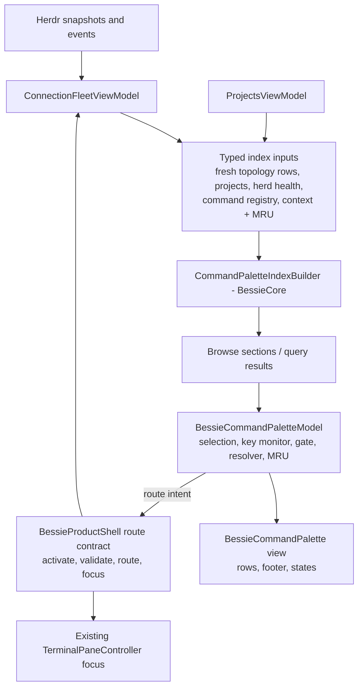
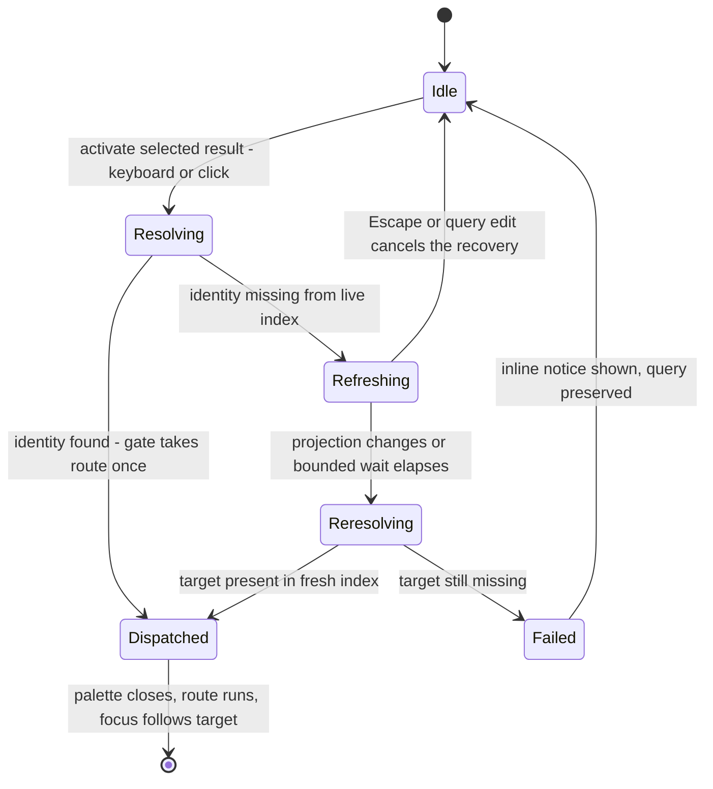
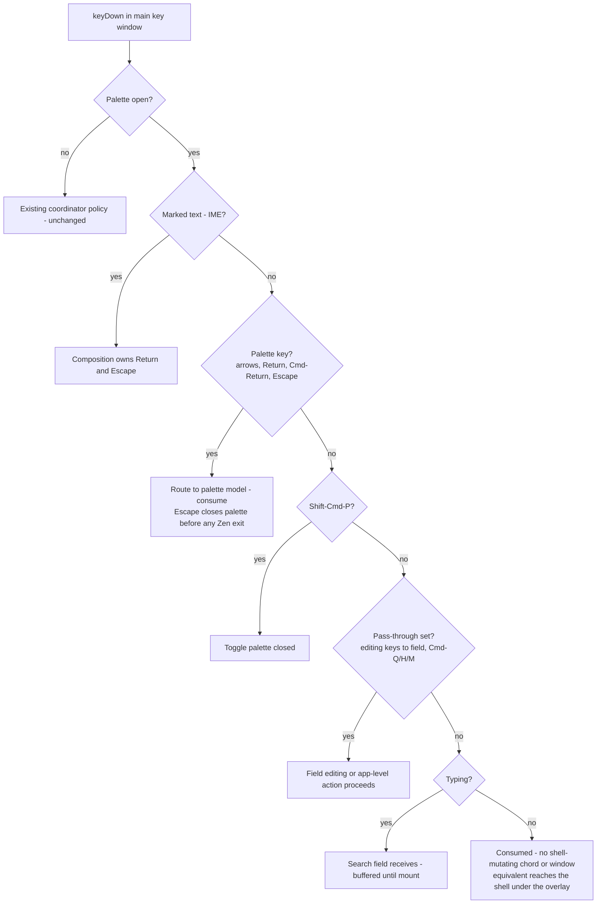

# Command Palette Refactor - Plan

## Goal Capsule

- **Objective:** Rebuild Bessie's command palette from first principles into the entity-aware universal navigator that `docs/plans/2026-08-04-001-feat-pre-v1-ui-redesign-plan.md` U6/R9 promises, replacing the current stringly-typed, unranked, three-key-path implementation with a typed BessieCore index, honest freshness, deterministic ranking, modal keyboard ownership, and in-palette stale recovery.
- **Target repo:** Bessie implementation repository, branch `feat/v1-l-brand-chrome` (current integrated checkpoint `d08d1a1`).
- **Authority:** `AGENTS.md` and live public Herdr/libghostty behavior govern ownership; redesign plan U6, R9, F3, AE5, KTD6/KTD7/KTD10 and its integration invariants govern palette behavior; `docs/plans/2026-08-05-001-feat-tab-refresh-redesign-plan.md` governs the palette's fallback-navigation role; this plan's KTDs govern the refactor's technical choices.
- **Execution profile:** Deep single-worker refactor in dependency order U1→U7. Re-read every touched file before editing; the branch carries the full pre-V1 redesign.
- **Stop conditions:** Stop and surface a blocker if a behavior would need private Herdr APIs, a second durable session model, terminal-controller recreation from palette activity, weakened CI checks, or removal of an existing palette route (tab-refresh fallback contract).
- **Tail ownership:** The executor owns implementation, tests, packaged-app verification, visual evidence, simplification, and code review. Commit, push, PR, or publication require Jordan's explicit instruction.

---

## Product Contract

### Summary

Refactor the command palette (screen 07/07L) so it actually functions as the product's universal navigator: open with `⇧⌘P`, the rail magnifier, or the menu item; browse a curated, attention-first list with no query; type to fuzzy-search panes, workspaces, Projects, herds, and commands across every fresh connection; Return navigates or executes through the existing authoritative route contract; stale targets recover honestly inside the palette; keyboard, focus, VoiceOver, and reduced motion behave like a finished macOS surface.

The refactor keeps what is genuinely good — the five-tier fuzzy scorer and its tests, the composite entity IDs, the one-shot dispatch gate concept, the route contract in `ProductSurfaces.swift` — and replaces the weak architecture around them: display-string state round-trips, an unranked concatenated index built inside a 5,300-line view, duplicated dead resolution logic, three competing key-event paths, and a footer that advertises a capability nothing has.

### Problem Frame

The palette technically works — it opens, filters, and routes — but functions poorly. Blunt diagnosis, grounded in code at `d08d1a1`:

1. **The most important signal renders wrong.** `paletteState(_:)` (`Sources/BessieApp/ProductSurfaces.swift:1874-1881`) emits presentation strings ("Needs you", "Settled"), but `BessieCommandPaletteRow` re-parses them with `AgentSemanticState(herdrValue:)` (`Sources/BessieApp/KeyboardShortcutCoordinator.swift:394-396`), which only knows raw lowercase Herdr values (`Sources/BessieCore/SurfaceProjection.swift:6-8`). Result: blocked and settled panes both render the Unknown diamond, and VoiceOver announces "Unknown" (`KeyboardShortcutCoordinator.swift:443-447`). Only "Working" survives by lucky case-folding. The palette cannot show who needs you.
2. **Connection rows are visually wrong.** They carry `state: "Connected"/"Disconnected"` (`ProductSurfaces.swift:603`), so the row always renders an agent-state glyph (Unknown diamond) instead of the mock's hard-drives icon; the icon branch (`KeyboardShortcutCoordinator.swift:403`) is dead for connections.
3. **The footer advertises a lie.** "⌘↵ open in a new tab" renders unconditionally (`KeyboardShortcutCoordinator.swift:238`), but zero command definitions set `alternateCommand` (`Sources/BessieCore/KeyboardShortcuts.swift:261-304`), and the gate refuses alternates without one (`Sources/BessieCore/CommandPalette.swift:157`). ⌘↩ does nothing, everywhere, always — a direct U6 violation ("hide the footer hint").
4. **Empty query is a wall of noise.** `CommandPaletteSearch.results` returns insertion order for empty queries (`CommandPalette.swift:77`), and insertion order is every pane, then every workspace, project, connection, and ~42 commands (`ProductSurfaces.swift:615`). No attention ordering, no grouping, no recency, no caps. The roadmap's named risk — "a universal palette can become noisy without ranking and scope" — shipped as the default state.
5. **Stale herds are presented as live.** The index reads `topology` built from unfiltered `fleet.topologyConnections` (`ProductSurfaces.swift:505-507`), while the pickers filter to `connectedConnectionIDs` (`ProductSurfaces.swift:508-515`). Panes and workspaces from disconnected herds appear with stale states and no freshness marking, violating the workspace spec's "disconnected or stale agents do not count as live."
6. **Scope filtering is accidental.** Pane/workspace entities respect the rail's herd scope, but connection and command entities ignore it — when scoped to one herd the palette silently hides other herds' panes while still listing all herds. Neither behavior was chosen; a universal navigator should search everything.
7. **Project rows launch topology.** The palette's project route calls `projects.requestOpen` (`ProductSurfaces.swift:1850-1851`), which is the launch path (`Sources/BessieApp/ProjectsViewModel.swift:269-286`) — it materializes Herdr workspaces immediately when the recipe has no commands. U6 forbids entity results implicitly creating topology, and U5 of the redesign requires launching to be explicit.
8. **Three key-event paths compete.** The app-wide monitor (`KeyboardShortcutCoordinator.swift:15-19`), the palette's own monitor (`:343-374`), and SwiftUI `onKeyPress` handlers (`:279-295`) all target the same keys. The monitor wins, so the `onKeyPress` block is dead code; ordering between the two monitors is observed, not contractual. Meanwhile product chords like `⇧⌘Z` and `⌥⌘N` still fire through the app monitor while the palette is open (`:118-126` whitelist), mutating the shell underneath the overlay.
9. **Clicks bypass the dispatch gate.** Row clicks call `run(item.route)` directly (`KeyboardShortcutCoordinator.swift:213-215`), skipping `CommandPaletteDispatchGate`; only keyboard activation is gated.
10. **The stale-target contract is split-brained.** `CommandPaletteTargetResolver` (`CommandPalette.swift:163-180`) exists, is tested, and is dead in production; `dispatchPaletteRoute` (`ProductSurfaces.swift:1826-1859`) reimplements resolution inline. Recovery closes the palette, drops the query, and shows a banner telling the user to "search again" — honest, but the least helpful honest behavior.
11. **The no-connection state is unreachable.** The "No herds connected" message renders only when results are empty (`KeyboardShortcutCoordinator.swift:199-207`), but ~42 command entities are always present, so browse results are never empty. The U6-required no-connection state cannot render.
12. **The index is rebuilt on every shell render.** `commandPaletteEntities` is a computed property on `BessieProductShell` (`ProductSurfaces.swift:561-616`), recomputed per body evaluation, diffed as a whole array in `.onChange(of: entities)` (`KeyboardShortcutCoordinator.swift:276-278`), and re-searched on every fleet tick. Untestable (private, view-embedded), wasteful, and the reason results churn under the cursor.
13. **"Refresh" does not refresh, and moved panes are falsely stale.** The stale-target path awaits `fleet.scheduleRefresh()`, but `refresh()` only recomputes derived fleet state from projections already in memory (`Sources/BessieApp/BessieApp.swift:1186-1211`) — no `session.snapshot` is requested, so the toast's claim that "Bessie refreshed the current Herdr state" is false. Worse, dispatch compares the captured workspace/tab/pane tuple against the pane's current location (`ProductSurfaces.swift:1830-1839`), so a pane that merely moved — still alive, resolvable by ID — is reported stale and dumped to The herd instead of opened at its current location. AE5 demands "reports or recovers"; this does neither correctly.
14. **The palette is a modal that nothing treats as modal.** Its key monitor has no marked-text (IME) guard — committing a CJK composition with Return dispatches the selected row mid-composition (`KeyboardShortcutCoordinator.swift:343-374` vs the coordinator's own `:43-51` guard). It has no sheet guard and no window scoping: the menu item opens it over rename/close-confirmation sheets, it intercepts keys while the separate Settings scene window is key, and with a live connection the shell mounts under `OnboardingView` (`Sources/BessieApp/BessieApp.swift:1329-1375`) so `⇧⌘P` opens an invisible palette beneath onboarding that swallows every plain Return app-wide. Meanwhile whitelisted product chords (`⇧⌘Z`, `⌥⌘N`, `⌘,`, `⇧⌥⌘[/]`) still mutate the shell behind the open overlay, and `⌘W` falls through to SwiftUI's default File > Close and can close the whole window.
15. **Zen has no palette route contract.** Only pane routes reconcile Zen (`ProductSurfaces.swift:1968-1970`). Workspace routes leave Zen active showing the old pane; connection routes can leave Zen retargeted arbitrarily by the restore path; destination commands show a new page while Zen shortcuts stay armed. The rail magnifier's tap in Zen both opens the palette and exits Zen via the rail's exit gesture (`:760-762`), then steals search-field focus with the Zen exit's async terminal focus.
16. **Command rows silently no-op.** All registry commands are indexed unconditionally; `handleShortcut` silently swallows dispatches when `actionInFlight` gates them (`ProductSurfaces.swift:2024-2032`) or when the required workspace/tab/pane context is nil. Return appears to do nothing, with no feedback. Project route failures behave the same from non-Projects destinations: `requestOpen` preconditions set a notice that renders only inside `ProjectsSurface`.
17. **Focus restoration is origin-blind and route-blind.** `closeCommandPalette` (`ProductSurfaces.swift:1867-1872`) unconditionally requests terminal focus — even when the palette was opened from Projects or Settings (planting a deferred pane-focus grab), and on dispatch it focuses the old pane before the route focuses the new one. A connection dispatch sets `destination = .herd` only for the restore path to overwrite it to `.workspace` under the last-workspace preference (`:2506-2527`).
18. **Small absurdities.** Selecting the palette's own "Command Palette" row closes and immediately reopens it (`ProductSurfaces.swift:2044-2045` re-entered via `:1856-1857`). The provider mark rides on `keywords.first` as an implicit contract (`ProductSurfaces.swift:577` → `KeyboardShortcutCoordinator.swift:426-428`), passing `""` for shell panes. The overlay centers vertically (`ProductSurfaces.swift:779-798`) where the mock anchors at ~14% from the top. Pane detail is a generic "Pane"/"Agent pane" instead of agent identity. The footer legend omits herds. The index builder uses trapping `Dictionary(uniqueKeysWithValues:)` (`ProductSurfaces.swift:562-564`) — one duplicate ID crashes the app on palette open. Keyboard-scrolling under a stationary cursor lets `onHover` yank the selection back.

History context: the palette began as a static ⌘B command list (2026-07-31), was parked, then unparked and rewritten entity-aware under U6 in the squashed checkpoint `d08d1a1`. Reports record two rounds of focus-on-open fixes and one live-filtering fix; the current build has focused-test evidence but no full green `mac-verify.sh` at its latest state. Prior review promises never delivered: no-connection state, honest ⌘↩ gating, palette accessibility pass.

### Requirements

**Index and data ownership**

- R1. One typed entity index in `BessieCore` covers exactly five kinds — panes (agent and shell), workspaces, Projects, herds (connections), commands — built from authoritative projections, with no terminal-output indexing.
- R2. Entity metadata is typed end-to-end: semantic state (`AgentSemanticState`), freshness, provider (agent kind), and location are dedicated typed fields; presentation strings appear only at the view boundary via `HerdPresentationStatus`. No display-string round-trips.
- R3. Pane and workspace entities come only from fresh (connected) herds. Disconnected herds appear only as connection entities carrying honest health detail and a retry route. Nothing stale is presented as live.
- R4. The index spans all configured fresh connections regardless of the rail's herd scope; scope influences ranking only. Identical labels from different herds stay distinct through stable composite IDs and location metadata.
- R5. Command entities cover the existing registry minus the self-referential Command Palette entry; all existing palette-reachable destinations and commands remain reachable (tab-refresh fallback contract).

**Search, ranking, grouping**

- R6. Empty query renders a curated sectioned browse in fixed order: Needs you, Recent, Workspaces, Projects, Herds, Commands. Panes appear in browse only under Needs you and Recent; every pane remains reachable by typing. Empty sections are omitted; headers are not selectable.
- R7. Non-empty query renders one flat ranked mixed list. The existing five-tier fuzzy scorer (exact > prefix > word-boundary > contiguous > subsequence, all terms must match) is retained; ties break deterministically by attention (`requiresUserAction`), then active-connection proximity, then kind order, then stable ID.
- R8. Results are deduplicated by entity ID before ranking (existing behavior preserved).
- R9. Recency uses a session-scoped MRU of successfully dispatched targets to populate the Recent section (cap 6, live-resolvable entries only). No elapsed-age text anywhere (redesign KTD3).

**Navigation versus action semantics**

- R10. Return on a pane, workspace, or herd navigates through the existing route contract: activate connection, validate against fresh projection, route, focus the terminal. Return on a command executes exactly the dispatch its menu/shortcut equivalent uses; a command dispatch that cannot run (action in flight, missing context) reports honestly through the existing route-failure surface instead of silently doing nothing.
- R11. Return on a Project navigates to that project in the Projects surface (its editor, or its running workspace when `runningInstance` reports one). The palette never launches or materializes topology; launching stays explicit in the Projects surface.
- R12. ⌘↩ is enabled and advertised only while the selected result exposes an explicit alternate route; the footer hint is hidden otherwise. No command ships an alternate route in this refactor, so the hint renders for nothing until a verified alternate exists.
- R13. Every activation — keyboard and mouse — passes through one dispatch gate and one pre-dispatch target resolution; a route dispatches at most once per palette session.
- R14. Stale live targets recover inside the palette, and recovery is real: resolution is by stable entity identity (connection + pane ID), never by captured location, so a moved pane dispatches to its current location. When identity resolution fails, the palette stays open with the query preserved, shows a refreshing notice, and waits a bounded interval (~2 s) for the existing per-event lifecycle refresh — which already requests `session.snapshot` on every Herdr event — to converge; it re-resolves on the next projection change or at timeout, then dispatches or shows an inline honest notice. During the wait the search field stays focused and editable, arrow selection stays live, and Escape or editing the query cancels the recovery (Escape also closes the palette). `fleet.scheduleRefresh()` recomputes derived state only and never counts as the refresh; the notice never claims a refresh that did not happen. No shadow panes, no new snapshot writer, no silent retry loop (AE5).
- R15. Destructive commands reached through the palette (close pane/tab/workspace) route through the existing authoritative confirmation paths unchanged; the palette adds no bypass and no new destructive surface.

**Keyboard, focus, modality**

- R16. Exactly one key-event monitor total: palette keys become a mode of `BessieKeyboardShortcutCoordinator` (an `isPaletteActive` closure beside the existing `isZenActive`), and the palette-local monitor and the dead SwiftUI `onKeyPress` path are both deleted. While the palette is open the coordinator suppresses shell-mutating product chords and window-level menu equivalents (`⌘W` included) by consuming the events — never by monitor installation order — and passes through an explicit set: the `⇧⌘P` toggle, standard editing equivalents to the focused search field (`⌘A`/`⌘C`/`⌘V`/`⌘X`/`⌘Z`), and app-level equivalents (`⌘Q` Quit, `⌘H` Hide, `⌘M` Minimize). Tests enumerate both the suppressed and pass-through sets. Command dispatches that arrive without a key event (menu clicks posting `.bessieCommand`) obey the same modality: while the palette is open, the shell's command handler ignores every command except the palette toggle unless the dispatch originated from the palette's own gate. Palette-dismiss evaluates before Zen-exit for Escape; scrim click dismisses exactly like Escape. Typing always lands in the search field; suppression starts when the overlay state flips, and printable keys pressed before the field mounts are buffered into the query and replayed at mount, so no keystroke leaks to the terminal pty and no leading character is lost.
- R17. Selection wraps at list boundaries, skips section headers, scrolls into view, survives result churn by entity ID (pane IDs are location-independent, so a moved pane keeps its selection), and resets to the top result when the query changes it away. Activation captures the selected entity by ID at keypress time so a result-set push racing Return cannot dispatch a row the user never selected. Hover moves selection only on actual pointer movement, not when rows scroll under a stationary cursor.
- R18. The search field is focused and receives the first keystroke on every open path: `⇧⌘P`, rail magnifier, menu item, and the capture-preview hook.
- R19. Focus restoration is origin-aware and single-shot: the model captures the first responder at open; dismissal without dispatch restores it (terminal focus only when the origin was a terminal context — workspace or Zen); dispatch hands focus to the route target per F3 with no intermediate bounce to the old pane and no deferred pane-focus grabs planted from non-terminal origins.
- R20. The Zen route contract is explicit: with Zen active, pane routes retarget Zen (`zenState.select`); workspace, herd, Project, and destination-changing command routes exit Zen before navigating; opening or closing the palette itself never changes Zen. The rail magnifier in Zen opens the palette without triggering the rail's Zen-exit tap gesture.
- R21. IME and text-editing guards apply inside the palette too: while marked text exists, Return commits the composition and Escape cancels it — neither reaches palette dispatch; the palette chord remains available while editing text (existing `allowsDuringTextEditing` contract).

**Visual layout and states**

- R22. Screen-07 anatomy: overlay top-anchored at ~14% of the shell height, width 560, scrim 0.28, 16 pt input with esc chip, list rows of leading state-glyph-or-kind-icon, label · detail, trailing location meta in monospaced small type, and provider mark for agent panes; dynamic footer with the full five-kind legend (panes · workspaces · projects · herds · commands) and only honest key hints — "↵ open" for navigable entities, "↵ run" for commands, "↵ retry" for a disconnected herd row, and no verb when nothing actionable is selected.
- R23. Connection rows render the hard-drives icon plus health text and never the agent-state glyph. Provider marks come from the typed provider field, not `keywords.first`.
- R24. Browse sections render quiet section headers; query results render flat (matching the artboard). Spacing adopts `BessieDensityMetrics` (comfortable/compact) instead of hard-coded paddings.
- R25. States are all reachable and honest: a no-herds-connected notice renders in browse (commands still listed) whenever zero connections are fresh; no-results renders for unmatched queries with the footer reduced to the kind legend; an inline refreshing/failed notice renders during R14 recovery; a retrying herd row shows a transient in-progress state and a repeated failure updates its health text distinguishably from the first; Reduce Motion removes scale/scroll animation; the surface stays opaque under Reduce Transparency (existing CI-pinned material).
- R26. VoiceOver announces kind, title, presentation status (correct four-state vocabulary), location, and health per row, plus selection state and honest action hints; every notice state (no connections, no results, recovery refreshing, recovery failed) posts an announcement when it appears; browse section headers are exposed as accessibility headers; the open palette is accessibility-modal (background content not traversable) and the scrim exposes an accessible dismiss action; keyboard-only operation covers open, browse, search, activate, recover, and dismiss.

**Quality, evidence, compatibility**

- R27. The index is built when the palette opens and rebuilt only on projection/input change while open — never per shell render. Debug signposts cover palette indexing and query (redesign observability contract). Palette open/close/dispatch never recreates terminal controllers.
- R28. All existing CI and evidence hooks keep passing: `⇧⌘P` binding and no-⌘B-claim greps, no Attention types, no "⌘K PALETTE" copy, `BESSIE_COMMAND_PALETTE_PREVIEW`, the artboard-07 "sch" query seed, `BessieWindowSnapshotProbe(role: "sheet")`, and the 07/07L capture-matrix states. Geometry pins (width 560, scrim 0.28, input 16) are preserved; changed assertions are updated deliberately in the same change with the new contract.
- R29. One openability predicate governs every open path (`⇧⌘P`, magnifier, menu item, preview hook): the palette does not open while onboarding is presented, while the key window has an attached sheet, or while the main window is not key; the menu item disables from the same published state. Index construction is total — no trapping dictionary constructors on duplicate IDs.
- R30. Command entities keep exact parity with their menu/shortcut equivalents by dispatching only through `handleShortcut`; a full availability/disabled-reason model for context-blocked commands stays parked (see Scope Boundaries) — honest failure reporting per R10 is the floor this refactor ships.

### Key Flows

- F1. **Attention jump.** Open palette (any path) → browse shows Needs you first → ↓ → Return → connection activates, target validates fresh, pane focuses, palette closes, terminal is first responder.
- F2. **Typed navigation.** Type "sch" → flat ranked mixed results across herds → exact/prefix matches first, blocked entities win ties → Return navigates; footer shows ⌘↩ only if the selected result has an alternate route.
- F3. **Stale recovery.** Return on a pane whose target moved or vanished → identity resolution first (moved pane dispatches to its current location) → otherwise palette stays open, shows "refreshing herd state…", waits at most the bounded interval for the event-driven refresh → target found: dispatch; target gone: inline "no longer available" notice, query intact, list updated; Escape or a query edit cancels the wait.
- F4. **Zen.** In Zen, `⇧⌘P` or the magnifier opens the palette over Zen (no Zen exit from opening) → pane result retargets Zen to that pane → workspace/herd/Project/destination-command result exits Zen, then routes.
- F5. **Cold/no connections.** Zero fresh herds → browse shows the no-connections notice, herd rows with Retry, and the full command list; Retry routes through `fleet.retry` with a visible in-progress state and distinguishable repeat-failure feedback.
- F6. **Blocked open.** During onboarding, over an attached sheet, or when the main window is not key → `⇧⌘P` and the menu item do not open the palette; the menu item renders disabled; no invisible overlay ever swallows keys.

### Acceptance Examples

- AE1. Given a blocked agent pane in a fresh herd, when the palette renders it, then its row shows the Needs-you glyph and VoiceOver says "Needs you" — never "Unknown".
- AE2. Given any selected result without an alternate route, when the footer renders, then no ⌘↩ hint appears and ⌘↩ performs nothing.
- AE3. Given a pane result whose pane was closed from the Herdr TUI after indexing, when Return is pressed, then the palette stays open showing the refreshing notice, waits at most the bounded interval for the event-driven refresh, and shows an inline notice naming the outcome; no pane opens, nothing crashes, the query is preserved.
- AE4. Given the palette is open, when a shell-mutating chord (`⌥⌘N`, `⇧⌘Z`, `⌘D`, `⌘W`) is pressed or a shell menu item is clicked, then nothing changes underneath the overlay; when `⌘V` is pressed, it pastes into the search field; when `⌘Q` is pressed, Bessie quits normally; when `⇧⌘P` is pressed, the palette closes and terminal focus returns.
- AE5. Given a project with no pane commands, when its palette row is activated, then Bessie navigates to that project in the Projects surface and no Herdr workspace, tab, or pane is created.
- AE6. Given two herds each containing a pane titled "scratch", when "scratch" is searched, then both rows appear with distinct locations and dispatch to their own connections.
- AE7. Given the rail is scoped to one herd, when the palette opens, then results still include the other fresh herds' entities, ranked below the active herd's on ties.
- AE8. Given identical entity inputs, when the browse list or any query is produced twice, then the order is byte-identical.
- AE9. Given an active IME composition in the search field, when Return or Escape is pressed, then the key commits or cancels the composition only; no palette row dispatches and the palette does not close mid-composition.
- AE10. Given onboarding is presented or a sheet is attached to the key window, when `⇧⌘P` is pressed or the menu item is invoked, then no palette opens and no keys are intercepted by palette handling.
- AE11. Given a pane that moved to another tab after the palette indexed it, when its row is activated, then Bessie opens the pane at its current location instead of reporting it stale.
- AE12. Given an open palette whose query matches nothing, when the no-results state renders, then it shows the notice copy, posts a VoiceOver announcement, reduces the footer to the kind legend, and Return performs nothing.

### Scope Boundaries

**In scope:** everything in Requirements; extraction of palette code into its own files; test updates forced by contract changes; screen 07/07L evidence.

**Deferred to follow-up work (parked, not started here):**

- Typed context-safe agent actions from the palette (prompt, interrupt). The roadmap's first useful slice names them, but the capability-gated action contracts they need (typed action IDs, labels, payloads, and scope per the workstream capability map) do not exist yet, the roadmap's own graduation criteria require high-risk side effects to be split into separately approved milestones, and the governing U6/R9 contract defines a navigation-only kind list — so they park until a capability contract lands.
- ⌘↩ "Launch project" as an alternate route on Project rows. It would give the footer its first honest occupant, but U6 restricts alternate routes to command definitions and forbids entity results creating topology; shipping it needs a product-contract amendment first.
- Tab entities as a sixth kind (`ScopedTopologyProjection.openTarget(for:)` makes this cheap later; U6's kind list does not include tabs).
- Persisted MRU across relaunches (would extend `BessiePresentationState`; in-memory MRU ships first).
- Disabled-state display with reasons for currently unavailable commands (recorded gap since the 2026-08-02 inventory; palette keeps menu parity today).
- Palette dispatch through the agent-intent bus (intent-bus plan flow 5 "UI parity" remains unverified and is a dispatch-plumbing change beyond this refactor).
- Scrollback/terminal-output search (`docs/roadmap/search-the-herd.md`, deferred; U6 forbids terminal-output indexing).
- Updater actions in the palette (releases plan KTD16 exclusion).

**Outside this product's identity:** a second durable session model, attention list/history types (CI-banned), private Herdr protocol use, non-libghostty terminal surfaces.

### Sources

- `docs/plans/2026-08-04-001-feat-pre-v1-ui-redesign-plan.md` — governing product contract: R9, F3, AE5, U6, KTD6/KTD7/KTD10, integration invariants, observability.
- `docs/plans/2026-08-05-001-feat-tab-refresh-redesign-plan.md` — palette routes are mandatory fallback navigation; routes may not be removed.
- `docs/roadmap/entity-aware-command-palette.md` — product intent, ranking/noise risk, later scope.
- `docs/plans/2026-08-02-entity-aware-command-palette.md` — superseded parking record delegating to U6/U12.
- `docs/research/2026-08-02-v1-feature-codebase-inventory.md` §7 — honest pre-entity baseline and recorded gaps.
- Bessie workstream `WORKSPACE-INTERACTION-SPEC.md`, `HERDR-CAPABILITY-MAP.md`, `V1-SCOPE.md`, `ARCHITECTURE.md`, `TERMINAL-BEHAVIOR.md`, `FEASIBILITY.md` — ownership, capability, and scope contracts.
- Bessie workstream `notes/BESSIE-PRE-V1-UI-INVENTORY.md` §07 and `projects/v1-release/source-material/pre-v1-ui-update/bessie-pre-v1-ui-update.html` (`.cmdk*` rules) — screen-07 visual contract: 560 px, 14vh top inset, 48vh list, row anatomy, footer.
- `docs/reports/goal-progress.md` — palette build/verification history, focus-fix rounds, outstanding full-verify status.
- Git history: palette introduced in `308a0e0` (⌘B, static commands), entity rewrite squashed into `d08d1a1`; intermediate evolution documented only in reports.

---

## Planning Contract

### Key Technical Decisions

- KTD1. **Move index construction into `BessieCore` as a pure builder.** A new `CommandPaletteIndexBuilder` consumes typed, `Sendable` inputs (fresh per-herd topology rows, projects with running state, connection definitions plus health, command definitions, and a context of active connection, scope, focused IDs, and MRU) and produces browse sections and query results. `BessieProductShell` supplies inputs and consumes outputs. Rationale: the index becomes testable without a Mac (`BessieAppModelTests` links GhosttyTerminal; `BessieCoreTests` does not), leaves the 5,300-line view, and gains one owner for ordering. Rejected: keeping construction in the view (untestable, re-rendered) and building from raw `HerdrModels` (the `HerdList`/`SurfaceProjection` projections already carry typed state and identity).
- KTD2. **Type the metadata; render strings only at the edge.** `CommandPaletteEntity` carries `state: AgentSemanticState?`, `freshness`, `provider: String?`; rows derive glyphs and VoiceOver text via `HerdPresentationStatus(state:)`. This fixes diagnosis items 1, 2, and 13 by construction. Rejected: patching `paletteState` strings to raw values — it preserves the round-trip trap.
- KTD3. **Keep the five-tier scorer; layer deterministic secondary ordering.** Text-match tier stays primary so exact command matches are never hidden; `requiresUserAction`, active-connection proximity, kind order, and stable ID break ties in that order. This answers the roadmap's ranking question (urgency favored without hiding exact matches) while preserving the tier tests (`Tests/BessieCoreTests/CommandPaletteTests.swift:41,57,87,107`). Rejected: a new scoring model (larger risk, kills pinned tests for no user-visible gain).
- KTD4. **One result list, two presentations.** Browse (empty query) is sectioned and curated; queries are flat (the artboard shows a flat mixed list under a query). This answers the roadmap's "should navigation and actions share one result list?" — yes, one list model; presentation varies by query state. Browse ordering reuses the canonical attention-first comparators (`agentListPrecedes`, `HerdList.swift:288-302`) rather than inventing a third order.
- KTD5. **Resolve by identity against the live projection; no new snapshot seam.** `CommandPaletteTargetResolver` becomes the single production resolution owner: activations resolve the selected entity by stable ID (connection + pane ID) against the current index, and a moved pane dispatches to its current location via `openTarget`. On `refreshRequired`, the palette stays open, shows the refreshing notice, and waits a bounded interval for the existing per-event lifecycle refresh to converge — `ConnectionLifecycle` already requests `session.snapshot` on every Herdr event and installs it, so projections are event-fresh without new machinery; re-resolve on the next projection change or at timeout, then dispatch or show the inline notice. `dispatchPaletteRoute`'s ad-hoc location-tuple checks (`ProductSurfaces.swift:1830-1848`) are removed. Rejected: `fleet.scheduleRefresh()` as the refresh step (it recomputes derived state without touching Herdr — the current dishonesty); a new on-demand `resnapshot()` seam (it would duplicate the event-driven snapshot pipeline to defend a sub-second race, add a second unsynchronized snapshot-install writer, and block the main actor — reinstate only if a wedged-but-RPC-responsive event subscription is ever demonstrated); close-then-banner recovery (drops the query; weakest honest UX).
- KTD6. **Fold palette keys into the one existing coordinator as a mode.** `BessieKeyboardShortcutCoordinator` gains an `isPaletteActive` closure beside `isZenActive`: while active it routes arrows/Return/⌘↩/Escape to the palette model, checks `hasMarkedText` before consuming Return/Escape, evaluates palette-dismiss before Zen-exit, scopes to the main key window, and consumes shell-mutating product chords and window-level menu equivalents so nothing mutates the shell or closes the window under the overlay. The pass-through set is explicit: `⇧⌘P`, editing equivalents to the focused field (`⌘A`/`⌘C`/`⌘V`/`⌘X`/`⌘Z`), and app-level `⌘Q`/`⌘H`/`⌘M`. The shell's command handler independently ignores non-palette commands while the overlay is open, so a menu click posting `.bessieCommand` — or a menu key equivalent that ever slips past the monitor — still cannot mutate the shell (defense in depth). The palette-local monitor (`KeyboardShortcutCoordinator.swift:343-374`) and the dead `onKeyPress` block (`:279-295`) are both deleted — one monitor total, modality from explicit state, never from monitor installation order. Rejected: keeping a second palette monitor (undocumented ordering, the current Zen-Escape coin flip); onKeyPress-only (regresses the arrow-swallowing bug the monitor fixed twice per reports); suppress-everything modality (it would break paste into the search field and app quit/hide — regressions from today).
- KTD7. **Project rows navigate through the existing Projects methods; launching stays in the Projects surface.** The project route changes from `projects.requestOpen` (a launch path) to setting the Projects destination and calling the methods the Projects row menu already uses — `openRunningWorkspace(_:)` when `runningInstance` reports one, else `beginEdit(_:)` on the stored project. No new `ProjectsViewModel` API. Rejected: launch-with-review from the palette (violates U6's no-implicit-topology rule and U5's explicit-launch rule); a parallel navigation entry point (two independently maintained paths to one outcome).
- KTD8. **Selection wraps.** `movedSelection` gains wrap semantics, matching the app's rail traversal (`⇧⌘J/K` wrap last↔first). The clamp assertions in `CommandPaletteTests.swift:217-221` are updated in the same change.
- KTD9. **MRU is session-scoped, in-memory, and shell-owned.** The shell owns the MRU store for the app session and passes it through the builder context (consistent with KTD1); the palette model — created per presentation — reports successful dispatches to it (cap 6, deduped, most recent first) and never owns the list, so palette teardown cannot erase recency. Entries are keyed by stable entity ID, so a moved pane keeps its Recent entry; entries drop when no longer resolvable. No persistence schema change; `lastWorkspaceID(for:)` hints may seed the list at startup. Rejected: model-owned MRU (dies with the per-presentation `@StateObject` on every close, so Recent would always be empty); persisting MRU in `BessiePresentationState` (schema migration for marginal value — parked).
- KTD10. **Extract by moving the existing owner.** `BessieCommandPalette`, its controller, and the row view move from `KeyboardShortcutCoordinator.swift` into a new `Sources/BessieApp/BessieCommandPalette.swift`; the controller is renamed `BessieCommandPaletteModel` per the redesign's component naming. U6 sanctions exactly this move and forbids a colliding second type. `KeyboardShortcutCoordinator.swift` returns to being only the shortcut coordinator.
- KTD11. **Preserve every CI and capture contract.** `⇧⌘P` mapping, no-⌘B claim, no Attention types, no "⌘K PALETTE", `BESSIE_COMMAND_PALETTE_PREVIEW`, artboard-07 "sch" seeding, `BessieWindowSnapshotProbe(role: "sheet")`, and geometry pins 560/0.28/16 all survive. The artboard seed moves with the view code and keeps reading `BESSIE_DESIGN_ARTBOARD`.
- KTD12. **One openability predicate.** A single published predicate (onboarding not presented, no attached sheet on the key window, main window key) gates `handleShortcut`, the magnifier, the menu item (which also disables from it), and the preview hook. Rejected: per-path guards (the current hole — the coordinator's `sheetParent` check protects only one of four paths).
- KTD13. **Zen contract by route kind.** Pane routes retarget Zen; workspace, herd, Project, and destination-changing command routes call the Zen exit before navigating (the pattern `reconcileFailedPaneRoute` already models); opening the palette never touches Zen, and the rail magnifier is excluded from the rail's Zen-exit tap gesture. Rejected: exiting Zen on palette open (punishes the primary retarget flow).

### Assumptions

Bets made without a synchronous user; each is correctable at review without invalidating the rest of the plan.

- A1. The 2026-08-04 redesign plan remains the binding palette contract. Workstream `V1-SCOPE.md` (updated 2026-08-03) still lists "entity-aware command-palette expansion" as out of V1; the newer user-approved redesign plan unparked it, and the U12 docs pass reconciled the repo docs. This plan follows the newer contract.
- A2. Cross-herd indexing regardless of rail scope (R4) is the intended "universal navigator" reading; the current scope-filtered pane list is treated as accidental (its connection/command lists already ignore scope).
- A3. The artboard specifies only the query state; the sectioned browse IA in R6 is new design authority for the empty-query state, kept consistent with rail vocabulary and ordering.
- A4. In-palette recovery (R14) is the intended reading of AE5's "reports or recovers", and it deliberately amends the redesign plan's error-propagation invariant ("Missing palette/menu target: show an honest stale-target recovery and open the relevant herd/workspace"): for targets activated from the open palette, in-palette recovery supersedes open-the-herd; the post-close fallback (`reportStalePaletteTarget`) and menu-bar stale targets retain the invariant's open-the-herd behavior.
- A5. The redesign screen-matrix row "open/open-in-new-tab actions" is governed by U6's narrower ⌘↩ contract; no alternate route ships until a verified one exists.
- A6. No Herdr capability changes and no persistence schema changes are needed for any requirement in this plan.
- A7. The existing per-event lifecycle refresh (subscribe → `session.snapshot` → install) keeps projections fresh enough that R14's bounded wait converges in ordinary operation; no new snapshot request path is needed. If a wedged-but-RPC-responsive event subscription is ever demonstrated from fleet evidence, an on-demand resnapshot becomes the follow-up, carrying that evidence.

### High-Level Technical Design

Directional contracts for ownership and flow; not exact Swift signatures.

Component and data flow:

Activation and stale recovery (single state machine for R13/R14):

Key ownership — one coordinator monitor, palette as a mode:

### Ordering specification

- Query pipeline: dedup by ID → AND-match all whitespace tokens → per-term best field score with existing field-order penalty (title, detail, location, state, keywords, shortcut) → sum → sort by score desc, `requiresUserAction` desc, active-connection first, kind order (pane, workspace, project, connection, command), entity ID asc.
- Browse sections, fixed order, intra-section order:
  - Needs you: all blocked panes across fresh herds, `agentListPrecedes` order.
  - Recent: MRU order, cap 6, entries dropped unless still resolvable.
  - Workspaces: connection definition order, then workspace number.
  - Projects: existing Projects list order.
  - Herds: connection definition order; disconnected rows carry health + retry.
  - Commands: registry order.
- Section volume is a decision, not an accident: panes are the only capped kind in browse (they appear solely under Needs you and Recent); Workspaces, Projects, Herds, and Commands render complete — each is bounded by real fleet or registry size, one line per row, and completeness beats a second ranking policy. A multi-herd fixture test pins section order and completeness.
- Browse applies no active-herd proximity boost — section-internal connection-definition order already groups herds deterministically; the proximity boost belongs to query ranking only.
- Searchable text also includes the presentation status word ("needs you", "settled") so state-term queries keep working — sourced from the typed state, not a stored string.
- Determinism (AE8) is over identical inputs, and the inputs include the Projects list order and connection definition order; the permutation tests vary entity arrival order while holding those input orders fixed.

### Keep, replace, delete

| Disposition | Code |
| --- | --- |
| Keep as-is | Five-tier `fuzzyScore` + tokenization (`CommandPalette.swift:95-145`); `CommandPaletteRouteIntent` cases; route contract `openRoutedPane`/`presentRoutedPane` (`ProductSurfaces.swift:1883-1981`); `⇧⌘P`/magnifier/menu open paths; opaque surface + tokens; capture hooks |
| Keep, extend | `CommandPaletteEntityID` type (pane components change to connection + pane ID so identity survives moves); `CommandPaletteSearch.results` (context-aware tiebreaks); `CommandPaletteDispatchGate` (cover clicks); `CommandPaletteTargetResolver` (wire into production); `CommandPaletteKeyboard` (wrap); command registry (unchanged entries) |
| Replace | `commandPaletteEntities` computed property (`ProductSurfaces.swift:561-616`) → BessieCore builder with non-trapping construction; `paletteState(_:)` string mapping (`:1874-1881`) → typed state; `dispatchPaletteRoute` inline staleness (`:1830-1848`) → identity resolver + bounded-wait recovery; project route launch semantics (`:1850-1851`) → navigation; static footer (`KeyboardShortcutCoordinator.swift:234-245`) → dynamic; centered overlay (`ProductSurfaces.swift:779-798`) → top-anchored; origin-blind `closeCommandPalette` focus (`:1867-1872`) → origin-aware restore; `BessieCommandPaletteKeyRouting` → `BessieCommandPaletteModel` in its own file, monitor removed |
| Delete | Palette-local `NSEvent` monitor (`KeyboardShortcutCoordinator.swift:343-374` — folded into the coordinator mode); SwiftUI `onKeyPress` palette block (`:279-295`); "No herds connected" dead branch (`:199-207` — replaced by reachable notice); provider-from-`keywords.first` (`:426-428`); self-referential Command Palette row; `split`-substring icon hack (`:404`) |

---

## Implementation Units

### U1. Typed core model, index builder, and ordering

**Goal:** The palette's entity model, browse/query production, and ordering live in `BessieCore` as pure, deterministic, fully tested logic.

**Requirements:** R1-R9, R12 (gate capability check), R14 (identity scheme), R17 (wrap math). **Decisions:** KTD1-KTD4, KTD8, KTD9 (store side).

**Files:**

- `Sources/BessieCore/CommandPalette.swift` — extend `CommandPaletteEntity` with additive typed fields (`semanticState: AgentSemanticState?`, `freshness`, `provider`) beside the existing `state: String?` so every target keeps compiling; the string field and its consumers are deleted in U3 (producer rewrite) and U6 (row rebuild), and R2's no-round-trip rule is satisfied at that end-state, not after U1. Change pane entity ID components to connection + pane ID — pane IDs are unique per connection and `openTarget` resolves by pane ID alone — so identity survives moves; workspace/tab stay in the route payload and location metadata. Context-aware `CommandPaletteSearch`; wrap in `CommandPaletteKeyboard.movedSelection`.
- New `Sources/BessieCore/CommandPaletteIndex.swift` — input structs, section model, `CommandPaletteIndexBuilder` (browse + query), MRU value type.
- `Tests/BessieCoreTests/CommandPaletteTests.swift` — update empty-query and clamp assertions to the new contract; keep tier/dedup/gate tests green unchanged.
- New `Tests/BessieCoreTests/CommandPaletteIndexTests.swift`.

**Approach:**

1. Define builder inputs mirroring what the shell already has: per-herd fresh topology (reuse the shapes behind `HerdRailPaneRow`/`ScopedTopologyProjection`), projects with running flag, connection definitions + health, `BessieCommandDefinition` list, context (active connection, scope, focused workspace/pane, MRU). Construction is total: duplicate IDs merge deterministically instead of trapping (`Dictionary(uniqueKeysWithValues:)` is banned in the builder).
2. Produce pane entities with agent identity detail, typed state, provider from agent kind, location "herd / workspace / tab"; workspace entities with rolled state; project entities with "Project · N panes" plus running marker; connection entities with typed freshness (no agent state); command entities excluding `.showCommandPalette`.
3. Implement the ordering specification exactly; reuse `AgentSemanticState.sortRank`/`agentListPrecedes` semantics rather than new comparators where they fit.
4. Keep `CommandPaletteSearch` tiers untouched; move empty-query handling out of `results` (browse is the builder's job); add the secondary comparator chain.

**Execution note:** Test-first: write the index/ordering tests from the ordering specification before implementing the builder.

**Test scenarios:**

- Blocked pane maps to `.blocked` typed state and Needs-you presentation; done/idle map to settled; unknown stays unknown (Covers AE1 at model level).
- Browse: sections appear in fixed order; empty sections omitted; panes absent outside Needs you/Recent; deterministic across input permutations (Covers AE8).
- Query: tier tests unchanged; equal-score tie between blocked and settled pane ranks blocked first; active-connection entity outranks other-herd twin; kind order then ID close ties (Covers AE7).
- Cross-herd: same-titled panes from two herds both survive dedup with distinct IDs/locations (Covers AE6).
- Identity: a pane input whose workspace/tab changed between builds keeps the same entity ID; the identity test pins the connection + pane ID component scheme (Covers AE11 at model level).
- Freshness: disconnected herd contributes no pane/workspace entities but exactly one connection entity flagged disconnected.
- MRU: dispatch recording caps at 6, dedupes, drops non-resolvable entries, and keeps an entry whose pane moved (ID unchanged).
- Commands: registry minus Command Palette; state-word query ("needs") matches blocked pane via typed-state search text.
- Wrap: last→first and first→last selection movement; zero and one-item lists.
- Gate: alternate refused without alternate route (existing test retained).
- Total construction: duplicate entity IDs in inputs merge without trapping and produce one deterministic winner.

**Verification:** `swift test --filter BessieCoreTests` passes on the Mac lane; `./scripts/check.sh` stays green.

**Dependencies:** none — first unit.

### U2. Move the palette to its own files; rename the controller

**Goal:** Palette view/controller code has one home and the redesign's intended names, with zero behavior change.

**Requirements:** R28 (hooks survive the move). **Decisions:** KTD10, KTD11.

**Files:**

- New `Sources/BessieApp/BessieCommandPalette.swift` — receives `BessieCommandPalette`, `BessieCommandPaletteKeyRouting` (renamed `BessieCommandPaletteModel`), `BessieCommandPaletteRow`, moved verbatim from `KeyboardShortcutCoordinator.swift:162-448`.
- `Sources/BessieApp/KeyboardShortcutCoordinator.swift` — retains only the shortcut coordinator (`:5-160`).
- `Tests/BessieAppModelTests/CommandPaletteControllerTests.swift` — rename references; assertions unchanged.

**Approach:** Pure move-and-rename commit. No colliding second type; the artboard-07 query seeding and `BessieWindowSnapshotProbe(role: "sheet")` move with the view. U1's additive typing keeps the moved code compiling unchanged (the legacy `state: String?` field still exists until U3/U6), so both Mac test filters can pass here with only rename diffs.

**Execution note:** Characterization posture — the full existing test suite is the proof; no assertion changes beyond the type rename.

**Test scenarios:** Test expectation: none beyond compilation and the existing suites passing unchanged — this unit is a mechanical move (non-feature-bearing).

**Verification:** `./scripts/check.sh` and both Mac test filters pass with only the rename diffs.

**Dependencies:** U1.

### U3. Shell integration: index lifecycle, inputs, MRU, signposts

**Goal:** The shell feeds the builder typed inputs, builds the index on open and on change while open, records MRU on dispatch, and gates every open path behind one openability predicate.

**Requirements:** R3-R5, R9, R25 (banner source), R27, R29. **Decisions:** KTD1, KTD9, KTD11, KTD12.

**Files:**

- `Sources/BessieApp/ProductSurfaces.swift` — delete `commandPaletteEntities` (`:561-616`); add input assembly from fleet/projects (fresh connections across all herds, ignoring rail scope for membership); pass inputs at overlay presentation (`:779-798`); openability predicate consulted by `handleShortcut` (`:2044-2045`) and `openSearch` (`:1082`); preview hook `:2464-2466` behind the same predicate.
- `Sources/BessieApp/BessieApp.swift` — menu item (`:149-154`) disables from the published openability state.
- `Sources/BessieApp/BessieCommandPalette.swift` — model owns built sections/results; rebuilds on input change while open; palette indexing/query signposts.
- `Tests/BessieAppModelTests/CommandPaletteControllerTests.swift` — extend for lifecycle and openability.

**Approach:**

1. Assemble builder inputs once per palette open, then rebuild only on `onChange` of an `Equatable` builder-input snapshot while the overlay is visible — never per shell render. The snapshot includes topology identity, per-pane agent status and titles, workspace rolled state, connection health, projects, and MRU, so a pane flipping to blocked while the palette is open re-sections immediately; input assembly populates only the typed fields (the legacy string `state` is no longer produced here).
2. Openability: closed while onboarding is presented, while the key window has an attached sheet, or while the main window is not key; `⇧⌘P`, magnifier, menu item, and preview hook all consult it; the menu item is disabled, not silently ignored. The preview hook additionally defers its open until the main window first reports key, then applies the full predicate, so the capture harness cannot race window activation at launch.
3. The no-connections notice derives from `fleet.connectedConnectionIDs.isEmpty`, never from empty results (the empty-results derivation is the current dead branch).
4. The shell owns the session MRU store (KTD9) and passes it in the builder context; the model reports successful dispatches to it. Seed workspace recency from `lastWorkspaceID(for:)` hints at first open.
5. Emit debug signposts around index build and query execution (redesign observability list names "palette indexing/query").

**Test scenarios:**

- Opening the palette with a scoped rail still indexes other fresh herds (Covers AE7).
- A disconnected herd's panes vanish from results while its connection row remains with retry detail.
- Result churn mid-typing: selection preserved by ID when the selected entity survives; resets to top otherwise (existing behavior, retained under the new lifecycle).
- A pane flipping to blocked while the overlay is open re-sections into Needs you and updates its glyph without reopening (Covers AE1 under churn).
- MRU records only successful dispatches into the shell-owned store and surfaces in browse Recent on reopen within the session (the store survives palette teardown).
- No index rebuild occurs from shell renders while the palette is closed (lifecycle hook assertions).
- Openability: onboarding presented, sheet attached, and non-key main window each refuse all four open paths; the menu item's disabled state tracks the predicate (Covers AE10, F6).
- The preview hook opens the palette once the window first reports key; the capture harness renders artboard 07 deterministically.
- Zero fresh connections produce the notice plus command and herd rows (Covers F5).

**Verification:** Mac `BessieAppModelTests` filter passes; Instruments/log shows palette signposts; no `GhosttyTerminal` reconstruction during open/close (existing controller-identity tests stay green).

**Dependencies:** U1, U2.

### U4. Route semantics, resolver wiring, in-palette recovery

**Goal:** One identity-based resolution path for every activation, genuinely authoritative recovery inside the palette, navigation-only entity semantics, and an explicit Zen contract.

**Requirements:** R10-R15, R20 (route contract), R30. **Decisions:** KTD5, KTD7, KTD13.

**Files:**

- `Sources/BessieApp/BessieCommandPalette.swift` — clicks route through the model's gate+resolver; recovery states (resolving/refreshing/failed notice) per the state machine, with the bounded wait observing the shell's projection changes and Escape/query-edit cancellation; activation captures the selected entity by ID at keypress time; dynamic footer capability check.
- `Sources/BessieApp/ProductSurfaces.swift` — `dispatchPaletteRoute` (`:1826-1859`) slims to pure route execution against the pane's current `openTarget` location; project route sets the Projects destination and calls `projects.openRunningWorkspace(_:)` when `runningInstance` reports one, else `projects.beginEdit(_:)` on the stored project (the existing row-menu calls; no new `ProjectsViewModel` API); connection route sets `selectedTopologyConnectionID` so the restore path cannot overwrite its destination, and uses `fleet.retry` for failed herds; `reportStalePaletteTarget` (`:1861-1865`) reduces to the post-close fallback only; magnifier excluded from the rail Zen-exit gesture (`:760-762`).
- `Sources/BessieCore/CommandPalette.swift` — resolver extended to return the current routed location for moved panes and to distinguish "missing" from "connection stale".
- Tests in both targets.

**Approach:**

1. All activations call `model.activate(alternate:)` with the entity ID captured at keypress/click time; clicks stop calling `run(item.route)` directly.
2. Resolution is identity-first: a pane that still exists dispatches to its current location (moved panes recover instead of reporting stale). `refreshRequired` keeps the overlay open in the Refreshing state and waits at most the bounded interval (~2 s) for the event-driven lifecycle refresh to change the projection (U3's rebuild already observes it); re-resolve on change or timeout, then dispatch or show the inline failure notice with the query preserved. No new snapshot request path (KTD5); the notice never claims a refresh that did not happen.
3. Both honest-failure surfaces are the same mechanism: command dispatches `handleShortcut` cannot run (action in flight, missing context) and project navigation whose stored project is gone report through `fleet.reportRouteFailure`; the palette's inline notice covers only live-target recovery while the overlay is open.
4. Zen: pane dispatch keeps `zenState.select` retargeting (existing `presentRoutedPane:1968-1969`); workspace, herd, Project, and destination-command dispatches exit Zen before navigating; palette open/close never touches Zen. Pin all of it with tests.
5. Destructive commands keep flowing through `handleShortcut` → existing confirmation paths; add a regression test that palette Close Pane raises the confirmation and cancels clean.

**Test scenarios:**

- Click and Return on the same row dispatch exactly once total, including a click landing inside the keyboard activation's async hop (gate covers both).
- Moved pane: identity resolution dispatches to the current location without any stale report (Covers AE11).
- Vanished pane: Refreshing state → bounded wait elapses with no projection change → inline notice, palette open, query intact (Covers AE3); a projection change arriving mid-wait re-resolves immediately.
- Escape and a query edit during the wait each cancel the recovery exactly once; a second Return during the wait is ignored by the gate.
- Return racing a result-set push dispatches the entity selected at keypress, or nothing — never the new row 0.
- Project with a running instance routes to its live workspace; without one, opens its editor; both perform zero Herdr mutations (Covers AE5); a missing stored project reports through the route-failure banner.
- Connection dispatch lands on The herd for that connection and is not overwritten by `restoreActiveSelection`; failed herds trigger `fleet.retry` with honest health.
- Blocked command dispatch (action in flight / missing context) produces a visible route-failure report, not silence.
- Zen active: pane result retargets Zen; workspace and Settings results exit Zen; magnifier in Zen opens the palette without exiting Zen.
- Palette Close Pane routes through `confirmationForClosingPane`; cancel is a no-op with focus restored.
- ⌘↩ with no alternate: nothing dispatches, no footer hint rendered (Covers AE2).

**Verification:** Both Mac test filters pass; isolated live checks: move a pane via the Herdr CLI with the palette open and dispatch (opens at new location); close a pane the same way (bounded-wait recovery notice).

**Dependencies:** U3.

### U5. Keyboard ownership, modality, focus restoration

**Goal:** One monitor total, a genuinely modal overlay, IME correctness inside the palette, wrap navigation, and origin-aware focus restoration.

**Requirements:** R16-R19, R20 (palette open/close and Escape ordering never change Zen), R21. **Decisions:** KTD6, KTD8.

**Files:**

- `Sources/BessieApp/KeyboardShortcutCoordinator.swift` — coordinator gains the `isPaletteActive` mode: routes palette keys to the model, checks `hasMarkedText` first, evaluates palette-dismiss before Zen-exit, scopes to the main key window, consumes shell-mutating chords and window-level equivalents (`⌘W` included), and passes through `⇧⌘P`, editing equivalents to the field (`⌘A`/`⌘C`/`⌘V`/`⌘X`/`⌘Z`), and app-level `⌘Q`/`⌘H`/`⌘M`; buffers printable keys pressed before the field mounts.
- `Sources/BessieApp/BessieCommandPalette.swift` — delete the palette-local monitor and the `onKeyPress` block; the model exposes `moveSelection/activate/dismiss` and the pre-mount key buffer for the coordinator; wrap; capture first responder at open for origin-aware restore.
- `Sources/BessieApp/ProductSurfaces.swift` — `closeCommandPalette` (`:1867-1872`) becomes origin-aware: restores the captured responder on dismissal-without-dispatch (terminal focus only for workspace/Zen origins); dispatched routes own focus via the route contract. `handleShortcut` gains the modality gate: while the palette is open it ignores every command except `.showCommandPalette` unless the dispatch originated from the palette's own gate, so `.bessieCommand` menu clicks cannot mutate the shell under the overlay.
- `Tests/BessieAppModelTests/` — coordinator/controller tests; `Tests/BessieCoreTests/CommandPaletteTests.swift` wrap assertions (from U1).

**Approach:**

1. Fold palette keys into the one coordinator monitor as pure policy functions (testable like the existing router). Modality is explicit shared state; suppression consumes events so window-level menu equivalents (File > Close `⌘W`) never fire under the overlay, while the enumerated pass-through set (editing keys to the field, `⌘Q`/`⌘H`/`⌘M`) proceeds normally. Tests enumerate both sets.
2. Suppression activates when the overlay state flips — before the search field mounts. Printable keyDowns in that window are consumed and appended to the model's query, then replayed into the field at mount, so no keystroke reaches the terminal pty and no leading character is lost.
3. IME: with marked text, Return/Escape are left to the composition (never consumed as palette keys) — mirroring the coordinator's existing `:43-51` guard.
4. Escape ordering: palette-dismiss evaluates before Zen-exit, deterministically, in one policy function; scrim click routes through the same dismiss path.
5. Focus: capture the first responder at open; dismissal-without-dispatch — including dismissal from the Failed recovery notice — restores it; dispatch paths let `presentRoutedPane`/`focusTerminal` own focus with no intermediate bounce and no deferred pane-focus grabs from Projects/Settings origins.
6. Search-field focus on open stays on the proven task-mount path; add a focus-source regression covering all four open paths.

**Test scenarios:**

- With palette open, `⌥⌘N`, `⇧⌘Z`, `⌘D`, `⌘,`, and `⌘W` cause no shell/destination/topology/window change; `⌘V` pastes into the search field, `⌘A` selects the query, and `⌘Q` still routes to quit; `⇧⌘P` closes (Covers AE4).
- A `.bessieCommand` notification for `toggleZen` (or any non-palette command) while the palette is open is a no-op; the same dispatch from the palette's own gate executes.
- Marked-text active: Return commits composition, Escape cancels it, no dispatch, palette stays open (Covers AE9).
- In Zen with the palette open, Escape closes the palette and Zen persists; the next Escape exits Zen; scrim click dismisses identically.
- Arrow wrap at both boundaries; headers skipped in browse mode.
- Escape from a Projects-origin open restores the Projects responder and plants no deferred terminal focus; dispatch to another pane focuses that pane and never re-focuses the old one first.
- Keys in the separate Settings scene window are never intercepted by palette handling.
- Typing during the mount window loses no characters and leaks nothing to the terminal (buffer-replay regression per open path).

**Verification:** Coordinator/controller tests pass; manual keyboard walkthrough on the Mac (open paths × arrows × Return × Escape × `⇧⌘P` × `⌘W` × `⌘V`/`⌘Q` pass-through × CJK IME composition).

**Dependencies:** U4.

### U6. Presentation rebuild: sections, rows, footer, anchor, states, accessibility

**Goal:** Screen 07/07L rendered honestly with correct glyphs, sections, dynamic footer, and reachable states.

**Requirements:** R22-R26, R28. **Decisions:** KTD2 (view edge), KTD11.

**Files:**

- `Sources/BessieApp/BessieCommandPalette.swift` — sectioned browse UI, dynamic footer, row anatomy (typed glyph / kind icon / hard-drives for herds / provider mark from typed field), top-anchored overlay container, density metrics, notice rows (no connections, stale recovery, no results), retry in-flight treatment, reduce-motion paths, VoiceOver labels from `HerdPresentationStatus`. The row view reads only the typed fields; the legacy `state: String?` and its last consumer are deleted here (completing U1's sequencing), which is when R2 holds end-to-end.
- `Sources/BessieApp/ProductSurfaces.swift` — overlay alignment (`:779-798`) to top with ~14% inset; scrim unchanged.
- `Tests/BessieAppModelTests/BessieVisualFoundationTests.swift` — keep 560/0.28/16 pins (`:300-305`); add top-inset and dynamic-footer contract assertions.

**Approach:**

1. Rows: leading `BessieStatusGlyph` from typed state for panes/workspaces; kind icons otherwise; hard-drives + health text for herds; provider mark from `provider`; title `·` detail; trailing monospaced location.
2. Footer: five-kind legend (panes · workspaces · projects · herds · commands) plus "↵ open" / "↵ run" per selected kind; ⌘↩ hint only when the selection has an alternate route.
3. Top-anchor the overlay at 14% of shell height (artboard `.cmdk-mask` `padding-top: 14vh`); list max-height ~48% of shell height with the existing 520 pt ceiling.
4. No-connections notice renders as a non-selectable row above sections whenever zero herds are fresh; commands and herd rows stay listed (kills the unreachable branch honestly). The inline stale-recovery notice from U4 gets its visual treatment here.
5. Reduce Motion: no scale/scroll animations (existing behavior preserved through the rebuild); opaque surface contract untouched.
6. Accessibility modality: the open palette is `accessibilityViewIsModal`, the scrim exposes an accessible dismiss action (and keeps its click-to-dismiss behavior), VoiceOver cannot traverse background shell content while open, each notice state posts an announcement when it appears, and browse section headers are exposed as accessibility headers.
7. Hover updates selection only on real pointer movement; rows scrolling under a stationary cursor do not yank the keyboard selection.
8. Retry rows: while `fleet.retry` is in flight the row shows a transient retrying state; a repeated failure updates the health text distinguishably from the first attempt.

**Test scenarios:**

- Blocked pane row renders Needs-you glyph and announces "Needs you" (Covers AE1).
- Herd row renders hard-drives icon + health; never a state glyph; the footer shows "↵ retry" (never "↵ open") for a disconnected herd row.
- Footer hides ⌘↩ for every current entity; shows "run" for commands, "open" for entities (Covers AE2).
- No-results: notice copy renders, VoiceOver announces it, the footer reduces to the kind legend, Return performs nothing (Covers AE12).
- Each notice state (no connections, no results, recovery refreshing, recovery failed) posts its VoiceOver announcement.
- Retry: an in-flight retry shows the transient state; a second failure produces distinguishably updated health text.
- Zero-fresh-herds browse shows the notice plus commands and retry-capable herd rows (Covers F5).
- Multi-herd fixture: sections render complete in fixed order with panes confined to Needs you and Recent, deterministically across permutations.
- Geometry pins hold: 560/0.28/16 plus new top-inset assertion.
- VoiceOver labels include kind, status vocabulary, location; no "Unknown" for known states; background content untraversable while open; section headers announced as headers; scrim exposes dismiss.
- Footer legend names all five kinds; hover under a stationary cursor does not move selection during keyboard scrolling.

**Verification:** Visual-foundation tests pass; `./scripts/capture-redesign-matrix.sh` artboards 07/07L captured and matching in both appearances; Accessibility Inspector spot pass on palette rows.

**Dependencies:** U5.

### U7. Full verification, evidence, and docs reconciliation

**Goal:** Prove the refactor on the packaged app and leave one current story in the docs.

**Requirements:** R27-R28 evidence; all AEs. **Decisions:** KTD11.

**Files:**

- `docs/reports/goal-progress.md` — changed files, real command output, live-check evidence.
- `docs/roadmap/entity-aware-command-palette.md` — first-slice status note keeping the U6/U12 governance pointer and recording scope accurately: navigation across the five kinds shipped; the first slice's typed prompt/interrupt actions remain parked on the missing capability contracts and the roadmap's own separately-approved-milestone rule, not on a "later scope" label.
- `scripts/capture-redesign-matrix.sh` — only if the rebuilt view requires a selector change; do not weaken `--require-copy`.

**Approach:**

1. Run the full ladder: `./scripts/check.sh` (VPS), `swift test --filter BessieCoreTests` and `--filter BessieAppModelTests` (Mac), `./scripts/mac-verify.sh`, capture matrix 07/07L.
2. Live palette drill on the Mac against isolated Herdr state: open via all paths; attention jump; cross-herd search; stale-target drills (move a pane via Herdr CLI → dispatch opens current location; close a pane → in-palette recovery notice); Zen retarget and Zen-Escape ordering; `⌘W` suppression while open; CJK IME composition commit/cancel in the search field; onboarding and sheet-attached open refusal; no-connections state with Herdr stopped; VoiceOver spot pass including background non-traversal.
3. Install `dist/Bessie.app` to `/Applications` per `AGENTS.md` default completion and verify executable identity.
4. Record evidence and reconcile the roadmap note; no stale "parked" claims remain.

**Test scenarios:** Test expectation: none new — this unit executes the Verification Contract and records evidence (non-feature-bearing).

**Verification:** Every Verification Contract row passes; evidence recorded in `docs/reports/goal-progress.md`.

**Dependencies:** U6.

---

## Verification Contract

| Layer | Command / procedure | Gate |
| --- | --- | --- |
| Repo/static contract | `./scripts/check.sh` on the VPS | After every unit; existing palette-related greps (⇧⌘P, no ⌘B claim, no Attention types, UI copy) must stay green unweakened |
| Core logic tests | `swift test --filter BessieCoreTests` on the Mac lane | U1, U4; ordering, freshness, resolver, gate, wrap scenarios execute |
| App model tests | `swift test --filter BessieAppModelTests` on the Mac lane | U2-U6; controller lifecycle, modality, focus, visual pins |
| Full Mac lane | `./scripts/mac-verify.sh` | U7 (and after U4 for the live stale drill); package, install, live isolated Herdr checks; no terminal-budget regression |
| Visual matrix | `./scripts/capture-redesign-matrix.sh` | U7; artboards 07/07L in Coals and Paper with the "sch" seed visible |
| Live behavior | Manual drill: open paths, attention jump, cross-herd search, stale-target recovery, Zen retarget, no-connections, VoiceOver spot pass | U7; evidence in `docs/reports/goal-progress.md` |
| Install | Packaged `dist/Bessie.app` installed to `/Applications` and identity-verified | U7 per `AGENTS.md` default completion |

---

## Definition of Done

1. All R1-R30 hold in the packaged app; AE1-AE12 demonstrably pass (tests or recorded live evidence).
2. `Sources/BessieCore/CommandPalette.swift` + `CommandPaletteIndex.swift` own all entity/ordering logic; `ProductSurfaces.swift` contains no entity construction and no inline staleness logic; palette view/model live in `Sources/BessieApp/BessieCommandPalette.swift`; the legacy string `state` field is gone end-to-end; the deleted code list (Keep/replace/delete table) is actually gone.
3. One key-event monitor total, with palette keys as a coordinator mode; shell-mutating chords, menu equivalents, and `⌘W` provably suppressed while open with the pass-through set (editing keys to the field, `⌘Q`/`⌘H`/`⌘M`) provably live; menu-click commands provably gated; IME composition safe; `⇧⌘P` toggle, Escape ordering, scrim dismissal, openability predicate, and origin-aware focus restoration verified.
4. Ranking, browse ordering, dedup, and freshness are deterministic and covered by BessieCoreTests runnable without a Mac.
5. No terminal controller is created, destroyed, or refit by palette open/close/dispatch (existing identity tests stay green).
6. `./scripts/check.sh`, both Mac test filters, `./scripts/mac-verify.sh`, and the 07/07L capture states pass without any weakened check; evidence recorded in `docs/reports/goal-progress.md`.
7. Abandoned-approach code from the refactor is removed; the diff contains no dead palette paths, no unused resolver duplicate, no stale footer strings.
8. Docs tell one story: roadmap first-slice note updated; no doc claims the palette is parked or that ⌘↩ opens tabs.

---

## Risks and Migration

| Risk | Mitigation |
| --- | --- |
| Pinned tests break by design (empty-query order `CommandPaletteTests.swift:116`, clamp `:217-221`, controller API rename, visual pins) | Each unit updates the exact named assertions in the same change with the new contract; tier/dedup/gate/identity tests must stay green unchanged — if one fails, the refactor is off-contract |
| Capture matrix 07/07L silently breaks (renamed view, moved seed, dropped probe) | KTD11 preserves `BESSIE_COMMAND_PALETTE_PREVIEW`, `BESSIE_DESIGN_ARTBOARD` seeding, and the snapshot probe; U7 runs the matrix as a gate |
| Modality gate suppresses a chord someone relies on while the palette is open | Suppression applies only while the overlay is visible and only to shell-mutating chords and window equivalents; the pass-through set (editing keys to the field, `⌘Q`/`⌘H`/`⌘M`, typing, IME, Escape, `⇧⌘P`) is explicit and coordinator tests enumerate both sets |
| Local-monitor consumption preceding menu key equivalents is observed AppKit behavior, not a documented contract | The shell command handler independently ignores non-palette commands while the overlay is open, so an equivalent that ever slips past the monitor still cannot mutate the shell; U7's manual `⌘W` check verifies the live behavior |
| Monitor lifecycle leaks (install/teardown once) | Model owns start/stop symmetrically on appear/disappear and dispatch; add a teardown assertion; this was already the pattern, now with one monitor instead of two |
| In-palette recovery introduces async UI states in a previously synchronous view | The state machine's wait is bounded (~2 s), cancellable by Escape or a query edit, and single-shot; failure lands in a visible notice; tests cover both resolution outcomes, cancellation, and double-activation during the wait |
| Recovery leans on the event-driven lifecycle refresh staying healthy | The bounded wait converges through the same per-event `session.snapshot` pipeline the whole app trusts; timeout lands in the honest Failed notice rather than hanging; if a wedged-but-RPC-responsive subscription is ever observed, an on-demand resnapshot is the evidence-gated follow-up (A7) |
| Folding palette keys into the coordinator grows its responsibility | Palette handling lands as pure policy functions beside the existing router (same testable shape); the net monitor count drops from two to one and the Zen-Escape ordering becomes deterministic instead of installation-order-dependent |
| Deterministic ranking can still feel wrong in live use | Acceptance criteria pin determinism and honesty, not felt relevance; U7's live drill includes a subjective ranking pass, and an ordering-tweak follow-up after sustained use is expected rather than treated as failure |
| `ProductSurfaces.swift` is a single-writer merge hotspot | The refactor removes ~70 palette lines from it and adds a small input-assembly seam; all new palette code lands in dedicated files |
| Project-route change surprises a user expecting launch | Navigation lands on the project with its explicit Launch control visible; running instances route to the live workspace; U5's launch review remains one click away |
| Squashed history hides why past palette fixes exist (two focus-fix rounds) | U2 is a pure move; U5 keeps the proven task-mount focus path and adds a regression test per open path instead of re-deriving the fix |
| Cross-herd indexing increases result volume | Browse caps panes to Needs you + Recent; query mode is ranked; scope proximity boosts the active herd; per-section determinism keeps output stable |
| Full `mac-verify.sh` was last green before this branch's latest palette fixes | U7 runs the complete lane; any pre-existing red unrelated to the palette is reported as a blocker with evidence, not absorbed |
