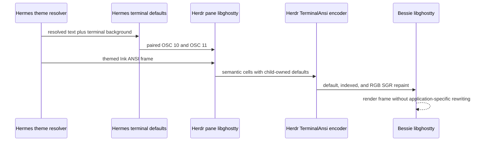
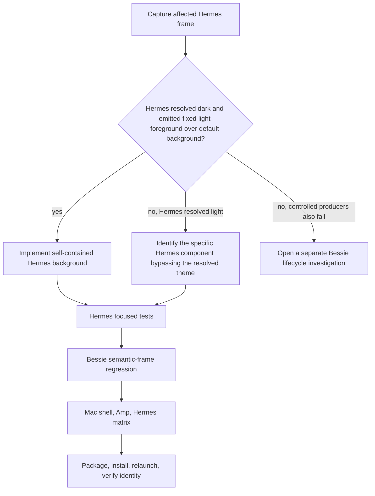

# Hermes Terminal Theme Pairing - Plan

## Goal Capsule

- **Objective:** Make every Hermes TUI theme a self-contained terminal surface that paints a coherent default foreground/background pair, then prove that Bessie renders shell, Amp, and Hermes panes legibly across light, dark, and System themes without rewriting application ANSI colors.
- **Target repositories:** Hermes Agent owns the TUI behavior change under `ui-tui/`; this Bessie repository owns the cross-application regression matrix, Mac packaging, installed-app acceptance, and this plan artifact.
- **Authority:** The session-settled decisions and this plan govern fix ownership; each repository's `AGENTS.md` and existing test conventions govern implementation; Bessie's Herdr/libghostty ownership constraints remain non-negotiable.
- **Execution profile:** Characterize the affected live frame first, implement the narrow Hermes pairing fix, add Bessie regression proof, then run both repositories' focused and required verification. Keep unrelated dirty work untouched in both repositories.
- **Stop conditions:** Stop the default-theme pairing branch and isolate the Hermes producer if the affected pane already resolves a light palette. Stop and report instead of broadening into Bessie or Herdr if the producer cannot be identified, the unreadable cells do not combine a fixed light foreground with a default light background, or paired OSC 10/11 defaults do not survive Herdr's public `TerminalAnsi` repaint as expected.
- **Tail ownership:** The executor owns Hermes checks, Bessie checks, Mac screenshots, live Herdr terminal evidence, packaging, installation at `/Applications/Bessie.app`, packaged-versus-installed executable identity, relaunch verification, and `docs/reports/goal-progress.md`. Commit, push, PR, publication, and changes to Herdr require separate approval.

---

## Product Contract

### Summary

Hermes owns a complete terminal color surface. Its built-in dark and light themes, plus gateway skins, set matching default foreground and background colors rather than emitting explicit themed foregrounds over a host-owned background. Bessie continues to apply its terminal palette normally and preserves application-authored ANSI semantics; it does not identify Hermes output, rewrite escape sequences, force a per-agent dark fallback, or extend Herdr's protocol.

### Problem Frame

Bessie Light defines a dark default terminal foreground on a near-white background, and the base shell and Amp TUI remain readable. The unreadable surface is isolated to Hermes. Hermes themes use explicit color values throughout the Ink render tree and resolve light/dark polarity by querying the source-side terminal with OSC 10/11. The built-in theme path can select dark foreground colors while leaving the terminal background host-owned because `paintTerminalDefaults` currently paints defaults only when a gateway skin explicitly supplies `background`.

Herdr parses the child PTY into a source libghostty grid and sends Bessie a semantic ANSI repaint. Default, indexed, and explicit RGB cell colors remain distinct. An explicit near-white Hermes foreground therefore survives into Bessie's receiving libghostty, while a default background resolves through Bessie Light's near-white terminal background. That two-stage composition plausibly explains the Hermes-only light-on-white result, but the exact affected frame still needs characterization before implementation.

### Requirements

**Hermes theme ownership**

- R1. Every resolved Hermes TUI theme carries an explicit terminal background in addition to its existing foreground and semantic tones.
- R2. Built-in dark and light themes paint paired OSC 10 foreground and OSC 11 background defaults whenever the TUI is attached to a TTY.
- R3. Gateway skins preserve an authored background when present; a skin without one falls back to the resolved built-in terminal background rather than leaving the host background unowned.
- R4. Startup, skin changes, and `/theme auto|light|dark` apply the foreground/background pair together and force one coherent redraw when polarity changes.
- R5. Hermes restores both host defaults through OSC 110/111 on exit and emits no terminal-default OSC writes for non-TTY output.

**Bessie and Herdr boundaries**

- R6. Bessie must not rewrite ANSI, strip true color, remap Hermes-specific colors, detect Hermes for a forced dark palette, or add a per-agent terminal-theme policy.
- R7. Herdr protocol, source, and runtime behavior remain unchanged. No receiver-theme declaration or private Herdr surface is added.
- R8. Bessie's existing theme definitions and runtime theme transaction remain unchanged unless characterization finds a distinct Bessie lifecycle defect reproducible with controlled non-Hermes ANSI.
- R9. Default, indexed, child-overridden, and explicit RGB semantics remain intact across the Herdr `TerminalAnsi` frame and Bessie's receiving libghostty surface.

**Proof and release acceptance**

- R10. Characterization must compare the affected Hermes pane with a base shell and Amp pane in the same Bessie Light environment, separately record source-side Hermes theme/default evidence and downstream Herdr `TerminalAnsi` categories, and prove with a controlled producer whether paired OSC 10/11 defaults survive the repaint before behavior changes.
- R11. Focused tests cover built-in dark, built-in light, authored-skin background, skin fallback, theme transitions, restoration, and non-TTY behavior in Hermes.
- R12. Bessie regression coverage proves that host-default cells follow Bessie's palette while an explicit application-owned RGB foreground/background pair survives the Herdr frame and Bessie theme changes unchanged. Existing indexed-color, reset, reverse-video, and sequencing coverage remains green without unrelated expansion.
- R13. Additive live Mac verification covers representative base-shell, Amp TUI, and Hermes TUI output under Bessie Dark, Bessie Light, and System in both macOS appearances, plus Hermes theme switching with existing content and observable input/output. Existing reconnect, takeover, and frame-sequencing checks continue to run unchanged but are not expanded for this fix unless characterization reveals a defect in those paths.
- R14. Required Bessie verification, packaging, installation, executable identity, relaunch, screenshot inspection, and live-terminal assertions pass without weakening existing checks.

### Key Flows

- F1. Resolve and paint a Hermes theme
  - **Trigger:** Hermes starts, receives a skin, or applies `/theme auto|light|dark`.
  - **Steps:** Resolve one theme including its terminal background; write matching OSC 11 and OSC 10 defaults; render the themed Ink tree; force a full redraw only when the resolved theme changes.
  - **Outcome:** Explicit and default Hermes text always appears over the background for which the palette was designed.
  - **Covered by:** R1-R5.

- F2. Render Hermes through Bessie
  - **Trigger:** Herdr sends a Hermes pane repaint to Bessie's `HerdrTerminalController`.
  - **Steps:** Herdr preserves semantic color categories and materializes child-owned defaults where required; Bessie feeds the frame unchanged into its in-memory Ghostty surface.
  - **Outcome:** A self-contained Hermes dark theme remains coherently dark inside light Bessie chrome, while shell and Amp default/indexed output continue following Bessie's terminal palette.
  - **Covered by:** R6-R9.

- F3. Validate the installed app
  - **Trigger:** Hermes and Bessie focused checks are green.
  - **Steps:** Run Bessie's full Mac verifier, inspect the three-application theme matrix, package and install Bessie, confirm executable identity, relaunch, and repeat the Hermes light-mode check.
  - **Outcome:** The fix is proven in the actual Herdr/libghostty/Bessie pipeline, not only in unit tests.
  - **Covered by:** R10-R14.

### Acceptance Examples

- AE1. Given Bessie Light and a Hermes session that resolves its dark theme, when Hermes renders normal prose, muted text, prompt text, and status UI, then the pane uses Hermes's dark terminal background and readable paired foregrounds rather than Bessie Light's default background.
- AE2. Given a Hermes session that resolves its light theme, when it renders through Herdr into Bessie Light, then the pane uses the light theme's explicit background and dark readable foregrounds.
- AE3. Given a gateway skin with an authored background, when it becomes active, then OSC 11 uses that background and OSC 10 uses the resolved skin text color. Given a skin without a background, the resolved built-in background is used.
- AE4. Given a running Hermes TUI, when `/theme dark`, `/theme light`, and `/theme auto` are applied in sequence, then each transition repaints one coherent foreground/background pair with no mixed-polarity stale cells.
- AE5. Given the same Bessie Light workspace contains shell, Amp, and Hermes panes, when the Bessie theme changes without restarting those panes, then shell and Amp remain readable through normal default/indexed semantics and Hermes remains readable through its self-contained pair.
- AE6. Given Hermes exits normally, when the shell prompt resumes, then both terminal defaults are restored and the shell remains readable.

### Success Criteria

- The affected frame is classified before implementation and matches the expected fixed-foreground/default-background failure signature.
- All resolved Hermes themes own a paired default foreground/background on TTY output and restore both on exit.
- Bessie makes no production ANSI-rewriting, Hermes-detection, forced-dark, or Herdr-protocol change.
- Hermes checks and Bessie's required VPS/Mac/package/install checks pass.
- Screenshots and live pane reads demonstrate readable shell, Amp, and Hermes output under every required appearance.

### Scope Boundaries

**In scope:** Hermes theme background modeling; paired OSC 10/11 application for built-in themes and skins; theme-transition redraw behavior; Hermes unit tests; Bessie semantic-frame regression tests; Mac shell/Amp/Hermes capture matrix; required packaging and installed-app acceptance.

**Deferred to follow-up work:** broader terminal-theme interoperability documentation if other TUIs exhibit the same incomplete color contract; reusable frame-capture diagnostics if the implementation shows the current verifier cannot classify SGR without substantial new infrastructure.

**Out of scope:** Bessie ANSI rewriting; Hermes-specific Bessie fallback themes; independent app/terminal selectors; Herdr protocol changes; libghostty or Herdr upstream modifications; automatic synchronization of Bessie's selected palette into arbitrary child processes; changing Bessie's curated palette values; requiring every ANSI color to meet 4.5:1 against the default background.

---

## Planning Contract

### Key Technical Decisions

- KTD1. Hermes themes are self-contained terminal surfaces. (session-settled: user-directed — chosen over making Hermes follow Bessie's selected terminal theme: Hermes should own a coherent surface across all hosts.)
- KTD2. Built-in Hermes themes always paint a background paired with their foreground. (session-settled: user-directed — chosen over retaining host-owned backgrounds for built-in themes: explicit themed foregrounds are unreadable when the downstream host has the opposite polarity.)
- KTD3. Bessie does not rewrite ANSI or add a Hermes-specific dark fallback. (session-settled: user-directed — chosen over receiver-side compatibility rewriting: rewriting would be application-specific and could corrupt semantic colors, selections, reverse video, and other TUIs.)
- KTD4. Herdr receives no receiver-theme protocol extension. (session-settled: user-directed — chosen over synchronizing Bessie's palette through Herdr: a self-contained Hermes theme fixes the reported ownership mismatch without widening the runtime contract.)
- KTD5. If the affected Hermes pane already resolved a light palette, stop the default-theme pairing branch and isolate the component that emitted incompatible colors. (session-settled: user-approved — chosen over changing Bessie globally on an unverified diagnosis: the Hermes-specific producer must be identified first.)
- KTD6. Add an explicit terminal-background value to the resolved Hermes `Theme`, sourced from `ThemeSeeds.bg` for built-ins and the authored skin background when present. Do not derive the terminal default from completion/status surfaces, which may have different roles.
- KTD7. `paintTerminalDefaults` owns the pair. A paired operation in `terminalModes.ts` validates both colors first, emits OSC 10 and OSC 11 in one `stream.write`, and updates both tracked ownership states together. It uses the resolved theme background and `themeToneHex(theme.color.text)` so true-color and limited-palette paths both produce concrete OSC-compatible values.
- KTD8. Preserve the existing terminal-default slot lifecycle in `terminalModes.ts`: TTY-gated writes, tracked ownership, and conditional OSC 110/111 restoration. Do not bypass that helper with direct writes.
- KTD9. Bessie tests classify semantic color behavior instead of globally enforcing contrast for all ANSI slots. Default text should follow the Bessie palette, indexed colors should remain indexed unless child-overridden, explicit RGB should remain explicit, and application-owned foreground/background pairs should stay paired.
- KTD10. The live Mac matrix is the release gate because the defect crosses Hermes Ink, PTY/libghostty, Herdr's semantic repaint, Bessie's in-memory terminal session, and a second libghostty renderer.

### High-Level Technical Design

### System-Wide Impact

- **Hermes users:** Built-in themes now paint terminal defaults just as authored-background skins already do. Normal exit must restore the host to avoid leaking Hermes colors into the shell.
- **Bessie users:** Light chrome may contain a deliberately dark Hermes terminal when Hermes resolves dark. This is expected under the self-contained decision; the pane remains readable and honest.
- **Other terminals:** The Hermes change applies across terminal hosts, so tests must protect non-TTY output and host-default restoration rather than treating Bessie as a special case.
- **Herdr ownership:** Herdr continues to own pane state and semantic repainting. Bessie remains a presentation client and Hermes remains a child application.

### Risks and Mitigations

- **Incorrect diagnosis:** The current pane may already resolve light. Mitigation: U1 is a mandatory characterization gate and KTD5 defines the branch.
- **Source/repaint evidence conflation:** A downstream semantic repaint cannot by itself prove which escape semantics Hermes authored. Mitigation: label source-side and downstream observations separately and use a controlled OSC producer to verify the bridge behavior.
- **Host color leakage after exit:** Painting built-in defaults widens the path that owns OSC 10/11. Mitigation: test normal exit, repeated theme changes, invalid/unpaintable values, and non-TTY output through the existing tracked restore helper.
- **Skin behavior regression:** A missing skin background currently leaves the host untouched. Mitigation: make fallback behavior explicit and test both authored and absent backgrounds; preserve authored values exactly.
- **Mixed stale cells after theme change:** Existing renderer caches require a coherent redraw after palette changes. Mitigation: preserve `commitTheme`'s changed-theme full redraw and test visible content across multiple transitions.
- **False confidence from static palette tests:** Bessie unit tests alone cannot prove the two-emulator path. Mitigation: retain full live Herdr, screenshot, package, install, and relaunch verification.

### Sequencing

Execute U1 first as a hard gate. U2 owns the Hermes behavior and focused tests. U3 adds Bessie characterization/regression coverage without production theme changes. U4 runs cross-repository and installed-app acceptance and records actual results.

---

## Implementation Units

### U1. Characterize the live Hermes color contract

- **Goal:** Prove the exact foreground/background categories in the affected pane before changing behavior.
- **Requirements:** R8-R10. **Decisions:** KTD5, KTD9.
- **Dependencies:** None.
- **Files:**
  - Bessie: `scripts/mac-verify.sh` only if the existing isolated live-test setup needs a small reusable capture hook
  - Bessie: `Sources/BessieCore/TerminalProtocol.swift` as the decoder for captured public `terminal.frame` envelopes; production changes are not expected
  - Bessie: `docs/reports/goal-progress.md` for final evidence, not intermediate speculation
  - Hermes: `ui-tui/src/app/slash/commands/debug.ts` as the existing `/theme-info` diagnostic pattern; production changes are not expected
- **Approach:** In one isolated Bessie Light workspace, record Hermes `/theme-info` plus the resolved source theme tokens, then capture the public bridge output from `herdr terminal session control <pane-id> --cols 80 --rows 24` for representative prose. Decode each `terminal.frame` envelope through the same contract as `HerdrTerminalEnvelope.decode`; classify downstream foreground as default (`39`), indexed (`38;5` or named ANSI), or RGB (`38;2`) and background as default (`49`), indexed, or RGB. Do not infer source SGR authorship solely from this downstream frame. In a separate disposable pane, emit a known OSC 10/11 pair followed by default-colored text and prove whether the resulting bridge frame and Bessie surface retain the pair. Capture shell and Amp controls from the same environment. Keep diagnostics non-destructive, maintain one controller process per pane, and do not persist `/theme light` or alter user configuration.
- **Patterns to follow:** Existing live pane reads and deterministic ANSI injection in Bessie's `scripts/mac-verify.sh`; Hermes's `/theme-info` fields in `ui-tui/src/app/slash/commands/debug.ts`.
- **Test scenarios:**
  1. Affected Hermes prose shows the resolved theme, OSC 10/11 answers, and emitted SGR category needed to confirm or reject the proposed chain.
  2. Base shell default text in the same Bessie Light session resolves through Bessie's configured foreground/background and remains readable.
  3. Amp in the same session remains readable and provides a styled-TUI control.
  4. A controlled source that writes known OSC 10/11 values and default-colored text establishes whether Herdr's semantic repaint and Bessie's receiving surface preserve the pair.
  5. If Hermes reports light mode, stop the global pairing unit below and replace it with a unit scoped to the first identified Hermes component/color token that differs from the resolved theme.
- **Verification:** Evidence distinguishes confirmed wire behavior from inference. The executor can state which branch in the design flow applies without relying only on screenshots.

### U2. Pair every resolved Hermes foreground with its terminal background

- **Goal:** Make built-in and skinned Hermes themes own coherent terminal defaults across startup and live theme changes.
- **Requirements:** R1-R5, R11. **Decisions:** KTD1, KTD2, KTD5-KTD8.
- **Dependencies:** U1 confirms the expected Hermes ownership failure or identifies the narrower Hermes component to fix.
- **Files:**
  - Hermes: `ui-tui/src/theme.ts` — `Theme`, `ThemeColors`, `DARK_SEEDS`, `LIGHT_SEEDS`, `buildPalette`, `fromSkin`, and `defaultThemeForCurrentBackground`
  - Hermes: `ui-tui/src/app/createGatewayEventHandler.ts` — `paintTerminalDefaults`, `themesEqual`, `commitTheme`, `applySkin`, and `reapplyTheme`
  - Hermes: `ui-tui/src/lib/terminalModes.ts` — existing `defaultColorSlot`, `setTerminalForeground`, `setTerminalBackground`, and `resetTerminalModes`; proposed paired `setTerminalDefaults`
  - Hermes: `ui-tui/src/__tests__/theme.test.ts`
  - Hermes: `ui-tui/src/__tests__/createGatewayEventHandler.test.ts`
  - Hermes: `ui-tui/src/__tests__/terminalModes.test.ts`
- **Approach:** Extend the resolved theme model with its terminal background, preserving built-in `ThemeSeeds.bg` and authored skin backgrounds. Add the background to `themesEqual` so background-only changes trigger `commitTheme`'s existing full redraw while identical pairs remain a no-op. Make `paintTerminalDefaults` apply the resolved background and text foreground through one paired `terminalModes.ts` operation that validates both values before one stream write and tracks both defaults for restoration. Reuse `themeToneHex` for OSC-compatible foreground values. This unit runs only when U1 confirms the dark-theme/fixed-foreground/default-background failure. If Hermes already resolves light, replace U2 with a producer-specific unit and tests instead of applying this global theme-model change.
- **Execution note:** Start with characterization tests for the current built-in-theme behavior, then change the theme model and paired application together so no intermediate state paints only one side.
- **Patterns to follow:** `ThemeSeeds` and `buildPalette` as the source of built-in identity; `fromSkin` for authored overrides; existing paired skin test in `createGatewayEventHandler.test.ts`; `defaultColorSlot` for TTY gating and restoration.
- **Test scenarios:**
  1. Built-in dark resolves its authored dark background and writes matching OSC 11 plus readable text via OSC 10.
  2. Built-in light resolves its authored light background and writes matching OSC 11 plus readable dark text via OSC 10.
  3. A skin with an authored background keeps that exact background and pairs it with the resolved skin text color.
  4. A skin without an authored background falls back to the polarity-appropriate built-in background.
  5. `/theme dark`, `light`, then `auto` updates both defaults per transition and triggers coherent redraw behavior without stale mixed-polarity state.
  6. A background-only resolved-theme difference triggers a full redraw; an identical foreground/background pair performs no unnecessary redraw.
  7. A non-TTY stream receives no OSC 10/11 writes.
  8. Normal exit after built-in or skinned theme application restores both owned defaults exactly once; a session that painted nothing restores nothing.
  9. Limited-palette text represented as `ansi256(N)` resolves through `themeToneHex` to a valid OSC 10 color.
- **Verification:** Hermes's focused theme, event-handler, and terminal-mode tests pass; the full `ui-tui` check passes; no unrelated Hermes source or configuration changes are included.

### U3. Prove Bessie preserves semantic color categories and self-contained pairs

- **Goal:** Prove the one Bessie-side invariant relevant to the fix without adding application-specific production behavior.
- **Requirements:** R6-R9, R12. **Decisions:** KTD3, KTD4, KTD9.
- **Dependencies:** U2 defines the paired frame behavior to characterize.
- **Files:**
  - Bessie: `Tests/BessieAppModelTests/BessieThemeTests.swift` — existing concrete-theme/default-palette assertions and the focused explicit-pair theme-switch regression
  - Bessie: `Tests/BessieCoreTests/TerminalControllerTests.swift` — `HerdrTerminalEnvelope.decode` fixtures and frame application/sequencing tests
  - Bessie: `Sources/BessieApp/BessieThemes.swift` only if a test-visible projection is strictly necessary; no palette-value change is planned
  - Bessie: `Sources/BessieApp/TerminalPaneController.swift` only if tests expose a distinct generic lifecycle defect; no Hermes-specific branch is allowed
- **Approach:** Audit the existing theme and terminal-controller tests first, then add only missing coverage that feeds an application-authored foreground/background pair through the existing Herdr-frame and in-memory terminal seams and proves it survives Bessie theme switching unchanged. Do not recolor explicit RGB. Treat production Bessie edits as gated; any generic failure must be independently reproducible before changing Bessie.
- **Patterns to follow:** Existing `BessieThemeTests.testEveryConcreteThemeHasCompleteValidTerminalColorsAndAccessiblePrimaryContrast`, live controller identity tests, and `TerminalControllerTests` frame decoding/sequencing fixtures.
- **Test scenarios:**
  1. A default foreground/background fixture follows Bessie's active terminal palette, preserving the shell control behavior.
  2. An explicit application-owned RGB foreground/background pair remains unchanged across Bessie Dark-to-Light and System appearance changes.
  3. SGR `39`/`49` after the explicit pair returns subsequent cells to Bessie's active defaults.
  4. Existing indexed-color, reverse-video, controller-identity, reconnect, and frame-sequencing coverage remains green; add no new cases for those paths unless U1 exposes a separate generic defect.
- **Verification:** Focused Bessie core and app theme tests pass on the Mac. The diff contains no ANSI sanitizer, agent-name condition, Herdr protocol work, or curated-palette retuning.

### U4. Validate the live three-application matrix and installed Bessie app

- **Goal:** Demonstrate the fix through the complete Hermes → Herdr → Bessie → libghostty path and retain release evidence.
- **Requirements:** R10-R14. **Decisions:** KTD9, KTD10.
- **Dependencies:** U2 and U3.
- **Files:**
  - Bessie: `scripts/mac-verify.sh` — `capture_live_theme_matrix`, `read_pane_recent`, existing lifecycle/recovery gates, package/install checks, and the focused shell/Amp/Hermes acceptance scene
  - Bessie: `scripts/verify-design-snapshot.swift` only if an additive terminal contrast assertion belongs there
  - Bessie: `docs/reports/goal-progress.md`
- **Approach:** Run the existing lifecycle/recovery suite unchanged. Add a focused acceptance scene that deterministically renders representative normal, muted, prompt/input, status, selection, warning, and error states in Hermes, alongside shell and Amp control panes. Capture those panes under Bessie Dark, Bessie Light, and System in both macOS appearances, then switch Hermes themes with visible content. For each required capture, record the expected surface polarity, inspect the named regions for matched foreground/background behavior, and pair the screenshot path with a live pane-read or input/output assertion. Preserve package/install identity and relaunched installed-app rendering.
- **Patterns to follow:** Existing `capture_live_theme_matrix`, deterministic ANSI slot injection, live pane-read assertions, Bessie package/install flow, and executable hash/identity checks in `scripts/mac-verify.sh`.
- **Test scenarios:**
  1. Shell default text remains readable under each Bessie theme and both System appearances.
  2. Amp remains readable under the same matrix.
  3. Hermes dark renders a coherent dark surface inside Bessie Light; normal prose, muted text, input, status, selected row, code, warning, and error colors remain readable.
  4. Hermes light renders a coherent light surface with dark foregrounds.
  5. Switching Bessie while Hermes content remains visible does not create a mixed Hermes foreground/Bessie default background frame.
  6. Switching Hermes `/theme` while Bessie remains light repaints the foreground/background pair coherently.
  7. Existing reconnect, takeover, full-frame, and incremental-frame checks remain green without theme-specific expansion.
  8. The packaged and installed executables match; the relaunched installed app reproduces the passing Bessie Light Hermes check with a screenshot and pane-read assertion.
- **Verification:** Hermes's full TUI check, `./scripts/check.sh`, and `./scripts/mac-verify.sh` pass. Required captures are inspected, the installed executable matches the package, and `docs/reports/goal-progress.md` records actual commands and outcomes without claiming skipped checks.

---

## Verification Contract

| Gate | Repository | Applies to | Required outcome |
|---|---|---|---|
| Hermes focused tests | Hermes Agent | U2 | Theme, gateway-event, and terminal-mode suites prove paired built-in/skin defaults, transitions, TTY gating, and restoration. |
| `npm run check --prefix ui-tui` | Hermes Agent | U2 | Hermes Ink build, TypeScript check, tests, and lint pass without unrelated autofixes. |
| Focused Swift tests | Bessie | U3 | Theme and terminal-controller suites prove semantic category behavior and controller identity on the Mac. |
| `./scripts/check.sh` | Bessie | U3-U4 | Repository static, unit, and contract checks pass unchanged. |
| `./scripts/mac-verify.sh` | Bessie | U4 | Mac tests, live Herdr/libghostty checks, three-application theme matrix, packaging, signing, captures, and required lifecycle checks pass. |
| Installed-app acceptance | Bessie | U4 | `dist/Bessie.app` is installed at `/Applications/Bessie.app`, packaged and installed executables match, the app relaunches, and installed Hermes light-mode evidence is readable. |

Visual acceptance must inspect the rendered pixels rather than infer success from compilation or process exit. Live acceptance must pair screenshots with Herdr pane reads or equivalent observable input/output evidence.

---

## Definition of Done

- U1 records whether the affected Hermes cells use default, indexed, or explicit RGB foreground/background semantics and selects the correct implementation branch.
- U2 makes every resolved Hermes theme own a matched terminal foreground/background pair, with focused and full Hermes TUI checks green.
- U3 adds Bessie semantic color regression coverage without production ANSI rewriting, Hermes detection, Herdr protocol changes, or palette retuning.
- U4 proves shell, Amp, and Hermes under required light/dark/System appearances through live Herdr/libghostty, package, install, relaunch, and executable-identity gates.
- Normal Hermes exit restores host foreground and background defaults; non-TTY output remains free of terminal-default OSC writes.
- Bessie's existing controllers, sessions, focus, input ordering, ownership, reconnect, and theme transaction behavior remain intact.
- `docs/reports/goal-progress.md` contains the exact verification outcomes and evidence paths.
- No unrelated working-tree changes are modified, staged, discarded, or incorporated.
- No abandoned diagnostic hooks, temporary artifacts, dead branches, or failed implementation attempts remain in either repository.
- No commit, push, PR, publication, deployment, Herdr modification, or system-wide configuration change occurs without explicit approval.
