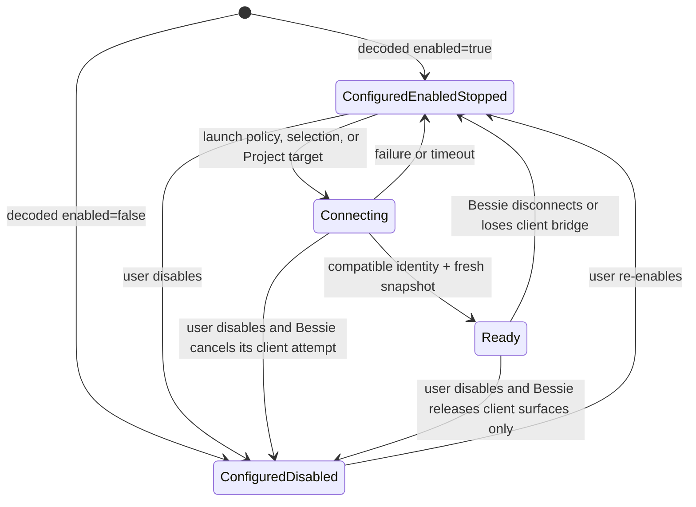
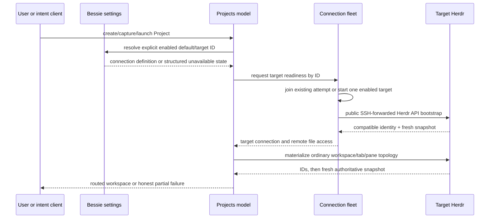
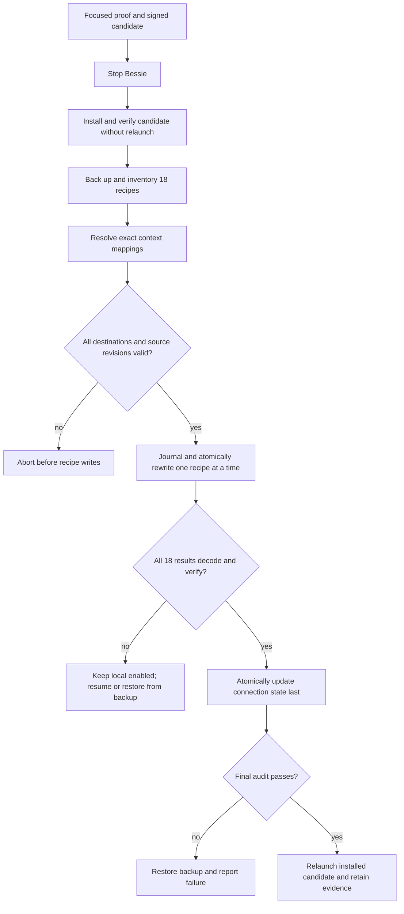

# First-Class Remote-Only Herds and Project Targets - Plan

## Goal Capsule

- **Objective:** Make remote-only Bessie a first-class configuration: a user can disable This Mac without losing its saved definition, use an enabled SSH herd as the default Project target, launch every existing or new Project against explicit target-host paths, and keep the menu-bar popover focused exclusively on pane/agent status rather than connection lifecycle.
- **Observed deployment:** Jordan's selected connection is `hermes-vps`; Hermes VPS starts at launch; This Mac does not. All 18 stored schema-v3 Projects currently target `local-bessie`. Seventeen use a workstream path below the shared Hermes root and Command Center uses the root itself. Every corresponding VPS directory was resolved through the context catalog and observed to exist.
- **Authority:** The session-settled remote-only decisions and this plan govern product behavior. Bessie's repository instructions and retained V1 contracts govern implementation. Herdr continues to own every live workspace, tab, pane, terminal, process, agent, and durable session fact.
- **Execution profile:** Implement configuration semantics first, thread enabled/default state through fleet and Project surfaces, add agent-context parity, then migrate Jordan's data transactionally. Use focused verification, package and install the app, and leave final live Project acceptance to Jordan.
- **Stop conditions:** Stop rather than guess if a stored folder lacks an exact catalog mapping, the mapped VPS directory is missing, a recipe has a concurrent revision, a disabled connection would be silently re-enabled, or disabling a Bessie connection would require stopping Herdr or killing pane processes.
- **Tail ownership:** The executor owns focused Swift tests, production packaging, code-sign verification, migration backup and manifest evidence, installation at `/Applications/Bessie.app`, packaged-versus-installed executable identity, relaunch verification, and `docs/reports/goal-progress.md`. No broad suite, screenshot pass, live Project mutation, commit, push, PR, publication, or Herdr upstream change is authorized.

---

## Product Contract

### Summary

Bessie distinguishes whether a herd is **configured**, whether it is **enabled for use**, and whether it should **start at app launch**. This Mac remains a canonical, re-enableable connection definition, but a disabled local herd does not enter the fleet, appear as a normal target, or start on demand. Remote-only users can select an SSH herd as their active and default Project herd, and all new Project recipes persist that explicit target. The menu-bar popover remains a separate pane/agent-status surface and renders no connection-health section for any herd state.

Jordan's 18 existing Projects are a deployment migration, not a generic product heuristic. Their exact Mac-to-VPS mappings are validated before any write, the entire catalog and connection state are backed up, and an idempotent per-recipe journal makes interruption resumable or restorable. The compatible app is installed first, and This Mac is disabled only after all 18 remote recipes verify. Bessie never learns a universal rule that rewrites arbitrary local paths into remote paths.

### Problem Frame

`BessieConnectionDefinition` currently models `connectAtLaunch` but not enabled/disabled state. `connectAtLaunch = false` means on-demand, not unavailable: selection and Project launch can still start the connection. `BessieConnectionState` always injects canonical `local-bessie`, defaults invalid selection to it, and startup falls back to the selected herd when no launch-enabled herd exists. `BessieSettingsModel` cannot disable local, and removal of a selected remote falls back to local.

Projects now carry an explicit `targetConnectionID`, but creation and capture still fall back to `local-bessie` when no active target is available. The editor lists every configured connection without an enabled-state distinction. Launch correctly routes by explicit target and validates paths in that host's namespace, so the missing layer is configuration policy—not Herdr topology ownership or transport.

Jordan's current persisted state proves the mismatch: `hermes-vps` is selected and starts at launch, while all 18 Projects target `local-bessie` and carry Mac paths. All 18 map exactly to observed VPS directories, so this deployment can be corrected without inference once Bessie supports remote-only state.

### Requirements

**Connection semantics**

- R1. Every connection definition persists an enabled flag independent of `connectAtLaunch`; old files without the flag decode as enabled.
- R2. The canonical This Mac definition remains stored and can be re-enabled, but it may be disabled like an SSH connection.
- R3. Disabled connections are excluded from fleet startup, on-demand activation, health/issues, topology, status surfaces, command-palette targets, and new Project target choices. Settings still lists them with an explicit disabled state and re-enable action.
- R4. `connectAtLaunch` remains startup policy for enabled herds only. Disabling a herd does not mutate its launch preference; re-enabling restores the prior preference.
- R5. Bessie always has at least one enabled selected herd. Disabling or removing the selected/default herd deterministically chooses another enabled herd; an operation that would leave no enabled selected herd is rejected without changing memory, disk, or fleet state.
- R6. Disabling or quitting Bessie may tear down Bessie-owned observers, tunnels, and terminal controllers, but must never stop Herdr, close Herdr objects, or kill pane processes.

**Project defaults and routing**

- R7. Connection state persists a default Project herd independently from transient runtime focus. It must always reference an enabled configured connection, normally the selected herd unless the user explicitly chooses another enabled default.
- R8. New and captured Projects use the default Project herd, falling back only to the selected enabled herd. They never hard-code `local-bessie`.
- R9. Every stored Project continues to own an explicit `targetConnectionID`, and every folder path is interpreted exclusively in that target host's filesystem namespace.
- R10. The Project editor offers enabled target herds. A Project that currently references a disabled or missing herd remains editable with a factual warning; Bessie must not silently retarget or rewrite its paths.
- R11. Launch refuses a disabled target before starting a connection or mutating Herdr. An enabled stopped target follows the existing bounded on-demand connection and compatibility flow.

**Remote-only product behavior**

- R12. Startup, onboarding, Settings, herd/workspace pickers, command palette, Projects, notifications, and fleet restoration work when This Mac is disabled and an SSH herd is the only enabled connection.
- R13. Settings, persistence normalization, onboarding completion, disable, and remove operations enforce the invariant that at least one configured herd is enabled and selected. Attempts to disable or remove the final enabled herd produce a factual error and no state change.
- R14. Bundled Herdr remains included and available, but inclusion does not imply that a local session must be enabled or running.

**Agent/context parity**

- R15. Bessie's discoverable intent surface exposes read-only configured connection context—ID, label, kind, enabled state, selected/default Project status, and live state—without requiring a live herd.
- R16. Configuration and Project retarget mutations remain human-operated through Settings and the Project editor in this slice. Adding CLI/MCP mutation contracts is a separate parity project rather than a dependency of remote-only launch.
- R17. Agent reads remain explicit-ID operations. No intent infers a path mapping, chooses a different herd because one is unavailable, or mutates Herdr-owned live topology as part of configuration.

**Jordan deployment migration**

- R18. Before changing live data, stop Bessie and create a timestamped restorable backup of connection state and the complete Project catalog plus a manifest of source hashes and proposed changes.
- R19. Revalidate all 18 mappings immediately before write. Seventeen workstream Projects map from the Mac workstream root to the VPS workstream root; Command Center maps the shared Hermes root to the VPS shared root. Every destination must exist as a directory.
- R20. Idempotently rewrite all 18 recipes to `hermes-vps` with validated VPS folder paths, preserving IDs/topology/labels/commands/timestamps except for required update metadata. Journal each source hash, intended result hash, and completion state; atomically replace one recipe at a time. Only after all 18 decode and verify may connection state set `hermes-vps` selected/default and disable This Mac.
- R21. If validation, write, interruption, or postflight fails, leave unstarted recipe files untouched, retain completed atomic rewrites plus the journal, and either resume from verified hashes or restore the complete backup. Never corrupt an individual recipe, and never disable local while any recipe still targets it.

**Verification and handoff**

- R22. Focused tests cover persistence, normalization, remote-only startup, disabled routing, Project defaults, intent parity, migration safety, and the existing remote launch/materialization path.
- R23. Package, sign, install, relaunch, and prove that packaged and installed Bessie executables are byte-identical. Jordan performs the final live Project launches.

**Pane-status menu bar**

- R24. The menu-bar popover is a pane/agent-status surface only. It never renders connection lifecycle or health rows for enabled, disabled, stopped, disconnected, failed, or intentionally unstarted herds; pane counts and rows derive only from fresh connected projections.

### Key Flows

- F1. Disable This Mac
  - **Trigger:** The user disables the canonical local connection.
  - **Steps:** Persist disabled state; retain local runtime and launch preferences; if local is selected/default, choose the deterministic enabled fallback; remove local from fleet configuration and release Bessie-owned client surfaces without stopping Herdr.
  - **Outcome:** Bessie operates through the remote herd only, while This Mac remains available in Settings for re-enabling.
  - **Covered by:** R1-R6, R12-R14.

- F2. Create and launch a remote Project
  - **Trigger:** The user creates/captures a Project, or launches one from the command palette.
  - **Steps:** Persist the enabled default herd's explicit ID; interpret paths in that host namespace; validate through remote file access; connect the configured target on demand if needed; materialize ordinary Herdr topology; verify it from a fresh target snapshot.
  - **Outcome:** No local Herdr dependency or path interpretation enters the launch.
  - **Covered by:** R7-R14.

- F3. Repair a Project with a disabled target
  - **Trigger:** A recipe references a connection that is disabled or no longer configured.
  - **Steps:** Keep the target visible as unavailable and show why launch is blocked. The user may re-enable the existing configured target without changing the recipe, or explicitly choose another enabled target and supply valid target-host paths. Validate before save and launch.
  - **Outcome:** The recipe is never silently rerouted and the user has a clear recovery path.
  - **Covered by:** R9-R11.

- F4. Migrate Jordan's Project catalog
  - **Trigger:** Focused release-configuration store/codec tests decode a staged migrated fixture, the exact compatible candidate is installed but stopped, and preflight inventory is clean.
  - **Steps:** Install the compatible candidate without relaunching; back up and hash configuration/catalog data; resolve every path through the explicit context map; verify canonical VPS directories; atomically apply and journal each recipe rewrite; update connection state last; decode and audit the resulting catalog; relaunch Bessie.
  - **Outcome:** All Projects target Hermes VPS and This Mac is disabled, with a complete rollback artifact.
  - **Covered by:** R18-R23.

### Acceptance Examples

- AE1. Given This Mac is disabled and Hermes VPS is enabled, selected, and start-at-launch, when Bessie opens, then no local connection model starts, Hermes VPS becomes active, and only remote topology appears in normal herd and command-palette surfaces.
- AE2. Given This Mac is disabled but retains its previous start-at-launch preference, when it is re-enabled, then its saved preference is restored and it behaves as an ordinary enabled connection without reconstructing its definition.
- AE3. Given Hermes VPS is the only enabled selected herd, when the user attempts to disable or remove it, then Bessie rejects the operation, preserves the enabled selection/default and persisted files, and starts or stops no additional runtime or SSH bridge.
- AE4. Given Hermes VPS is the default Project herd, when a Project is created or captured while another surface has no active connection, then the recipe persists `hermes-vps` rather than `local-bessie`.
- AE5. Given a Project targets a disabled local herd, when the user opens its editor, then the disabled target is preserved and labeled unavailable; launch becomes available if the existing target is re-enabled, or after the user explicitly chooses another enabled target and valid target-host paths.
- AE6. Given a stopped but enabled Hermes VPS target, when the user launches a Project from the palette, then Bessie joins or starts exactly one connection attempt and continues materialization after compatibility and snapshot readiness.
- AE7. Given the preflight inventory of Jordan's 18 Projects, when deployment migration runs, then all 18 target `hermes-vps`, all folders use observed VPS directories, every recipe retains identity and topology, and a manifest proves source-to-result changes.
- AE8. Given any destination mapping is missing, a Project changed, or execution is interrupted, when migration resumes or rolls back, then completed entries are verified by journaled hashes, untouched entries retain source hashes, This Mac remains enabled until all 18 complete, and no individual recipe is corrupt.
- AE9. Given an agent lists Bessie connections, then configured disabled connections and live enabled connections are distinguishable without exposing credentials. No new configuration mutation intent appears in this slice.
- AE10. Given any stopped, failed, disconnected, or intentionally unstarted connection, when the menu-bar popover opens, then no connection-health section or row appears; fresh pane/agent status remains unchanged.

### Success Criteria

- This Mac can be disabled without deletion and without stopping Herdr-owned work.
- Remote-only fleet state is stable across relaunch, with Hermes VPS remaining the enabled selected herd.
- New Projects use an explicit enabled default herd; existing recipes never silently change targets.
- Jordan's 18 Projects and connection defaults are migrated recoverably to Hermes VPS with validated canonical paths, a durable journal, and rollback evidence.
- Focused tests pass, the latest signed package is installed and relaunched, and packaged/installed executable hashes match.

### Scope Boundaries

**In scope:** persisted connection enablement; the invariant that at least one herd is enabled and selected; selected/default normalization; remote-only fleet/UI behavior; explicit Project target defaults; disabled-target recovery; removal of connection health from the pane-status menu-bar popover (BES-43); discoverable read-only connection context; recoverable migration of Jordan's 18 recipes and connection settings; focused tests; packaging and Mac installation.

**Deferred to follow-up work:** a general user-facing bulk path-mapping/import wizard; automatic host path discovery; fleet-wide connection policy profiles; syncing one recipe across different host-specific roots; configuration and Project mutation intents, including complete Project CRUD parity.

**Out of scope:** deleting the canonical local definition; removing the bundled Herdr resource; changing Herdr or libghostty; stopping Herdr when a connection is disabled; guessing arbitrary Mac-to-VPS mappings; silently retargeting recipes; persisting live Herdr IDs as Project truth; broad test suites, screenshot QA, or automatic live Project mutation during implementation.

---

## Planning Contract

### Key Technical Decisions

- KTD1. Enabled state is separate from `connectAtLaunch`. (session-settled: user-directed — chosen over treating Start at launch as disablement: on-demand targets must remain possible while disabled targets must be impossible to start.)
- KTD2. This Mac remains canonical but may be disabled. (session-settled: user-directed — chosen over forcing or deleting local Herdr: remote-only is common, while the bundled local option should remain reversible.)
- KTD3. Bessie supports remote-only operation but never a zero-enabled state: at least one herd is enabled and selected at all times. (session-settled: user-directed — chosen over a connection-free mode: local is optional, but an operational Bessie configuration always has an eligible selected herd.)
- KTD4. New Projects use a persisted default enabled herd, not transient focus and never a hard-coded local ID. (session-settled: user-directed — chosen over active-pane-only defaults: Jordan expects every new Project to target Hermes VPS consistently.)
- KTD5. Project targets and paths stay explicit and target-host scoped. (session-settled: user-directed — chosen over automatic cross-host path translation: recipes must be deterministic and portable only where configured.)
- KTD6. Jordan's 18-recipe rewrite is an operator migration backed by explicit context evidence, not generic application inference. (session-settled: user-approved — chosen over teaching Bessie a personal Mac-to-VPS prefix rule: all 18 mappings are currently provable, but arbitrary users' mappings are not.)
- KTD7. Disabling a connection tears down only Bessie-owned client resources. (session-settled: user-directed — chosen over stopping the runtime: Herdr owns live work and must survive Bessie configuration changes.)
- KTD8. Disabled targets remain visible in Settings and affected Project editors but disappear from normal runtime surfaces and new-target choices. This preserves recovery without status noise.
- KTD9. Connection persistence remains backward compatible by defaulting absent enabled fields to true. Selected/default Project herd is normalized against configured enabled connections, and mutations that would remove the final enabled selection fail without persistence or fleet changes.
- KTD10. Agent parity in this slice is read-only context through Bessie's existing discoverable intent registry. Mutating configuration/Project intents are deferred so they do not enlarge the critical path; no second catalog or private protocol is introduced.
- KTD11. Deployment is idempotent and resumable rather than pretending 19 independent JSON resources can be crash-atomic. A checked-in, manifest-driven migration executable owns preflight/apply/resume/rollback/audit and its versioned journal; every mapping and source revision is verified before its atomic file write; connection state changes last; a metadata-preserving complete backup remains available for full rollback.
- KTD12. Amp implements the approved plan in the existing serialized Implementation pane, then installs the latest app for Jordan's hands-on test. (session-settled: user-directed — chosen over broad autonomous QA: focused proof plus direct user feedback is the preferred iteration loop.)
- KTD13. The menu-bar popover shows pane/agent status only, never connection lifecycle or health. (session-settled: user-directed via BES-43 — chosen over relabeling stopped connections: connection management belongs in the main app and Settings.)

### High-Level Technical Design

### System-Wide Impact

- **Remote-only users:** Bessie no longer assumes bundled local Herdr is active. SSH can be the only enabled connection and default Project target.
- **Mixed local/remote users:** Existing behavior remains available. Enabled and Start at launch become separate, comprehensible controls, and each Project still chooses an explicit target.
- **Existing configuration:** Missing enabled fields preserve current behavior. Selected/default IDs must normalize without erasing disabled definitions or silently changing recipes.
- **Fleet and terminal lifecycle:** Removing a disabled connection from the fleet releases Bessie-owned models/controllers and stale routing, while Herdr and pane processes continue independently.
- **Projects:** Catalog schema v3 is sufficient for explicit targets; the product change does not require encoding personal path mappings into a new schema version.
- **Agents and integrations:** The intent catalog gains factual read-only connection context; configuration and Project mutation contracts remain deferred.
- **Operations:** Jordan's data migration is a deliberate deployment step with backup, preflight, idempotent per-recipe writes, connection-state-last ordering, resumability, and postflight evidence.

### Risks and Mitigations

- **Disabled versus dormant confusion:** Users may conflate Enabled with Start at launch. Mitigation: distinct labels/help text, disabled styling, and tests proving launch preference survives disable/re-enable.
- **Silent local resurrection:** Existing fallback code injects/selects local in several seams. Mitigation: centralize normalized enabled/default projections and audit creation, capture, fleet startup, picker, command palette, onboarding, and removal paths.
- **Accidental Herdr termination:** Fleet cleanup may be mistaken for runtime shutdown. Mitigation: use existing client/model release semantics only and test that no Herdr stop or topology close action is emitted.
- **Project stranding:** Disabling a herd can leave recipes targeting it. Mitigation: preserve recipes, show disabled-target warnings, block launch before mutation, and require explicit repair.
- **Migration drift:** A Project may change between preflight and its write. Mitigation: hash/revision manifest, recheck each source immediately before atomic replacement, stop with local still enabled on mismatch, and resume from verified journal state or restore the complete backup.
- **Path-map overreach:** Prefix substitution could rewrite an unrelated folder. Mitigation: accept only exact catalog roots and observed descendant boundaries; verify every destination directory remotely.
- **Final-herd disablement:** A disable/remove path could violate the selected-herd invariant. Mitigation: centralize validation before persistence or fleet publication and test that the rejected mutation leaves memory, disk, selection/default, and runtime configuration unchanged.
- **Intent scope creep:** Adding mutation contracts could delay the direct remote-only outcome. Mitigation: expose factual read-only connection context now and defer configuration/Project mutation parity.
- **Dirty checkout overlap:** BES-41, command-palette, terminal-theme, and BES-42 edits coexist. Mitigation: preserve the current checkout, inspect the live diff before every edit cluster, and avoid reset/stash/cleanup/commit.

### Sequencing

U1 establishes the durable state and normalization invariants. U2 consumes those invariants in runtime and UI. U3 applies them to Projects and launch behavior. U4 adds read-only context parity over the same seams. U5 builds, verifies, and installs the exact compatible candidate while leaving Bessie stopped. U6 then performs the recoverable data transition. U7 relaunches only after migration postflight and records final evidence.

---

## Implementation Units

### U1. Model enabled herds and a default Project target

- **Goal:** Add backward-compatible connection availability and default-target semantics without deleting canonical local configuration.
- **Requirements:** R1-R5, R7, R13-R14. **Decisions:** KTD1-KTD4, KTD8-KTD9.
- **Dependencies:** None.
- **Files:**
  - `Sources/BessieCore/BessieConnections.swift`
  - `Tests/BessieCoreTests/BessieConnectionTests.swift`
  - `Sources/BessieApp/BessieSettings.swift`
  - `Tests/BessieAppModelTests/SettingsAndNotificationsTests.swift`
- **Approach:** Extend connection definitions with enabled state that decodes absent values as true. Extend connection state with a default Project connection ID and central normalization for configured, enabled, selected, and default targets. Preserve canonical local definition and its preferences even when disabled. Enforce at least one enabled selected herd; disabling/removing the final enabled herd is a validation error, while disabling a selected/default herd with another enabled option repairs both roles deterministically. Replace the current publish-then-`try?` persistence path for connection mutations with a candidate-state transaction: validate/normalize, persist atomically through `BessieConnectionStore`, then publish/reconcile runtime state only after success. On validation or write failure retain the prior in-memory and on-disk state, present a structured Settings error, and emit no fleet change.
- **Execution note:** Add characterization coverage for today's decode and canonical-local behavior before changing normalization.
- **Patterns to follow:** Custom Codable defaults and atomic persistence in `BessieConnections.swift`; Settings mutation/persistence paths in `BessieSettingsModel`; unsupported-newer persistence honesty from presentation tests.
- **Test scenarios:**
  1. A hand-written old connection file without enabled/default fields decodes every connection enabled and preserves current selected/startup behavior.
  2. Canonical local decodes disabled, remains first and canonical, and round-trips its launch preference unchanged.
  3. Disabling the selected/default local herd selects the enabled Hermes VPS for both roles.
  4. Disabling a non-selected herd does not alter selected/default IDs.
  5. Disabling or removing the final enabled herd is rejected and leaves enabled, selected, default, persisted, and fleet state unchanged.
  6. Re-enabling local restores its retained `connectAtLaunch` value but does not automatically make it selected/default when another enabled choice exists.
  7. Removing a selected/default SSH herd chooses a deterministic enabled fallback and preserves unrelated definitions.
  8. Duplicate IDs and a malformed fake local definition still normalize safely without discarding the canonical local enabled flag.
  9. A simulated connection-store permission/write failure leaves enabled, selected, and default values unchanged in memory and on disk, surfaces a factual error, and emits no fleet reconfiguration.
- **Verification:** Connection and Settings focused tests prove backward decode, round-trip, deterministic repair, and final-enabled-herd rejection without touching runtime code.

### U2. Thread enabled state through fleet, onboarding, and visible surfaces

- **Goal:** Make runtime behavior and presentation honestly exclude disabled herds while preserving Settings recovery.
- **Requirements:** R2-R6, R12-R14, R24. **Decisions:** KTD1-KTD3, KTD7-KTD9, KTD13.
- **Dependencies:** U1.
- **Files:**
  - `Sources/BessieApp/BessieApp.swift`
  - `Sources/BessieApp/BessieSettings.swift`
  - `Sources/BessieApp/HerdPicker.swift`
  - `Sources/BessieApp/OnboardingView.swift`
  - `Sources/BessieApp/OnboardingCompletionCoordinator.swift`
  - `Sources/BessieApp/ProductSurfaces.swift`
  - `Sources/BessieApp/BessieMenuBarPopover.swift`
  - `Sources/BessieApp/BessieMenuBarController.swift`
  - `Sources/BessieCore/HerdList.swift`
  - `Tests/BessieAppModelTests/SurfaceProjectionTests.swift`
  - `Tests/BessieAppModelTests/PickerPresentationTests.swift`
  - `Tests/BessieAppModelTests/OnboardingCompletionCoordinatorTests.swift`
  - `Tests/BessieAppModelTests/MenuBarPresentationTests.swift`
  - `README.md`
- **Approach:** Feed only enabled definitions into `ConnectionFleetViewModel`; when a connection becomes disabled, cancel/join no new work, stop Bessie-owned model/bridge/controller observation, clear stale active/scope/routing hints, and leave Herdr untouched. Remove the current startup fallback that starts a selected herd merely because no connection has Start at launch. Settings shows all definitions with separate Enabled and Start at launch controls; disabled rows stay recoverable but cannot be activated. Start at launch is visibly unavailable while a herd is disabled, retains its saved value, and explains that it applies again when re-enabled. Turning Enabled off always presents one concise confirmation: Bessie stops using the herd; Projects targeting it cannot launch until it is re-enabled or explicitly retargeted; active/default selection may move; and Herdr plus pane processes keep running. If it is the final enabled herd, reject before confirmation or fleet mutation and explain that another herd must first be enabled or added. Do not query the Project catalog for counts and do not offer a "don't ask again" bypass. Normal herd, picker, command-palette, notification, and health projections derive from enabled fleet configuration only. Separately, remove connection definitions/health from `BessieMenuBarPresentation` and delete the popover's entire connection-status section; do not leave an empty divider/spacer or replace it with quieter lifecycle wording. The menu-bar model continues to derive pane/agent rows and counts only from fresh connected projections. Onboarding must permit SSH-first and no-local completion rather than requiring the canonical local runtime, while completion still requires one enabled selected herd. All new toggles, warnings, and recovery actions need keyboard operation, VoiceOver labels/values, and announced state changes.
- **Patterns to follow:** `ConnectionFleetViewModel.applyConfiguration` for Bessie-owned cleanup; connection-qualified topology projections; existing remote onboarding bootstrap; Settings row controls and accessibility labels.
- **Test scenarios:**
  1. With local disabled and remote enabled/start-at-launch, fleet starts only remote and reports no local health, issue, topology, picker, or command-palette row.
  2. With local disabled and remote enabled/on-demand, startup starts no herd; selecting remote starts exactly one connection.
  3. Disabling a ready local connection releases Bessie client state and terminal controllers without emitting Herdr stop, workspace close, or pane close actions.
  4. Disabling a connecting herd cancels or retires Bessie's attempt and prevents late readiness from restoring it.
  5. Attempting to disable the final enabled herd shows a factual validation error and emits no client teardown, selection/default change, persistence write, or fleet reconfiguration.
  6. Re-enabling a connection makes it selectable; Start at launch remains separately controlled.
  7. SSH-first onboarding reaches a real remote terminal without materializing a local setup session.
  8. Persisted herd scope or last-workspace hints referencing a disabled connection fall back to neutral scope and are revalidated when re-enabled.
  9. Disabling any non-final enabled herd requires one consequence confirmation with factual generic Project/selection/Herdr-survival copy and no Project-catalog dependency.
  10. While disabled, Start at launch is non-interactive but its value is retained and becomes effective again after re-enable.
  11. Final-herd validation and disabled-row controls are keyboard-operable, expose useful VoiceOver labels/values, and announce completion or failure.
  12. Menu-bar presentation has no connection-health model or rendered section for stopped, failed, disconnected, disabled, or intentionally unstarted connections; fresh pane/agent status remains unchanged.
- **Verification:** Focused fleet, picker, Settings, onboarding, and menu-bar presentation tests prove remote-only behavior, final-enabled-herd enforcement, pane-status-only menu bar, and no Herdr-owned mutation. README no longer claims local Herdr always starts.

### U3. Make Project creation, editing, and launch honor enabled defaults

- **Goal:** Ensure every new or launched Project uses an explicit enabled target and target-host paths, with honest recovery for disabled recipes.
- **Requirements:** R7-R14. **Decisions:** KTD4-KTD5, KTD8-KTD9.
- **Dependencies:** U1, U2.
- **Files:**
  - `Sources/BessieApp/ProjectsViewModel.swift`
  - `Sources/BessieApp/ProjectEditorView.swift`
  - `Sources/BessieApp/ProjectsSurface.swift`
  - `Sources/BessieApp/ProjectLaunchCoordinator.swift`
  - `Sources/BessieApp/BessieCommandPalette.swift`
  - `Sources/BessieApp/ProductSurfaces.swift`
  - `Sources/BessieCore/BessieProjects.swift`
  - `Sources/BessieCore/BessieProjectCapture.swift`
  - `Sources/BessieCore/CommandPaletteIndex.swift`
  - `Tests/BessieAppModelTests/ProjectsViewModelTests.swift`
  - `Tests/BessieAppModelTests/CommandPaletteControllerTests.swift`
  - `Tests/BessieCoreTests/BessieProjectTests.swift`
  - `Tests/BessieCoreTests/BessieProjectCaptureTests.swift`
  - `Tests/BessieCoreTests/CommandPaletteIndexTests.swift`
- **Approach:** Replace local fallbacks in Project creation/capture with the normalized default enabled connection. Keep schema-v3 explicit targets and host-scoped validation. Supply Projects with configured definitions plus enabled/default metadata, not only connected launch targets. The editor lists enabled targets while preserving a disabled/missing current target as an unavailable repair option. Launch checks enabled policy before `waitForProjectLaunchTarget`, then retains the existing on-demand SSH readiness, remote stat, materialization, and full verification path.
- **Execution note:** Start with failing cases for create/capture when local is disabled and for launch against a disabled target; preserve the existing 113-test BES-42 behavior cluster.
- **Patterns to follow:** `normalizedForLaunch(on:)`, `LiveProjectLaunchService` remote file access, explicit `targetConnectionID` owner checks, stale-write revisions in `BessieProjectStore`, and the command palette's one-dispatch Project route.
- **Test scenarios:**
  1. New Project and captured Project persist the enabled default Hermes VPS ID when local is disabled.
  2. If the default becomes disabled but another enabled selected herd exists, new Projects use the repaired default.
  3. A rejected attempt to disable the final enabled herd leaves the existing selected/default Project target available to Create/Capture without changing the recipe.
  4. A recipe targeting disabled local remains visible/editable; its current picker option is retained as `This Mac (Disabled)`, the editor warning explains that launch is blocked, and Bessie cannot start local.
  5. Explicitly selecting an enabled remote target does not rewrite paths. Save remains unavailable until every folder is a valid absolute target-host path, then preserves recipe identity/topology.
  6. An enabled stopped remote target joins/starts one connection and continues launch after compatibility and fresh snapshot readiness.
  7. Missing, disabled, failed, timed-out, and incompatible targets produce distinct failures without Herdr mutation.
  8. Enter and click palette launch still dispatch once; Manage Projects and Create Project remain separate commands.
  9. Local Projects continue working when local is enabled and explicitly selected as their target.
- **Verification:** Focused Project, palette, and materialization tests preserve prior BES-42 guarantees while proving no hard-coded local fallback remains.

### U4. Expose remote-only connection context through Bessie's intent surface

- **Goal:** Keep agent-readable connection context aligned with the UI without adding a second mutation surface.
- **Requirements:** R15-R17. **Decisions:** KTD5, KTD10.
- **Dependencies:** U1, U3.
- **Files:**
  - `Sources/BessieCore/AgentIntentRegistry.swift`
  - `Sources/BessieCore/AgentIntentExecutor.swift`
  - `Sources/BessieApp/AppIntentServer.swift`
  - `Sources/BessieApp/IntentActionDispatcher.swift`
  - `Tests/BessieCoreTests/AgentIntentRegistryTests.swift`
  - `Tests/BessieCoreTests/AgentIntentExecutorTests.swift`
  - `Tests/BessieAppModelTests/IntentActionDispatcherTests.swift`
  - `.agents/skills/operating-bessie/SKILL.md`
- **Approach:** Extend the discoverable catalog with read-only configured connection context that remains readable while Herdr is disconnected. The call still requires the Bessie app and its local intent socket. Feed the result from the same normalized Settings/fleet projection used by the UI; do not add enable/disable, default-target, or Project-retarget mutations in this slice. Preserve structured errors for unavailable Bessie app and explicit filters for requested connection IDs.
- **Patterns to follow:** Existing catalog-generated CLI/MCP surfaces, risk classes, one-shot confirmation tokens, explicit connection-qualified IDs, and `project.list`/`project.show` reads that do not require a live Herdr connection.
- **Test scenarios:**
  1. Connection context reports configured disabled local, enabled remote, selected/default roles, and live state without conflating configured with connected.
  2. Optional connection-ID filtering returns configured state even when that herd is disabled or disconnected.
  3. The response excludes passwords, private keys, socket paths, and terminal content while retaining the configured SSH alias already shown in Settings.
  4. No new mutation intent is registered; an agent cannot infer a path map or cause configuration or Herdr topology mutation through this read surface.
  5. Catalog discovery, CLI, and MCP schemas remain derived from one registry and existing read/navigation intents remain compatible.
- **Verification:** Intent registry/executor and app-dispatch tests prove factual read parity and non-mutation. The operating skill continues to require discovery rather than carrying a copied command catalog.

### U5. Build and install the compatible candidate without relaunch

- **Goal:** Replace the old installed app before live data changes, while keeping Bessie stopped and proving exact package identity.
- **Requirements:** R22-R23. **Decisions:** KTD11-KTD12.
- **Dependencies:** U1-U4 are complete and focused tests pass.
- **Files:**
  - `docs/reports/goal-progress.md`
  - `scripts/package-app.sh` only if the existing packaging/install path exposes a defect; no planned script change
- **Approach:** Run focused tests and diff hygiene, including release-configuration `BessieCore` store/codec tests against a staged disabled-local/remote-default connection fixture and 18 retargeted Project fixtures. Sync the dirty tree to the known Mac mirror without destructive deletion, then build/sign the exact release candidate. Stop Bessie and transactionally install that candidate without launching it. Verify strict signing, nested runtime/license identity, and packaged-versus-installed executable equality while no Bessie process owns the installed path. If install verification fails, restore the previous app and stop before any configuration/catalog write.
- **Patterns to follow:** Existing BES-41/BES-42 package/install lifecycle helpers and evidence format in `docs/reports/goal-progress.md`.
- **Test scenarios:**
  1. Focused changed-surface tests pass with no weakened or skipped relevant case.
  2. Focused release-configuration store/codec tests accept a staged disabled-local/remote-default connection file and 18 retargeted Project fixtures built from the exact candidate source.
  3. Install failure restores the previous app and leaves live configuration/catalog hashes unchanged.
  4. Successful install leaves no running Bessie process before U6 begins; packaged and installed executables are byte-identical and strictly signed.
- **Verification:** Record focused test counts, package/sign/install results, the stopped-app proof, and the packaged/installed hash before migration starts.

### U6. Recoverably migrate Jordan's connection and Project data

- **Goal:** Move all existing Projects to validated Hermes VPS paths and disable This Mac with complete recovery evidence after the compatible app is already installed.
- **Requirements:** R18-R21. **Decisions:** KTD5-KTD6, KTD11.
- **Dependencies:** U5 installed the exact compatible candidate and Bessie remains stopped.
- **Files:**
  - `Package.swift`
  - `Sources/BessieMigrationTool/main.swift` (new; repository-local operator executable, not bundled in Bessie.app)
  - `Sources/BessieCore/BessieProjectTargetMigration.swift` (new)
  - `Tests/BessieCoreTests/BessieProjectTargetMigrationTests.swift` (new)
  - `docs/reports/goal-progress.md`
- **Approach:** Add a generic repository-local `BessieMigrationTool` executable with explicit `preflight`, `apply`, `resume`, `rollback`, and `audit` commands plus a versioned manifest/journal schema. The tool never contains Jordan-specific paths; U6 supplies an uncommitted explicit manifest keyed by Project/folder UUID. It inventories and hashes the live connection file and 18 schema-v3 Project files, creates a timestamped metadata-preserving backup outside the live catalog, and records source mode/ownership/ACL/extended-attribute evidence before the first write. For remote validation, the tool establishes and owns a bounded SSH ControlMaster for `hermes-vps`, uses `SSHRemoteFileClient` through that control path for canonical-path/stat checks, rejects a symlink leaf, and requires each canonical destination to equal an approved root or be its path-component descendant. For each recipe, it re-checks the source hash, prepares one fully encoded/decoded result through BessieCore, atomically replaces that file using the existing same-directory temporary-write/rename pattern, fsyncs the file and parent directory, and persists the completed result hash in the journal. The operation is idempotent: `resume` accepts a completed file only when its hash matches the journal, otherwise stops for operator review. After all 18 verify, it atomically rewrites connection state to disable local and select/default `hermes-vps`. On startup with a nonterminal journal, the tool refuses a fresh apply and requires explicit resume or rollback; U7 cannot relaunch Bessie until `audit` records a terminal success or verified full rollback. Close the migration-owned SSH master only after durable postflight evidence.
- **Execution note:** This is a deployment transaction, not a reusable personal path heuristic. Do not commit Jordan-specific mappings into production code.
- **Patterns to follow:** `BessieProjectStore` atomic replacement and stale revision checks, `BessieConnectionStore` atomic writes, `SSHRemoteFileClient` canonical/stat semantics, and the repository's existing operator-script verification style. The executable is a reusable explicit-manifest mechanism, not a generic path inference engine.
- **Test scenarios:**
  1. Preflight identifies exactly 18 source Projects, all targeting local, with one exact validated VPS mapping per folder.
  2. A missing remote directory, unknown source prefix, duplicate Project ID, corrupt file, source hash drift, symlink destination, canonical path outside an approved root, or path-component prefix collision aborts before live writes.
  3. Successful apply rewrites exactly 18 targets/folder paths and preserves IDs, topology, labels, commands, and catalog count.
  4. Connection apply leaves `hermes-vps` enabled/selected/default/start-at-launch and local configured but disabled.
  5. Simulated failure and process interruption after each recipe write resumes from verified journal hashes without rewriting completed files; a controlled full rollback restores every source hash.
  6. Connection state is unchanged while fewer than 18 results verify, so This Mac remains enabled until no recipe depends on it.
  7. A nonterminal journal blocks a fresh apply and U7 relaunch; explicit resume or rollback reaches a terminal audited state.
  8. Backup/rollback preserves and verifies file modes, ownership, ACLs, extended attributes, directory metadata, and source bytes.
  9. The migration-owned SSH ControlMaster is created before canonical validation, used by `SSHRemoteFileClient`, and closed after durable audit evidence.
- **Verification:** Focused `BessieProjectTargetMigrationTests` exercise preflight/apply/resume/rollback/audit, hash drift, interrupted phases, metadata restoration, and SSH-client injection on fixtures. The retained manifest links each source hash to its canonical validated destination and result hash; the installed candidate decoder reports 18 valid remote recipes and no migration issue; no live Project is launched.

### U7. Relaunch and hand off for live acceptance

- **Goal:** Relaunch the already-installed candidate against the verified migrated state and hand it to Jordan for direct testing.
- **Requirements:** R22-R24. **Decisions:** KTD12-KTD13.
- **Dependencies:** U6 postflight is complete and no recovery journal remains active.
- **Files:**
  - `docs/reports/goal-progress.md`
- **Approach:** Relaunch the installed app, confirm it loads the 18-recipe catalog, reports local disabled/remote selected, starts Hermes VPS but no local herd, and presents no menu-bar connection section. Re-check installed executable hash against the retained U5 package and verify one exact installed process after stabilization. Do not automatically launch a Project.
- **Patterns to follow:** The existing installed-owner stabilization and hash evidence used for BES-41/BES-42.
- **Test scenarios:**
  1. Installed Bessie starts Hermes VPS but no local herd, loads all 18 Projects, and presents Hermes VPS as their target.
  2. The menu-bar popover contains only pane/agent status with no connection-health section.
  3. Packaged and installed executables remain byte-identical, strict deep signing still passes, and one exact installed process remains after stabilization.
  4. No automatic Project launch mutates live Herdr during implementation verification.
- **Verification:** Report installed PID, final hash/signature/postflight results, and explicit hands-on steps. Keep BES-42 and BES-43 In Progress until Jordan confirms their respective acceptance behavior.

---

## Verification Contract

| Gate | Applies to | Required outcome |
|---|---|---|
| Connection persistence and normalization tests | U1 | Backward decode, disabled canonical local, deterministic selected/default repair, and rejection of final-enabled-herd disable/remove pass. |
| Fleet, Settings, picker, onboarding, and menu-bar tests | U2 | Remote-only surfaces and the always-one-enabled-selected invariant work; disabled herds never start or appear as live; no Herdr stop/close action is emitted; the menu bar contains pane/agent status only. |
| Project, palette, and materialization tests | U3 | Default remote targeting, disabled-target blocking, on-demand remote readiness, explicit host paths, and prior BES-42 launch behavior pass. |
| Intent registry/executor/dispatcher tests | U4 | Read-only connection context, filtering, redaction, non-mutation, and CLI/MCP discovery parity pass. |
| Deployment preflight/postflight | U6 | Backup, manifest, and per-recipe journal exist; all 18 canonical mappings validate; all results decode with expected IDs, remote paths, and hashes; idempotent resume and full rollback are proven on a controlled fixture; connection state changes last. |
| Diff hygiene | U1-U7 | No whitespace errors, unrelated cleanup, secret material, personal path heuristics in production code, or weakened checks. |
| Release package and install | U5, U7 | Clean candidate package, staged migrated decode, strict signing, nested runtime/license identity, stopped install before migration, later relaunch, sole exact-path process, and matching packaged/installed executable hashes pass. |
| Jordan hands-on acceptance | Post-handoff | Representative Projects launch on Hermes VPS with expected names, pane topology, cwd, labels, and startup commands; This Mac remains disabled and unused. |

Broad `check.sh`, full `mac-verify.sh`, screenshot QA, and automatic live Project mutation are intentionally outside this iteration. Skipped gates must be reported honestly rather than relabeled as passing.

---

## Operational and Rollout Notes

- Build, verify, and install the exact compatible candidate before migration, but keep Bessie stopped. Apply the recoverable data transition only after installed package identity is proven, then relaunch that same candidate after postflight so no older app can observe the new state.
- Stop Bessie before backup and rewrite to avoid racing `BessieProjectStore` or connection persistence.
- Retain the timestamped backup and manifest through Jordan's acceptance. Do not clean them until he confirms representative Projects open correctly.
- Acceptance should include Command Center, one ordinary workstream, and one Project with non-empty pane commands. Confirm the live Herdr workspace on `hermes-vps`, not only Bessie's success message.
- If acceptance fails after data migration, preserve the partial Herdr workspace for inspection and leave the configuration backup untouched. Do not roll back product data automatically unless the catalog itself is invalid or Jordan asks.

---

## Sources and Research

- `AGENTS.md` — Herdr ownership, public API boundary, repository discipline, and Mac installation requirement.
- `docs/plans/2026-08-01-bessie-v1.md` and retained `V1-SCOPE.md` — Native Projects and connection UX remain V1-owned; Herdr live state remains authoritative.
- `docs/plans/2026-08-02-herdr-session-connection-manager.md` — client disconnect must not stop remote Herdr; existing connection/store/fleet seams.
- `docs/plans/2026-07-31-native-bessie-projects.md` — Bessie-owned recipes, atomic storage, explicit migration, and Herdr-owned materialization.
- `docs/plans/2026-08-02-v1-shared-substrate.md` — connection-qualified identity and fresh snapshot revalidation.
- `Sources/BessieCore/BessieConnections.swift`, `Sources/BessieApp/BessieSettings.swift`, and `Sources/BessieApp/BessieApp.swift` — current local fallback, startup policy, settings persistence, and fleet lifecycle.
- `Sources/BessieCore/BessieProjects.swift`, `Sources/BessieCore/BessieProjectStore.swift`, `Sources/BessieApp/ProjectsViewModel.swift`, and `Sources/BessieApp/ProjectLaunchCoordinator.swift` — schema-v3 explicit target ownership, atomic writes, remote validation, and launch readiness.
- `Sources/BessieCore/AgentIntentRegistry.swift` and `.agents/skills/operating-bessie/SKILL.md` — discoverable CLI/MCP intent contract and agent-operation boundaries.
- BES-43 and `Sources/BessieApp/BessieMenuBarPopover.swift` — the menu bar is a pane/agent-status surface; connection lifecycle and health belong in main-app connection management.
- Live read-only inventory on 2026-08-06 — 18 stored Projects target `local-bessie`; `hermes-vps` is selected and start-at-launch; every exact context-catalog VPS destination exists.

---

## Definition of Done

- Connection enabled state and default Project herd persist backward compatibly and normalize without forcing local.
- This Mac is configured but disabled in Jordan's Bessie; Hermes VPS is enabled, selected, start-at-launch, and default for Projects.
- Remote-only app state works across fleet, Settings, onboarding, normal surfaces, and Project flows; Bessie never persists or publishes a zero-enabled state.
- New/captured Projects persist an explicit enabled default herd; disabled/missing targets remain honest and recoverable without silent rewrites.
- The menu-bar popover contains no connection-health model, section, rows, divider, or replacement lifecycle wording; pane/agent status remains fresh-projection-only.
- Discoverable Bessie intents expose read-only connection context without adding configuration or Project mutation contracts.
- All 18 existing Projects target `hermes-vps`, use verified VPS folder paths, preserve recipe identity/topology/commands, and have complete backup/manifest evidence.
- Focused tests and diff hygiene pass; no broad test or screenshot claim is fabricated.
- The latest signed app is installed and relaunched at `/Applications/Bessie.app`; packaged and installed executable hashes match.
- `docs/reports/goal-progress.md` records changed files, migration evidence, exact verification outcomes, skipped gates, PID, and hashes.
- The dirty checkout remains uncommitted; unrelated changes are preserved; no reset, stash, clean, push, PR, publication, Herdr modification, or destructive live Project acceptance occurs.
- BES-42 remains In Progress until Jordan launches representative Projects successfully on Hermes VPS and confirms This Mac stays disabled; BES-43 remains In Progress until he confirms the menu-bar popover has pane/agent status only.
