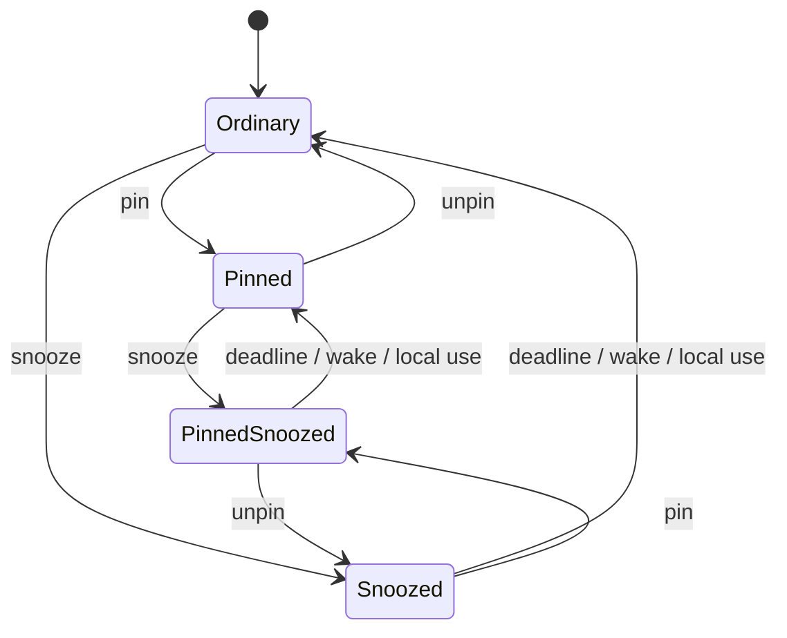

# Pinned and Snoozed Panes - Plan

## Goal Capsule

- **Objective:** Let users pin important panes to the top of Bessie's left Herd rail and temporarily snooze panes into a collapsible section below Shells, without changing the pane's Herdr-owned state or process.
- **Design authority:** Jordan's `bessie-sidebar-standalone.html` mockup and the BES-45 issue define the visual hierarchy. Explicit session requirements settle pinned precedence, section placement, preset snooze choices, timed return, and automatic wake on user use; the custom picker shown in the mockup is deliberately deferred.
- **Ownership:** Herdr continues to own every live pane and semantic agent state. Pinning and snoozing are Bessie-owned presentation and attention preferences keyed to a Herdr pane identity; they never pause, stop, close, focus, or otherwise mutate the pane merely because the preference changes.
- **Execution profile:** Build the pure preference/incarnation model, exclusive persistence owner, routed projection, supervised expiry, local-use provenance, and attention suppression first; then expose native SwiftUI and agent-intent surfaces together, followed by focused Mac verification.
- **Stop conditions:** Stop rather than infer activity from agent output, remote focus events, wall-clock anomalies, stale/scoped snapshots, or reused IDs. Do not ship if a pane can appear twice, disappear outside Snoozed, remain snoozed after a successful local user interaction, wake because an agent worked, or mutate Herdr as a side effect of pin/snooze.
- **Tail ownership:** The executor owns focused Core/App model tests, `./scripts/check.sh`, `git diff --check`, Mac verification, signed packaging, installed executable identity, app relaunch, screenshot inspection of the native rail and preset snooze menu, and `docs/reports/goal-progress.md`. No live pane closure/process mutation, broad unrelated QA, commit, push, PR, publication, or Herdr/libghostty upstream change is authorized.

---

## Product Contract

### Summary

Each live pane has its ordinary Herdr-derived semantic placement—Needs you, Working, Settled, Unknown, or Shells—and an optional Bessie presentation preference. A pinned pane is extracted from that ordinary placement and rendered in an always-expanded Pinned section at the top of the pane list, immediately below the herd/workspace/tab hierarchy. A snoozed but unpinned pane is extracted from ordinary placement and rendered in a collapsible Snoozed section immediately below Shells. A pane that is both pinned and snoozed remains in Pinned, because pinning has visual precedence; it remains muted, carries the `Zzz` cue, and does not demand attention until its snooze clears.

Snooze choices are Until further notice, 30 minutes, 1 hour, 3 hours, 12 hours, 24 hours, and Tomorrow at 9:00 AM. Duration presets resolve from one captured action time; Tomorrow resolves to 9:00 AM on the next local calendar day. Bessie persists the resulting absolute deadline. Timed snoozes expire while the app is running, after system sleep, and across relaunch. Expiration removes only snooze state; a pinned pane remains pinned and otherwise returns to its current semantic group.

Snoozing is an attention preference, not process control. Bessie suppresses new notifications and attention-badge contribution for snoozed panes while continuing to ingest their fresh Herdr state. Agent activity, semantic-state changes, and background output never wake a pane. A local user explicitly opening/focusing the pane or sending terminal input/paste/special keys wakes it immediately before normal use continues.

### Problem Frame

`HerdRailProjection` currently gives every pane exactly one Herdr-derived `HerdRailGroup` and sorts the flat traversal by group rank and topology identity. `HerdRail` renders those groups followed by a collapsible Shells section. There is no Bessie-owned per-pane presentation layer, no stored pin/snooze state, and no expiry scheduler.

Bessie's existing `presentation.json` already persists Bessie-native UI preferences and last-opened Herdr identifiers through `BessiePresentationState` and `BessiePresentationStore`. That is the correct ownership boundary for this feature, but the current state has no pane-preference records. `BessieSettingsModel` is the shared presentation-state owner and persistence entry point.

Pane use enters through several paths: sidebar rows and keyboard rail traversal converge on `openRoutedPane`; workspace-pane cycling has a direct focus path; notification routing has its own validated open path; and `PaneTerminalController` owns raw libghostty input plus intercepted keys and paste. Auto-wake must be explicit across those local-user paths rather than inferred from Herdr state changes. Notification planning already tracks previous semantic states and must continue updating its history while suppressing delivery so waking does not synthesize a stale alert.

The supplied mockup resolves several otherwise ambiguous details: Pinned appears above semantic groups and is not collapsible; Shells remains in its existing place; Snoozed appears below Shells and is collapsible; pinned-and-snoozed rows stay pinned with a `Zzz` cue; snoozed rows are muted but regain normal opacity on hover; rows show either a wake countdown or infinity; and the pane menu includes Pin/Unpin, preset snooze choices, checkmarks for the active choice, and Wake now.

### Requirements

**Ownership, identity, and persistence**

- R1. Pin and snooze are Bessie-owned presentation/attention preferences exposed through the shared Bessie intent bus. SwiftUI menus, shortcuts, CLI, MCP, and skill skins call the same registered mutation port; changing a preference sends no Herdr request and never pauses, stops, closes, focuses, resizes, renames, or otherwise mutates a live pane or process.
- R2. A preference lookup uses explicit `connectionID + paneID` and stores the pane's current `terminalID` as an incarnation discriminator. A record applies only when all three values match a fresh projection. A terminal mismatch treats the current pane as ordinary and retires the stale record only from a fresh full snapshot; stored preferences never create shadow panes or leak onto reused IDs.
- R3. Persist only non-default records: pinned, actively snoozed, or both. Unpinned and awake removes the record. Store an explicit snooze kind (`indefinite` or `until`), an absolute UTC deadline for timed snoozes, and timed-choice provenance (`thirtyMinutes`, `oneHour`, `threeHours`, `twelveHours`, `twentyFourHours`, or `tomorrow`) so the native menu can mark the actual active choice without guessing from a deadline.
- R4. Extend `BessiePresentationState` additively with an optional pane-preference collection so existing schema-v1 files decode as no preferences and older Bessie builds ignore the new key. Before decode, reject files over 1 MiB; after decode, reject more than 4,096 pane records or any connection/pane/terminal/request identifier over 256 UTF-8 bytes. Oversized, corrupt, unsupported, symlink, or non-regular sources create an immutable load blocker that permits session-local mutations but never writes/retries over the source. A save failure after a valid baseline has a monotonic dirty revision; retries atomically persist the newest complete state and never clear/bypass a load blocker.
- R5. Timed snoozes normalize against a single injected `now`. Expired deadlines are awake on decode/projection, are removed and persisted on launch/foreground/clock or time-zone change/nearest-deadline wake, and never require a Herdr snapshot mutation.
- R6. Preferences for panes absent from a scoped view stay stored but invisible. Cleanup may occur only when a fresh full snapshot for that exact connection proves the pane absent, or when Bessie successfully closes that pane itself; a disconnected, stale, filtered, workspace-only, or tab-only projection is not evidence for deletion.

**Placement and ordering**

- R7. Every projected pane appears exactly once. Placement precedence is `pinned > snoozed > ordinary semantic group`.
- R8. Pinned is the first pane section below the herd/workspace/tab hierarchy and divider. It is omitted when empty, always expanded with no disclosure chevron, shows the mockup's compact pushpin mark, uppercase label, and right-aligned count, and preserves the base rail's stable topology order across its rows.
- R9. A pinned row retains its current Herdr status glyph, provider/shell mark, location, selection, and age. Pinning changes placement only. A pinned-and-snoozed row is muted, shows `Zzz`, and remains in Pinned.
- R10. Needs you, Working, Settled, and Unknown contain only unpinned, awake rows. Their section counts exclude extracted rows. The global Needs-you attention count includes awake pinned Needs-you panes but excludes every snoozed pane.
- R11. Shells remains collapsible in its current position and contains only unpinned, awake shell panes. Shell panes may be pinned or snoozed under the same rules as agent panes.
- R12. Snoozed is immediately below Shells. It is omitted when empty, collapsible independently from Shells, shows the mockup's typographic `Zzz` mark and count, and preserves the base rail's stable topology order. Matching the supplied mockup, Shells and Snoozed each default expanded when a new expanded rail instance is created and retain independent transient disclosure state while that rail lives; this slice does not add disclosure persistence.
- R13. Snoozed rows retain underlying status/location/provider or shell identity but render at muted opacity, suppress Needs-you highlight, regain normal opacity on hover/focus, and show `∞` for indefinite snooze or a compact localized wake countdown such as `in 59m` or `in 22h` for timed snooze. Accessibility exposes the timing in full words.
- R14. Expanded-rail disclosure removes hidden Shell/Snoozed rows from visual, Tab, and VoiceOver traversal. Ordinary rail next/previous navigation excludes every snoozed pane; a snoozed row wakes only through explicit row activation or Wake now. Existing workspace-pane cycling remains an explicit local-use path and wakes a freshly validated target it actually selects. In the 40-point collapsed rail, awake Pinned and ordinary rows remain individual icon buttons in routed order, while nonempty Shells and Snoozed each become one labeled summary button with count; activating a summary expands the rail and that section without opening or waking an arbitrary pane. A pinned-and-snoozed row remains an individual Pinned icon with a `Zzz` cue. No collapsed path retains the current arbitrary “first Shell only” behavior.
- R15. Pin/snooze placement applies within the rail's current connection/workspace/tab scope. A pin does not escape scope or force an otherwise filtered pane into another workspace, tab, or herd.

**Menus and presets**

- R16. Every pane row exposes one shared native action menu through context click and a keyboard-focusable overflow control that appears on hover/focus. It starts with Pin or Unpin, followed by a Snooze section containing Until further notice, 30 minutes, 1 hour, 3 hours, 12 hours, 24 hours, and Tomorrow. Tomorrow always means 9:00 AM on the next local calendar day. Existing Herdr pane actions remain after a divider and keep their current behavior and confirmation rules.
- R17. The active snooze choice has a checkmark. A snoozed pane additionally offers Wake now. Choosing a different snooze option atomically replaces the existing snooze; pin state is unchanged.
- R18. Every fixed-duration preset is measured from one captured action time: 30 minutes is `now + 1,800 seconds`, 1 hour is `now + 3,600 seconds`, 3 hours is `now + 10,800 seconds`, 12 hours is `now + 43,200 seconds`, and 24 hours is `now + 86,400 seconds`.
- R19. Tomorrow resolves with the user's current calendar and time zone to 9:00 AM on the next local calendar day, then persists that absolute deadline. Later clock or time-zone changes do not reinterpret the scheduled wall-clock components.
- R20. Each timed preset records its exact provenance and resulting absolute deadline from the same captured action time. Expiration never changes pin state.

**Wake and attention behavior**

- R21. Timed expiration and Wake now clear snooze only. The pane immediately reprojects into Pinned if pinned, otherwise its current semantic group or Shells.
- R22. A freshly validated explicit local activation wakes the pane: sidebar row activation, workspace-pane cycling that selects the pane, command-palette pane focus, notification deep link, or another Bessie route that resolves the exact current pane incarnation. The wake occurs at validated local intent, not after an unavailable asynchronous Herdr focus acknowledgement; failure before fresh incarnation validation retains snooze.
- R23. Terminal use wakes only from trustworthy user-event provenance: validated mouse-down inside the terminal and immediately before raw committed input, intercepted special keys, paste, or explicit wheel forwarding. The raw path hooks inside the `InMemoryTerminalSession(write:)` closure and the intercepted-operation path hooks before `TerminalInputRouter` enqueue, both carrying controller-bound connection/pane/terminal IDs. `responderChanged`, `becomeFirstResponder`, programmatic `makeFirstResponder`, reattach, Zen restoration, passive viewport resize, and automatic focus restoration never wake.
- R24. An unavailable/stale/incarnation-mismatched target, background Herdr focus events, agent output, semantic-state transitions, snapshot refresh, and notification evaluation do not wake a pane. Bessie must not infer a human from runtime activity.
- R25. While snoozed, a pane contributes no new Bessie desktop notification or Needs-you badge count, while planner history still advances. Suppression generations are keyed per pane incarnation, never global. Each event enters a cancellable 250-millisecond pre-delivery stage; immediately before handing it to `delivery.add`, MainActor revalidates that incarnation's generation and establishes the delivery commit point. Snooze before commit cancels the task and removes its pending deterministic ID. After commit the OS owns presentation timing, so later snooze performs best-effort pending/delivered removal but does not claim it can prevent a banner already committed to `UNUserNotificationCenter`. Wake never replays transitions observed during snooze.
- R26. Pinning alone has no notification effect. A pinned Needs-you pane remains attention-bearing unless it is also snoozed.

**Safety**

- R27. Persist only bounded connection/pane/terminal IDs and preference fields; diagnostics may record bounded IDs and transition/error codes but never terminal content, commands, paths, environment, credentials, SSH details, or notification bodies. Create the Bessie support directory as `0700`; require regular non-symlink files; force `presentation.json` and Bessie diagnostic logs to `0600` after every atomic replacement. Hold an existing-style process lease for presentation ownership so a second Bessie process cannot become a stale concurrent writer.

**Accessibility and verification**

- R28. Section headers expose names, counts, and disclosure state. Rows expose selected, semantic, pinned/snoozed, and wake timing. The overflow `Menu` stays in the focus/accessibility tree while visually transparent and becomes visible when its row/control has focus or hover. Explicit relocation follows this matrix: focus the same pane row when its destination is visible; if Snoozed is collapsed, preserve that disclosure and focus/announce the Snoozed header rather than expanding it; Pin/Wake destinations are visible and receive row focus. Activating a collapsed-rail Shells/Snoozed summary expands the rail/section and focuses its first current row, or the section header if it became empty. Automatic expiry never changes focus when another control owns it; if the expiring row/overflow owned focus, focus follows the same pane row to its awake destination without an announcement. Explicit actions announce once; countdown refreshes never announce.
- R29. Use native SwiftUI/AppKit components and existing Bessie design tokens. The HTML mockup is design input only and is never embedded or shipped in a web view.
- R30. Focused tests cover model normalization, incarnation mismatch, load-blocker/save-retry separation, process lease and file modes, precedence/no-duplication projection, collapsed/disclosure matrix, expiry/watchdog recovery, every preset and Tomorrow calendar resolution, notification delivery races/history, trustworthy local wake paths, intent parity, focus restoration, and accessibility labels.
- R31. BES-45 verification packages and strictly signs its exact candidate, installs it stopped, verifies packaged/installed executable identity, relaunches `/Applications/Bessie.app`, and inspects Pinned, Snoozed, pinned-and-snoozed, expanded/collapsed rail, preset menu, focus, and large-text states before handing the build to Jordan.

### Key Flows

- F1. Pin a pane
  - **Trigger:** User chooses Pin from the row menu or an agent dispatches `pane.pin`.
  - **Steps:** The shared intent validates a fresh connection/pane/terminal incarnation, sets `pinned = true`, increments revision, persists through the exclusive owner, and recomputes routed projection without changing Herdr.
  - **Outcome:** The row appears once in Pinned, retains its state and attention behavior, and remains pinned across scope changes/relaunch when present.
  - **Covered by:** R1-R10, R15-R17, R27-R30.

- F2. Snooze for a fixed duration
  - **Trigger:** User or agent skin dispatches one of the shared 30-minute, 1-hour, 3-hour, 12-hour, or 24-hour snooze presets.
  - **Steps:** Validate the fresh incarnation; resolve one absolute deadline from one injected action time; retain pin state; increment presentation revision and suppression generation; persist through the single writer; cancel pending notification delivery; recompute placement.
  - **Outcome:** An unpinned row moves below Shells; a pinned row stays in Pinned with `Zzz`; both stop demanding attention until wake.
  - **Covered by:** R1-R5, R7-R14, R17, R20, R25-R26.

- F3. Snooze until tomorrow
  - **Trigger:** User or agent skin chooses Tomorrow.
  - **Steps:** Validate the fresh incarnation, resolve 9:00 AM on the next local calendar day from the captured action time, persist its absolute deadline and `tomorrow` provenance, and supervise nearest-deadline plus watchdog reconciliation.
  - **Outcome:** The pane stays quiet until the next day's 9:00 AM deadline, surviving relaunch and later clock/time-zone changes as an absolute instant.
  - **Covered by:** R5, R18-R20, R30-R31.

- F4. Wake through local use
  - **Trigger:** User explicitly activates a freshly validated snoozed pane or sends a trusted terminal mouse/input/paste/special-key/wheel event.
  - **Steps:** For navigation, validate the exact incarnation and clear snooze at local activation before presentation. For terminal events, clear through the controller-bound callback immediately before forwarding. Retain pin state, increment suppression/presentation revisions, and reproject.
  - **Outcome:** The user can never actively use a pane while it remains snoozed; programmatic focus and failed validation do not wake it.
  - **Covered by:** R21-R24.

- F5. Agent keeps working while snoozed
  - **Trigger:** Herdr reports output, focus, or semantic-state changes for a snoozed pane.
  - **Steps:** Refresh the underlying projection and notification planner history; retain snooze; update the muted row's underlying status without delivering attention.
  - **Outcome:** Runtime truth stays fresh, but only a deadline, Wake now, or local user use clears snooze.
  - **Covered by:** R1, R9, R13, R24-R26.

- F6. Timed snooze expires while inactive
  - **Trigger:** Deadline passes during app background, system sleep, clock/time-zone change, or app termination.
  - **Steps:** Nearest-deadline supervisor, bounded watchdog, foreground/wake, clock/time-zone notification, or next load normalizes against absolute now, removes the expired snooze, persists under the failure state machine, and republishes attention/placement.
  - **Outcome:** Pane returns to Pinned or its live semantic group without duplicate alerts or Herdr mutation.
  - **Covered by:** R3-R6, R21, R25.

### Acceptance Examples

- AE1. Given a Working pane is pinned, when its Herdr state changes to Needs you and then Settled, then it remains the same single row in Pinned while its glyph, age, provider, underlying state, and awake Needs-you attention contribution update.
- AE2. Given a Settled pane is snoozed for 1 hour and not pinned, when the rail renders, then it is absent from Settled and present once in the expanded Snoozed section below Shells with `Zzz` and a wake countdown.
- AE3. Given a pane is pinned and snoozed indefinitely, when the rail renders, then it remains in Pinned rather than Snoozed, is muted, shows `Zzz`/infinity, and produces no notification or Needs-you badge contribution.
- AE4. Given a pinned-and-snoozed pane, when the user chooses Unpin, then it moves immediately to Snoozed and retains its deadline. Given the same pane later wakes, it returns to its current ordinary semantic group.
- AE5. Given the user chooses Tomorrow at any time today, when the snooze is applied, then its stored deadline is exactly 9:00 AM on the next local calendar day and the menu marks Tomorrow as active after relaunch.
- AE6. Given a timed snooze expires while Bessie is closed or the Mac sleeps, when Bessie next loads or becomes active, then the expired record clears, the row returns to normal placement, and no stale notification is emitted merely because it woke.
- AE7. Given a snoozed pane receives agent output and changes from Working to Needs you, when fresh snapshots arrive, then it stays snoozed with the updated underlying glyph but emits no Bessie notification. On Wake now it returns as Needs you without replaying the already-observed transition.
- AE8. Given a snoozed pane is selected and its terminal remains first responder, when the user mouse-downs inside it, types, pastes, sends an intercepted special key, or explicitly scrolls, then snooze clears from controller-bound identity before the existing ordered interaction is forwarded and that interaction is delivered once. Programmatic focus restoration does not wake it.
- AE9. Given a user explicitly activates a snoozed row whose fresh connection/pane/terminal incarnation resolves, then snooze clears before local presentation even if a later asynchronous Herdr focus acknowledgement fails. Given validation fails or the incarnation changed, routing fails factually and snooze remains.
- AE10. Given a pane is pinned on Hermes VPS but the rail scope is This Mac, another workspace, or another tab, then it does not escape scope. Returning to its matching scope restores it to Pinned.
- AE11. Given the expanded Shells or Snoozed section is collapsed, hidden rows are absent from visual/Tab/VoiceOver traversal and ordinary rail next/previous skips snoozed panes. Given the whole rail is collapsed, awake Pinned/ordinary panes remain individual icons while Shells/Snoozed are labeled summary buttons that expand their section without opening a pane; both disclosures default expanded on a new expanded rail, matching the mockup.
- AE12. Given a legacy schema-v1 `presentation.json` without pane preferences, when the new build loads it, then all panes are awake/unpinned and existing preferences/onboarding/workspace hints remain byte-semantically intact after the next valid save.
- AE13. Given the native candidate on Jordan's Mac, when screenshot verification compares the supplied mockup, then Pinned is above ordinary groups, Snoozed is immediately below Shells, muted/hover/`Zzz`/counts and every preset-menu state are legible, and no HTML/web view ships in the app.
- AE14. Given a valid baseline loaded and a save later fails, then the last valid file remains untouched, the newest complete transition remains effective in memory with a monotonic dirty revision, terminal input proceeds once, and a later retry saves that newest revision. Given load was blocked by corrupt/unsupported/non-regular input, no lifecycle retry or later mutation rewrites the source.
- AE15. Given pane ID `p1` is replaced by a fresh projection with a different terminal ID before cleanup, then the replacement appears ordinary and the stale preference never applies.
- AE16. Given a notification is in Bessie's cancellable pre-delivery stage, when that exact pane incarnation is snoozed, then only its per-pane generation changes and its task/request is canceled before OS handoff; unrelated panes still deliver. Given Bessie already committed the request to `UNUserNotificationCenter`, later snooze attempts removal but makes no impossible promise about OS presentation timing.
- AE17. Given the user pins or snoozes from SwiftUI and an agent performs the equivalent CLI/MCP intent, then both execute the same registered Bessie-owned intent, return the same structured result, and converge on one presentation revision without Herdr mutation.
- AE18. Given an explicit Pin/Unpin/Snooze/Wake moves a focused row, the R28 focus matrix chooses the same row or stable section header and announces once. Automatic expiry while another control is focused neither steals focus nor announces countdown ticks.
- AE19. Given a fresh full snapshot proves a stored pane/incarnation absent, or a Bessie close action succeeds, then the exact stale record is removed. A scoped/disconnected/stale snapshot or failed close removes nothing.
- AE20. Given a 1-hour snooze request times out after mutation, when the caller retries the same correlation ID, parameters, and expected revision in-process, then it receives the original deadline/revision without extension. Reusing that ID with different parameters fails. After app restart, the same stale expected revision returns a structured conflict/current state and still does not extend snooze.

### Success Criteria

- Pins and snoozes persist safely across relaunch without becoming Herdr-owned truth or creating phantom rows.
- Every visible pane appears exactly once with deterministic pinned/snoozed precedence and scope-respecting order.
- Timed-preset, indefinite, manual, and local-use wake paths behave deterministically, including Tomorrow resolution and app sleep/relaunch.
- Snoozed panes stop producing Bessie attention without hiding their fresh underlying status or waking from agent activity.
- The native rail and context menu match the supplied visual hierarchy and remain keyboard/VoiceOver accessible.
- Every UI path shares one preference model, validation path, and persistence store.
- Focused checks, Mac verification, strict signing, stopped-app installation, executable identity, relaunch, and screenshot/accessibility inspection pass for the BES-45 candidate before it is handed to Jordan.

### Scope Boundaries

**In scope:** main-window Herd rail pin/snooze placement; shared Bessie-owned intents plus SwiftUI/CLI/MCP/skill parity; native pane context/overflow menus; the seven specified snooze presets; persistent Bessie presentation records; nearest-deadline wake plus bounded recovery; local-use auto-wake; desktop notification and Needs-you badge suppression; shell-pane support; focused tests; native Mac screenshot verification and installation.

**Deferred to follow-up work:** custom date/time picker; user-defined or additional snooze presets; manual drag reordering of pins; cross-device preference sync; bulk pin/snooze; revocation of notifications already confirmed delivered before snooze; user-configurable auto-wake policy; historical snooze analytics.

**Out of scope:** pausing agents or processes; muting terminal output at Herdr; changing Herdr semantic states; modifying Herdr/libghostty; pinning workspaces/tabs/Projects; escaping current rail scope; adding pin/snooze sections to the macOS status-item popover; replacing The Herd's canonical state filters; persisting terminal content or process facts; embedding the HTML mockup; implementing BES-44 notch UI; broad unrelated tests.

---

## Planning Contract

### Key Technical Decisions

- KTD1. Pin/snooze is a Bessie presentation and attention overlay joined onto fresh Herdr projection data, never a live-pane fact or Herdr action. This follows Bessie's explicit ownership boundary and survives runtime transport changes.
- KTD2. Placement precedence is `pinned > snoozed > ordinary`. (session-settled: user-directed — chosen over always moving snoozed pins below Shells: pinned panes must stay at the top regardless of state; the supplied mockup preserves `Zzz` on that top row.)
- KTD3. Pinned and Snoozed are routed placements, not new `AgentSemanticState` or `HerdRailGroup` values. Underlying state must continue to update for glyphs, attention, sorting within source topology, and wake return.
- KTD4. Preferences look up by connection + pane and carry terminal ID as an incarnation discriminator. This preserves pane-level behavior while failing closed on any fresh incarnation mismatch instead of leaking state onto reused IDs.
- KTD5. Add pane records to existing presentation persistence rather than inventing a second file or putting preferences in Project/connection state. The field is optional and additive for rollback compatibility.
- KTD6. Tomorrow means 9:00 AM on the next local calendar day and is converted immediately to an absolute deadline. This is chosen over storing recurring wall-clock components: the action is one-shot and must not shift silently after it is scheduled.
- KTD7. Snooze suppresses Bessie attention but not state ingestion. Notification history advances. A per-incarnation suppression generation and cancellable pre-delivery stage define an honest MainActor commit immediately before `delivery.add`; after that boundary, removal is best effort because OS presentation timing is outside Bessie's control.
- KTD8. Auto-wake is tied only to explicit, freshly validated local Bessie user events. Agent output, responder changes, programmatic focus, and Herdr state events are insufficient evidence of human use.
- KTD9. A single main-actor presentation mutation port owns validation, state transition, persistence revision, and structured result. SwiftUI and every agent skin dispatch the same registered Bessie-owned intents through that port; no second file writer exists.
- KTD10. Register primitive `pane.presentation.list`, `pane.pin`, `pane.unpin`, `pane.snooze`, and `pane.wake` intents. `pane.snooze` accepts one required preset enum: `until_further_notice`, `thirty_minutes`, `one_hour`, `three_hours`, `twelve_hours`, `twenty_four_hours`, or `tomorrow`. It does not accept an arbitrary deadline in this slice. Every mutation carries `expected_revision` and the request correlation ID: a revision mismatch performs no transition and returns current state; identical in-flight/completed retries coalesce or replay the original result/deadline; mismatched ID reuse fails; a bounded 256-entry process LRU prevents growth. After process restart, a lost-response retry cannot extend snooze because its expected revision is stale. Results report connection/pane/terminal identity and resulting revision. CLI, MCP, and the operating skill remain thin catalog skins.
- KTD11. The main-window Herd rail is the designed surface. The macOS status-item popover keeps its compact status shape; only its badge input excludes snoozed attention. Adding full Pinned/Snoozed sections there is intentionally separate.
- KTD12. One supervised nearest-deadline task owns exact expiration. A bounded 60-second reconciliation watchdog runs only while timed snoozes exist, recreates a lost task, and republishes one normalized active-snooze snapshot to rail, badge, and notifications. Visible relative labels update at minute boundaries and only during the final minute at second boundaries; no row owns a timer.
- KTD13. Snoozed defaults expanded because the supplied design authority explicitly initializes it expanded. Users may collapse it independently for the rail lifetime; changing that default requires a product revision rather than an implementation guess.
- KTD14. The custom date/time picker is deferred in favor of the seven explicit presets. Automatic unsnooze on actual user use remains in this slice; the plan narrows incidental wake by requiring fresh identity and trustworthy user-event provenance. (session-settled: user-directed — defer picker complexity and cover common needs with presets.)

### Data and State Model

```swift
public struct BessiePanePresentationPreference: Codable, Equatable, Sendable {
    public let connectionID: String
    public let paneID: String
    public let terminalID: String
    public var pinned: Bool
    public var snooze: BessiePaneSnooze?
}

public enum BessiePaneSnooze: Equatable, Sendable {
    case indefinite
    case until(Date, provenance: BessieTimedSnoozeProvenance)
}

public enum BessieTimedSnoozeProvenance: String, Codable, Equatable, Sendable {
    case thirtyMinutes
    case oneHour
    case threeHours
    case twelveHours
    case twentyFourHours
    case tomorrow
}
```

Use an explicit tagged Codable representation for `BessiePaneSnooze` (`kind`, optional `wake_at`, optional timed `provenance`) rather than relying on compiler-synthesized enum wire format. Normalize duplicate records deterministically by connection/pane/terminal incarnation, reject malformed timed records, remove expired snoozes, and omit records where `pinned == false && snooze == nil`.

`BessieSettingsModel` and a main-actor presentation mutation port share one normalized in-memory ledger. The port exposes idempotent list/pin/unpin/snooze/wake/reconcile intents, validates fresh incarnation identity, increments a monotonic presentation revision, and is the only mutation/persistence owner used by UI and agent skins. Persistence keeps an immutable `loadBlocker` distinct from retryable `saveFailure + dirtyRevision`; lifecycle retry may persist only after a valid baseline load and always writes the newest complete revision. Mutation APIs accept an injected `Date` for tests.



### Projection Contract

Add a pure routed presentation layer above `HerdRailProjection`, for example `HerdRailPresentation`. It accepts the base projection, normalized preferences, and one `now`, then produces:

- `pinnedRows`
- ordinary rows by existing `HerdRailGroup`
- `shellRows`
- `snoozedRows`
- global awake attention counts
- ordinary awake navigation rows with all snoozed identities excluded
- per-row incarnation, flags, and wake labels without mutating `HerdPaneSummary`

The routed layer must prove that the union of all logical placements equals the base projection's fresh pane-incarnation set and that placements are disjoint. `HerdRail` owns transient Shells/Snoozed disclosure and the expanded/collapsed presentation matrix from R14; hidden rows are not Tab/VoiceOver targets, and collapsed summary controls are not pane targets.

### Expiry and Clock Contract

Use one supervised nearest-deadline task plus a bounded 60-second watchdog active only while timed snoozes exist. Reconcile on:

1. presentation-state load;
2. preference mutation;
3. nearest timed deadline;
4. watchdog tick or lost-task recovery;
5. application foreground/wake;
6. system clock or time-zone change.

Every reconciliation compares absolute deadlines to injected wall-clock `now`, removes expired records, persists under the load/save state machine, and publishes one normalized active-snooze snapshot consumed by rail, status badge, and notification delivery. A shared render cadence refreshes compact labels at minute boundaries and at second boundaries only during the final minute. No per-row timer, daemon, cron job, or Herdr event owns expiration.

### Local User-Use Contract

Create one `recordLocalPaneUse(connectionID:paneID:terminalID:)` intent-backed entry point. Call it after a route validates the exact fresh incarnation and immediately before trusted terminal operations are forwarded. Required call sites:

- explicit `HerdRail` row activation through `openRoutedPane` after fresh incarnation validation;
- workspace pane cycling only when it resolves/selects that target;
- command-palette pane activation and successful notification target validation;
- other explicit UI route helpers that resolve the same incarnation;
- terminal `mouseDown` originating inside `BessieTerminalView`;
- the raw `InMemoryTerminalSession(write:)` closure and intercepted special-key/paste/wheel forwarding before `TerminalInputRouter` enqueue.

Do not wire wake to generic responder callbacks. The controller-bound callback must preserve composite input ordering and takeover rules. Wake state changes before forwarding, but load blockers/save failures never swallow or duplicate input; session-local wake remains effective, diagnostics report the persistence state, and delivery proceeds once.

### Notification Contract

Thread one normalized snooze snapshot and a per-incarnation suppression generation into every notification path. The planner advances history but emits no suppressed event. A cancellable 250-millisecond pre-delivery task retains `(notificationID, generation, incarnation)`; MainActor revalidates and records commit immediately before invoking `delivery.add`. Snooze increments only that incarnation's generation, cancels its queued task, removes its pending request, and attempts delivered removal for an already committed deterministic ID. The status-item badge counts awake Needs-you/Unknown panes; pinned awake panes still count. The contract guarantees cancellation only before commit and reports post-commit removal as best effort.

### Agent and Intent Contract

Register Bessie-owned `pane.presentation.list`, `pane.pin`, `pane.unpin`, `pane.snooze`, and `pane.wake` entries in the existing intent catalog. A single main-actor presentation mutation port owns fresh-incarnation validation, transition, revision, persistence, idempotency cache, and structured result; UI menus call the main-actor dispatcher directly. External socket handlers run off-main, enqueue the same dispatcher with `DispatchQueue.main.async`, and wait only on their worker with a bounded timeout—never `main.sync` and never from the main thread—so no second store or deadlock path exists. Every mutation includes `expected_revision` and preserves its correlation ID across retries. The port rejects stale revisions without mutation, coalesces identical in-flight requests, and replays completed results/deadlines from a bounded process LRU; reusing an ID with different parameters is an error. A timeout retry after app restart is also non-extending because its expected revision is stale and the structured conflict returns current state. CLI, MCP, and `.agents/skills/operating-bessie/SKILL.md` remain thin catalog skins. Results include connection/pane/terminal identity, pinned/snooze state, wake deadline, and presentation revision; list provides context parity without terminal content.

### Security and Privacy

- Preference files contain only connection/pane/terminal identity, pin flag, snooze kind/provenance, deadline, and revision.
- Create Application Support as `0700`; hold a process lease; reject symlink/non-regular sources; atomically replace and enforce `0600` on `presentation.json` and Bessie diagnostic logs after every write.
- Validate every UI or agent target against a fresh configured connection/pane/terminal projection before mutation.
- Do not persist labels, terminal content, commands, cwd, environment, credentials, SSH details, notification body text, or inferred user activity.
- No preference mutation crosses a host boundary or opens an SSH operation.

---

## Execution Plan

### Pre-execution gate

This plan was re-reviewed against clean branch `feat/v1-l-brand-chrome` at `54fd079` after the pre-V1 command and Herd workflows landed. The named persistence, projection, routing, terminal, notification, intent, CLI/MCP, and verification seams remain present. Before U1 starts, confirm the checkout is still clean or preserve any new unrelated changes, and confirm there is no other write-capable worker in `/home/hermes/code/bessie`.

### U1. Pure preference model and additive persistence

**Goal:** Establish one deterministic, testable source of Bessie-owned pin/snooze truth.

**Files:**
- Add `Sources/BessieCore/PanePresentationPreferences.swift`.
- Update `Sources/BessieCore/PresentationPersistence.swift` and reuse the repository's process-lease pattern.
- Update `Sources/BessieApp/BessieSettings.swift` and `Sources/BessieApp/BessieDiagnosticLog.swift`.
- Add/update `Tests/BessieCoreTests/PersistenceReconnectTests.swift` and focused pane-preference/security tests.

**Work:**
1. Define connection/pane/terminal incarnation identity, tagged snooze encoding, normalized preference record, pure ledger mutations, and monotonic presentation revision.
2. Add optional pane records to `BessiePresentationState` without breaking schema-v1 decoding or old-build unknown-key tolerance.
3. Separate immutable load blockers from retryable save failures/dirty revisions; prove retries cannot overwrite a blocked source and always merge the newest state after a valid load.
4. Add a process lease, regular-file/symlink checks, `0700` support directory, and `0600` presentation/diagnostic files after atomic replacement.
5. Load, normalize, expose, mutate, and persist through one main-actor mutation port; keep all mutations idempotent and clock-injectable.
6. Test legacy decode, incarnation mismatch, round trip, file-size/record-count/identifier limits, corrupt/unsupported/non-regular files, duplicate/default/expired normalization, pin+snooze independence, lease conflict, modes, load-blocker no-rewrite, dirty revision merge, and successful retry.

**Gate:** Core tests prove additive compatibility, incarnation-safe joins, exclusive ownership, restrictive modes, separate failure state machines, and no default record is persisted.

### U2. Routed Herd rail projection and disclosure behavior

**Goal:** Derive exactly one visual placement per fresh pane while preserving Herdr semantic truth.

**Files:**
- Update `Sources/BessieCore/HerdList.swift` or add `Sources/BessieCore/HerdRailPresentation.swift`.
- Update `Sources/BessieApp/BessieApp.swift` and `ProductSurfaces.swift` for full-snapshot reconciliation, close completion, and attention/navigation consumers.
- Update `Tests/BessieCoreTests/HerdListTests.swift`.
- Update `Tests/BessieAppModelTests/SurfaceProjectionTests.swift` and focused routing/close tests.

**Work:**
1. Build routed placement from base `HerdRailProjection + preferences + now`, joining only exact connection/pane/terminal incarnations.
2. Implement precedence, topology-stable ordering, snoozed-excluding ordinary navigation rows, global awake attention counts, and scope-respecting joins.
3. Keep underlying semantic state available on every routed row and expose collapsed Shells/Snoozed summary inputs without inventing pane targets.
4. On each exact connection's fresh full snapshot, reconcile its complete pane/terminal incarnation set through the single mutation owner; remove stale records only there. After a successful Bessie pane-close completion, remove that exact record through the same owner. Never clean from disconnected, stale, workspace/tab-scoped, or failed-close data.
5. Expose pure snoozed-excluding attention/navigation candidates for `openNextNeedsYou`, Zen Needs-you routing, and shared Needs-you selection while leaving canonical The Herd state filters unchanged; U4 wires the live consumers.
6. Cover agents/shells, pin+snooze precedence, incarnation mismatch, expiration, scope isolation, hidden-row traversal, full-snapshot/close cleanup, attention navigation, and union/disjointness invariants.

**Gate:** Tests prove no duplicate, omitted, phantom, reused-incarnation, stale-record, cross-scope, failed-close cleanup, or accidentally navigated snoozed rows under all preference/disclosure combinations.

### U3. Expiration and local-user auto-wake

**Goal:** Make snooze end exactly when intended without mistaking background activity for human use.

**Files:**
- Add/update a small App scheduler near `BessieSettingsModel` or `BessieApp` lifecycle ownership.
- Update `Sources/BessieApp/ProductSurfaces.swift` routing/focus helpers.
- Update `Sources/BessieApp/TerminalPaneController.swift` and its store/registry wiring.
- Update focused settings, routing, and terminal sequencing tests.

**Work:**
1. Supervise the nearest deadline; reconcile on load, foreground, `NSWorkspace.didWakeNotification`, clock/time-zone changes, and a 60-second watchdog active only while timed records exist.
2. Publish one `now`-normalized active-snooze snapshot to rail, badge, and notifications; test task cancellation/failure with no Herdr updates.
3. Resolve Tomorrow to 9:00 AM on the next local calendar day and test date, calendar, time-zone, and relaunch behavior.
4. Add one intent-backed local-use callback and thread it through freshly validated routes, pane cycling, command palette, notification route, controller-bound terminal mouse-down, raw `InMemoryTerminalSession(write:)`, special keys, paste, and explicit wheel forwarding.
5. Prohibit responder/focus-restoration hooks; prove programmatic `makeFirstResponder`, reattach, Zen exit, and background Herdr focus never wake.
6. Preserve terminal operation ordering and deliver input once under load blockers or save failures.
7. Drive compact countdown labels through one shared minute cadence and a one-second cadence only during the final minute, with no per-row timers or persistence writes.

**Gate:** Deterministic clock/watchdog tests and terminal frame/input sequencing tests pass; a lost task recovers without projection traffic and no background/programmatic transition clears snooze.

### U4. Attention suppression

**Goal:** Make snooze quiet across Bessie's attention surfaces without losing fresh state history.

**Files:**
- Update `Sources/BessieCore/NotificationPlanning.swift`.
- Update `Sources/BessieApp/BessieNotifications.swift`, `BessieAppDelegate.swift`, `BessieMenuBarController.swift`, and `BessieMenuBarPopover.swift`.
- Update focused notification and menu-bar presentation tests.

**Work:**
1. Suppress planner events, status-item attention counts, and existing `openNextNeedsYou`/Zen attention candidates for snoozed incarnations while advancing semantic history; keep canonical The Herd filters unchanged.
2. Assign deterministic notification IDs and per-incarnation generations; queue a cancellable 250-millisecond pre-delivery stage and revalidate/commit on MainActor immediately before `delivery.add`.
3. Snooze increments only the target incarnation, cancels its pre-delivery task, removes pending requests, and best-effort removes committed delivered IDs. Test before-commit cancellation, after-commit limitation, and isolation between two panes.
4. Publish pane-presentation revision changes reactively to `BessieMenuBarController`; pass suppression identities into `BessieMenuBarPresentation`. Keep pinned awake panes in attention counts and the compact status-item popover layout unchanged.
5. Test commit-boundary semantics, per-pane generation isolation, history, badge/navigation inputs, pin+snooze suppression, wake without replay, and secret-free diagnostics.

**Gate:** Suites prove pre-commit snooze cancellation, honest post-commit behavior, per-pane isolation, and that snoozed transitions are neither counted nor chosen by ordinary Needs-you routing.

### U5. Native rail, intent parity, and preset menus

**Goal:** Expose the complete behavior through native UI and the shared agent intent bus only after persistence, routing, expiry, wake, and suppression are proven.

**Files:**
- Update `Sources/BessieApp/HerdRail.swift` and `ProductSurfaces.swift`.
- Update `Sources/BessieCore/AgentIntentRegistry.swift`, `AgentIntentExecutor.swift`, and focused intent models.
- Update `Sources/BessieApp/AppIntentServer.swift`, `IntentActionDispatcher.swift`, and main-actor presentation-port wiring.
- Update `.agents/skills/operating-bessie/SKILL.md`; update CLI/MCP skins only through catalog discovery patterns.
- Update `Sources/BessieApp/BessieDesignSystem.swift` and add approved SVG resource(s) only if the existing asset system lacks the pin cue; render `Zzz` natively.
- Update focused Core/App intent, model, and view tests.

**Work:**
1. Register list/pin/unpin/snooze/wake primitives with strict fresh-incarnation schemas, request-ID idempotency/coalescing, bounded completed-result replay, and structured revision results; wire UI and agent skins through one mutation port.
2. Render Pinned after hierarchy/divider, ordinary groups, Shells, then Snoozed; initialize both Shells and Snoozed expanded for every new expanded rail, implement the disclosure/collapsed matrix, and remove arbitrary first-Shell behavior.
3. Implement muted/hover/focus style, counts, provider/shell marks, underlying glyphs, `Zzz`, infinity, and relative wake labels.
4. Add one shared Pin/Unpin/Snooze/Wake menu before Herdr actions; expose it from context click and an overflow `Menu` that always remains focusable/accessibility-visible while becoming visually visible on row/control focus or hover.
5. Implement all seven presets from R16-R20 with exact active-choice checkmarks and localized Tomorrow/wake labels.
6. Restore keyboard/VoiceOver focus by pane identity after explicit relocation; preserve focus on passive expiry and suppress countdown announcements.
7. Test UI/CLI/MCP parity, every preset, collapsed summaries, ordinary navigation exclusion, context-menu lifecycle, focus restoration, and large-text/accessibility semantics.

**Gate:** No placement-only partial feature is exposed; focused intent/UI/model tests and compile-time accessibility coverage pass. Native screenshot, large-text, signing, installation, and relaunch evidence are reserved for U6.

### U6. Integration, Mac verification, and handoff

**Goal:** Verify and deliver one exact BES-45 native artifact without disturbing unrelated dirty changes.

**Files:**
- Update `docs/reports/goal-progress.md` with actual results and screenshots/evidence paths.
- Update focused fixtures only as required.

**Work:**
1. Run focused Linux-safe checks, `./scripts/check.sh`, and `git diff --check` without weakening any check.
2. Run `./scripts/mac-verify.sh`; exercise legacy decode, load-blocker/save-retry separation, file modes/lease, incarnation mismatch, relaunch persistence, watchdog expiry, local-use provenance, notification delivery race, and UI/CLI/MCP parity on an isolated repository-local configuration.
3. Package and strictly verify signing/notarization expectations for `dist/Bessie.app`.
4. Stop installed Bessie, install the verified candidate without launching, prove packaged and installed executables are byte-identical, then relaunch.
5. Inspect screenshots at normal/large text for Pinned, Snoozed, pinned-and-snoozed, expanded/collapsed rail, the complete preset menu, focus continuity, and accessibility labels.
6. Do not close or mutate Jordan's real panes to manufacture fixtures; use isolated non-destructive panes/configuration. Hand the installed BES-45 build to Jordan for acceptance.

**Gate:** All focused checks pass, signing is strict, installed hash matches package, Bessie relaunches, screenshot review passes, and Jordan receives a concise acceptance checklist.

---

## Verification Matrix

| Behavior | Primary test/evidence |
|---|---|
| Legacy/additive persistence | `PersistenceReconnectTests` fixture decode + round trip + load-blocker no-rewrite |
| Save recovery and ownership | Size/count/identifier bounds, dirty-revision merge/retry, process-lease conflict, symlink/non-regular rejection, `0700`/`0600` modes |
| Pin/snooze independence | Pure ledger reducer tests |
| Incarnation safety | Same pane ID/different terminal ID fresh-snapshot tests |
| Stale-record cleanup | Exact fresh-full-snapshot and successful-close removal; scoped/disconnected/failed-close negative tests |
| Exactly-once routed placement | `HerdListTests` union/disjointness assertions |
| Pinned precedence | Pinned+snoozed projection and unpin transition tests |
| Scope/filter/isolation | Connection/workspace/tab projection fixtures |
| Expanded/collapsed traversal | Disclosure-hidden rows, collapsed summaries, no arbitrary first Shell, snoozed-excluding ordinary navigation |
| Timed/indefinite preset snooze | Injected-clock tests for all durations plus Tomorrow local-calendar resolution |
| App sleep/relaunch/scheduler loss | Supervised deadline + 60-second watchdog lifecycle tests and isolated Mac check |
| Local-use wake provenance | Fresh route validation plus terminal mouse-down/raw/paste/special-key/scroll ordering; programmatic-focus negative tests |
| No agent-activity wake | Fresh projection/state-transition regression tests |
| Notification suppression without replay | Planner history, deterministic IDs, per-pane generation isolation, cancellable pre-commit stage, honest post-commit behavior |
| Status badge suppression | Menu-bar presentation tests with mixed pinned/snoozed panes |
| UI/CLI/MCP parity and retry | Registered schemas/results, one presentation revision across skins, in-flight coalescing, completed replay, mismatched-ID rejection |
| Context menu/presets/focus/accessibility | App tests + Mac screenshot/VoiceOver focus and announcement evidence |
| No Herdr mutation | Mock action-recorder assertions for every preference operation |
| Artifact integrity | `scripts/check.sh`, `scripts/mac-verify.sh`, signing checks, SHA-256 package/install comparison |

## Rollout and Recovery

- Existing users begin with no pane preferences; no migration tool is required.
- The optional additive presentation key permits rollback to the prior build; the old build ignores it. If that older build later saves presentation state, pin/snooze preferences may be dropped, which is acceptable presentation-only rollback behavior.
- A corrupt/unsupported/non-regular load source creates an immutable blocker: session-local transitions may work, but no retry or lifecycle event may rewrite the source. A save failure after a valid baseline keeps the newest complete in-memory revision dirty, retries atomically, and never blocks or duplicates terminal input.
- A lost deadline task is recreated by its supervisor or the bounded watchdog; recovery does not depend on a Herdr projection event. Every consumer receives the same normalized active-snooze snapshot.
- If notification suppression or auto-wake cannot be proven in focused tests, do not ship partial snooze. Pinning can be separated only through a revised, explicitly approved scope; do not silently degrade snooze into placement-only behavior.

## Source Trail

- Linear: BES-45, “Add pinned and snoozed panes,” including Jordan's attached sidebar screenshot/mockup.
- Design mockup inspected from `/Users/jordanstella/Downloads/bessie-sidebar-standalone.html`; unpacked read-only at `/tmp/bessie-mockup-unpacked/index.html` for exact hierarchy, menu, `Zzz`, countdown, and pinned+snoozed precedence.
- Repository: `Sources/BessieCore/HerdList.swift`, `PresentationPersistence.swift`, `NotificationPlanning.swift`, `AgentIntentRegistry.swift`, `AgentIntentExecutor.swift`; `Sources/BessieApp/HerdRail.swift`, `BessieSettings.swift`, `BessieDiagnosticLog.swift`, `ProductSurfaces.swift`, `TerminalPaneController.swift`, `BessieNotifications.swift`, `BessieMenuBarPopover.swift`, `AppIntentServer.swift`, `IntentActionDispatcher.swift`; `.agents/skills/operating-bessie/SKILL.md`; matching Core/App tests.
- Product contracts: `AGENTS.md`, `docs/plans/2026-08-01-bessie-v1.md`, workstream `V1-SCOPE.md`, `WORKSPACE-INTERACTION-SPEC.md`, `TERMINAL-BEHAVIOR.md`, `ARCHITECTURE.md`, and design-system source material.

## Handoff

The plan is implementation-ready on clean branch `feat/v1-l-brand-chrome` at `54fd079`. Re-check the live branch/status and named source seams before editing, preserve any unrelated changes that appeared after this review, then execute U1-U6 in order. Do not start a second write-capable worker before the current writer exits.
