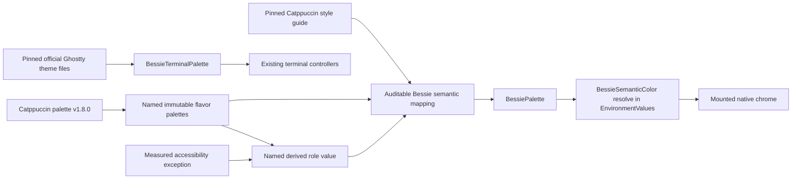

# fix: Restore Catppuccin semantic role fidelity

## Goal Capsule

Make Catppuccin Latte, Frappé, Macchiato, and Mocha faithful native Bessie themes by deriving app chrome from the official named palette and semantic role guidance, while preserving Bessie Dark/Light and the already-correct official Ghostty terminal configurations.

## Product Contract

### Summary

Bessie's Catppuccin terminal configurations match the official Ghostty port, but the native SwiftUI chrome currently reuses a compressed Bessie token set in ways that contradict Catppuccin's documented roles. Primary text becomes Rosewater, selection becomes translucent Blue, selected borders stay Blue, hunk headers stay Blue, Latte panels use white, and some theme-owned errors bypass the palette.

Users who deliberately select Catppuccin expect the app chrome and terminal to read as one coherent theme; semantic misuse makes the native shell feel like a loose color imitation even when each swatch is recognizable.

This corrective pass establishes a testable canonical Catppuccin source, maps Bessie semantics to it explicitly, adds only the missing product roles, repairs caller intent, and treats accessibility deviations as named and measured derivatives rather than silent substitutions.

### Problem Frame

The current implementation is internally consistent enough to pass contrast and dynamic-theme tests, but those tests do not prove semantic fidelity. A palette can contain valid Catppuccin swatches and still use them for the wrong jobs. Because generic roles such as `strong`, `accent`, `selected`, and `borderStrong` propagate across hundreds of native call sites, a few incorrect mappings create application-wide drift.

Terminal and native chrome are separate contracts. The terminal side must continue matching the pinned official Ghostty files exactly. Native chrome must follow Catppuccin's app/UI guidance and may adapt only where the raw swatch fails measured legibility on the actual Bessie surface.

### Requirements

- **R1. Canonical palette source:** represent all 26 named colors for each of the four Catppuccin flavors from `catppuccin/palette` v1.8.0 in one immutable, testable app-owned source.
- **R2. Canonical semantic mapping:** derive Catppuccin native chrome by role rather than visual similarity: Base for the main background; Mantle/Crust for secondary layers; Surface 0 for elevated panels; Text/Subtext/Overlay for text hierarchy; Blue for links; Teal for genuine information; Green for success; Yellow for warning; Red for error; Rosewater for insertion points; and Peach for diff hunk identity. Blue accent, control-tint, and working/progress uses are explicit Bessie adaptations rather than mislabeled upstream information guidance.
- **R3. Precise interaction treatments:** use Overlay 2 at 25% for selection and 10% for hover, Overlay 0 at 20% for structural hairlines and 40% for stronger inactive borders, Blue at 15% for accent washes, Lavender at full authored strength for active borders, and canonical Green/Red/Peach at 20% for diff plates. Caller-level opacity must not attenuate an already-authored semantic treatment a second time.
- **R4. Explicit semantic vocabulary:** add dedicated native roles where existing tokens cannot express intent, including active border, destructive/error, link foreground, control tint, and insertion-point tint. Keep status, diff, selection, accent markers, and structural-border concepts distinct; do not add speculative roles without a real caller.
- **R5. Controlled accessibility adaptation:** canonical swatches are the default. A raw swatch that fails the applicable contrast requirement on its actual Bessie surface may use a narrowly named, hue-preserving derivative or an explicit on-color foreground. Each derivative must identify the canonical source, target surface, required ratio, and measured result; stay within 5° of source hue in OKLCH; retain at least 60% of source chroma; and change lightness only as far as needed. If no candidate satisfies both contrast and those fidelity bounds, preserve the canonical hue in a non-text plate or marker and use Text or Base for the foreground instead of inventing a distant swatch.
- **R6. Theme-owned caller fidelity:** selected backgrounds, selected outlines, control tint, destructive/error content, diff hunks, primary text, and active pane/card treatments use the matching semantic role. Intentional fixed-color invariants such as masks, `Color.clear`, cold-open branding, and the missing-resource diagnostic glyph remain explicit and documented.
- **R7. Dynamic resolution:** same-polarity switches such as Frappé to Mocha update mounted native surfaces through the existing concrete-theme environment path without replacing views, controllers, or terminal sessions.
- **R8. Regression isolation:** preserve the rendered Bessie Dark and Bessie Light palettes, all persisted IDs, System resolution, the theme picker, menu-bar scope, terminal controller identity, and all official Ghostty terminal values.
- **R9. Contract coverage:** tests assert the canonical named palette, exact native semantic mapping and alpha treatments, composited results on every intended backing surface, documented accessibility derivatives, unchanged Bessie Dark/Light fingerprints, unchanged terminal configurations, mounted live resolution, and an allowlisted direct-color audit.
- **R10. Native acceptance:** focused Mac verification covers all four Catppuccin flavors in representative Settings and live workspace states, including selection, active borders, text hierarchy, diff content, destructive/error content, and terminal seams. The packaged app is installed into the standard macOS Applications location, relaunched, byte-verified against `dist/Bessie.app`, and inspected as the installed executable.
- **R11. Provenance:** packaged attribution identifies the native palette source/version and pinned style-guide revision in addition to the existing Ghostty source and MIT notice.

### Acceptance Examples

- **AE1.** With Catppuccin Mocha selected, a primary headline resolves to Mocha Text, a selected row uses Overlay 2 at the authored selection treatment, and an active pane outline uses Lavender rather than Blue.
- **AE2.** With Catppuccin Latte selected, elevated panels use the Surface ladder rather than pure white. Any accessible on-Blue, active-border, or diff-text derivative is independently named and meets its documented contrast target.
- **AE3.** A unified diff renders hunk identity from Peach, additions from Green, and removals from Red; plates use canonical hues while small Latte text uses tested accessible derivatives where required.
- **AE4.** A runtime persistence error and a destructive menu action resolve through the theme's destructive/error role. The missing-resource diagnostic remains a fixed red-and-white invariant because it diagnoses a broken packaged asset rather than product state.
- **AE5.** Switching directly from Frappé to Macchiato updates existing mounted window and Settings semantic probes without changing controller identities or terminal contents.
- **AE6.** Every Catppuccin terminal foreground, background, cursor pair, selection pair, and ANSI slot remains byte-for-byte equal to the pinned official Ghostty configuration after the native refactor.

### Scope Boundaries

#### In Scope

- The four built-in Catppuccin native palettes and their semantic-role mapping.
- Missing theme-owned semantic roles and targeted caller migrations.
- Exact palette/mapping/regression tests, contrast tests, focused screenshots, provenance, packaging, installation, and installed-app verification.

#### Deferred to Follow-Up Work

- A broader visual-policy audit of every fixed system color outside the confirmed theme-owned states.
- Coordinator-wide System transition acceptance/rejection/retry across active and supplemental terminal registries, AppKit appearance, scene roots, and the menu-bar popover.

#### Out of Scope

- Custom themes, imports/exports, a theme editor, new curated themes, or changing the picker product.
- Redesigning Bessie's layout, typography, iconography, cowprint system, or brand splash.
- Changing Herdr, libghostty, terminal transport, process/session lifecycle, persistence schema, or upstream Catppuccin projects.
- Running or weakening the broad `scripts/mac-verify.sh` gate; this plan uses focused native validation unless Jordan separately requests that exact script.

---

## Planning Contract

### Key Technical Decisions

- **KTD1. Separate source palette from product semantics.** Add one immutable named Catppuccin palette representation, then derive each Catppuccin `BessiePalette` through a visible semantic mapping. Do not scatter raw hex values through theme definitions or infer roles from a few seeds. *(session-settled: user-approved — chosen over direct hex replacement: the bug is role misuse, not merely incorrect swatches.)*
- **KTD2. Keep native and terminal contracts independent.** The named app palette may share raw upstream swatches, but official Ghostty configurations remain separately pinned terminal data and are not regenerated from the native mapping. *(session-settled: user-approved — chosen over one universal palette generator: terminal-specific cursor, selection, and ANSI decisions already match the official port.)*
- **KTD3. Extend semantics by real caller intent.** Retain the `BessieDesign`/`BessieSemanticColor` facade and existing dynamic resolver. Add active-border, destructive, link, control-tint, and insertion-point roles because those callers currently collide with headline text or generic accent. Reuse existing selection/diff/status roles and split another role only if the audit proves two independent behaviors still collide. *(session-settled: user-approved — chosen over preserving overloaded generic roles: the confirmed scope includes replacing direct system colors and overloaded roles where they block Catppuccin fidelity.)*
- **KTD4. Map Catppuccin text hierarchy deliberately.** `strong` resolves to Text; ordinary secondary labels resolve through the existing Text/Subtext hierarchy; `subtle` and `faint` use progressively lower Subtext/Overlay roles. Typography and weight continue carrying hierarchy where two text uses legitimately share Text.
- **KTD5. Author treatment once and define compound-state precedence.** Alpha and compositing belong in the semantic palette mapping. Selected, hover, accent-wash, structural-border, and diff-plate callers consume the authored role directly unless a component has a separately named semantic reason to modify it. Selected fill wins over hover; hover applies only to unselected content; an active border may coexist with either fill without replacing it. Standard and custom focusable controls preserve the native macOS focus indicator as an independent outer state; focus does not reuse or suppress selected, hover, active-border, or destructive semantics, and this visual correction does not add keyboard focusability where none exists.
- **KTD6. Make accessibility exceptions inspectable.** Store canonical source swatches unchanged. Implement Latte's required on-accent, normal-text link, active-border, and diff-foreground adaptations as explicit derived values with focused contrast assertions; do not overwrite Blue, Lavender, Green, Red, or Peach themselves. *(session-settled: user-approved — chosen over either blind canonical colors or undocumented substitutions: Catppuccin itself puts legibility first.)*
- **KTD8. Preserve non-color state cues.** Existing checkmarks, font weight, geometry, labels, and status glyphs remain authoritative. The correction must not turn selection, warning, success, blocked, or destructive state into color-only communication.
- **KTD9. Verify narrowly but in the real app.** Use focused Swift suites and the existing `BESSIE_THEME_LIVE_CAPTURE_DIR`/design-preview seams, then package, install, relaunch, compare installed and packaged executables, and inspect installed-app screenshots. Do not claim success from compilation or token tests alone.

### High-Level Technical Design

The native mapping and terminal palette meet only inside the existing `BessieThemeDefinition`; neither is derived from the other. This correction preserves the existing theme transaction and environment ingress while proving same-polarity semantic refresh on mounted surfaces.

### Canonical Native Mapping Contract

| Bessie intent | Catppuccin source/treatment | Provenance | Notes |
| --- | --- | --- | --- |
| Desk/backdrop | Crust | Bessie surface adaptation | Lowest chrome layer. |
| Window, rail, and inset | Mantle | Bessie surface adaptation | One secondary layer around the main content. |
| Main background | Base | Direct upstream foundation guidance | Preserve appearance polarity. |
| Elevated panel/control well | Surface 0 | Upstream elevation guidance adapted to Bessie | Latte must not use pure white. Surface 1/2 remain available only for a caller that needs a second/third elevation. |
| Code background | Crust | Editor-domain adaptation | Keep code and terminal-adjacent plates distinct from Base. |
| Strong text | Text | Direct upstream text guidance | Headlines and primary labels stop using Rosewater. |
| Secondary/subtle/faint text | Subtext 1, Subtext 0, Overlay 1 | Direct upstream text hierarchy | Match actual information hierarchy. |
| Selection | Overlay 2 at 25% | Direct upstream selection range | Composite once; selected fill wins over hover. |
| Hover | Overlay 2 at 10% | Bessie interaction adaptation | Apply only to unselected content. |
| Structural/strong inactive border | Overlay 0 at 20% / 40% | Bessie hairline adaptation | Keep structural separators distinct from active focus. |
| Active border | Lavender at full authored strength | Cross-domain active-border adaptation | May coexist with selected fill; Latte may use a bounded tested derivative. |
| Accent wash | Blue at 15% | Bessie interaction adaptation | Decorative/selection-adjacent wash, not selected fill. |
| Links | Blue or bounded accessible Blue derivative | Direct upstream semantic guidance plus Bessie accessibility adaptation | Apply at link callers rather than through broad root tint; Latte normal-text links must meet their contrast target. |
| Accent, control tint, and working/progress state | Blue | Bessie semantic adaptation | Broad `.tint(strong)` uses move to intent-specific roles; do not call working progress “information.” |
| Informational state | Teal | Direct upstream semantic guidance | Add/use only for a genuine informational caller found in the bounded audit. |
| Insertion point | Rosewater | Direct upstream cursor guidance adapted to text fields | Keep caret intent separate from body/code text. |
| On-accent foreground | Base or bounded accessible derivative | Bessie accessibility adaptation | Latte Base/Blue is about 4.34:1 where normal-text contrast applies. |
| Success/warning/error | Green/Yellow/Red | Direct upstream semantic guidance | Preserve existing text, glyph, and geometry cues; add Yellow only with a warning caller. |
| Diff hunk | Peach; plate at 20% | Direct upstream foreground identity plus Bessie plate adaptation | The guide names Peach for hunk headers; 20% is Bessie's authored background treatment. Latte small text needs a bounded accessible derivative. |
| Diff added/removed | Green/Red; plates at 20% | Direct upstream foreground identity plus Bessie plate adaptation | The guide names the semantic hues; 20% is Bessie's authored background treatment. Latte small text needs bounded derivatives on the code surface. |

### System-Wide Impact

- **Users:** all native surfaces change visually under the four Catppuccin themes; Bessie Dark/Light and terminal behavior should not change.
- **Developers:** theme additions become auditable against a named upstream palette and role contract instead of copied hex clusters.
- **Runtime:** no Herdr, process, terminal-session, transport, persistence, or controller-lifecycle behavior changes.
- **Distribution:** packaged attribution and static packaging checks gain the native palette/style-guide source pins.

### Risks and Mitigations

- **Latte contrast pressure:** raw Peach, Green, Lavender, and Base-on-Blue fail or narrowly miss relevant ratios on current surfaces. Mitigate with named derivatives and tests against the actual composited background, not blanket darkening of canonical swatches.
- **Double opacity:** some selected callers currently apply additional opacity to `selected`. Audit every role use and remove attenuation that would move the final treatment outside the contract.
- **Over-broad role changes:** `strong`, `accent`, and `selected` have wide propagation. Lock the mapping with exact tests before caller migration and inspect representative surfaces in every flavor.
- **Stale mounted chrome:** same-polarity changes can evade color-scheme invalidation. Keep concrete-theme environment resolution and include direct dark-to-dark mounted-view coverage.
- **SwiftUI tint approximation:** `tint(_:)` accepts `ShapeStyle` but platform controls may approximate it. Inspect real Settings controls in screenshots rather than assuming token resolution proves rendered fidelity.
- **Terminal regression by proximity:** keep terminal values and controller code out of the implementation diff; existing exact terminal tests remain a release blocker.
- **Accidental tokenization of invariants:** record retained direct colors explicitly so masks, diagnostics, and brand media are not folded into misleading theme roles.

### Dependencies and Sequencing

U1 establishes the canonical source and regression fingerprints. U2 depends on U1 and establishes the semantic contract. U3 depends on U2 and migrates only callers whose intent differs from their old generic token. U4 follows all code units and owns provenance, focused native proof, packaging, installation, and evidence.

---

## Implementation Units

### U1. Add the canonical Catppuccin source and regression fingerprints

**Goal:** establish a single exact upstream color source before changing rendered semantics.

**Requirements:** R1, R8, R9; KTD1, KTD2.

**Dependencies:** none.

**Files:**

- New `Sources/BessieApp/CatppuccinPalette.swift`
- `Sources/BessieApp/BessieThemes.swift`
- `Tests/BessieAppModelTests/BessieThemeTests.swift`

**Approach:**

- Represent the 26 named sRGB colors for Latte, Frappé, Macchiato, and Mocha from palette v1.8.0 with stable flavor/name lookup suitable for exact tests.
- Keep the source model immutable, Sendable, internal to the app target, and independent of SwiftUI environment state.
- Construct no terminal values from this model. Leave current `BessieTerminalPalette` literals and terminal/controller code unchanged.
- Add full RGBA fingerprints for Bessie Dark and Bessie Light so subsequent semantic-role expansion cannot silently retune the baseline themes.

**Execution note:** start with failing exact-value and baseline-fingerprint tests before introducing the named palette model.

**Patterns to follow:** finite code-owned registry and exact terminal-table assertions in `BessieThemes.swift` and `BessieThemeTests.swift`.

**Test scenarios:**

1. For each flavor, every named color resolves to the exact v1.8.0 sRGB hex and opaque alpha; missing, duplicate, or cross-flavor values fail.
2. Bessie Dark and Bessie Light resolve every pre-existing palette role to the current RGBA fingerprint.
3. All four Catppuccin terminal foreground/background/cursor/selection values and ANSI slots remain equal to the existing pinned Ghostty expectations.
4. System still resolves only to Bessie Dark or Bessie Light and does not expose a Catppuccin source palette directly.

**Verification:** the canonical table, baseline app fingerprints, and unchanged terminal tables all pass together before semantic mappings change.

### U2. Define and test the Catppuccin semantic mapping

**Goal:** make native role assignment explicit, complete, and auditable.

**Requirements:** R2-R5, R7-R9; KTD3-KTD6.

**Dependencies:** U1.

**Files:**

- `Sources/BessieApp/BessieDesignSystem.swift`
- `Sources/BessieApp/BessieThemes.swift`
- `Tests/BessieAppModelTests/BessieThemeTests.swift`
- `Tests/BessieAppModelTests/BessieVisualFoundationTests.swift`

**Approach:**

- Extend `BessiePalette`, `BessieSemanticColor.Role`, and `BessieDesign` with active-border, destructive/error, link, control-tint, and insertion-point roles while preserving the existing facade and dynamic `ShapeStyle.resolve(in:)` path.
- Build each Catppuccin `BessiePalette` from the named source using every exact surface/source/treatment row in the Canonical Native Mapping Contract. Eliminate custom near-match colors except named, measured accessibility derivatives.
- Keep structural border, selected, hover, accent wash, and diff plates as source color plus one authored alpha treatment. Ensure downstream callers can consume them without additional opacity.
- Keep Bessie Dark/Light visually stable by mapping new roles to the existing behavior each role replaces.
- Resolve Latte accessibility derivatives against the actual Base/Mantle/Crust/Surface/code composite used by the caller, with 4.5:1 for normal text and 3:1 for necessary non-text indicators where applicable. Assert the R5 OKLCH fidelity bound as well as contrast; fall back to canonical plate/marker plus Text or Base when both cannot be met.

**Execution note:** implement the mapping test-first; contrast failures must drive a named derivative, not a weakened assertion.

**Patterns to follow:** existing environment-driven `BessieSemanticColor`, concrete-theme key, `NSColor` conversion helpers, and mounted rendering probes.

**Test scenarios:**

1. Each Catppuccin semantic role resolves to the expected named source and exact alpha treatment for all four flavors, including desk=Crust, window/rail/inset=Mantle, background=Base, panel=Surface 0, and code=Crust.
2. `strong` resolves to Text; selection resolves to Overlay 2 at 25%; active border resolves to Lavender or the documented Latte derivative; accent/link/control tint resolve from Blue; insertion point resolves from Rosewater; destructive resolves from Red; diff hunk identity resolves from Peach.
3. Structural border, hover, selected, and accent wash have distinct expected source/alpha pairs and cannot collapse to one generic token.
4. Every accessibility derivative records its source role, meets required contrast against its actual composited target, remains within the R5 hue/chroma fidelity bound, and leaves canonical raw values unchanged; an impossible pair falls back to canonical non-text identity plus Text/Base foreground.
5. A mounted semantic probe changes from Frappé to Macchiato without recreation, while Bessie Dark/Light and System behavior remain unchanged.
6. Increased-contrast and Differentiate Without Color environments do not erase existing non-color selection/status cues or produce an untested color-only branch.

**Verification:** exact mapping, alpha, contrast, dynamic-resolution, and baseline-regression tests pass as one contract.

### U3. Repair native caller intent and close theme-owned leaks

**Goal:** ensure components request the semantic role they actually mean.

**Requirements:** R3, R4, R6-R9; KTD3, KTD5, KTD8.

**Dependencies:** U2.

**Files:**

- `Sources/BessieApp/BessieDesignSystem.swift`
- `Sources/BessieApp/BessieApp.swift`
- `Sources/BessieApp/BessieSettings.swift`
- `Sources/BessieApp/BessieCommandPalette.swift`
- `Sources/BessieApp/OnboardingView.swift`
- `Sources/BessieApp/ProductSurfaces.swift`
- `Sources/BessieApp/RuntimeSettingsView.swift`
- `Sources/BessieApp/FollowFilesSurface.swift`
- `Sources/BessieApp/MarkdownFileEditor.swift`
- `Tests/BessieAppModelTests/BessieThemeTests.swift`
- `Tests/BessieAppModelTests/BessieVisualFoundationTests.swift`

**Approach:**

- Remove broad `.tint(BessieDesign.strong)` scopes. Apply link, control-tint, and insertion-point roles at the owning controls so Blue actions/links and Rosewater carets do not depend on headline text or a root-wide tint.
- Replace selected backgrounds that use `accentSoft` with `selected`, remove second-stage `selected.opacity(...)` attenuation, and route selected card/pane outlines through `activeBorder` rather than accent.
- Make compound states consistent: selected fill remains authoritative, hover is suppressed for selected content, and active-border treatment composes over either selected or unselected fill.
- Route runtime errors and destructive menu labels through `destructive`; remove the general-purpose system-red semantic escape hatch if no legitimate theme-owned caller remains.
- Keep the resource-missing diagnostic red/white glyph, masks, clear backgrounds, and fixed cold-open colors as documented invariants.
- Make diff hunk/add/remove callers consume the split foreground/plate roles so canonical hues and accessible Latte text can coexist.
- Audit all affected app-source usages after migration to confirm no selected, destructive, hunk, or control-tint intent still relies on the overloaded old role.

**Execution note:** add representative failing resolution/rendering assertions before changing each caller category; avoid a global search-and-replace across legitimate accent icons and markers.

**Patterns to follow:** existing semantic modifiers and the explicit invariant exceptions established in `BessieDesignSystem.swift`.

**Test scenarios:**

1. A selected command-palette row and selected list row resolve the same authored selection treatment exactly once.
2. Selected onboarding cards and active panes use active-border semantics while retaining checkmark, weight, marker, or geometry cues.
3. Settings controls and links resolve through their independent Blue roles, text-field carets resolve through Rosewater, and headline text remains Text without becoming control tint.
4. Runtime persistence errors and destructive actions resolve to each flavor's destructive role, while the missing-resource diagnostic remains fixed red/white.
5. Diff hunk/add/remove foreground and plate pairs resolve independently and meet their tested contrast contracts.
6. Frappé-to-Mocha and Latte-to-Bessie-Light transitions update existing Settings, workspace, and menu-bar semantic probes without stale colors or identity changes.
7. A source audit finds no remaining theme-owned direct red, selected-accent wash, selected-accent outline, or broad strong-tint usage in the targeted surfaces; intentional invariant matches are documented.
8. Native keyboard focus remains visible and independent: focused+selected keeps selected fill, focused+hover follows the existing selected/hover rule, and focused+destructive preserves both focus and destructive meaning.

**Verification:** focused tests and representative rendered probes demonstrate semantic intent, one-time compositing, same-polarity redraw, and non-color state preservation.

### U4. Pin provenance and complete focused native acceptance

**Goal:** make the correction externally grounded, repeatable, and proven in the installed app.

**Requirements:** R8-R11; KTD2, KTD9.

**Dependencies:** U1-U3.

**Files:**

- `Sources/BessieApp/Resources/ATTRIBUTION.md`
- New `scripts/check-theme-color-escapes.py`
- New `scripts/rebuild-install-catppuccin-themes.sh`
- `scripts/check.sh`
- `docs/reports/goal-progress.md`

**Approach:**

- Add the native palette v1.8.0 source and the pinned style-guide revision `a310b246a3cfcdadb6f5b174d879743e084e87ea` to packaged attribution while preserving the Ghostty commit `5a58926563ddacbde4a12b4a347464c2c6945393`, MIT text, and no-endorsement language.
- Add a targeted, allowlisted source audit limited to the U3 theme-owned caller files and semantic patterns. It should reject new direct primary/secondary/red/white/black/raw-RGB uses and overloaded selected/strong-tint patterns while allowing only documented masks, scrims, diagnostics, and fixed brand invariants. Keep exact color identity in Swift tests rather than duplicating it in source greps or widening this into a repo-wide visual-policy checker.
- Extend the ordinary repository check for the audit, durable provenance/required-file assertions, and focused-wrapper syntax/configuration output without weakening unrelated checks.
- Add a narrowly named Mac wrapper that runs only focused theme/visual tests, production packaging, install identity checks, relaunch, live theme capture, and screenshot validation. Reuse existing lifecycle helpers and environment seams instead of invoking, embedding, or copying the broad release gate.
- Use an isolated preferences/configuration domain for automation so the six-theme selection sequence and final Mocha state cannot mutate the user's real persisted theme.
- Capture all four Catppuccin Settings states, the six-theme live workspace matrix, and focused Latte/Mocha interaction states that visibly include an unselected hovered row, selected fill, active border, native focus indicator, Blue control, Blue link, and focused text field with its Rosewater insertion point. Require fresh expected filenames, valid dimensions, nontrivial file sizes, explicit six-theme/stable-controller completion diagnostics, and observable terminal ANSI/input output.
- Use a region-level visual oracle rather than pixel equality: record each capture filename, installed process identity, visible region, expected semantic role, source/treatment, permitted platform rendering variance, and human pass/fail. The required regions cover primary/secondary text, selected fill, hover, active outline, panel elevation, controls, links, insertion point, diff states, destructive/error treatment, menu-bar consistency, and terminal/chrome seams. Record defects rather than relaxing screenshot or contrast checks.
- Package a production app with the stable signing identity, install it into the standard macOS Applications location, verify packaged and installed Bessie/Herdr executables are identical, relaunch the sole installed owner, and capture/inspect the installed app.
- Record actual commands, test counts, artifact paths, executable hashes, and any unverified caveat in `goal-progress.md`.

**Patterns to follow:** focused rebuild/install wrappers such as `scripts/rebuild-install-shortcuts.sh`, lifecycle helpers in `scripts/lib/bessie-app-lifecycle.sh`, existing theme preview/live-capture seams, packaging identity checks, and the result-led reporting convention in `docs/reports/goal-progress.md`.

**Test scenarios:**

1. The packaged attribution contains the native palette version, pinned style-guide revision, pinned Ghostty revision, MIT notice, and no-endorsement statement.
2. Removing any required source pin or introducing a non-allowlisted direct theme-owned color/overloaded-role escape causes the ordinary repository check to fail; documented invariant entries pass.
3. The focused wrapper reports its package/test/capture configuration without side effects and fails on missing artifacts, stale captures, timeout, selection rejection, controller inconsistency, or partial output.
4. Each Catppuccin Settings capture shows the selected theme with readable labels and non-color selection indication; Latte and Mocha interaction captures visibly prove hover, control, link, and caret roles.
5. The live six-theme capture completes with stable terminal-controller identity, fresh valid PNGs, correct polarity, and the existing ANSI/input marker still observable without modifying real preferences; every required region has a recorded semantic-oracle result.
6. The installed Bessie executable and bundled Herdr executable match their packaged counterparts, the relaunched process owns the exact installed path, and the inspected screenshot comes from that process.

**Verification:** repository checks, focused Mac tests, inspected theme captures, package signing, install identity, relaunch, and installed-app screenshot all succeed; no claim relies on compilation alone.

---

## Verification Contract

- **Static contract:** the ordinary repository check passes and protects attribution/source pins plus the allowlisted direct-color/overloaded-role policy without weakening unrelated checks.
- **Swift contract:** focused theme and visual-foundation suites pass on the Mac, covering canonical tables, exact role mappings, contrast derivatives, baseline fingerprints, terminal values, dynamic resolution, and caller intent.
- **Visual contract:** inspect Catppuccin Settings captures for all four flavors, live workspace captures for all six concrete themes, and Latte/Mocha interaction captures. The region-level evidence record must cover primary/secondary text, selected fill, hover, active outline, elevated panel, Blue control/link, Rosewater insertion point, terminal seam, diff hunk/add/remove, and destructive/error treatment.
- **Runtime contract:** live theme switching retains controller identity and terminal content/input markers; native same-polarity chrome updates immediately through the existing environment path.
- **Distribution contract:** newly packaged `dist/Bessie.app` passes strict signing checks, is installed in the standard macOS Applications location, matches the installed Bessie and Herdr executables byte-for-byte, relaunches as the sole installed owner, and is inspected from the installed app.
- **Scope contract:** no Herdr/libghostty source, terminal palette value, persistence schema, custom-theme feature, broad visual redesign, or release-gate weakening enters the diff.

## Definition of Done

- The four Catppuccin native themes derive from an exact named v1.8.0 source and an auditable semantic mapping.
- Primary text, selection, active borders, accent/tint, destructive/error, surfaces, and diff roles follow the documented Catppuccin contract.
- Every noncanonical value is a named, measured accessibility derivative; raw canonical swatches remain exact.
- Bessie Dark/Light, System behavior, mounted resolution, terminal controller identity, and all official Ghostty values remain unchanged.
- Targeted theme-owned direct colors and overloaded caller uses are removed; intentional fixed invariants are documented.
- The ordinary repository check and dedicated focused Mac wrapper pass; screenshots are inspected, real preferences remain unchanged, and the newly packaged app is installed, relaunched, and identity-verified.
- `docs/reports/goal-progress.md` records the changed files and actual verification results.

## Sources and Research

- Related implementation plan: `docs/plans/2026-08-05-002-feat-curated-bessie-themes-plan.md`.
- Catppuccin style guide pinned at `a310b246a3cfcdadb6f5b174d879743e084e87ea`: https://github.com/catppuccin/catppuccin/blob/a310b246a3cfcdadb6f5b174d879743e084e87ea/docs/style-guide.md
- Catppuccin palette v1.8.0: https://github.com/catppuccin/palette/blob/v1.8.0/palette.json
- Official Ghostty port pinned at `5a58926563ddacbde4a12b4a347464c2c6945393`: https://github.com/catppuccin/ghostty/tree/5a58926563ddacbde4a12b4a347464c2c6945393/themes
- Apple `ShapeStyle.resolve(in:)`: https://developer.apple.com/documentation/swiftui/shapestyle/resolve(in:)-6feyg
- Apple `tint(_:)`: https://developer.apple.com/documentation/swiftui/view/tint(_:)-93mfq
- Apple Differentiate Without Color evaluation criteria: https://developer.apple.com/help/app-store-connect/manage-app-accessibility/differentiate-without-color-alone-evaluation-criteria/
- WCAG 2.2 contrast minimum: https://www.w3.org/WAI/WCAG22/Understanding/contrast-minimum.html
- Repository patterns: `Sources/BessieApp/BessieThemes.swift`, `Sources/BessieApp/BessieDesignSystem.swift`, `Sources/BessieApp/BessieThemeCoordinator.swift`, `Tests/BessieAppModelTests/BessieThemeTests.swift`, `Tests/BessieAppModelTests/BessieVisualFoundationTests.swift`, and `docs/reports/goal-progress.md`.
