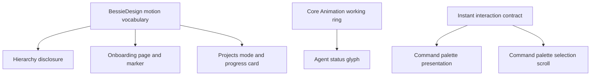
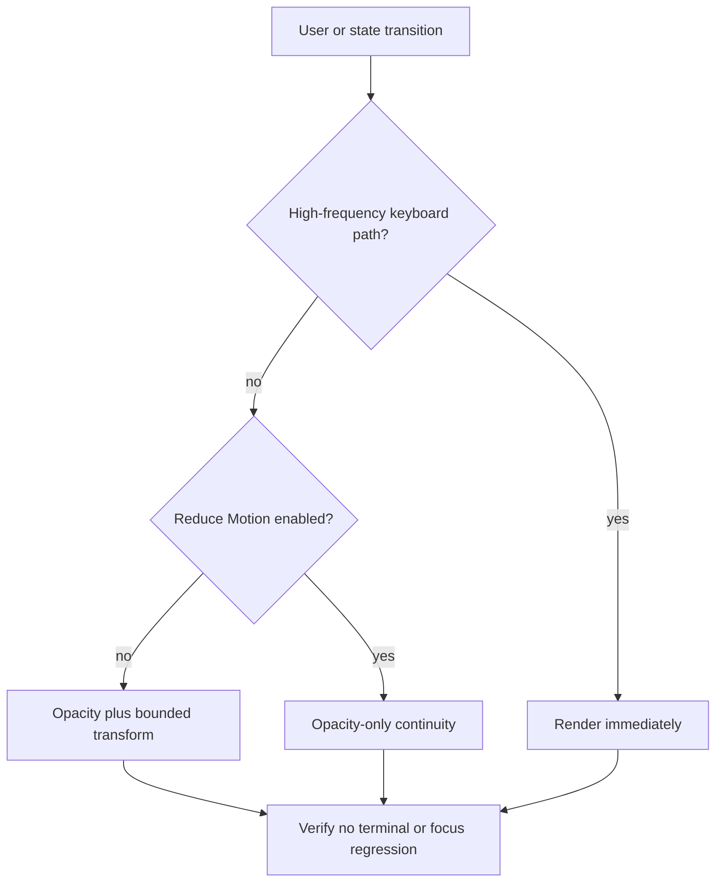
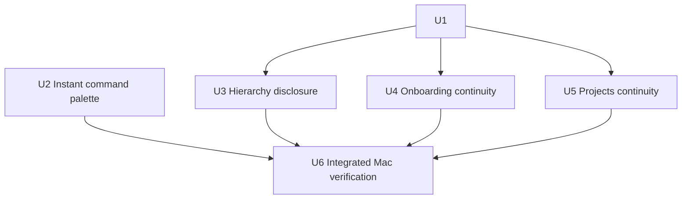

# macOS Motion Quality Pass - Plan

## Goal Capsule

- **Objective:** Make Bessie’s macOS motion feel immediate in expert workflows, physically coherent where motion remains, and selectively helpful in rare explanatory transitions.
- **Authority:** `AGENTS.md` and the canonical V1/workstream contracts outrank this plan; Herdr and libghostty ownership boundaries remain unchanged.
- **Execution profile:** Standard, UI-focused SwiftUI/AppKit refactor with six implementation units and installed-app visual verification.
- **Stop conditions:** Stop if a change requires replacing a libghostty terminal surface, changing Herdr-owned state or lifecycle, delaying successful Project navigation, introducing a new dependency, or weakening an existing verification gate.
- **Tail ownership:** Keep the repository uncommitted unless Jordan asks for commits. After focused Mac validation, package and install `dist/Bessie.app` at `/Applications/Bessie.app`, verify packaged and installed executable identity, relaunch, and inspect screenshots plus motion behavior.

---

## Product Contract

### Summary

Bessie should be crisp, calm, and mostly still. High-frequency keyboard interactions become instantaneous, the existing working spinner and hierarchy disclosure gain correct timing and scope, and rare onboarding and Project transitions gain restrained continuity. The work reuses Bessie’s existing design-system boundary and preserves native macOS, Herdr, and libghostty behavior.

### Problem Frame

The current app has four explicit motion sites, but three are attached to frequent navigation: command-palette presentation, command-palette selection scrolling, and hierarchy disclosure. The first two add latency to keyboard workflows; the hierarchy animation applies a 220 ms layout transaction to its whole container. The compositor-based working spinner is efficient but lacks an explicit linear timing function.

At the same time, rare transitions with explanatory value are abrupt. Onboarding replaces the heading, lead, content, actions, and step state in one frame. Projects replace the catalog with the editor in one frame, and the launch progress card appears without continuity. Existing duration tokens in `BessieDesignSystem.swift` are pinned by tests but unused by production motion, so adding more handwritten values would deepen drift.

### Actors

- A1. Keyboard-first operator who repeatedly opens the command palette and moves through results.
- A2. Pointer-first operator who expands hierarchy sections, moves through onboarding, and creates or launches Projects.
- A3. Operator with macOS Reduce Motion enabled.
- A4. Implementer or reviewer validating motion without compromising live libghostty responsiveness.

### Requirements

**Immediate expert workflows**

- R1. Command-palette presentation and dismissal render without an application-authored transition regardless of Reduce Motion state.
- R2. Command-palette selection changes scroll directly to the selected row without `withAnimation` or another application-authored interpolation.
- R3. Removing palette motion must not change shortcut routing, focus capture/restoration, search mounting, scrim hit testing, modal accessibility, or dispatch behavior.

**Correct existing motion**

- R4. The working-state ring retains its 0.8-second compositor-only Core Animation loop and uses an explicit linear timing function.
- R5. Reduce Motion continues to freeze the working ring in its canonical static pose.
- R6. Herd, workspace, and tab option disclosure animates only the inserted or removed option region, not the entire hierarchy stack.
- R7. Hierarchy disclosure uses the same opacity-only 160 ms strong ease-out transition with or without Reduce Motion; no spatial hierarchy motion exists to remove.
- R8. Rapid hierarchy retargeting is interruptible and newest-target-wins: it must not queue transitions, leave stale interactive content, or restart from a fixed keyframe.

**Cohesive motion contract**

- R9. Replace the unused `hoverDuration`, `popoverDuration`, and `panelDuration` literals with a small, production-used motion vocabulary under the existing `BessieDesign` design-system boundary.
- R10. The shared vocabulary exposes a 160 ms fast-feedback duration, a 200 ms explanatory-transition duration, and the strong ease-out timing curve `(0.23, 1, 0.32, 1)` in a SwiftUI-compatible form.
- R11. Continuous progress remains explicitly linear; instantaneous keyboard paths do not acquire a nominal zero-duration animation token.

**Rare explanatory transitions**

- R12. Advancing onboarding inserts the heading, lead, content, completion error, and actions as one keyed page from a 12-point trailing offset plus opacity over 200 ms with the strong ease-out curve; the outgoing page uses opacity only, sits below the incoming page, and becomes non-interactive and accessibility-hidden as soon as the step changes.
- R13. Under Reduce Motion, onboarding step changes retain the 200 ms opacity transition but remove translation and scale.
- R14. A newly completed onboarding step marker changes from its number to the checkmark using opacity plus scale from 0.94 over 160 ms; Reduce Motion uses opacity only.
- R15. Project catalog/editor mode changes use a 160 ms opacity transition without delaying editor mounting, save, or cancellation; the outgoing mode becomes non-interactive and accessibility-hidden immediately, while the pass introduces no new automatic keyboard-focus policy.
- R16. The Project launch progress card enters from an 8-point downward offset plus opacity over 200 ms, settling upward into place; Reduce Motion uses opacity only.
- R17. Cancellation or failure may use a 160 ms opacity exit while the Projects surface remains visible. On success, Bessie invokes the existing navigation closure in the same observation transaction that receives `navigationHandoff`, with no animation sleep or completion dependency; the visible workspace may still wait for the existing authoritative Herdr focus callback.

**Accessibility, performance, and scope**

- R18. Every new spatial transform branches on `accessibilityReduceMotion`; opacity feedback remains available where it aids continuity.
- R19. Predetermined motion uses SwiftUI transitions or Core Animation and limits animated properties to opacity and transforms. During a crossfade, transient outgoing and incoming subtrees may coexist visually, but only the newest subtree is interactive or accessibility-visible.
- R20. The pass must not animate live topology updates, command-palette results, workspace/tab/pane focus, terminal navigation, Herd status, menu-bar status, native sheets, alerts, confirmation dialogs, or the cold-open-to-shell handoff.
- R21. The pass must not add broad button compression or notification-permission celebration; those remain a separate optional polish pass.
- R22. No new motion may introduce whole-window display-cadence work that degrades live libghostty input, frame delivery, or first-responder behavior.

### Key Flows

- F1. Immediate command palette
  - **Trigger:** A1 opens, navigates, or dismisses the palette with the keyboard.
  - **Steps:** Bessie mounts or removes the overlay in the same render transaction; arrow navigation updates selection and scroll position directly; focus and dispatch follow the existing controller paths.
  - **Outcome:** The palette feels instantaneous and no animation accumulates under repeated input.
  - **Covered by:** R1-R3.

- F2. Hierarchy disclosure
  - **Trigger:** A2 opens, closes, or switches Herd, Workspace, or Tab options.
  - **Steps:** A dedicated option-region presentation layer crossfades old and new option content while the hierarchy layout settles without implicit animation; only the newest list is interactive and accessibility-visible, and a rapid second toggle cancels stale presentation state.
  - **Outcome:** Disclosure remains legible without making routine navigation feel soft.
  - **Covered by:** R6-R8.

- F3. Onboarding progression
  - **Trigger:** A2 advances to the next onboarding step.
  - **Steps:** The outgoing page is hidden from interaction and accessibility, the next keyed page enters above it as one visual unit, and the completed rail marker resolves to a checkmark. The Connect path field retains its existing focus rule; other steps do not gain forced keyboard focus and announce their step title to VoiceOver.
  - **Outcome:** The rare explanatory flow has continuity without delaying interaction.
  - **Covered by:** R12-R14, R18.

- F4. Project creation and launch
  - **Trigger:** A2 enters or exits the Project editor, then launches a Project.
  - **Steps:** Catalog/editor mode crossfades with only the newest mode interactive; launch progress enters at bottom trailing without stealing focus; success dispatches the existing Herdr navigation path in the same observation transaction and does not wait for card removal.
  - **Outcome:** Mode changes and progress are legible while successful navigation stays immediate.
  - **Covered by:** R15-R17.

### Acceptance Examples

- AE1. **Given** the main window is key, **when** the operator presses the command-palette shortcut repeatedly and dismisses with Escape, **then** the overlay appears and disappears without scale, fade, or edge exposure and focus returns to the prior responder. Covers R1-R3.
- AE2. **Given** enough palette results to require scrolling, **when** the operator holds the Down Arrow key, **then** selection and scroll position track input immediately without animated lag or queued motion. Covers R2-R3.
- AE3. **Given** a working agent, **when** Reduce Motion is off, **then** its ring rotates at constant angular velocity; **when** Reduce Motion is on, **then** the ring remains static at 12 o’clock. Covers R4-R5.
- AE4. **Given** one hierarchy section is open, **when** the operator switches sections rapidly, selects an option, or expands from compact rail, **then** only option content fades, the newest list is the only actionable/accessibility-visible list, and the terminal remains responsive. Covers R6-R8, R19, R22.
- AE5. **Given** onboarding is on Connect, **when** the operator advances, **then** the page and completed rail marker transition once, only the incoming page remains actionable/exposed, and VoiceOver receives the new step title; with Reduce Motion enabled, only opacity changes. Covers R12-R14, R18-R19.
- AE6. **Given** the Projects catalog, **when** the operator begins creation and cancels, **then** catalog/editor mode changes use a brief crossfade, only the current mode is actionable/exposed, and animation adds no forced focus change. Covers R15, R18-R19.
- AE7. **Given** a Project launch completes, **when** `navigationHandoff` becomes available, **then** the existing navigation closure is invoked in that same observation transaction without waiting for progress-card animation; visible destination change may still await authoritative Herdr focus. Covers R17.

### Success Criteria

- Palette open, close, and keyboard scrolling have no application-authored animation.
- Existing motion tests and new timing/Reduce Motion contracts pass.
- Normal-speed and slowed visual inspection confirms hierarchy, onboarding, and Project transitions are restrained and interruptible.
- Live terminal output and input remain observable during repeated hierarchy and Project-surface transitions.
- `./scripts/check.sh` passes, focused Mac tests pass, the packaged app installs, and packaged/installed executable hashes match.

### Scope Boundaries

**Included**

- Existing animation removal and timing correction.
- Shared motion constants under `BessieDesign`.
- Onboarding page/step continuity.
- Project catalog/editor and progress-card presentation.
- Focused tests, installed-app screenshots, motion inspection, and terminal responsiveness checks.

**Deferred polish**

- Scale compression for shared custom button styles.
- Notification-permission success feedback.

**Excluded**

- Cowprint motion, cold-open video changes, terminal animation, animated live Herdr state, navigation choreography, custom sheet/alert motion, and new dependencies.
- Any change to Herdr ownership, Project materialization, topology, terminal controllers, or intent semantics.

### Dependencies and Sources

- `AGENTS.md` defines the repository workflow, installed-app completion step, and libghostty/Herdr boundaries.
- `docs/plans/2026-08-01-bessie-v1.md` defines the V1 release gates and measured-performance posture.
- `docs/plans/2026-08-04-001-feat-pre-v1-ui-redesign-plan.md` is the current shell/onboarding visual foundation.
- `Sources/BessieApp/BessieDesignSystem.swift` contains the current duration tokens, working spinner, and shared design-system boundary.
- `Sources/BessieApp/ProductSurfaces.swift`, `Sources/BessieApp/BessieCommandPalette.swift`, and `Sources/BessieApp/WorkspaceTitlebarChrome.swift` contain all current explicit SwiftUI motion.
- `Sources/BessieApp/OnboardingView.swift` and `Sources/BessieApp/ProjectsSurface.swift` contain the accepted additive opportunities.
- `Tests/BessieAppModelTests/BessieVisualFoundationTests.swift`, `Tests/BessieAppModelTests/CommandPaletteControllerTests.swift`, `Tests/BessieAppModelTests/ProjectsViewModelTests.swift`, and `Tests/BessieAppModelTests/SurfaceProjectionTests.swift` contain the nearest test patterns.

---

## Planning Contract

### Key Technical Decisions

- KTD1. **Delete motion from keyboard-heavy paths.** `(session-settled: user-approved — chosen over shortening the existing palette animations: keyboard-first command-palette workflows should be immediate rather than merely faster.)` Palette presentation and selection scrolling become non-animated rather than receiving new curves.
- KTD2. **Reuse the existing design-system boundary.** `(session-settled: user-approved — chosen over introducing a separate BessieMotion namespace: BessieDesign already owns tested motion durations and should not gain a parallel token system.)` Replace unused duration names with a small vocabulary that production call sites use.
- KTD3. **Keep the spinner on Core Animation.** SwiftUI timeline or transform loops remain prohibited because the current compositor-only implementation avoids whole-window hosting commits around live libghostty surfaces.
- KTD4. **Reduce Motion preserves opacity continuity.** Spatial transforms and rotation stop, while brief opacity transitions remain for rare explanatory state changes.
- KTD5. **Keep successful Project navigation immediate.** `(session-settled: user-approved — chosen over adding a rendered completion pause: the exact Herdr workspace is the success feedback, and animation must not delay arrival.)`
- KTD6. **Limit the additive pass to onboarding and Projects.** `(session-settled: user-approved — chosen over broad animation coverage: Bessie’s terminal-centric desktop personality benefits from restrained motion.)` Button compression and notification delight remain deferred.
- KTD7. **Do not invent test-only production abstractions.** Use existing view/environment seams and source-contract tests where SwiftUI does not expose animation inspection, while directly testing Core Animation timing and Project navigation behavior where APIs permit.

### High-Level Technical Design

The design system supplies two durations and one strong ease-out curve. High-frequency surfaces bypass the motion vocabulary. Rare surfaces choose a full-motion or reduced-motion transition from the environment, while the working ring remains an independent Core Animation path.

### Implementation Constraints

- Use SwiftUI/AppKit APIs available on macOS 14 and Swift 6.
- Keep animation properties to opacity and transforms; do not animate width, height, padding, or entire terminal-hosting containers.
- Preserve all existing accessibility labels, focus state, keyboard routing, hit testing, and modal semantics.
- Preserve the Core Animation optimization and the status-glyph geometry contract.
- Work on the current dirty branch without reverting or reformatting unrelated changes.
- Do not invoke `scripts/mac-verify.sh`; use focused Mac tests and the ordinary packaging/install path described in `AGENTS.md`.

### Sequencing

U1 establishes the shared contract and spinner timing. U2 is independent because it deletes motion rather than consuming the vocabulary. U3-U5 depend on U1’s values and Reduced Motion convention. U6 verifies all units together against the installed app.

### Risks and Mitigations

| Risk | Impact | Mitigation |
| --- | --- | --- |
| A SwiftUI implicit animation reaches a parent hosting live terminals | Input or frame cadence regresses | Attach transitions to the smallest conditional subtree and exercise live terminal input while repeatedly triggering them. |
| Keying onboarding content duplicates controls or resets focus | First-run flow becomes harder to complete or VoiceOver sees two pages | Hide/disable outgoing content immediately, keep model/binding ownership outside the identity boundary, preserve Connect-field focus only, and announce the incoming step title. |
| A Project exit transition delays navigation | Successful launch feels slower or routes late | Keep `ProjectsViewModel.completeLaunch` unchanged and prove the presentation observer invokes navigation in the same transaction without waiting for an animation completion. |
| Token cleanup breaks design-contract tests or hidden call sites | Build or visual contract regresses | Search all token usages before removal, update exact-value tests, and use one production call site per retained value. |
| Reduced Motion removes useful feedback or leaves spatial motion | Accessibility regression | Test both environment branches and inspect onboarding, hierarchy, and Projects with the system setting toggled. |
| Dirty-branch overlap overwrites unrelated work | Concurrent release/update work is damaged | Re-read each target before editing, keep diffs bounded to named files, and inspect `git diff` per unit. |

---

## Implementation Units

### U1. Reconcile the motion contract and spinner timing

- **Goal:** Establish the production-used timing vocabulary and correct constant spinner motion without changing glyph geometry or lifecycle.
- **Requirements:** R4-R5, R9-R11, R18-R19, R22. **Decisions:** KTD2-KTD4, KTD7.
- **Files:**
  - `Sources/BessieApp/BessieDesignSystem.swift`
  - `Tests/BessieAppModelTests/BessieVisualFoundationTests.swift`
  - `scripts/check.sh`
- **Approach:** Replace the unused `hoverDuration`, `popoverDuration`, and `panelDuration` constants with clearly named 0.16-second and 0.20-second values plus the strong SwiftUI timing curve under `BessieDesign`. Update the existing static assertion in `scripts/check.sh` to name the retained production-used vocabulary rather than the removed `hoverDuration`. Keep `BessieStatusGeometry.workingRotationDuration` at 0.8 seconds. Set the spinner’s `CABasicAnimation.timingFunction` to linear before adding it to `contentLayer`.
- **Patterns to follow:** Existing exact geometry/duration assertions and `BessieWorkingSpinnerNSView` lifecycle tests in `BessieVisualFoundationTests.swift`.
- **Test scenarios:**
  1. Shared motion durations equal 0.16 and 0.20 seconds and superseded unused names no longer exist.
  2. A visible, non-reduced spinner installs an infinite animation whose timing control points are linear.
  3. Reconfiguration with unchanged duration does not restart the animation.
  4. Reduce Motion removes the animation and parks the ring at its canonical pose.
- **Verification:** Run the focused `BessieVisualFoundationTests` suite on the Mac and inspect the working glyph at normal speed.
- **Dependencies:** None.

### U2. Remove command-palette motion

- **Goal:** Make palette presentation, dismissal, and selection scrolling immediate while preserving focus and controller behavior.
- **Requirements:** R1-R3, R11, R20, R22. **Decisions:** KTD1, KTD6-KTD7.
- **Files:**
  - `Sources/BessieApp/ProductSurfaces.swift`
  - `Sources/BessieApp/BessieCommandPalette.swift`
  - `Tests/BessieAppModelTests/BessieVisualFoundationTests.swift`
  - `Tests/BessieAppModelTests/CommandPaletteControllerTests.swift`
  - `Tests/BessieAppModelTests/SurfaceProjectionTests.swift`
- **Approach:** Remove the overlay transition and `showCommandPalette` animation from `shellPresentation`. Replace the reduced/non-reduced `withAnimation` branch around `scrollTo` with one direct call. Remove the now-unused palette `accessibilityReduceMotion` environment value only if no other palette behavior uses it.
- **Patterns to follow:** Existing command-palette openability, focus, buffering, dismissal, and shortcut-routing tests; existing source-contract assertions in `BessieVisualFoundationTests.swift` where rendered animation state is not introspectable.
- **Test scenarios:**
  1. Opening and dismissing still preserves `BessieCommandPaletteModel.isOpen`, search mounting, scrim dismissal, and previous-responder restoration.
  2. Arrow-key movement preserves stable row identity and selection behavior.
  3. Source-contract coverage prevents reintroducing `.animation`, `.transition`, or `withAnimation` on palette open/close/selection paths.
  4. Repeated shortcut and arrow input does not leak into the terminal.
- **Verification:** Run focused command-palette and surface-projection tests on the Mac, then invoke/dismiss the installed palette repeatedly and hold Arrow Down through a long result list.
- **Dependencies:** None.

### U3. Localize hierarchy disclosure motion

- **Goal:** Retain lightweight disclosure continuity without animating the entire hierarchy layout.
- **Requirements:** R6-R8, R18-R20, R22. **Decisions:** KTD2, KTD4, KTD6-KTD7.
- **Files:**
  - `Sources/BessieApp/WorkspaceTitlebarChrome.swift`
  - `Tests/BessieAppModelTests/BessieVisualFoundationTests.swift`
- **Approach:** Remove `.animation(..., value: openSection)` from the containing stack. Keep `openSection` as the immediate source-of-truth mutation for every entry path: header toggle, option-selection dismissal, and compact-rail expansion. Add one nested, file-local option-region presentation component that lets incoming content determine layout immediately while retaining outgoing content only as a non-layout overlay for the 160 ms opacity crossfade. The outgoing subtree becomes `allowsHitTesting(false)` and `accessibilityHidden(true)` as soon as the target changes; the incoming subtree is layered above it and is the sole interactive/accessibility-visible list. On rapid retarget, cancel and discard stale outgoing presentation state and animate to the newest section without queueing. Use the same opacity behavior under Reduce Motion because no spatial movement exists.
- **Patterns to follow:** Existing environment-based accessibility contract and source-contract testing in `BessieVisualFoundationTests.swift`.
- **Test scenarios:**
  1. Herd, workspace, and tab sections still open, close, and remain mutually exclusive.
  2. The option transition contains opacity but no `.move`, scale, offset, or container-level implicit animation.
  3. Rapidly switching sections may briefly crossfade two visual layers, but only the newest list is hit-testable and accessibility-visible; stale layers never queue.
  4. Option-selection dismissal and compact-rail expansion follow the same presentation path as header toggles.
  5. Reduce Motion preserves the brief fade and introduces no position change.
- **Verification:** Run focused visual-foundation tests, then inspect rapid hierarchy switching beside a live two-pane terminal at normal speed and slowed playback.
- **Dependencies:** U1.

### U4. Add onboarding continuity

- **Goal:** Make rare onboarding step changes read as one coherent progression while preserving form state, focus, and accessibility.
- **Requirements:** R12-R14, R18-R20, R22. **Decisions:** KTD2, KTD4, KTD6-KTD7.
- **Files:**
  - `Sources/BessieApp/OnboardingView.swift`
  - `Tests/BessieAppModelTests/BessieVisualFoundationTests.swift`
  - `Tests/BessieAppModelTests/SettingsAndNotificationsTests.swift`
- **Approach:** Add `accessibilityReduceMotion` to `OnboardingView`. Wrap heading, lead, content, completion error, and actions in one presentation boundary keyed by `state.step`; keep bindings, observed models, and `pathFocused` outside that identity boundary. For ordinary motion, insert the incoming page above the outgoing page from `x: 12` toward rest while fading it in over 200 ms; remove the outgoing page with opacity only. Under Reduce Motion, both sides use opacity only. Disable hit testing and hide the outgoing page from accessibility immediately, expose the incoming page immediately, and post the existing incoming step title as a VoiceOver announcement without moving accessibility focus. Preserve the current keyboard-focus matrix: Connect focuses the path field through `pathFocused`; other steps and re-entry do not force focus. The current UI has no back-step route, so no reverse-direction transition is introduced. Give newly completed rail markers a 160 ms opacity/scale-from-0.94 transition, falling back to opacity-only.
- **Patterns to follow:** Existing `OnboardingState.Step` ordering, `pathFocused` behavior, and design-artboard hooks for onboarding screens.
- **Test scenarios:**
  1. Advancing each step preserves the correct heading, lead, content, actions, and step-rail state.
  2. Connect path text and focus survive the presentation boundary until the existing state machine advances.
  3. Reduce Motion selects opacity-only page and marker behavior.
  4. Re-entering onboarding and design-artboard rendering do not replay unrelated motion or reset persisted setup state.
  5. Repeated activation cannot queue pages; the newest step is the only actionable/accessibility-visible subtree, and VoiceOver hears one step-title announcement.
- **Verification:** Run focused onboarding/settings tests on the Mac; capture Connect and later-step screenshots; inspect one normal-motion and one Reduce Motion progression.
- **Dependencies:** U1.

### U5. Add restrained Projects continuity without delaying launch

- **Goal:** Clarify occasional Projects mode and progress changes without altering materialization or adding delay to the existing authoritative navigation path.
- **Requirements:** R15-R17, R18-R20, R22. **Decisions:** KTD2, KTD4-KTD7.
- **Files:**
  - `Sources/BessieApp/ProjectsSurface.swift`
  - `Tests/BessieAppModelTests/BessieVisualFoundationTests.swift`
  - `Tests/BessieAppModelTests/ProjectsViewModelTests.swift`
- **Approach:** In `ProjectsSurface`, key the catalog/editor presentation by whether `model.draft` exists and apply a 160 ms opacity crossfade without relocating draft ownership. Make the outgoing mode non-interactive and accessibility-hidden immediately, layer the incoming mode above it, and preserve the current focus policy: entering/exiting the editor adds no forced keyboard or accessibility focus move. Rapid Create/Edit/Cancel/Save retargets to the newest `draft` state without queued identities. Insert the bottom-trailing progress card from `y: 8` toward rest while fading it in over 200 ms, with opacity-only under Reduce Motion; use a 160 ms opacity-only removal when the Projects surface remains visible. The card never steals focus. Announce launch start once using the card’s existing project/progress text; rely on the existing failure sheet and destination change for failure/success announcements rather than duplicating them. Do not modify `ProjectsViewModel.completeLaunch`: its immediate `opening = nil` and `navigationHandoff` publication remain the model contract. Prove that `ProjectLaunchPresentationModifier` invokes `navigate(handoff)` in the same observation transaction and does not gate it on card removal; visible destination change may continue to await Herdr’s existing focus callback.
- **Patterns to follow:** Existing `ProjectLaunchPresentationModifier`, `reviewBinding`/`failureBinding`, launch tests that await `navigationHandoff`, and design artboards for Projects list/create states.
- **Test scenarios:**
  1. Create, Edit, Cancel, and Save still produce the same `draft` lifecycle and focus behavior.
  2. Progress presentation appears for an active launch and remains cancellable.
  3. Reduce Motion removes the progress-card transform while retaining opacity.
  4. Successful materialization clears `opening` and publishes the exact navigation handoff without a delayed task or completion-animation state; the presentation observer invokes navigation in the same observation transaction and independently of card removal.
  5. Failure and cancellation retain their current review/retry semantics.
  6. Rapid Create/Edit/Cancel/Save and launch cancellation/failure leave only the newest mode or card state actionable/accessibility-visible; progress never steals focus and launch start is announced once.
- **Verification:** Run focused Projects tests on the Mac; inspect catalog/editor transitions and a real or deterministic launch; assert navigation dispatch is immediate and animation-independent while the visible destination continues to honor authoritative Herdr focus.
- **Dependencies:** U1.

### U6. Verify motion, accessibility, terminal responsiveness, and installation

- **Goal:** Prove the complete pass in the packaged installed app rather than treating compilation as acceptance.
- **Requirements:** R1-R22. **Decisions:** KTD1-KTD7.
- **Files:**
  - `docs/reports/goal-progress.md`
- **Approach:** Run the repository check suite on the VPS. Sync the bounded repository changes to the verified Mac mirror without `rsync --delete`. Run focused Swift tests, package the production app, install it at `/Applications/Bessie.app`, verify packaged/installed executable identity, relaunch, and inspect normal plus Reduce Motion behavior. Capture screenshots of stable states and a short recording or slowed playback for transitions. Exercise live terminal input/output while rapidly toggling hierarchy and navigating Projects.
- **Patterns to follow:** `AGENTS.md`, `scripts/package-app.sh`, `scripts/lib/bessie-app-lifecycle.sh`, existing design-artboard/snapshot hooks, and the installed identity checks used by focused Bessie acceptance work.
- **Test scenarios:**
  1. `./scripts/check.sh` passes on the VPS.
  2. Focused Mac tests for visual foundation, command palette, onboarding/settings, Projects, and surface projection pass.
  3. Palette actions are visibly instantaneous at normal speed.
  4. Hierarchy, onboarding, and Projects motion matches the exact duration/curve contract and drops transforms under Reduce Motion.
  5. A live Herdr pane accepts input and emits observable output during repeated UI transitions.
  6. The packaged and installed executables are byte-identical, and the installed app relaunches successfully.
- **Verification:** Record actual commands, test counts, package/install hashes, screenshot paths, motion observations, and terminal evidence in `docs/reports/goal-progress.md`.
- **Dependencies:** U1-U5.

---

## Verification Contract

| Gate | Command or method | Applies to | Passing signal |
| --- | --- | --- | --- |
| Repository checks | `./scripts/check.sh` | U1-U6 | Script exits 0 without weakened or skipped checks. |
| Visual foundation | On `jordan-macbook`, run `swift test --filter BessieVisualFoundationTests` from the Mac mirror | U1-U5 | Motion values, spinner timing, accessibility, and source contracts pass. |
| Palette behavior | On `jordan-macbook`, run `swift test --filter CommandPaletteControllerTests` and `swift test --filter SurfaceProjectionTests` | U2 | Controller, focus, keyboard, and selection contracts pass. |
| Onboarding behavior | On `jordan-macbook`, run `swift test --filter SettingsAndNotificationsTests` | U4 | Setup state, notifications, and onboarding contracts pass. |
| Projects behavior | On `jordan-macbook`, run `swift test --filter ProjectsViewModelTests` plus focused `ProjectLaunchPresentationModifier` coverage | U5 | Draft, launch, failure, cancellation, and same-transaction navigation-dispatch tests pass. |
| Focused native build | On `jordan-macbook`, run `swift build` after focused tests | U1-U6 | Native Swift 6 package builds with no new warnings treated as errors. |
| Package and install | Use `scripts/package-app.sh` and the established focused install lifecycle; do not run `scripts/mac-verify.sh` | U6 | `dist/Bessie.app` installs at `/Applications/Bessie.app` and relaunches. |
| Identity | Hash `dist/Bessie.app/Contents/MacOS/BessieApp` and `/Applications/Bessie.app/Contents/MacOS/BessieApp` | U6 | Hashes are equal. |
| Visual feel | Capture stable screenshots and inspect normal-speed plus slowed motion for hierarchy, onboarding, and Projects | U3-U6 | No palette motion, no container-wide disclosure motion, no excessive travel, no stale interactive layer, and no focus jump. |
| Reduced Motion | Preserve the current macOS setting, test with Reduce Motion enabled, then restore the original setting | U1, U3-U6 | Rotation and spatial transforms stop; accepted opacity continuity remains. |
| Accessibility exposure | Inspect with VoiceOver during onboarding, hierarchy retargeting, Projects mode changes, and launch progress | U3-U6 | Only the newest subtree is exposed/actionable, onboarding announces one step title, launch progress announces once without taking focus, and native failure/destination announcements are not duplicated. |
| Terminal responsiveness | Use a live Herdr pane and an observable pane read or equivalent while triggering UI transitions | U3-U6 | Input/output remains correct and responsive; Bessie does not stall or terminate pane processes. |

The executor must not claim success from compilation alone. Static screenshots prove layout and accessibility states; motion acceptance also requires direct observation at normal speed and slowed playback.

---

## Definition of Done

- D1. R1-R22 are implemented or explicitly blocked with evidence that changes scope; no requirement is silently dropped.
- D2. U1-U6 test scenarios pass with actual command output recorded in `docs/reports/goal-progress.md`.
- D3. The command palette and keyboard result scrolling contain no application-authored motion.
- D4. The working ring is compositor-driven, linear, 0.8 seconds per revolution, and static under Reduce Motion.
- D5. Hierarchy disclosure animates only opacity at the option boundary and never attaches an implicit animation to the full hierarchy stack.
- D6. Onboarding and Projects use the shared 160 ms/200 ms strong ease-out vocabulary and opacity-only reduced-motion variants.
- D7. Successful Project launch publishes its handoff and invokes the existing navigation closure in the same observation transaction, with no completion pause; authoritative Herdr focus remains the gate for the visible destination change.
- D8. No excluded live Herdr, terminal, status, sheet, alert, cold-open, button-compression, or notification-delight motion enters the diff.
- D9. `./scripts/check.sh`, focused Mac tests, package/install, executable identity, relaunch, screenshots, motion inspection, and live terminal observation all pass.
- D10. No abandoned experiments, unused motion tokens, dead helpers, or temporary capture code remain in the diff.
- D11. The repository remains uncommitted and unpublished unless Jordan gives separate approval.
